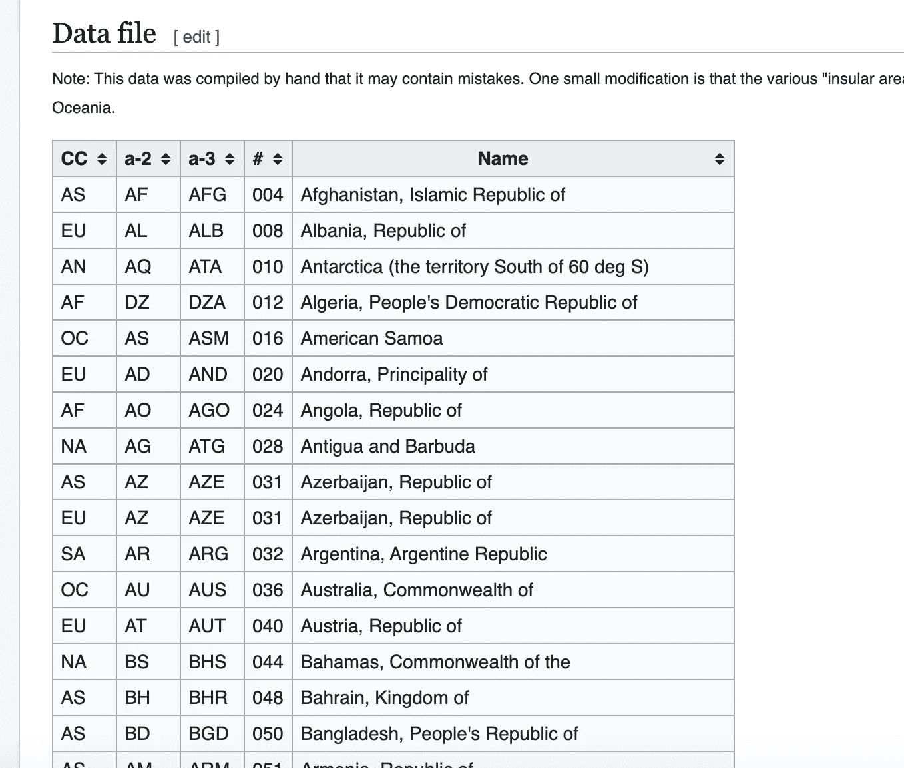

# 使用 Python 进行图像抓取

> 原文：<https://towardsdatascience.com/image-scraping-with-python-a96feda8af2d?source=collection_archive---------0----------------------->

## 使用 PYTHON 进行 WEB 抓取

## 学习如何用 Python 从 Google 下载图片的代码指南！


Photo by [Mr Cup / Fabien Barral](https://unsplash.com/@iammrcup?utm_source=medium&utm_medium=referral) on [Unsplash](https://unsplash.com?utm_source=medium&utm_medium=referral)

为了训练一个模型，你需要图像。你当然可以手动下载，甚至可以批量下载，但我认为有一种更令人愉快的方式。让我们使用 Python 和一些 web 抓取技术来下载图像。

**更新 2(2020 年 2 月 25 日):**抓取网页的一个问题是目标元素依赖于某种类型的 a `selector`。我们使用`css-selectors`从页面中获取相关元素。谷歌似乎在过去的某个时候改变了它的网站布局，这使得它有必要更新相关的选择器。提供的脚本应该可以再次工作。

**更新:**自从写了这篇关于图像抓取的文章后，我已经发表了关于构建图像识别卷积神经网络的文章。如果你想好好利用这些图片，看看下面这篇文章吧！

[](/cat-dog-or-elon-musk-145658489730) [## 猫，狗，还是埃隆马斯克？

### 了解如何使用 Python 和 Keras 在不到 15 分钟的时间内构建您的图像识别卷积神经网络！

towardsdatascience.com](/cat-dog-or-elon-musk-145658489730) 

# 在今天的文章中，我们将讨论以下主题:

1.  抓取静态页面
2.  抓取交互式页面
3.  从谷歌抓取图片
4.  合法性后记

# 先决条件

一个 Python 环境(我建议 Jupyter 笔记本)。如果你还没有设置这个，不要担心。这是毫不费力的，不到 10 分钟。

[](/get-started-with-python-e50dc8c96589) [## 所以你想成为一名数据科学家？

### 到底是什么阻止了你？下面是如何开始！

towardsdatascience.com](/get-started-with-python-e50dc8c96589) 

# ①抓取静态页面


Photo by [David Marcu](https://unsplash.com/@davidmarcu?utm_source=medium&utm_medium=referral) on [Unsplash](https://unsplash.com?utm_source=medium&utm_medium=referral)

编写静态页面(即不使用 JavaScript 在页面上创建高度交互的页面)非常简单。静态网页就是一个用标记语言编写的大文件，它定义了内容应该如何呈现给用户。您可以非常快速地获得原始内容，而无需应用标记。假设我们想从这个[维基百科页面](https://en.wikipedia.org/wiki/List_of_sovereign_states_and_dependent_territories_by_continent_(data_file))中获取下表:



Screenshot from [Wikipedia page](https://en.wikipedia.org/wiki/List_of_sovereign_states_and_dependent_territories_by_continent_(data_file)) shows country codes and corresponding names

我们可以通过利用一个名为 [requests](https://pypi.org/project/requests/2.7.0/) 的基本 Python 库来实现这一点，如下所示:


using requests library to download static page content

如你所见，这不是很有用。我们不想要所有的噪音，而是想只提取页面的特定元素(准确地说是表格)。这种情况下[美汤](https://www.crummy.com/software/BeautifulSoup/bs4/doc/)就派上了用场。

Static Extraction

漂亮的 Soup 允许我们轻松地导航、搜索或修改解析树。在通过适当的解析器运行原始内容之后，我们得到了一个可爱的干净的解析树。在这个树中，我们可以使用类“wikitable sortable”搜索“table”类型的元素。您可以通过右键单击表并单击 inspect 查看源代码来获得关于类和类型的信息。然后，我们遍历该表，逐行提取数据，最终得到以下结果:


parsed table from Wikipedia Page

**巧妙的技巧:** Pandas 有一个内置的`read_html`方法，通过运行`pip install lxml`安装 [lxml](https://lxml.de/) (一个强大的 xml 和 HTML 解析器)后就可以使用了。`read_html`允许您执行以下操作:


the second result from read_html

正如你所看到的，我们调用`res[2]`是因为`pd.read_html()`会把它找到的所有东西转储到一个单独的数据帧中，即使是松散地类似于一个表。您必须检查哪个结果数据帧包含所需的数据。对于结构良好的数据，尝试一下`read_html`是值得的。

# ②抓取互动页面


Photo by [Ross Findon](https://unsplash.com/@rossf?utm_source=medium&utm_medium=referral) on [Unsplash](https://unsplash.com?utm_source=medium&utm_medium=referral)

然而，大多数现代网页都具有很强的互动性。“单页应用程序”的概念意味着网页本身会改变，而用户不必一直重新加载或从一个页面重定向到另一个页面。因为只有在特定的用户交互之后才会发生这种情况，所以在抓取数据时几乎没有什么选择(因为这些操作必须发生)。

有时，用户操作可能会触发对公开的后端 API 的调用。在这种情况下，可以直接访问 API 并获取结果数据，而不必经过中间不必要的步骤。然而，大多数时候，你将不得不经历点击按钮、滚动页面、等待加载和所有这些步骤……或者至少你必须让网页认为**你**正在做所有这些。硒来拯救！

## 硒

[Selenium](https://www.seleniumhq.org/) 可用于自动化 web 浏览器与 Python(以及其他语言)的交互。通俗地说，selenium 假装是一个真实的用户，它打开浏览器，“移动”光标，并点击按钮，如果你告诉它这样做的话。据我所知，Selenium 背后最初的想法是自动化测试。然而，在自动化基于 web 的重复性任务方面，Selenium 同样强大。

让我们看一个例子来说明硒的用法。不幸的是，需要事先做一点准备。我将用**谷歌 Chrome 概述 Selenium 的安装和使用。**如果您想使用另一个浏览器(如 Headless ),您必须下载相应的 web 驱动程序。你可以在这里找到更多信息。

**步骤:**

1.  安装谷歌浏览器(如果已经安装，跳过)
2.  识别你的 Chrome 版本。通常通过点击“关于谷歌浏览器”找到。我目前有版本 **77.0.3865.90** (我的主版本因此是 **77** ，第一个点之前的数字)。
3.  从[这里](https://chromedriver.chromium.org/downloads)为你的主版本下载相应的 from 驱动程序，并将可执行文件放到一个可访问的位置(我使用`Desktop/Scraping`
4.  通过`pip install selenium`安装 Python Selenium 包

启动网络驱动

运行下面的代码片段(为了便于演示，请在 Jupyter 笔记本上运行)并查看幽灵浏览器是如何打开的。

```
import selenium# This is the path I use
# DRIVER_PATH = '.../Desktop/Scraping/chromedriver 2'# Put the path for your ChromeDriver here
DRIVER_PATH = <YOUR PATH>wd = webdriver.Chrome(executable_path=DRIVER_PATH)
```

如果一切按计划进行，您现在应该会看到这样的内容:


Google Chrome browser controlled by Selenium

现在运行(在新单元格中):

```
wd.get('[https://google.com'](https://google.com'))
```

你的浏览器应该导航到——不出所料——google.com。现在运行:

```
search_box = wd.find_element_by_css_selector('input.gLFyf')
search_box.send_keys('Dogs')
```

当你的浏览器在搜索框中输入`Dogs`时，你就会看到结果。


好吧，让我们关闭驱动程序:

```
wd.quit()
```

**完美！你已经掌握了基本知识。Selenium 非常强大，几乎每个交互都可以模拟。有些动作甚至可以通过抽象方法来实现，比如点击按钮或者悬停在物体上。此外，如果出现最坏的情况，您可以通过将光标移动到您想要的位置，然后执行单击操作来模仿人类行为。**

# ③从谷歌上抓取图片


Photo by [Bharathi Kannan](https://unsplash.com/@bk010397?utm_source=medium&utm_medium=referral) on [Unsplash](https://unsplash.com?utm_source=medium&utm_medium=referral)

既然你现在明白了基本知识，我们就可以把所有的东西拼凑起来。让浏览器按照我们的要求行事:

*   搜索特定术语并获取图片链接
*   下载图像

**搜索特定短语&获取图片链接**

get_image_links.py

函数`fetch_image_urls`需要三个输入参数:

1.  `**query**`:搜索词，如`**Dog**`
2.  `**max_links_to_fetch**`:刮刀应该收集的链环数
3.  `**webdriver**`:实例化的 Webdriver

**下载图像** 为了让下面的代码片段工作，我们首先必须通过运行`pip install Pillow`来安装`PIL`。

persist_image.py

`persist_image`功能抓取一个图片 URL `url`并下载到`folder_path`中。该函数将为图像分配一个随机的 10 位 id。

**综合起来** 下面的函数`search_and_download`结合了前面的两个函数，为我们使用 ChromeDriver 增加了一些弹性。更准确地说，我们在一个`with`上下文中使用 ChromeDriver，这保证了浏览器正常关闭，即使在`with`上下文中出现错误。`search_and_download`允许您指定`**number_images**`，默认设置为 5，但可以设置为您想要下载的任意数量的图像。

search_and_donwload.py

现在，我们可以执行以下操作:


Download some doggie images

并将获得:


**恭喜你！你已经建立了你自己的图像刮刀。考虑使用刮刀，享受你正在喝的咖啡，而不是手动下载 100 张图片。**

如果您想了解如何自动执行抓取过程并持续运行，请查看以下文章:

[](/practical-python-how-to-write-and-deploy-a-monitoring-notification-service-within-minutes-for-free-b682cffa66ef) [## 实用 Python:如何在几分钟内编写和部署一个监控+通知服务？

### 你曾经希望有一种服务，一旦它观察到一个特定的事件，就反复地检查和 pings 你吗？—了解如何…

towardsdatascience.com](/practical-python-how-to-write-and-deploy-a-monitoring-notification-service-within-minutes-for-free-b682cffa66ef) 

哦，如果你喜欢阅读这样的故事，并想支持我成为一名作家，考虑注册成为一名灵媒成员。每月 5 美元，你可以无限制地阅读媒体上的故事。如果你用我的链接注册，我甚至会做一些🍩。

[](https://medium.com/@fabianbosler/membership) [## 通过我的推荐链接加入 Medium-Fabian Bosler

### 作为一个媒体会员，你的会员费的一部分会给你阅读的作家，你可以完全接触到每一个故事…

medium.com](https://medium.com/@fabianbosler/membership) 

# ④关于网络抓取合法性的后记

我不是律师，所以我所说的一切都不应被视为法律意见。话虽如此，围绕网络抓取合法性的问题很可能要逐案评估。只要你不违反任何服务条款或对你抓取的网页产生负面影响，你就是清白的，这似乎是一个共识。网络抓取行为本身不可能违法。你可以抓取你的页面而不会有任何影响，毕竟谷歌机器人每天都在抓取整个网页。我的建议是:

> 确保您没有违反任何法律、服务条款或对您的目标产生负面影响。