# 使用 Python 的 scikit-image 模块进行图像分割。

> 原文：<https://towardsdatascience.com/image-segmentation-using-pythons-scikit-image-module-533a61ecc980?source=collection_archive---------2----------------------->

## scikit-image 库的图像分割方法概述。

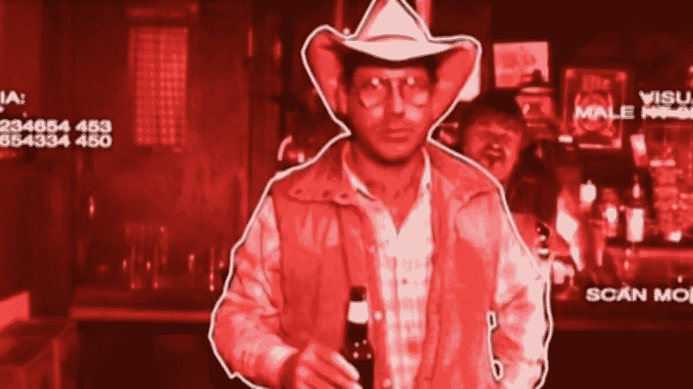

[source](https://i.imgflip.com/nuf6y.jpg)

> 所有的东西迟早都是数字，包括图像。

*看过* [***【终结者】***](https://en.wikipedia.org/wiki/The_Terminator) *的人一定会同意这是那个时代最伟大的科幻电影。在电影中，* [***詹姆斯·卡梅隆***](https://en.wikipedia.org/wiki/James_Cameron) *引入了一个有趣的视觉效果概念，使观众有可能获得被称为终结者的电子人的眼睛后面。这种效果后来被称为* [***终结者视觉***](http://www.imaginativeuniversal.com/blog/2015/10/16/terminator-vision/)**和**中的一种方式，它把人类从背景中分割出来。这听起来可能完全不合时宜，但图像分割是当今许多图像处理技术的重要组成部分。**

# *图象分割法*

*我们都很清楚 Photoshop 或类似的图形编辑器提供的无限可能性，它们可以将一个人从一幅图像中取出，放入另一幅图像中。然而，这样做的第一步是 ***识别该人在源图像中的位置*** 和这是图像分割发挥作用的地方。有许多为图像分析目的而编写的库。在本文中，我们将详细讨论 **scikit-image** ，这是一个基于 Python 的图像处理库。*

> *完整的代码也可以从与本文相关的 [**Github 资源库**](https://github.com/parulnith/Image-Processing/tree/master/Image%20Segmentation%20using%20Python's%20scikit-image%20module) 中获得。*

# *sci kit-图像*

**

*scikit-image.org*

*Scikit-image 是一个专门用于图像处理的 Python 包。*

## *装置*

*scikit-image 可以按如下方式安装:*

```
*pip install scikit-image# For Conda-based distributions
conda install -c conda-forge scikit-image*
```

## *Python 中的图像概述*

*在讨论图像分割的技术细节之前，有必要先熟悉一下 scikit 图像生态系统及其处理图像的方式。*

*   ***从浏览库导入灰度图像***

*skimage 数据模块包含一些内置的示例数据集，这些数据集通常以 jpeg 或 png 格式存储。*

```
*from skimage import data
import numpy as np
import matplotlib.pyplot as pltimage = data.binary_blobs()
plt.imshow(image, cmap='gray')*
```

*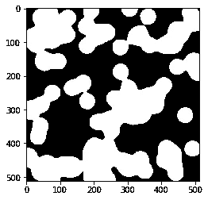*

*   ***从浏览库导入彩色图像***

```
*from skimage import data
import numpy as np
import matplotlib.pyplot as pltimage = data.astronaut()plt.imshow(image)*
```

*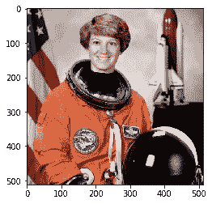*

*   ***从外部来源导入图像***

```
*# The I/O module is used for importing the image
from skimage import data
import numpy as np
import matplotlib.pyplot as plt
from skimage import ioimage = io.imread('skimage_logo.png')plt.imshow(image);*
```

*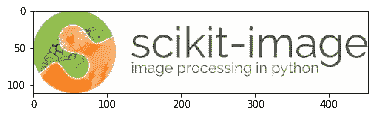*

*   ***加载多张图片***

```
*images = io.ImageCollection('../images/*.png:../images/*.jpg')print('Type:', type(images))
images.files
Out[]: Type: <class ‘skimage.io.collection.ImageCollection’>*
```

*   ***保存图像***

```
*#Saving file as ‘logo.png’
io.imsave('logo.png', logo)*
```

# *图象分割法*

*现在我们对 scikit-image 有了一个概念，让我们进入图像分割的细节。 [**图像分割** n](https://en.wikipedia.org/wiki/Image_segmentation) 本质上是将[数字图像](https://en.wikipedia.org/wiki/Digital_image)分割成多个片段的过程，以简化和/或改变图像的表示，使其更有意义且更易于分析。*

*在本文中，我们将结合监督和非监督算法来处理分割过程。*

*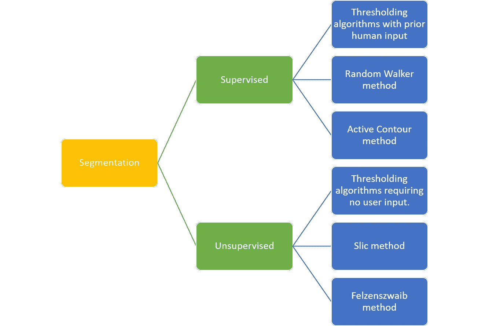*

*Some of the Segmentation Algorithms available in the scikit-image library*

***监督分割:**可能来自人的输入的一些先验知识用于指导算法。*

***无监督分割**:不需要先验知识。这些算法试图将图像自动细分成有意义的区域。用户可能仍然能够调整某些设置以获得期望的输出。*

*让我们从称为**阈值处理的最简单算法开始。***

## *[阈值处理](http://scikit-image.org/docs/dev/auto_examples/xx_applications/plot_thresholding.html)*

*通过选择高于或低于某个 ***阈值的像素，这是从背景中分割对象的最简单方法。当我们打算从背景中分割出物体时，这通常是有帮助的。你可以在这里阅读更多关于阈值[的内容。](http://scikit-image.org/docs/dev/auto_examples/xx_applications/plot_thresholding.html)****

*让我们在预先加载了 scikit-image 数据集的教科书图像上尝试一下。*

## *基本进口*

```
*import numpy as np
import matplotlib.pyplot as pltimport skimage.data as data
import skimage.segmentation as seg
import skimage.filters as filters
import skimage.draw as draw
import skimage.color as color*
```

*一个简单的函数来绘制图像*

```
***def** image_show(image, nrows=1, ncols=1, cmap='gray'):
    fig, ax = plt.subplots(nrows=nrows, ncols=ncols, figsize=(14, 14))
    ax.imshow(image, cmap='gray')
    ax.axis('off')
    **return** fig, ax*
```

## *图像*

```
*text = data.page()image_show(text)*
```

*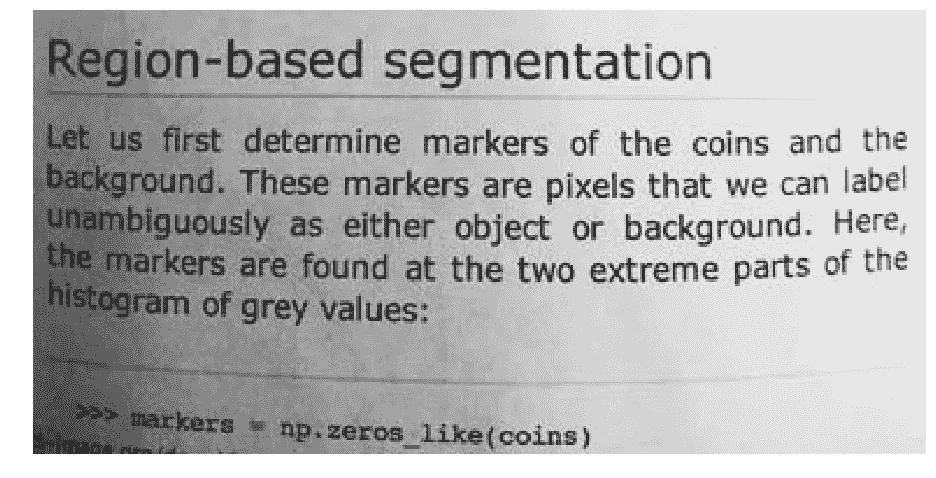*

*这张图像有点暗，但也许我们仍然可以选择一个值，在没有任何高级算法的情况下，给我们一个合理的分割。现在，为了帮助我们选择这个值，我们将使用一个**直方图**。*

*[直方图](https://homepages.inf.ed.ac.uk/rbf/HIPR2/histgram.htm)是显示在图像中发现的不同亮度值下图像中的[像素](https://homepages.inf.ed.ac.uk/rbf/HIPR2/pixel.htm)的数量的图表。简而言之，直方图是一种图表，其中 x 轴显示图像中的所有值，而 y 轴显示这些值的频率。*

```
*fig, ax = plt.subplots(1, 1)
ax.hist(text.ravel(), bins=32, range=[0, 256])
ax.set_xlim(0, 256);*
```

*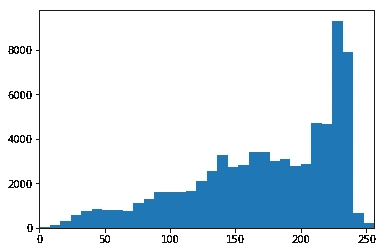*

*我们的例子恰好是一个 8 位图像，所以我们在 x 轴上总共有 256 个可能的值。我们观察到存在相当亮的像素浓度(0:黑色，255:白色)。这很可能是我们相当轻的文本背景，但其余的是一种涂抹了。一个理想的分割直方图应该是双峰的，并且是完全分开的，这样我们就可以在中间选择一个数字。现在，让我们试着基于简单的阈值分割制作一些分段图像。*

## *监督阈值*

*由于我们将自己选择阈值，我们称之为监督阈值。*

```
*text_segmented = *text > (value concluded from histogram i.e 50,70,120 )*image_show(text_segmented);*
```

*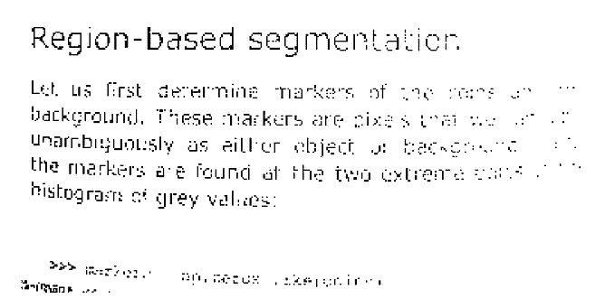**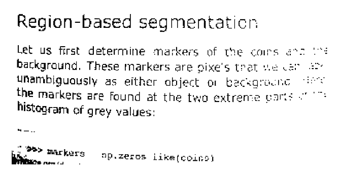**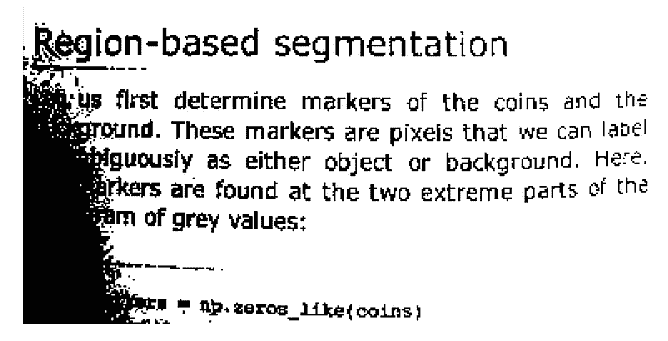*

*Left: text>50 | Middle : text > 70 | Right : text >120*

*我们没有得到任何理想的结果，因为左边的阴影产生了问题。现在让我们尝试无监督阈值处理。*

## *无监督阈值处理*

*Scikit-image 有许多自动阈值方法，在选择最佳阈值时不需要输入。一些方法有:`otsu, li, local.`*

```
*text_threshold = filters.threshold_  *# Hit tab with the cursor after the underscore to get all the methods.*image_show(text < text_threshold);*
```

*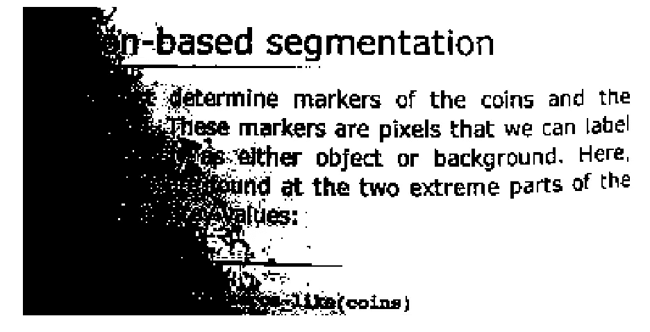**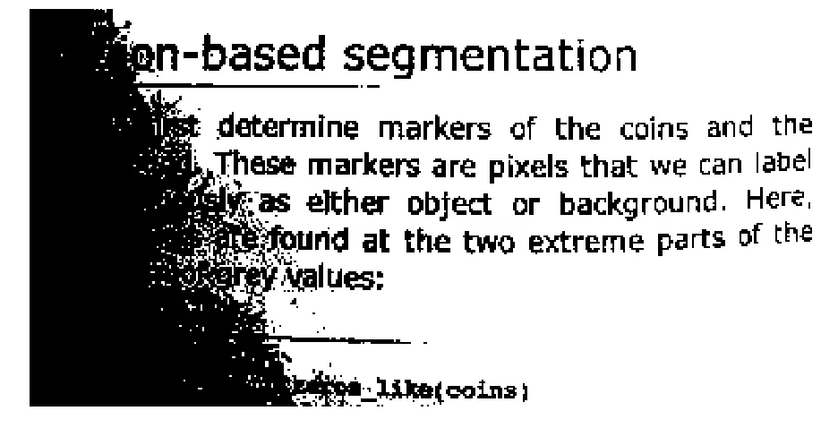*

*Left: otsu || Right: li*

*在`local`的情况下，我们还需要指定`block_size`。 `Offset` 帮助调整图像以获得更好的效果。*

```
*text_threshold = filters.threshold_local(text,block_size=51, offset=10) 
image_show(text > text_threshold);*
```

*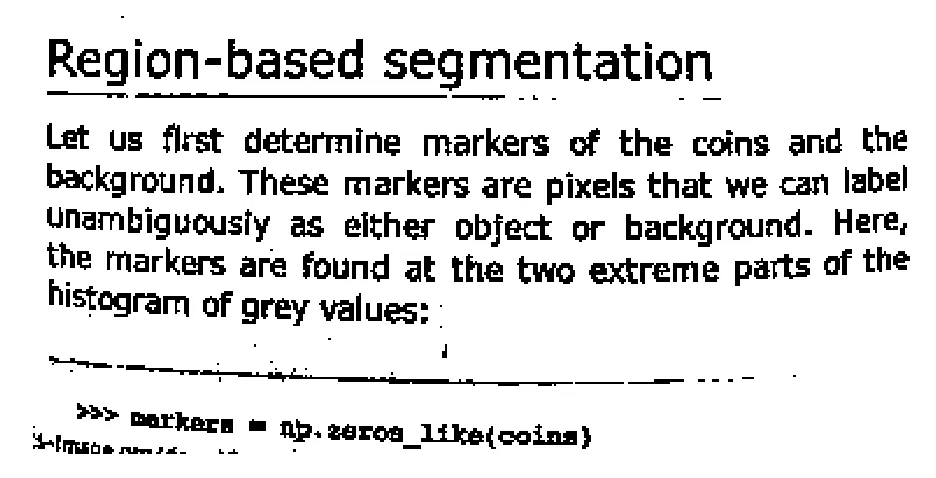*

*local thresholding*

*这是非常好的，并且在很大程度上摆脱了噪声区域。*

# *监督分割*

*阈值分割是一个非常基本的分割过程，在高对比度图像中无法正常工作，为此我们需要更先进的工具。*

*在本节中，我们将使用一个免费提供的示例图像，并尝试使用监督分割技术分割头部。*

```
**# import the image*
from skimage import io
image = io.imread('girl.jpg') 
plt.imshow(image);*
```

*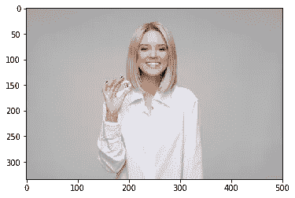*

*[source](https://www.pexels.com/photo/women-wearing-white-long-sleeved-collared-shirt-holding-bitcoin-1037915/)*

> *在对图像进行任何分割之前，使用一些滤波器对其进行降噪是一个好主意。*

*但是，在我们的例子中，图像并不是很嘈杂，所以我们会照原样处理。下一步是用`rgb2gray`将图像转换成灰度。*

```
*image_gray = color.rgb2gray(image) 
image_show(image_gray);*
```

**

*我们将使用两种基于完全不同原理的分割方法。*

## *[活动轮廓分割](http://scikit-image.org/docs/dev/auto_examples/edges/plot_active_contours.html)*

***活动轮廓分割**也称为**蛇**和使用感兴趣区域周围的用户定义轮廓或线条进行初始化，然后该轮廓缓慢收缩，并被光线和边缘吸引或排斥。*

*对于我们的示例图像，让我们在人的头部周围画一个圆来初始化蛇。*

```
***def** circle_points(resolution, center, radius): *"""*
 *Generate points which define a circle on an image.Centre refers to the centre of the circle*
 *"""*   
    radians = np.linspace(0, 2*np.pi, resolution) c = center[1] + radius*np.cos(radians)#polar co-ordinates
    r = center[0] + radius*np.sin(radians)

    **return** np.array([c, r]).T*# Exclude last point because a closed path should not have duplicate points*
points = circle_points(200, [80, 250], 80)[:-1]*
```

> *上面的计算计算了圆周上的点的 x 和 y 坐标。由于我们给定的分辨率是 200，它将计算 200 个这样的点。*

```
*fig, ax = image_show(image)
ax.plot(points[:, 0], points[:, 1], '--r', lw=3)*
```

**

*然后，该算法通过将闭合曲线拟合到人脸的边缘，将人脸从图像的其余部分中分割出来。*

```
*snake = seg.active_contour(image_gray, points)fig, ax = image_show(image)
ax.plot(points[:, 0], points[:, 1], '--r', lw=3)
ax.plot(snake[:, 0], snake[:, 1], '-b', lw=3);*
```

*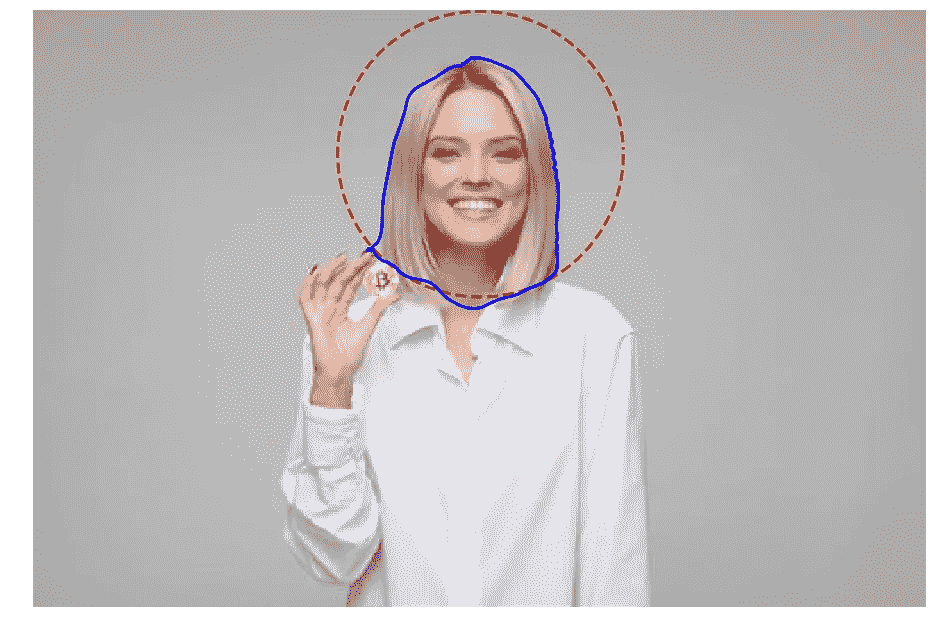*

*我们可以调整名为`alpha`和 `beta`的参数。较高的 alpha 值会使蛇收缩得更快，而 beta 值会使蛇更平滑。*

```
*snake = seg.active_contour(image_gray, points,alpha=0.06,beta=0.3)fig, ax = image_show(image)
ax.plot(points[:, 0], points[:, 1], '--r', lw=3)
ax.plot(snake[:, 0], snake[:, 1], '-b', lw=3);*
```

*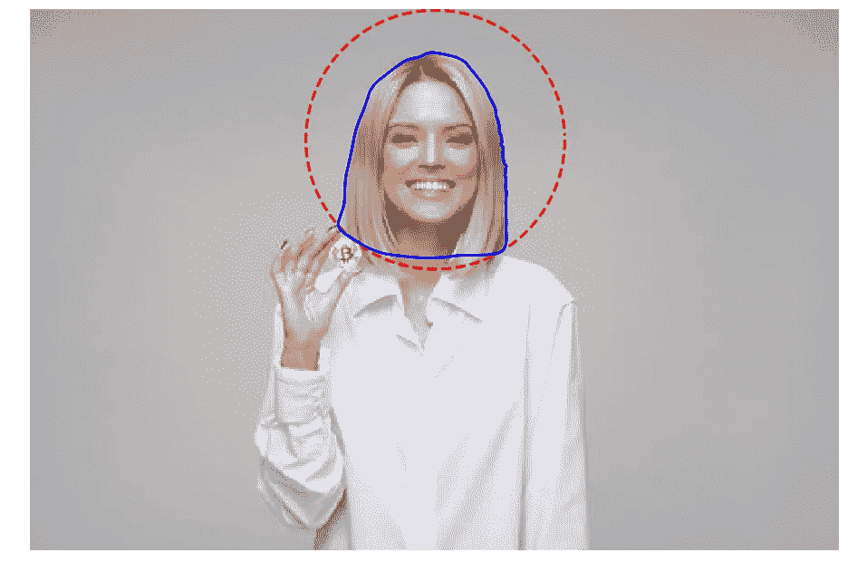*

## *[随机行者分割](http://scikit-image.org/docs/dev/auto_examples/segmentation/plot_random_walker_segmentation.html)*

*在这种方法中，用户交互式地标记少量像素，这些像素被称为**标记**。然后，设想每个未标记的像素释放一个随机行走体，然后可以确定随机行走体从每个未标记的像素开始并到达预先标记的像素之一的概率。通过将每个像素分配给计算出最大概率的标签，可以获得高质量的图像分割。点击阅读[参考文件。](https://ieeexplore.ieee.org/document/1704833)*

*在这里，我们将重用上一个示例中的种子值。我们可以用
完成不同的初始化，但是为了简单起见，让我们坚持使用圆形。*

```
*image_labels = np.zeros(image_gray.shape, dtype=np.uint8)*
```

*随机漫步算法需要一个标签图像作为输入。因此，我们将有一个较大的圆圈包围着这个人的整个脸，另一个较小的圆圈靠近脸的中间。*

```
*indices = draw.circle_perimeter(80, 250,20)#from [here](https://medium.com/p/533a61ecc980/oeed)image_labels[indices] = 1
image_labels[points[:, 1].astype(np.int), points[:, 0].astype(np.int)] = 2image_show(image_labels);*
```

*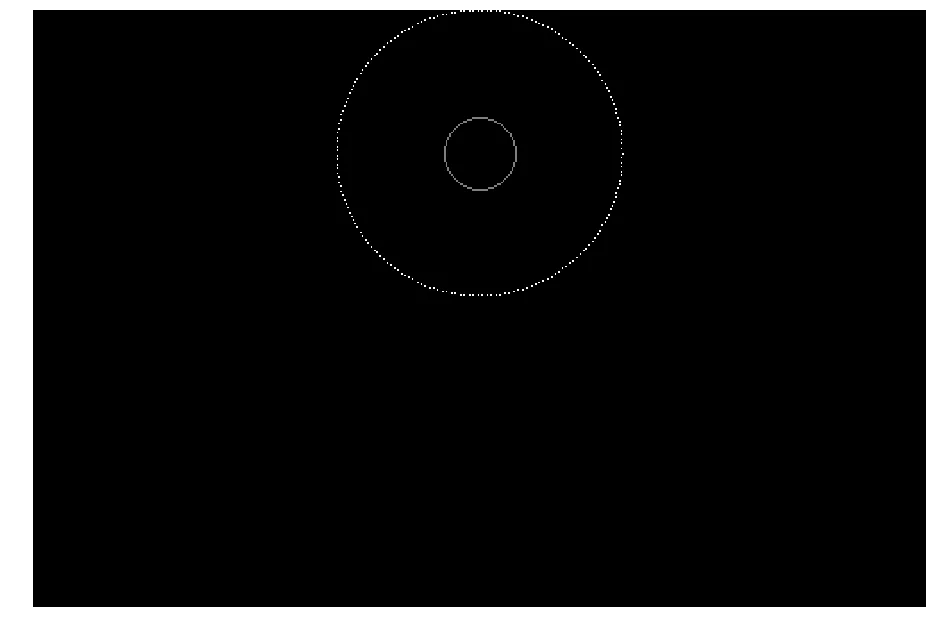*

*现在，让我们使用随机漫步机，看看会发生什么。*

```
*image_segmented = seg.random_walker(image_gray, image_labels)# Check our results
fig, ax = image_show(image_gray)
ax.imshow(image_segmented == 1, alpha=0.3);*
```

**

*它看起来不像我们想要的那样抓住边缘。为了解决这种情况，我们可以调整β参数，直到我们得到想要的结果。经过几次尝试后，值 3000 工作得相当好。*

```
*image_segmented = seg.random_walker(image_gray, image_labels, beta = 3000)# Check our results
fig, ax = image_show(image_gray)
ax.imshow(image_segmented == 1, alpha=0.3);*
```

**

*这就是监督分割，我们必须提供某些输入，还必须调整某些参数。然而，让一个人看着一幅图像，然后决定给出什么输入或者从哪里开始，并不总是可能的。幸运的是，对于这些情况，我们有无监督分割技术。*

# *无监督分割*

*无监督分割不需要先验知识。考虑一个如此大的图像，以至于不可能同时考虑所有像素。因此，在这种情况下，无监督分割可以将图像分解成几个子区域，所以不是数百万像素，而是数十到数百个区域。让我们来看两个这样的算法:*

## *[SLIC(简单线性迭代聚类)](http://scikit-image.org/docs/dev/api/skimage.segmentation.html#skimage.segmentation.slic)*

*SLIC 算法实际上使用了一种叫做 **K-Means** 的机器学习算法。它接受图像的所有像素值，并试图将它们分成给定数量的子区域。在此阅读[参考文件](https://ieeexplore.ieee.org/document/6205760)。*

*SLIC 是彩色的，所以我们将使用原始图像。*

```
*image_slic = seg.slic(image,n_segments=155)*
```

*我们所做的只是将我们找到的每个子图像或子区域设置为该区域的平均值，这使得它看起来不像是随机分配的颜色的拼凑物，而更像是被分解成类似区域的图像。*

```
**# label2rgb replaces each discrete label with the average interior color*
image_show(color.label2rgb(image_slic, image, kind='avg'));*
```

**

*我们将这张图片从 512*512 = 262，000 像素缩减到 155 个区域。*

## *费尔曾兹瓦尔布*

*该算法还使用了一种叫做**最小生成树聚类**的机器学习算法。Felzenszwaib 没有告诉我们图像将被划分成多少个簇。它将运行并生成它认为适合图像上给定的
比例或缩放因子的尽可能多的集群。[参考文件可在此处](http://cs.brown.edu/people/pfelzens/segment/)获取。*

```
*image_felzenszwalb = seg.felzenszwalb(image) 
image_show(image_felzenszwalb);*
```

*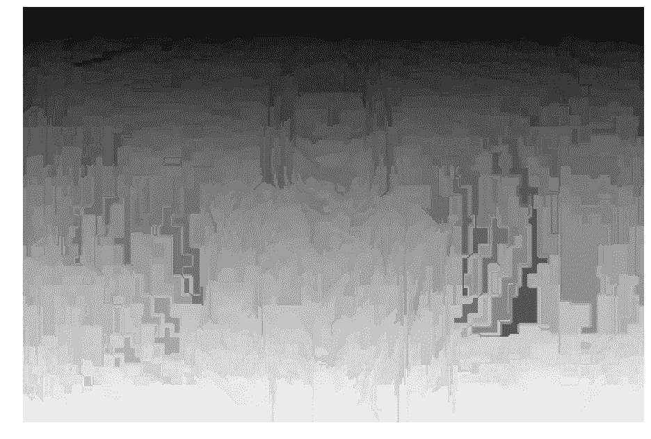*

*这是很多地区。让我们来计算独特区域的数量。*

```
*np.unique(image_felzenszwalb).size
3368*
```

*现在让我们使用区域平均值对它们重新着色，就像我们在 SLIC 算法中做的那样。*

```
*image_felzenszwalb_colored = color.label2rgb(image_felzenszwalb, image, kind='avg')image_show(image_felzenszwalb_colored);*
```

*现在我们得到了相当小的区域。如果我们想要更少的区域，我们可以改变`scale`参数或者从这里开始合并它们。这种方法有时被称为**过度分割**。*

**

*这几乎看起来更像是一个色调分离的图像，本质上只是减少了颜色的数量。要再次组合它们，可以使用 [**区域邻接图(RAG**](http://scikit-image.org/docs/dev/auto_examples/segmentation/plot_rag.html) **)** ，但这超出了本文的范围。*

# *基于深度学习的图像分割*

*到目前为止，我们只使用 scikit 图像模块研究了图像分割技术。然而，值得一提的是一些使用深度学习的图像分割技术。这里有一篇精彩的博客文章，重点介绍了图像分割架构、损失、数据集和框架，您可以将其用于您的图像分割项目。*

*[](https://neptune.ai/blog/image-segmentation-in-2020) [## 2020 年的图像分割:架构、损失、数据集和框架

### 在这篇文章中，我们将使用深度学习深入研究图像分割的世界。我们将讨论:什么…

海王星. ai](https://neptune.ai/blog/image-segmentation-in-2020)* 

# *结论*

*图像分割是一个非常重要的图像处理步骤。它是一个活跃的研究领域，应用范围从计算机视觉到医学成像，再到交通和视频监控。Python 以 scikit-image 的形式提供了一个健壮的库，其中包含大量用于图像处理的算法。它是免费的，没有任何限制，背后有一个活跃的社区。看看他们的文档，了解更多关于这个库及其用例的信息。*

***参考文献:***

*[Scikit 图像文档](https://scikit-image.org/docs/dev/user_guide/tutorial_segmentation.html)*