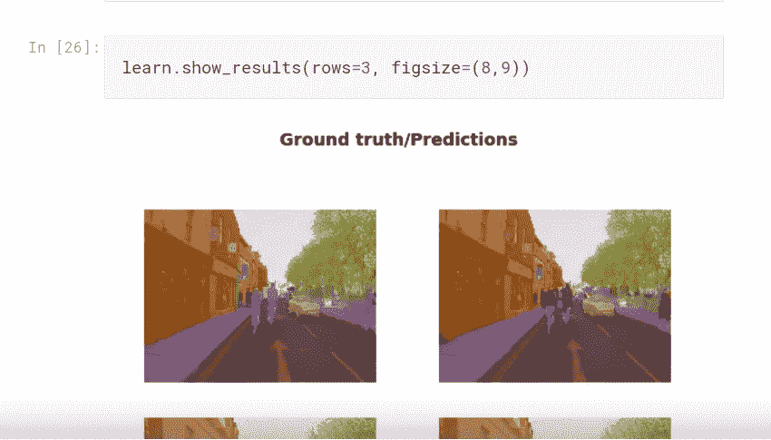

# 使用 fastai 的图像分割

> 原文：<https://towardsdatascience.com/image-segmentation-with-fastai-9f8883cc5b53?source=collection_archive---------6----------------------->

## 了解如何使用 U-net 对图像的每个像素进行颜色编码


## 介绍

图像分割是计算机视觉的一种应用，其中我们对图像中的每个像素进行颜色编码。每个像素代表图像中的一个特定对象。如果你看上面的图片，每条街道都是紫色的，每栋建筑都是橙色的，每棵树都是绿色的，等等。我们为什么要这样做，它与对象检测有何不同？

当我们关心边缘和区域时，当我们想从背景中分离出重要的对象时，通常会使用图像分割。我们希望了解一个对象的具体情况，并从那里对其进行进一步的分析。想象一下无人驾驶汽车。自动驾驶汽车不仅要识别街道，还要知道它的边缘或曲线，以便正确转弯。


图像分割在医学领域有着重要的意义。需要研究的部分用颜色编码，并从不同角度扫描观察。然后，它们被用于器官的自动测量、细胞计数或基于提取的边界信息的模拟。

## 该过程

我们将图像分割视为一个分类问题，对于图像中的每个像素，我们试图预测它是什么。是自行车，道路线，人行道，还是建筑？这样，我们产生了一个彩色编码图像，其中每个物体都有相同的颜色。

## **代码**

像往常一样，我们从导入 fastai 库开始。


让我们先来看看其中的一张图片。


接下来，我们来看看分割后的图像是什么样子。由于标记图像中的值是整数，我们不能使用相同的函数来打开它。相反，我们使用`open_mask` 和`show`来显示图像。


注意`open_mask`内部的`get_y_fn`功能。在每一个分割问题中，我们都有两组图像，原始图像和标记图像。我们需要将标签图像与正常图像进行匹配。我们用文件名来做这件事。让我们来看看一些图像的文件名。


我们看到正常图像和标记图像的文件名是相同的，除了相应的标记图像在末尾有一个`_P`。因此，我们写了一个函数，对于每一个图像，识别其相应的标记副本。


我们还有一个名为`codes.txt`的文件，它告诉我们标记图像中的整数对应于什么对象。让我们打开标签图像的数据。


现在让我们检查代码文件中这些整数的含义。


标签数据里有很多 26。从代码文件中的索引 0 开始计数，我们看到整数 26 引用的对象是一棵树。

既然我们已经理解了我们的数据，我们可以继续创建一个数据束并训练我们的模型。


我们不会使用整个数据集，我们还会保持相对较小的批量，因为对每个图像中的每个像素进行分类是一项资源密集型任务。


像往常一样，我们创建我们的数据束。阅读上面的代码:

*   从文件夹创建数据束
*   根据`valid.txt`中提到的文件名将数据分为训练和测试
*   使用功能`get_y_fn`找到带标签的图像，并将代码用作待预测的类别。
*   [在图像上应用变换](https://medium.com/@dipam44/data-augmentations-in-fastai-84979bbcefaa)(注意这里的`tfm_y = True`。这意味着我们对从属图像应用的任何变换也应该应用到目标图像上。(例如:如果我们水平翻转图像，我们也应该翻转相应的标签图像))

为了训练，我们将使用一个名为 U-Net 的 CNN 架构，因为他们擅长重建图像。


在解释什么是 U-Net 之前，请注意上面代码中使用的指标。什么是`acc_camvid`？

图像分割问题中的精度与任何分类问题中的精度相同。

```
Accuracy = no. of correctly classified pixels / total no. of pixels
```

然而，在这种情况下，一些像素被标记为`Void`(该标签也存在于`codes.txt`)，在计算精度时不应予以考虑。因此，我们创建了一个新的函数来计算精度，在这里我们避开了这些标签。


CNN 的工作方式是将一幅图像分解成越来越小的部分，直到只剩下一件事可以预测(下图 U-Net 架构的左边部分)。一个 U-Net 然后把它变得越来越大，它为 CNN 的每个阶段都这样做。然而，从一个小矢量构建一幅图像是一项困难的工作。因此，我们有从原始卷积层到反卷积网络的连接。


像往常一样，我们找到[学习率](https://medium.com/@dipam44/learning-rate-and-golf-87c8d4697e31)并训练我们的模型。即使只有一半的数据集，我们也能达到 92%的准确率。


检查一些结果。



事实是真正的目标，而预测是我们的模型所标注的。

我们现在可以在完整的数据集上进行训练。

## 结论

这就是本文的全部内容。在本文中，我们看到了如何使用 U-net 对图像的每个像素进行颜色编码。U-nets 越来越受欢迎，因为它们在从模糊图像生成高分辨率图像等应用上的表现优于 GANs。因此，知道它们是什么以及如何使用它们是非常有用的。

[*完整的笔记本可以在这里找到。*](https://www.kaggle.com/dipam7/image-segmentation-using-fastai)

如果你想了解更多关于深度学习的知识，可以看看我在这方面的系列文章:

[](https://medium.com/@dipam44/deep-learning-series-30ad108fbe2b) [## 深度学习系列

### 我所有关于深度学习的文章的系统列表

medium.com](https://medium.com/@dipam44/deep-learning-series-30ad108fbe2b) 

~快乐学习