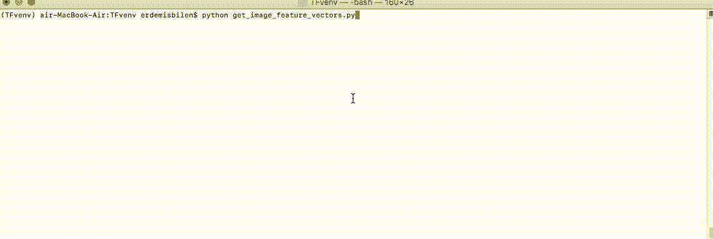
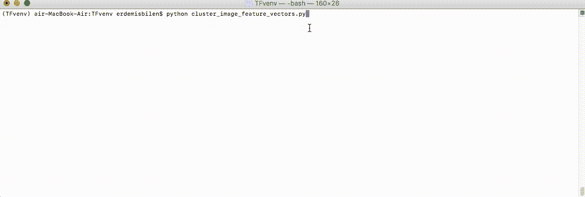
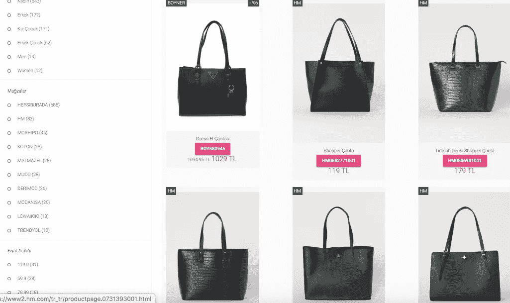

# Tensorflow 2.0 中的图像相似性检测

> 原文：<https://towardsdatascience.com/image-similarity-detection-in-action-with-tensorflow-2-0-b8d9a78b2509?source=collection_archive---------2----------------------->

## 准备好为您的 web 应用程序使用管道了吗


Photo by [Sharon McCutcheon](https://unsplash.com/@sharonmccutcheon?utm_source=medium&utm_medium=referral) on [Unsplash](https://unsplash.com?utm_source=medium&utm_medium=referral)

在这篇文章中，我将向您展示我是如何在我的'**时尚价格比较'** web 应用程序中实现'**图像相似性检测**任务的。我将使用图像相似性，根据用户搜索的内容向他们推荐视觉上相似的产品。

实现的完整源代码可以在我的 GitHub 库的[中找到。](https://github.com/eisbilen/ImageSimilarityDetection)

在整篇文章中，将有专门的部分来讨论以下每一个主题:

*   如何使用 **Tensorflow 2.0** 和 **Tensorflow Hub** 生成产品图像的**【图像特征向量】**。
*   如何使用**Spotify/airy**库和**图像特征向量**计算图像相似度得分。
*   在一个 **JSON 文件**中存储相似性分数和相关的产品标识号，以便在我们的 web 应用程序中进行可视化搜索。

# 什么是“图像相似性检测”，为什么它很重要？

图像相似性检测用于量化图像的视觉和语义相似程度。

在现代应用中，重复产品检测、图像聚类、视觉搜索和推荐任务都是使用这种技术来执行的。

“搜索的未来将是图片而不是关键词。”——***本·希伯尔曼，Pinterest CEO***

视觉搜索的一个优点是它完全依赖于商品的外观。不需要条形码、二维码、产品名称或其他产品元数据等其他数据。”——***布伦特·拉博斯基、*** ***亚马逊网络服务***

“顾客越来越多地使用社交媒体平台，如 Instagram 和 Pinterest，作为灵感的来源，因此视觉搜索有可能改变我们为家庭购物的方式。” ***—马克钢，数字导演，Argos***


Photo by [Vidar Nordli-Mathisen](https://unsplash.com/@vidarnm?utm_source=medium&utm_medium=referral) on [Unsplash](https://unsplash.com?utm_source=medium&utm_medium=referral)

# 如何使用 Tensorflow 2.0 和 Tensorflow Hub 生成“图像特征向量”

*   **Tensorflow 2.0 和 Tensorflow Hub**

[Tensorflow](https://www.tensorflow.org/) 是 Google 开发的用于机器学习的端到端开源平台。它拥有工具、库和社区资源，让开发人员可以轻松构建和部署机器学习应用程序。

[TensorFlow Hub](https://www.tensorflow.org/hub) 提供了许多可重用的机器学习模型。它使迁移学习变得非常容易，因为它为不同的问题领域和不同的任务(如图像分类、图像分割、姿态检测、文本嵌入、文本分类、视频生成等)提供了预训练的模型。

关于迁移学习的更多信息，你可以查看我以前的文章。

[](/training-custom-image-classification-model-on-the-browser-with-tensorflow-js-and-angular-f1796ed24934) [## 浏览器中的机器学习:为自定义图像分类训练和服务 Mobilenet 模型

### 用 Tensorflow.js 和 Angular 在浏览器上训练基于 Mobilenet 的自定义图像分类模型

towardsdatascience.com](/training-custom-image-classification-model-on-the-browser-with-tensorflow-js-and-angular-f1796ed24934) 

*   **什么是图像特征向量？**

一个**图像特征向量**是代表整个**图像的数字列表，**通常用于图像相似性计算或图像分类任务。

一般来说，低级图像特征是图像的次要细节，例如线、边缘、角或点。高级特征建立在低级特征之上，以检测图像中的对象和较大的形状。

我们可以使用卷积神经网络提取这两种类型的特征:第一对卷积层将学习用于找到低级特征的过滤器，而后面的层将学习识别常见的形状和对象。

在我们的例子中，我们将使用存储在 [Tensorflow Hub](https://www.tensorflow.org/hub) 中的[**mobilenet _ v2 _ 140 _ 224**](https://tfhub.dev/google/imagenet/mobilenet_v2_140_224/feature_vector/4)预训练的卷积神经网络来提取**产品图像**的高级特征。

MobilenetV2 是一个简单的神经网络架构，适用于移动和资源受限的应用程序。点击[此链接](https://arxiv.org/pdf/1801.04381.pdf)可获得关于 MobilenetV2 的更多信息。


Photo by [Quaid Lagan](https://unsplash.com/@freshseteyes?utm_source=medium&utm_medium=referral) on [Unsplash](https://unsplash.com?utm_source=medium&utm_medium=referral)

在开始编码之前，需要在我们的本地计算机上安装 Tensorflow 2.0、Tensorflow Hub 和 Spotify/airy 库。

```
$ virtualenv --system-site-packages -p python3 ./TFvenv
$ source ./TFvenv/bin/activate$ pip install tensorflow
$ pip install tensorflow-hub
$ pip install annoy
```

# 我们来生成图像特征向量:get_image_feature_vectors.py

这个脚本的主要目的是通过读取位于本地文件夹中的图像文件来生成图像特征向量。

它有两个功能: **load_img()** 和**get _ image _ feature _ vectors()**。

**load_img(path)** 获取文件名，作为函数的参数。然后加载并预处理图像，以便我们可以在我们的 MobilenetV2 CNN 模型中使用它们。

预处理步骤如下:

*   将图像解码为 W x H x 3 形状张量，数据类型为整数。
*   将图像大小调整为 224 x 224 x 3 形状张量，因为我们使用的 MobilenetV2 模型版本需要特定的图像大小。
*   将张量的数据类型转换为 **float** 并添加一个新轴，使张量形状为 1 x 224 x 224 x 3。这正是模型所期望的输入形状。

**get _ image _ feature _ vectors()**函数是我提取图像特征向量的地方。你可以在下面看到，这个函数的一步一步的定义；

*   使用 Tensorflow Hub 加载 MobilenetV2 模型
*   遍历本地文件夹中的所有图像，并将它们传递给 **load_img(path)** 函数
*   推断图像特征向量
*   将每个特征向量保存到单独的文件中以备后用



get_image_feature_vectors.py in action

```
**# get_image_feature_vectors.py****#################################################
# Imports and function definitions
#################################################**
**# For running inference on the TF-Hub module with Tensorflow**
import tensorflow as tf
import tensorflow_hub as hub**# For saving 'feature vectors' into a txt file**
import numpy as np**# Glob for reading file names in a folder**
import glob
import os.path
**#################################################****#################################################
# This function:
# Loads the JPEG image at the given path
# Decodes the JPEG image to a uint8 W X H X 3 tensor
# Resizes the image to 224 x 224 x 3 tensor
# Returns the pre processed image as 224 x 224 x 3 tensor
#################################################**
def load_img(path):**# Reads the image file and returns data type of string**
 img = tf.io.read_file(path)**# Decodes the image to W x H x 3 shape tensor with type of uint8**
 img = tf.io.decode_jpeg(img, channels=3)**# Resizes the image to 224 x 224 x 3 shape tensor**
 img = tf.image.resize_with_pad(img, 224, 224)**# Converts the data type of uint8 to float32 by adding a new axis
 # img becomes 1 x 224 x 224 x 3 tensor with data type of float32
 # This is required for the mobilenet model we are using**
 img = tf.image.convert_image_dtype(img,tf.float32)[tf.newaxis, ...]

 return img**#################################################
# This function:
# Loads the mobilenet model in TF.HUB
# Makes an inference for all images stored in a local folder
# Saves each of the feature vectors in a file
#################################################**
def get_image_feature_vectors():

 **# Definition of module with using tfhub.dev**
 module_handle = "https://tfhub.dev/google/imagenet/
                  mobilenet_v2_140_224/feature_vector/4"
 **# Loads the module**
 module = hub.load(module_handle)**# Loops through all images in a local folder**
 for filename in glob.glob('/Users/erdemisbilen/Angular/
          fashionWebScraping/images_scraped/full/*.jpg'):

  print(filename)**# Loads and pre-process the image**
  img = load_img(filename)**# Calculate the image feature vector of the img**
  features = module(img)**# Remove single-dimensional entries from the 'features' array ** 
  feature_set = np.squeeze(features)

 **# Saves the image feature vectors into a file for later use**
  outfile_name = os.path.basename(filename) + ".npz"

  out_path = os.path.join('/Users/erdemisbilen/Angular/
            fashionWebScraping/images_scraped/feature-vectors/',
            outfile_name)**# Saves the 'feature_set' to a text file**
  np.savetxt(out_path, feature_set, delimiter=',')get_image_feature_vectors()
```


Photo by [浮萍 闪电](https://unsplash.com/@vsmilelx?utm_source=medium&utm_medium=referral) on [Unsplash](https://unsplash.com?utm_source=medium&utm_medium=referral)

# 如何使用 Spotify/airy 库计算相似度得分

*   **什么是 Spotify/骚扰库？**

[](https://github.com/spotify/annoy)****(**A**approximate**N**earest**N**eighbor**O**h**Y**eah)**，**是一个用于近似最近邻实现的开源库。****

****我将使用它来查找给定集合中与给定特征向量最接近(或最相似)的图像特征向量。****

> ****调优 aroy 只需要两个主要参数:树的数量`*n_trees*`和搜索过程中要检查的节点数量`*search_k*`。****
> 
> ****`*n_trees*`在构建期间提供，影响构建时间和索引大小。较大的值会给出更准确的结果，但索引也较大。****
> 
> ****`*search_k*`在运行时提供，影响搜索性能。较大的值会给出更准确的结果，但需要更长的时间返回。****
> 
> ****[**来自 Spotify/asury**](https://github.com/spotify/annoy)****

# ****让我们来计算相似度得分:cluster _ image _ feature _ vectors . py****

****这个脚本的主要目的是使用我们在前一章刚刚生成的图像特征向量来计算图像相似性得分。****

****它有两个功能: **match_id(文件名)**和 **cluster()** 。****

******cluster()** 函数按照以下流程进行图像相似度计算:****

*   ****通过追加存储在本地文件夹中的所有图像特征向量来建立恼人的索引****
*   ****计算最近邻和相似性得分****
*   ****将信息保存和存储在 JSON 文件中，以备后用。****

******match_id(filename)** 是一个帮助函数，因为我需要将图像与产品 id 进行匹配，以便在我的 web 应用程序中实现可视化产品搜索。有一个 JSON 文件，其中包含与产品图像名称匹配的所有产品 id 信息。该函数使用 JSON 文件检索给定图像文件名的产品 id 信息。****

********

****cluster_image_feature_vectors.py in action****

```
****# cluster_image_feature_vectors.py****#################################################
# Imports and function definitions
#################################################
# Numpy for loading image feature vectors from file**
import numpy as np**# Time for measuring the process time**
import time**# Glob for reading file names in a folder**
import glob
import os.path**# json for storing data in json file**
import json**# Annoy and Scipy for similarity calculation**
from annoy import AnnoyIndex
from scipy import spatial
**#################################################****#################################################
# This function reads from 'image_data.json' file
# Looks for a specific 'filename' value
# Returns the product id when product image names are matched
# So it is used to find product id based on the product image name
#################################################**
def match_id(filename):
 with open('/Users/erdemisbilen/Angular/fashionWebScraping
 /jsonFiles/image_data.json') as json_file:for file in json_file:
   seen = json.loads(file)for line in seen:

     if filename==line['imageName']:
      print(line)
      return line['productId']
      break
**#################################################****#################################################
# This function:
# Reads all image feature vectores stored in /feature-vectors/*.npz
# Adds them all in Annoy Index
# Builds ANNOY index
# Calculates the nearest neighbors and image similarity metrics
# Stores image similarity scores with productID in a json file
#################################################** def cluster():
 start_time = time.time()

 print("---------------------------------")
 print ("Step.1 - ANNOY index generation - Started at %s" 
 %time.ctime())
 print("---------------------------------")**# Defining data structures as empty dict**
 file_index_to_file_name = {}
 file_index_to_file_vector = {}
 file_index_to_product_id = {}**# Configuring annoy parameters**
 dims = 1792
 n_nearest_neighbors = 20
 trees = 10000**# Reads all file names which stores feature vectors**
 allfiles = glob.glob('/Users/erdemisbilen/Angular
 /fashionWebScraping/images_scraped/feature-vectors/*.npz')

 t = AnnoyIndex(dims, metric='angular')for file_index, i in enumerate(allfiles):**# Reads feature vectors and assigns them into the file_vector**
  file_vector = np.loadtxt(i)**# Assigns file_name, feature_vectors and corresponding product_id**
  file_name = os.path.basename(i).split('.')[0]
  file_index_to_file_name[file_index] = file_name
  file_index_to_file_vector[file_index] = file_vector
  file_index_to_product_id[file_index] = match_id(file_name)**# Adds image feature vectors into annoy index**
  t.add_item(file_index, file_vector)print("---------------------------------")
  print("Annoy index     : %s" %file_index)
  print("Image file name : %s" %file_name)
  print("Product id      : %s" 
  %file_index_to_product_id[file_index])
  print("--- %.2f minutes passed ---------" % ((time.time() -
  start_time)/60))**# Builds annoy index**
 t.build(trees)print ("Step.1 - ANNOY index generation - Finished")
 print ("Step.2 - Similarity score calculation - Started ")named_nearest_neighbors = []**# Loops through all indexed items**
 for i in file_index_to_file_name.keys():

 **# Assigns master file_name, image feature vectors 
  # and product id values**
  master_file_name = file_index_to_file_name[i]
  master_vector = file_index_to_file_vector[i]
  master_product_id = file_index_to_product_id[i]**# Calculates the nearest neighbors of the master item**
  nearest_neighbors = t.get_nns_by_item(i, n_nearest_neighbors)**# Loops through the nearest neighbors of the master item**
  for j in nearest_neighbors:

   print(j)**# Assigns file_name, image feature vectors and 
   # product id values of the similar item** neighbor_file_name = file_index_to_file_name[j]
   neighbor_file_vector = file_index_to_file_vector[j]
   neighbor_product_id = file_index_to_product_id[j]**# Calculates the similarity score of the similar item**
   similarity = 1 - spatial.distance.cosine(master_vector,
   neighbor_file_vector)rounded_similarity = int((similarity * 10000)) / 10000.0**# Appends master product id with the similarity score
   # and the product id of the similar items** named_nearest_neighbors.append({
     'similarity': rounded_similarity,
     'master_pi': master_product_id,
     'similar_pi': neighbor_product_id})print("---------------------------------")
 print("Similarity index       : %s" %i)
 print("Master Image file name : %s" %file_index_to_file_name[i])
 print("Nearest Neighbors.     : %s" %nearest_neighbors)
 print("--- %.2f minutes passed ---------" % ((time.time() -
 start_time)/60))print ("Step.2 - Similarity score calculation - Finished ")**# Writes the 'named_nearest_neighbors' to a json file**
 with open('nearest_neighbors.json', 'w') as out:
 json.dump(named_nearest_neighbors, out)print ("Step.3 - Data stored in 'nearest_neighbors.json' file ")
 print("--- Prosess completed in %.2f minutes ---------" %
 ((time.time() - start_time)/60))cluster()**
```

****如您所见，我将每个产品图片的最高 20 个相似性分数保存在一个 JSON 文件中，并带有匹配的产品 id 信息。这是因为我不知道如何在客户端进行相似性计算来消除所需的工作量。****

****有了存储在 JSON 文件中的相似性得分，我可以轻松地填充 Elasticsearch 集群，或者填充数据库，以便在我的价格比较 web 应用程序的浏览器上实现近乎实时的可视化搜索体验。****

****为了开发这样的应用程序，web 抓取在开发和维护日常产品数据集方面起着重要的作用。如果你对这个主题感兴趣，可以看看我下面的相关文章。****

****[](/web-scraping-of-10-online-shops-in-30-minutes-with-python-and-scrapy-a7f66e42446d) [## 使用 Python 和 Scrapy 在 30 分钟内抓取 10 家在线商店的网页

### 获取启动应用程序项目所需的源数据

towardsdatascience.com](/web-scraping-of-10-online-shops-in-30-minutes-with-python-and-scrapy-a7f66e42446d)**** 

# ****结论****

********

****Fashion Search Web Application by Erdem Isbilen — Visual Search Results****

****正如你在上面所看到的，MobileNetV2 和 Annoy 在寻找视觉上相似的产品方面做得非常好。****

****这种实现方式的一个缺点是它只能在整个图像级别工作。如果图像的背景不同，即使物体相似，它也不会提供好的结果。****

****该应用程序可以进一步改进，以实现类似于 [Pinterest](https://www.pinterest.co.uk) 或 [Houzz](https://www.houzz.co.uk) 上的对象级相似性搜索。****