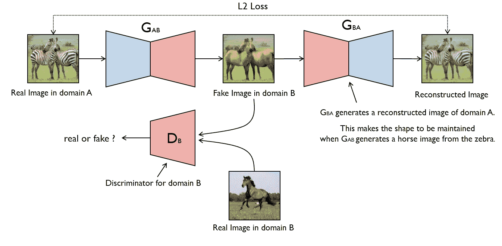

# 基于 CycleGAN 模型的图像到图像翻译

> 原文：<https://towardsdatascience.com/image-to-image-translation-using-cyclegan-model-d58cfff04755?source=collection_archive---------14----------------------->

## 一种用于图像到图像翻译的无监督方法。


Photo by [Tim Mossholder](https://unsplash.com/@timmossholder?utm_source=medium&utm_medium=referral) on [Unsplash](https://unsplash.com?utm_source=medium&utm_medium=referral)

> 如果你对 GANs 领域完全陌生，我建议你在开始写这篇文章之前先看看我以前的文章。

[](/fake-face-generator-using-dcgan-model-ae9322ccfd65) [## 基于 DCGAN 模型的人脸生成器

### 概观

towardsdatascience.com](/fake-face-generator-using-dcgan-model-ae9322ccfd65) 

> 即使你不熟悉 GANs，我仍然建议你通读这篇文章，因为我们需要所有我们在上一篇文章中学到的基本概念来理解这篇文章。也就是说，让我们从这篇文章开始。

**循环生成对抗网络 *(CycleGAN)*** ，是一种训练深度卷积网络用于图像到图像翻译任务的方法。与其他用于图像转换任务的 *GAN* s 模型不同，C *ycleGAN* 使用**无监督方法**学习一个图像域和另一个图像域之间的映射。例如，如果我们对将马的图像转换成斑马的图像感兴趣，我们不需要将马物理转换成斑马的训练数据集。 *CycleGAN* 做到这一点的方法是通过训练生成器网络来学习从域 X 到看起来像是来自域 Y 的图像的映射*(反之亦然)*。

> 当你阅读这篇文章时，你会对它是如何做到的有更深的理解。所以让我们开始吧…

# CycleGAN



**CycleGAN architecture**. Image from [https://modelzoo.co/model/mnist-svhn-transfer](https://modelzoo.co/model/mnist-svhn-transfer)

> 出于直觉，我们会参考上面的图像。

对于成对的图像集，我们可以直接创建一个 *GAN* 来借助 Pix2Pix 学习从 x 到 y 的映射。你可以在这里阅读更多关于 Pix2Pix Networks [的内容。](https://machinelearningmastery.com/a-gentle-introduction-to-pix2pix-generative-adversarial-network/)

但是准备成对的数据集既费时又困难。我的意思是，我们需要一幅斑马的图像，它的位置和马的位置一样，或者有着相同的背景，这样我们才能学会绘制地图。

为了解决这个问题，CycleGAN 架构应运而生。CycleGAN 能够学习从一个域 X 到另一个域 Y 的映射，而不必寻找完全匹配的训练对！我们来看看 CycleGAN 是怎么做到的。

假设我们有一组来自域 X 的图像和一组来自域 y 的不成对的图像，我们希望能够将一组图像转换成另一组图像。为此，我们定义了一个映射 G *(G: X- > Y)* ，它尽最大努力将 X 映射到 Y。但是对于不成对的数据，我们不再能够查看真实和虚假的数据对。但是我们知道我们可以改变我们的模型来产生一个属于目标领域的输出。


因此，当你推送一匹马的图像时，我们可以训练一个生成器生成逼真的斑马图像。但问题是，我们不能强迫生成器的输出对应于它的输入*(在上面的图像中，第一个转换是正确的图像到图像的转换)。*这导致了一个被称为**模式崩溃**的问题，其中一个模型可能将来自域 X 的多个输入映射到来自域 Y 的同一个输出。在这种情况下，给定一匹输入马*(域 X)* ，我们所知道的就是输出应该看起来像斑马*(域 Y)* 。但是为了在相应的目标域中获得输入的正确映射，我们引入了一个额外的映射作为逆映射 G' *(G': Y- > X)* ，它试图将 Y 映射到 X。这被称为**循环一致性约束**。

可以这样想，如果我们将一幅马的图像*(域 X)* 翻译成一幅斑马的图像*(域 Y)* ，然后我们再从斑马(域 Y)翻译回一匹马(域 X)，我们应该回到开始时的马的图像。

一个完整的翻译周期应该会让你回到开始时的图像。在从域 X 到 Y 的图像变换的情况下，如果满足以下条件，我们说图像从域 X 到域 Y 的变换是正确的。


condition -1

在循环一致性约束的帮助下，CycleGAN 确保模型学习到从域 X 到域 y 的正确映射。

# 图像到图像翻译任务

下面的任务被分解成一系列小任务，从**加载和可视化数据到训练模型**。

## 可视化数据集

具体来说，我们将看一组在夏季或冬季拍摄的约塞米蒂国家公园的照片。季节是我们的两个领域！


Images from the summer season domain.


Images from the winter season domain.

一般来说，你可以看到夏天的图像比冬天的图像更亮更绿。冬天包含了像雪和多云图像这样的东西。在这个数据集中，我们的主要目标是训练一个生成器，学习将图像从夏天转换到冬天，反之亦然。这些图像不包含标签，被称为不成对的训练数据。但是通过使用 CycleGAN，我们可以使用无监督的方法学习从一个图像域到另一个图像域的映射。

> 你可以点击[这里](https://s3.amazonaws.com/video.udacity-data.com/topher/2018/November/5be66e78_summer2winter-yosemite/summer2winter-yosemite.zip)下载以下数据。

## 定义模型

CycleGAN 包括两个鉴别器( *D_x* 和 *D_y* )和两个发生器( *G_xtoy* 和 *G_ytox* )。

*   *D_x* —将来自域 X 的训练图像识别为真实图像，将从域 Y 到域 X 的翻译图像识别为伪造图像。
*   *D_y* —将来自域 X 的训练图像识别为真实图像，将从域 Y 到域 X 的翻译图像识别为伪造图像。
*   *G_xtoy* —将图像从域 X 转换到域 y。
*   *G_ytox* —将图像从域 Y 转换到域 x。

**鉴别器**

在这个 *CycleGAN* 中，鉴别器 *D_x* 和 *D_y* 是卷积神经网络，它们看到一幅图像并试图将其分类为真实或伪造。在这种情况下，real 由接近 1 的输出表示，而 fake 由接近 0 的输出表示。鉴别器具有以下架构:

```
# helper conv function
def conv(in_channels, out_channels, kernel_size, stride=2, padding=1, batch_norm=True):
    """Creates a convolutional layer, with optional batch normalization.
    """
    layers = []
    conv_layer = nn.Conv2d(in_channels=in_channels, out_channels=out_channels, 
                           kernel_size=kernel_size, stride=stride, padding=padding, bias=False)

    layers.append(conv_layer)

    if batch_norm:
        layers.append(nn.BatchNorm2d(out_channels))
    return nn.Sequential(*layers)

class Discriminator(nn.Module):

    def __init__(self, conv_dim=64):
        super(Discriminator, self).__init__()

        # Define all convolutional layers
        # Should accept an RGB image as input and output a single value
        self.layer_1 = conv(3,conv_dim,4,batch_norm = False)
        self.layer_2 = conv(conv_dim,conv_dim*2,4)
        self.layer_3 = conv(conv_dim*2,conv_dim*4,4)
        self.layer_4 = conv(conv_dim*4,conv_dim*8,4)
        self.layer_5 = conv(conv_dim*8,1,4,1,batch_norm = False)

    def forward(self, x):
        # define feedforward behavior
        x = F.relu(self.layer_1(x))
        x = F.relu(self.layer_2(x))
        x = F.relu(self.layer_3(x))
        x = F.relu(self.layer_4(x))

        x = self.layer_5(x)
        return x
```

**解释**

*   以下架构由输出单个 logit 的五个卷积层组成。这个逻辑定义了图像是否真实。这种体系结构中没有完全连接的层。
*   除了第一层和最后一层，所有卷积层之后都是*批量归一化(在 conv 帮助函数中定义)*。
*   对于隐藏单元，使用 ReLU 激活功能。
*   每次卷积后特征图的数量基于参数*conv _ 尺寸(在我的实现中 conv _ 尺寸= 64)* 。

> D_x 和 D_y 的架构都是一样的，所以我们只需要定义一个类，后面实例化两个鉴别器。

## 剩余块和剩余函数

在定义生成器架构时，我们将在我们的架构中使用称为 **Resnet 块**和**剩余函数**的东西。使用 Resnet 块和剩余函数的思想如下:

**残留块**

残差块连接编码器和解码器。这种架构背后的动机如下:深度神经网络可能非常难以训练，因为它们更可能具有爆炸或消失的梯度，因此难以达到收敛；批处理规范化对此有所帮助。

这个问题的一个解决方案是使用 Resnet 块，允许我们学习所谓的*剩余函数*，因为它们被应用于层输入。

**剩余功能**

当我们创建深度学习模型时，该模型(应用了激活的若干层)负责学习从输入 x 到输出 y 的映射 M。

*M(x) = y*

我们可以定义一个剩余函数，而不是学习从 x 到 y 的直接映射。

*F(x) = M(x)-x*

这着眼于应用于 x 的映射与原始输入 x 之间的差异。F(x)通常是两个卷积层+归一化层以及其间的 ReLU。这些卷积层应该具有与输出相同数量的输入。这种映射可以写成如下形式:剩余函数和输入 x 的函数。

*M(x) = F(x) + x*

你可以在这里阅读更多关于深度剩余学习[。下面是实现 Residual Block 的代码片段。](https://arxiv.org/pdf/1512.03385.pdf)

```
class ResidualBlock(nn.Module):
    """Defines a residual block.
       This adds an input x to a convolutional layer (applied to x) with the same size input and output.
       These blocks allow a model to learn an effective transformation from one domain to another.
    """
    def __init__(self, conv_dim):
        super(ResidualBlock, self).__init__()
        # conv_dim = number of inputs  

        # define two convolutional layers + batch normalization that will act as our residual function, F(x)
        # layers should have the same shape input as output; I suggest a kernel_size of 3
        self.layer_1 = conv(conv_dim,conv_dim,3,1,1,batch_norm = True)
        self.layer_2 = conv(conv_dim,conv_dim,3,1,1,batch_norm = True)

    def forward(self, x):
        # apply a ReLu activation the outputs of the first layer
        # return a summed output, x + resnet_block(x)
        out_1 = F.relu(self.layer_1(x))
        out_2 = x + self.layer_2(out_1)

        return out_2
```

## 发电机

生成器 G_xtoy 和 G_ytox 由编码器、将图像转换成小特征表示的 conv 网和解码器、负责将特征表示转换成变换图像的转置 conv 网组成。下面是实现生成器的代码片段。

```
def deconv(in_channels, out_channels, kernel_size, stride=2, padding=1, batch_norm=True):
    """Creates a transpose convolutional layer, with optional batch normalization.
    """
    layers = []
    # append transpose conv layer
    layers.append(nn.ConvTranspose2d(in_channels, out_channels, kernel_size, stride, padding, bias=False))
    # optional batch norm layer
    if batch_norm:
        layers.append(nn.BatchNorm2d(out_channels))
    return nn.Sequential(*layers)

class CycleGenerator(nn.Module):

    def __init__(self, conv_dim=64, n_res_blocks=6):
        super(CycleGenerator, self).__init__()

        # 1\. Define the encoder part of the generator
        self.layer_1 = conv(3,conv_dim,4)
        self.layer_2 = conv(conv_dim,conv_dim*2,4)
        self.layer_3 = conv(conv_dim*2,conv_dim*4,4)
        # 2\. Define the resnet part of the generator
        layers = []
        for n in range(n_res_blocks):
            layers.append(ResidualBlock(conv_dim*4))
        self.res_blocks = nn.Sequential(*layers)
        # 3\. Define the decoder part of the generator
        self.layer_4 = deconv(conv_dim*4,conv_dim*2,4)
        self.layer_5 = deconv(conv_dim*2,conv_dim,4)
        self.layer_6 = deconv(conv_dim,3,4,batch_norm = False)

    def forward(self, x):
        """Given an image x, returns a transformed image."""
        # define feedforward behavior, applying activations as necessary

        out = F.relu(self.layer_1(x))
        out = F.relu(self.layer_2(out))
        out = F.relu(self.layer_3(out))

        out = self.res_blocks(out)

        out = F.relu(self.layer_4(out))
        out = F.relu(self.layer_5(out))
        out = F.tanh(self.layer_6(out))

        return out
```

**解说**

*   下面的架构由编码器的三个卷积层和解码器的三个转置卷积层组成，它们都使用一系列残差块*(在我们的例子中为 6)连接。*
*   所有卷积层之后是*批归一化*。
*   除了最后一层，所有转置卷积层之后都是*批量归一化*。
*   对于隐藏单元，使用 ReLU 激活函数，除了最后一层，我们使用 tanh 激活函数，这是基于我们在之前的[文章](/fake-face-generator-using-dcgan-model-ae9322ccfd65) *(训练 DCGAN 的技巧)*中的讨论。
*   编码器和解码器中每次卷积后的特征图数量基于参数 *conv_dim* 。

> G_xtoy 和 G_ytox 的架构都是一样的，所以我们只需要定义一个类，后面实例化两个生成器。

# 培训过程

> 训练过程包括定义损失函数、选择优化器以及最后训练模型。

## 鉴频器和发电机损耗

我们已经看到，常规 GANs 将鉴别器视为具有 sigmoid 交叉熵损失函数的分类器。然而，这种损失函数可能导致学习过程中的消失梯度问题。为了解决这个问题，我们将对鉴别器使用最小二乘损失函数。这种结构通常被称为最小二乘 GANs，你可以从 LSGANs 的[原始论文中读到更多关于它们的内容。](https://arxiv.org/pdf/1611.04076.pdf)

**鉴频器损耗**

鉴别器损耗将是鉴别器的输出(给定图像)和目标值(0 或 1)之间的均方误差，这取决于它应该将该图像分类为假还是真。例如，对于一个*真实的*图像 x，我们可以通过观察它与使用均方误差将 x 识别为真实图像的接近程度来训练 D_x:

> out = D_x(x)
> 
> real_error = torch.mean((out-1))(用于 Pytorch)

**发电机损耗**

在这种情况下，我们将生成看起来像是属于域 X 但却基于域 Y 的图像的假图像，反之亦然。我们将通过观察应用于这些伪图像的鉴频器的输出来计算这些生成图像的真实损失。

除了对抗性损失，发电机损失项将包括循环一致性损失。这种损失是重建图像与原始图像相比有多好的量度。例如，我们有一个假的生成图像 x^和一个真实的图像 y，在 g _ xtoy*(g_xtoy(x^)= y^】*的帮助下，我们可以从 x^生成 y^。这里，周期一致性损失将是原始图像和重建图像之间的绝对差异。


**Cycle consistency loss**. Image from [https://ssnl.github.io/better_cycles/report.pdf](https://ssnl.github.io/better_cycles/report.pdf)

下面是定义损失的代码片段。

```
def real_mse_loss(D_out):
    # how close is the produced output from being "real"?
    return torch.mean((D_out - 1)**2)

def fake_mse_loss(D_out):
    # how close is the produced output from being "fake"?
    return torch.mean(D_out**2)

def cycle_consistency_loss(real_im, reconstructed_im, lambda_weight):
    # calculate reconstruction loss 
    # return weighted loss
    loss = torch.mean(torch.abs(real_im - reconstructed_im))
    return loss*lambda_weight
```

*在周期一致性损失中，lambda 项是一个权重参数，它将对批次中的平均绝对误差进行加权。建议大家看一下* [*原文，CycleGAN 论文*](https://arxiv.org/pdf/1703.10593.pdf) *得到一个 lambda_weight 的起始值。*

## 【计算机】优化程序

对于 CycleGAN，我们为生成器 *(G_xtoy 和 G_ytox)* 和 D_x 和 D_y 定义了三个优化器。所有数值超参数均选自[原始 CycleGAN 文件](https://arxiv.org/pdf/1703.10593.pdf)。

```
# hyperparams for Adam optimizers
lr= 0.0002
beta1= 0.5
beta2= 0.999

g_params = list(G_XtoY.parameters()) + list(G_YtoX.parameters())  # Get generator parameters

# Create optimizers for the generators and discriminators
g_optimizer = optim.Adam(g_params, lr, [beta1, beta2])
d_x_optimizer = optim.Adam(D_X.parameters(), lr, [beta1, beta2])
d_y_optimizer = optim.Adam(D_Y.parameters(), lr, [beta1, beta2])
```

**培训**

当 CycleGAN 进行训练并看到来自集合 X 和 Y 的一批真实图像时，它通过执行以下步骤进行训练:

对于鉴别器:

*   计算实际图像上的鉴别器 D_x 损失。
*   在 G_ytox 的帮助下，使用集合 Y 中的图像生成伪图像，然后计算 D_x 的伪损失。
*   计算总损失并进行反向传播和优化。对 D_y 做同样的事情，你的域就转换了。

对于发电机:

*   根据域 Y 中的实像生成看起来像域 X 的假像，然后根据 D_x 如何响应假像 X 计算发电机损耗。
*   基于步骤 1 中的伪 x 射线图像生成重建图像 Y^图像。
*   计算重建和真实 Y 图像的周期一致性损失。
*   重复步骤 1 至 4，仅交换域，添加所有发电机损耗，并执行反向传播和优化。

下面是这样做的代码片段。

```
def training_loop(dataloader_X, dataloader_Y, test_dataloader_X, test_dataloader_Y, 
                  n_epochs=1000):

    print_every=10

    # keep track of losses over time
    losses = []

    test_iter_X = iter(test_dataloader_X)
    test_iter_Y = iter(test_dataloader_Y)

    # Get some fixed data from domains X and Y for sampling. These are images that are held
    # constant throughout training, that allow us to inspect the model's performance.
    fixed_X = test_iter_X.next()[0]
    fixed_Y = test_iter_Y.next()[0]
    fixed_X = scale(fixed_X) # make sure to scale to a range -1 to 1
    fixed_Y = scale(fixed_Y)

    # batches per epoch
    iter_X = iter(dataloader_X)
    iter_Y = iter(dataloader_Y)
    batches_per_epoch = min(len(iter_X), len(iter_Y))

    for epoch in range(1, n_epochs+1):

        # Reset iterators for each epoch
        if epoch % batches_per_epoch == 0:
            iter_X = iter(dataloader_X)
            iter_Y = iter(dataloader_Y)

        images_X, _ = iter_X.next()
        images_X = scale(images_X) # make sure to scale to a range -1 to 1

        images_Y, _ = iter_Y.next()
        images_Y = scale(images_Y)

        # move images to GPU if available (otherwise stay on CPU)
        device = torch.device("cuda:0" if torch.cuda.is_available() else "cpu")
        images_X = images_X.to(device)
        images_Y = images_Y.to(device)

        # ============================================
        #            TRAIN THE DISCRIMINATORS
        # ============================================

        ##   First: D_X, real and fake loss components   ##

        # 1\. Compute the discriminator losses on real images
        d_x_optimizer.zero_grad()
        real_D_loss = real_mse_loss(D_X(images_X))
        # 3\. Compute the fake loss for D_X
        fake_D_loss = fake_mse_loss(D_X(G_YtoX(images_Y)))
        # 4\. Compute the total loss and perform backprop
        d_x_loss = real_D_loss + fake_D_loss
        d_x_loss.backward()
        d_x_optimizer.step()

        ##   Second: D_Y, real and fake loss components   ##
        d_y_optimizer.zero_grad()
        real_D_y_loss = real_mse_loss(D_Y(images_Y))

        fake_D_y_loss = fake_mse_loss(D_Y(G_XtoY(images_X)))

        d_y_loss = real_D_y_loss + fake_D_y_loss
        d_y_loss.backward()
        d_y_optimizer.step()

        # =========================================
        #            TRAIN THE GENERATORS
        # =========================================

        ##    First: generate fake X images and reconstructed Y images    ##
        g_optimizer.zero_grad()
        # 1\. Generate fake images that look like domain X based on real images in domain Y
        out_1 = G_YtoX(images_Y)
        # 2\. Compute the generator loss based on domain X
        loss_1 = real_mse_loss(D_X(out_1))
        # 3\. Create a reconstructed y
        out_2 = G_XtoY(out_1)
        # 4\. Compute the cycle consistency loss (the reconstruction loss)
        loss_2 = cycle_consistency_loss(real_im = images_Y, reconstructed_im = out_2, lambda_weight=10)

        ##    Second: generate fake Y images and reconstructed X images    ##
        out_3 = G_XtoY(images_X)
        # 5\. Add up all generator and reconstructed losses and perform backprop
        loss_3 = real_mse_loss(D_Y(out_3))
        out_4 = G_YtoX(out_3)
        loss_4 =  cycle_consistency_loss(real_im = images_X, reconstructed_im = out_4, lambda_weight=10)

        g_total_loss = loss_1 + loss_2 + loss_3 + loss_4
        g_total_loss.backward()
        g_optimizer.step()

        # Print the log info
        if epoch % print_every == 0:
            # append real and fake discriminator losses and the generator loss
            losses.append((d_x_loss.item(), d_y_loss.item(), g_total_loss.item()))
            print('Epoch [{:5d}/{:5d}] | d_X_loss: {:6.4f} | d_Y_loss: {:6.4f} | g_total_loss: {:6.4f}'.format(
                    epoch, n_epochs, d_x_loss.item(), d_y_loss.item(), g_total_loss.item()))

        sample_every=100
        # Save the generated samples
        if epoch % sample_every == 0:
            G_YtoX.eval() # set generators to eval mode for sample generation
            G_XtoY.eval()
            save_samples(epoch, fixed_Y, fixed_X, G_YtoX, G_XtoY, batch_size=16)
            G_YtoX.train()
            G_XtoY.train()

        # uncomment these lines, if you want to save your model
#         checkpoint_every=1000
#         # Save the model parameters
#         if epoch % checkpoint_every == 0:
#             checkpoint(epoch, G_XtoY, G_YtoX, D_X, D_Y)

    return losses
```

> 使用 GPU 进行了超过 5000 个时期的训练，这就是为什么我必须将我的模型和输入从 CPU 移动到 GPU。

# 结果

*   以下是在每个时期之后记录的发生器和鉴别器的训练损失的曲线图。


我们可以观察到，发生器开始时有很高的误差，但随着时间的推移，它开始产生像样的图像转换，从而有助于降低误差。

两种鉴频器误差都显示出非常小的误差波动。但是到 5000 个纪元结束时，我们可以看到两个鉴别器误差都减少了，从而迫使生成器进行更真实的图像转换。

*   可视化样品。

经过 100 次迭代之后—


Translation from X to Y after 100 iterations


Translation from Y to X after 100 iterations

经过 5000 次迭代后—


Translation from X to Y after 5000 iterations


Translation from Y to X after 5000 iterations

我们可以观察到 CycleGAN 模型产生低分辨率图像，这是一个正在进行的研究领域，您可以通过点击[此处](https://arxiv.org/abs/1711.11585)了解更多关于使用多个生成器的高分辨率公式。

这种型号很难精确匹配颜色。这是因为，如果 G_xtoy 和 G_ytox 可能会改变图像的色调；周期一致性损失可能不受影响，并且仍然很小。你可以选择引入一个新的、基于颜色的损失项来比较 G_ytox(y)和 y，以及 G_xtoy(x)和 x，但这变成了一种监督学习方法。也就是说，CycleGAN 能够做出令人满意的翻译。

> 如果你想保持联系，你可以在 [LinkedIn](http://www.linkedin.com/in/rahil-vijay) 上找到我。

# 参考

*   [CycleGAN 原创论文](https://arxiv.org/pdf/1703.10593.pdf)
*   [Udacity 深度学习纳米学位课程](https://www.udacity.com/course/deep-learning-nanodegree--nd101)

> 查看我关于这篇文章的 Github 报告。