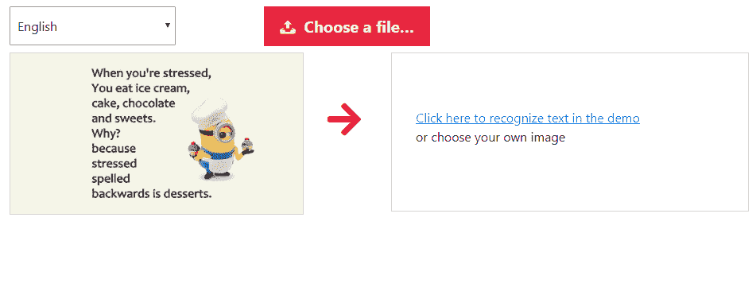
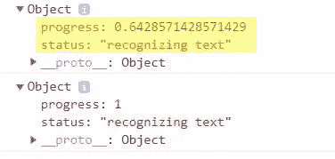
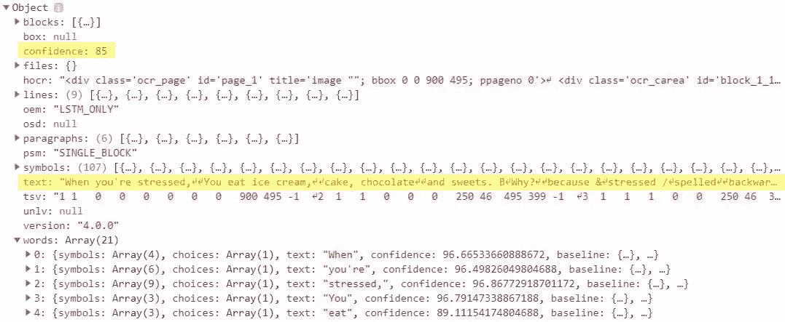

# 使用 Tesseract.js 进行图像到文本的 OCR

> 原文：<https://towardsdatascience.com/image-to-text-ocr-with-tesseract-js-3540b420e0e7?source=collection_archive---------3----------------------->

## 使用 javascript 从图像中提取文本


Photo by [Franck V.](https://unsplash.com/@franckinjapan?utm_source=medium&utm_medium=referral) on [Unsplash](https://unsplash.com?utm_source=medium&utm_medium=referral)

您是否希望从图像、照片中提取文本？是不是刚拍了一张讲义的照片，想转换成文字？然后你需要一个可以通过 OCR(光学字符识别)识别文本的应用程序。

今天，我将实现你期待已久的愿望，用强大的 JavaScript 库 [Tesseract.js](https://github.com/naptha/tesseract.js) 构建一个图像到文本的转换器



点击下面的链接亲自尝试一下:

[](https://bensonruan.com/image-to-text-ocr-with-tesseract-js/) [## 使用 Tesseract.js - Benson 技术的图像到文本 OCR

### 您是否希望从图像、照片中提取文本？今天，我要满足你的愿望，建立一个图像文本…

bensonruan.com](https://bensonruan.com/image-to-text-ocr-with-tesseract-js/) 

# 履行

你是不是觉得自己发现了宝藏？我们可以得到一本书的扫描图像，使用 OCR 技术读取图像，并以我们可以在机器上使用的格式输出文本。这可以极大地提高我们的生产率，并避免重复的手工输入。

在本教程中，我将向您展示如何使用 Tesseract.js 构建 OCR web 应用程序。让我们直接进入代码。

## #步骤 1:包含 tesseract.js

首先，我们需要包含 JavaScript 库 tesseract.js，在你的 HTML5 页面中包含 Tesseract.js 最简单的方法就是使用 CDN。因此，将以下内容添加到您的网页的`<head>`中。

```
<html>
  <head>
    <script src='[https://unpkg.com/tesseract.js@v2.0.0-alpha.13/dist/tesseract.min.js](https://unpkg.com/tesseract.js@v2.0.0-alpha.13/dist/tesseract.min.js)'></script>
  </head>
```

如果您使用的是 npm，也可以通过运行下面的命令来安装它

```
npm install tesseract.js@next
```

在的末尾，包含主 javascript 文件 tesseract-ocr.js

```
 <script src="js/tesseract-ocr.js"></script>
  </body>
</html>
```

## #步骤 2:设置 html 元素

接下来我们需要做的是添加下面的 html 元素

*   语言选择器
*   图像文件选择器
*   所选图像的缩略图预览
*   处理后结果的占位符

## #步骤 3:初始化并运行 Tesseract

此外，我们将初始化一个`TesseractWorker`。然后利用`recognize`功能。这个函数异步运行并返回一个`TesseractJob`对象。

您可以在一个回调函数中获得文本结果，该函数可以使用`then()`方法添加。此外，使用`progress()`方法添加一个回调来监控 OCR 操作的状态和进度。

## #第 4 步:显示进度和结果

最后，让我们探索返回的`TesseractJob`对象，并使用它来显示结果。



一旦结果返回，它包含一个**置信度**，从图像中提取的**文本**。在单词数组中，还包括单词在图像内部的**位置**。现在我们使用下面的函数`progressUpdate`将它显示给用户。

代码差不多就是这样了！选择你自己的图片和一些文字，看着结果滚滚而来！

# GitHub 知识库

您可以通过下面的链接下载上述演示的完整代码:

[](https://github.com/bensonruan/Tesseract-OCR) [## 本森阮/宇宙魔方光学字符识别

### 使用 javascript 库 tesseract.js 在浏览器中从图像中提取文本…

github.com](https://github.com/bensonruan/Tesseract-OCR) 

Photo by [Temple Cerulean](https://unsplash.com/@templecerulean?utm_source=medium&utm_medium=referral) on [Unsplash](https://unsplash.com?utm_source=medium&utm_medium=referral)

# 结论

毕竟，我已经用不同的图像做了一些实验，并且发现了 Tesseract.js 的一些优点和缺点。

优点:

*   它支持多种语言，点击这里查看支持语言的完整列表。
*   在正常字体和清晰背景的情况下，精确度相当高

缺点:

*   它在嘈杂的背景下不太好用
*   它被一些自定义字体弄糊涂了

但是，我仍然认为它是一个伟大的 JavaScript 库。它为浏览器带来了 OCR 的强大功能，并为开发人员打开了一扇机会之门。