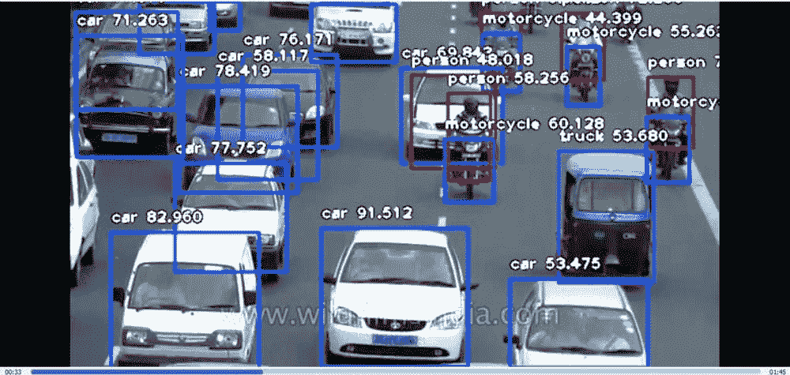
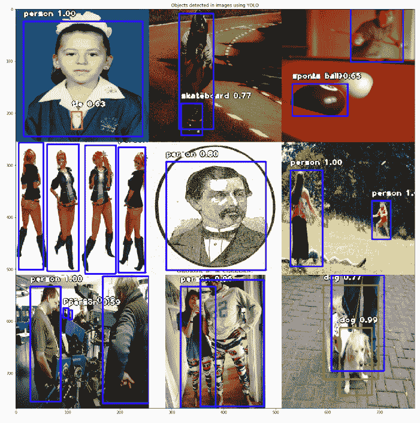
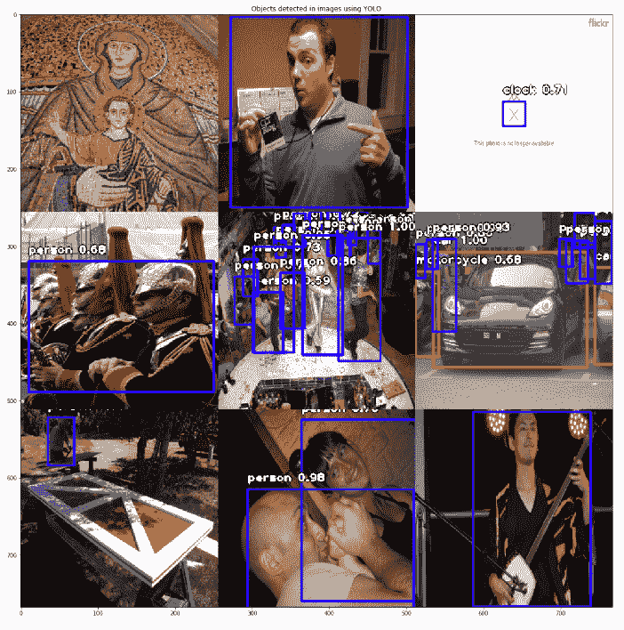
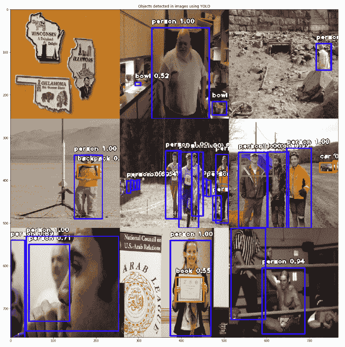

# ImageAI:动态物体识别

> 原文：<https://towardsdatascience.com/imageai-object-recognition-on-the-fly-815c7741928d?source=collection_archive---------15----------------------->

## 将物体识别快速连接到你的应用程序

## 如果计算机有眼睛，它能识别什么？

区分猫和狗会很好，但更好的是识别[开放图像数据集](https://github.com/openimages/dataset/blob/master/READMEV3.md)中的所有 7870 个对象！这里有一个练习。向窗外看，数一数你能认出多少物体。物体识别是将人类的这部分能力引入计算机。它实现了计算机以前很难实现的广泛应用——从无人驾驶汽车到高级安全。你的脸书人脸识别到交通管理。

计算机视觉已经真正从对整个图像进行分类发展到识别图像中的单个物体。这就是“这是一张有车辆的道路照片”和“这张照片上有 12-15 辆汽车和 4-6 辆摩托车”的区别。这是一种算法，它给出了足够的上下文来声明“中等流量”。



# 听起来不错。我该如何报名？

许多大型云提供商都有现成的 API 来做这件事。有[谷歌](https://cloud.google.com/vision/)、[微软](https://azure.microsoft.com/en-us/services/cognitive-services/computer-vision/)和[亚马逊](https://aws.amazon.com/rekognition/)的实现。如果你有预算，那么只需将它插入你的应用程序，你就有了[而不是](https://apps.apple.com/us/app/not-hotdog/id1212457521)热狗应用程序。但是我想把重点放在一些你可能会弄脏手的东西上。这些 API 大多由深度学习模型驱动，在对象识别方面，YOLO 是你的人。我推荐看看他们为 YOLO v3 的实现所做的惊人的开场白:

> *我们向 YOLO 展示一些更新！我们做了一些设计上的小改动，让它变得更好。我们还训练了这个新的网络，它非常棒。比上次大一点，但是更准确。不过还是很快，别担心。*

作者有幽默感，但不要让这愚弄了你。这是一个伟大的算法。它被命名为**Y**O**O**only**L**ook**O**因为该算法的主要贡献是速度非常快。其他模型执行两阶段区域提议和对象分类阶段。YOLO 使用单一模型来输出包围盒和类别概率。它在速度和准确性方面远远超过了其他算法。


# 这个 YOLO 不错。怎么才能拿到？

有一个开源库可以解决这个问题。ImageAI 是一个 Python 库，它可以轻松地使开发人员利用现成的训练好的模型进行对象识别。你也可以用自己的物品进行定制训练。

我在这个 Kaggle 笔记本上尝试了简单的识别用例。就像下面这个片段一样简单:

```
from imageai.Detection import ObjectDetection

# load YOLO here
detector = ObjectDetection()
detector.setModelTypeAsYOLOv3()
detector.setModelPath("yolo.h5")
detector.loadModel()

# load your image here "input_img"
# ...
detections = detector.detectObjectsFromImage(
          input_img, input_type='array', 
          minimum_percentage_probability=50, output_type='array')
```

[我在开放的图像数据集](https://github.com/openimages/dataset/blob/master/READMEV3.md)上进行测试，挑选出至少有一个“人”对象的图片。YOLO 模型是 ImageAI 的现成产品，它接受了包括人员、车辆和家居用品在内的 80 个类别的培训。我将模型设置为输出成为对象的概率大于 50%的区域。

# 看看它在我的一些样本输入中的表现

从左到右。(1) 100%一个人，但注意领带。(2)重叠的包围盒被识别出来，太神奇了。(3)失焦的人还是可以识别的。(4 和 5)图纸被认为是人。(6–8)可以检测多个人。(9)模型以为有两只狗。



(1)这是一个算法被难住的例子。(2)感觉良好！(3)404 消息被误标为时钟。(4)多个人被误标为一个人。我真的不知道这里发生了什么——某种聚会？(6)到处都是错误的标签！(7–9)全部正确。



(1)我不认为这个图像包含一个人！(2)发现了一个碗，真酷。(3–9)人！

这个人在废墟中行走的图像提出了一种可能性，即同样的技术可以帮助灾难恢复工作。例如，巡逻森林火灾或洪水的无人机可以识别被困人员。



它以 Python 字典的形式输出对象，所以你应该能够在你的应用程序中轻松操作它。这是一个普通的应用程序。能够分辨照片中的单个物体可以自动分类你越来越多的相机图像。或者至少，点钟，碗和滑板。

*原载于 2019 年 8 月 25 日*[*http://itstherealdyl.wordpress.com*](https://itstherealdyl.wordpress.com/2019/08/25/imageai-object-recognition-on-the-fly/)*。*