# 作为数据结构的图像:艺术到 256 整数

> 原文：<https://towardsdatascience.com/images-as-data-structures-art-through-256-integers-8898bce17230?source=collection_archive---------16----------------------->

## 让我们以数据结构的形式介绍图像的基本知识，认识一些迷幻的猫，并使用 NumPy“绘制”一个粉红色的棋盘！

形象问题一直让我兴奋。

我非常习惯在日常工作中使用表格数据。我相信大多数数据人都能理解。这篇文章将让你了解如何将图像表示为数据结构的基本知识，这样当奇异的图像识别或对象检测问题出现时，你就从`some knowledge`的地方开始，而不是从`no knowledge`的地方开始！

说到图像，我们将遵循一个由来已久的互联网传统。我们的一些主题将是猫！认识一下**艾尔莎**和**斯穆希**！


现在你注意到我了…我们开始吧。

# 黑白图像

让我们从这张简陋棋盘的图片开始:

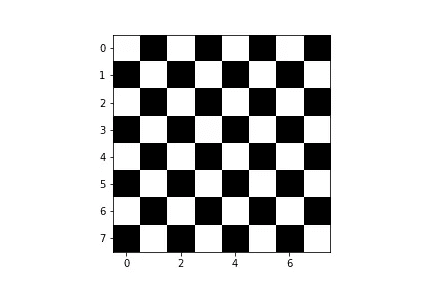

信不信由你，我刚刚用`NumPy`做了这个！

让我们假设我们有一个名为`chessboard`的`8x8` NumPy 数组。让我们看一下它最上面的一行。这是一行，其中最左边的像素是白色的:

```
chessboard[0]array([255,   0, 255,   0, 255,   0, 255,   0], dtype=uint8)
```

现在让我们看看第二排。这是一行，其中最左边的像素是**黑色**:

```
chessboard[1]array([  0, 255,   0, 255,   0, 255,   0, 255], dtype=uint8)
```

每个数字代表从`0 to 255`开始的像素强度。也就是说，在这个颜色系统中有`256`个可能的值。你可能已经猜到了，这里的`0`代表‘黑’，而`255`代表‘白’。介于两者之间的一切都是灰色的。

为了制作棋盘，我简单地堆叠了这些黑白行，直到得到一个维度数组`8x8`(即 8 行 8 列):

```
import matplotlib.pyplot as plt
import numpy as npwhite_row = np.zeros(8).astype(np.uint8)
black_row = np.zeros(8).astype(np.uint8)
black_row[[1, 3, 5, 7]] = 255
white_row[[0, 2, 4, 6]] = 255chessboard = np.array([
    white_row,
    black_row,
    white_row,
    black_row,
    white_row,
    black_row,
    white_row,
    black_row,
])print(chessboard)[[255   0 255   0 255   0 255   0]
 [  0 255   0 255   0 255   0 255]
 [255   0 255   0 255   0 255   0]
 [  0 255   0 255   0 255   0 255]
 [255   0 255   0 255   0 255   0]
 [  0 255   0 255   0 255   0 255]
 [255   0 255   0 255   0 255   0]
 [  0 255   0 255   0 255   0 255]]
```

> ***随机边注:*** *如果说*`*0*`*`*255*`*之间的一切在我们的色彩体系中都是一种深浅灰，那么*五十度灰*是怎么回事？让我们忽略灰色恰好是一个人的名字。为什么不:**

*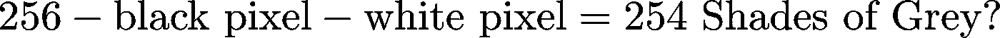*

> *总之，这 254 种灰色看起来像什么？让我们创建一个 `*16x16*` *NumPy 数组，因为* `*16x16 = 256*` *而这恰好是我们要绘制的像素强度的个数。**

```
*all_shades = np.reshape(np.arange(256), (16,16))*
```

> *让我们画出那些可怜的、被忽视的灰色阴影:*

*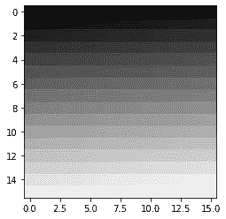*

> **很美，不是吗？**
> 
> **够了！“随机附言”完毕。**

# *彩色图像呢？让我们增加一些音量！*

*我相信你们大多数人都听说过 **RGB 颜色系统**，其中:*

*   *`R == 'red'`，*
*   *`G == 'green'`，以及*
*   *`B == 'blue'`*

*在 RGB 彩色图像中，我们现在有三个矩阵，而不是一个`8x8`:*

*   *专用于`red`像素强度的矩阵，*
*   *专用于`green`像素亮度的矩阵，以及*
*   *专用于`blue`像素亮度的矩阵。*

*这些被称为我们的 RGB 图像的红色、绿色和蓝色通道。*

*每个矩阵包含一个介于`0`和`255`之间的整数，其中`0`表示该通道中的颜色已经被有效地“关闭”，而`255`表示该通道中的颜色已经被“打开到最大”。*

*当我们将这些矩阵堆叠在一起时，我们得到了一幅彩色图像！`RGB`系统是`additive`颜色系统的一个例子，其中颜色是通过将三个矩阵中的每一个矩阵的像素强度相加形成的。*

*我们现在知道彩色图像是三维的。彩色图像具有:*

*   *以像素为单位的`height`，*
*   *以像素为单位的`width`,以及*
*   *3 个通道的一个`depth`。*

# *让我们制作红色、绿色和蓝色的图像！*

*首先，请注意**通道-第一个**和**通道-最后一个**约定。我们的 NumPy 数组是一维的`3x8x8`。也就是说，当描述数组的维度时，我们的“RGB 通道优先”。另一个约定是 channels-last，其中通道在数组的维度中列在最后(即`8x8x3`)。*

*我们将使用`Matplotlib's imshow`功能来绘制图像。检查函数的 docstring，我们会看到:*

> *(M，N，3):具有 RGB 值(0–1 float 或 0–255 int)的图像…前两个维度(M，N)定义图像的行和列。*

*换句话说，`imshow`需要一个“channels-last”NumPy 数组。放心吧！我们将通过使用`np.moveaxis`将频道轴移动到末端，将“频道优先”图像转换为“频道最后”图像:*

```
*channels_first = np.zeros((3, 8, 8)).astype(np.uint8)channels_first.shape(3, 8, 8)channels_last = np.moveaxis(channels_first, 0, 2)channels_last.shape(8, 8, 3)*
```

*很简单，对吧？我们继续。*

*让我们`turn on`所有的`red`像素。假设 RGB 排序，我们将把第一个矩阵中的所有像素亮度设置为`255`的最大值。*

*我们将首先创建一个`3x8x8`阵列，所有像素亮度“关闭”(即设置为零):*

```
*all_pixels_off = np.zeros((3, 8, 8)).astype(np.uint8)print(all_pixels_off)[[[0 0 0 0 0 0 0 0]
  [0 0 0 0 0 0 0 0]
  [0 0 0 0 0 0 0 0]
  [0 0 0 0 0 0 0 0]
  [0 0 0 0 0 0 0 0]
  [0 0 0 0 0 0 0 0]
  [0 0 0 0 0 0 0 0]
  [0 0 0 0 0 0 0 0]]

 [[0 0 0 0 0 0 0 0]
  [0 0 0 0 0 0 0 0]
  [0 0 0 0 0 0 0 0]
  [0 0 0 0 0 0 0 0]
  [0 0 0 0 0 0 0 0]
  [0 0 0 0 0 0 0 0]
  [0 0 0 0 0 0 0 0]
  [0 0 0 0 0 0 0 0]]

 [[0 0 0 0 0 0 0 0]
  [0 0 0 0 0 0 0 0]
  [0 0 0 0 0 0 0 0]
  [0 0 0 0 0 0 0 0]
  [0 0 0 0 0 0 0 0]
  [0 0 0 0 0 0 0 0]
  [0 0 0 0 0 0 0 0]
  [0 0 0 0 0 0 0 0]]]*
```

*所有通道像素都已关闭。所以我们得到一个全黑的图像是有道理的:*

```
*_ = plt.imshow(np.moveaxis(all_pixels_off, 0, 2))*
```

*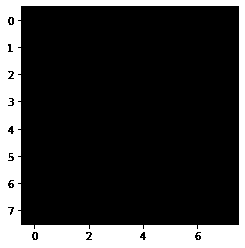*

*让我们把**红色像素**调到最大:*

```
*from copy import deepcopy
red_image = deepcopy(all_pixels_off)
red_image[0, :] = 255*
```

*检查矩阵，我们看到这个:*

```
*print(red_image)[[[255 255 255 255 255 255 255 255]
  [255 255 255 255 255 255 255 255]
  [255 255 255 255 255 255 255 255]
  [255 255 255 255 255 255 255 255]
  [255 255 255 255 255 255 255 255]
  [255 255 255 255 255 255 255 255]
  [255 255 255 255 255 255 255 255]
  [255 255 255 255 255 255 255 255]][[  0   0   0   0   0   0   0   0]
 [  0   0   0   0   0   0   0   0]
 [  0   0   0   0   0   0   0   0]
 [  0   0   0   0   0   0   0   0]
 [  0   0   0   0   0   0   0   0]
 [  0   0   0   0   0   0   0   0]
 [  0   0   0   0   0   0   0   0]
 [  0   0   0   0   0   0   0   0]][[  0   0   0   0   0   0   0   0]
 [  0   0   0   0   0   0   0   0]
 [  0   0   0   0   0   0   0   0]
 [  0   0   0   0   0   0   0   0]
 [  0   0   0   0   0   0   0   0]
 [  0   0   0   0   0   0   0   0]
 [  0   0   0   0   0   0   0   0]
 [  0   0   0   0   0   0   0   0]]]*
```

*绘制它，我们得到这个:*

```
*_ = plt.imshow(np.moveaxis(red_image, 0, 2))*
```

*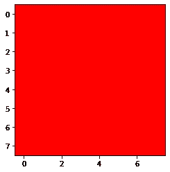*

*对**绿色像素**重复:*

```
*green_image = deepcopy(all_pixels_off)
green_image[1, :] = 255
print(green_image)[[[  0   0   0   0   0   0   0   0]
  [  0   0   0   0   0   0   0   0]
  [  0   0   0   0   0   0   0   0]
  [  0   0   0   0   0   0   0   0]
  [  0   0   0   0   0   0   0   0]
  [  0   0   0   0   0   0   0   0]
  [  0   0   0   0   0   0   0   0]
  [  0   0   0   0   0   0   0   0]][[255 255 255 255 255 255 255 255]
  [255 255 255 255 255 255 255 255]
  [255 255 255 255 255 255 255 255]
  [255 255 255 255 255 255 255 255]
  [255 255 255 255 255 255 255 255]
  [255 255 255 255 255 255 255 255]
  [255 255 255 255 255 255 255 255]
  [255 255 255 255 255 255 255 255]][[  0   0   0   0   0   0   0   0]
 [  0   0   0   0   0   0   0   0]
 [  0   0   0   0   0   0   0   0]
 [  0   0   0   0   0   0   0   0]
 [  0   0   0   0   0   0   0   0]
 [  0   0   0   0   0   0   0   0]
 [  0   0   0   0   0   0   0   0]
 [  0   0   0   0   0   0   0   0]]]_ = plt.imshow(np.moveaxis(green_image, 0, 2))*
```

*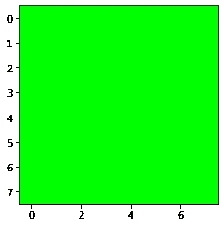*

*并且再次针对**蓝色像素**:*

```
*blue_image =  deepcopy(all_pixels_off)
blue_image[2, :] = 255
print(blue_image)[[[  0   0   0   0   0   0   0   0]
  [  0   0   0   0   0   0   0   0]
  [  0   0   0   0   0   0   0   0]
  [  0   0   0   0   0   0   0   0]
  [  0   0   0   0   0   0   0   0]
  [  0   0   0   0   0   0   0   0]
  [  0   0   0   0   0   0   0   0]
  [  0   0   0   0   0   0   0   0]][[  0   0   0   0   0   0   0   0]
 [  0   0   0   0   0   0   0   0]
 [  0   0   0   0   0   0   0   0]
 [  0   0   0   0   0   0   0   0]
 [  0   0   0   0   0   0   0   0]
 [  0   0   0   0   0   0   0   0]
 [  0   0   0   0   0   0   0   0]
 [  0   0   0   0   0   0   0   0]][[255 255 255 255 255 255 255 255]
 [255 255 255 255 255 255 255 255]
 [255 255 255 255 255 255 255 255]
 [255 255 255 255 255 255 255 255]
 [255 255 255 255 255 255 255 255]
 [255 255 255 255 255 255 255 255]
 [255 255 255 255 255 255 255 255]
 [255 255 255 255 255 255 255 255]]]_ = plt.imshow(np.moveaxis(blue_image, 0, 2))*
```

*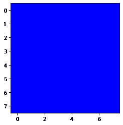*

# *如果我们把所有的像素亮度都调到最大会怎么样？*

*让我们将红色、绿色和蓝色通道中的所有像素强度设置为它们的最大值`255`:*

```
*all_channels_to_the_max = deepcopy(all_pixels_off)
all_channels_to_the_max[:, :] = 255
print(all_channels_to_the_max)[[[255 255 255 255 255 255 255 255]
  [255 255 255 255 255 255 255 255]
  [255 255 255 255 255 255 255 255]
  [255 255 255 255 255 255 255 255]
  [255 255 255 255 255 255 255 255]
  [255 255 255 255 255 255 255 255]
  [255 255 255 255 255 255 255 255]
  [255 255 255 255 255 255 255 255]][[255 255 255 255 255 255 255 255]
  [255 255 255 255 255 255 255 255]
  [255 255 255 255 255 255 255 255]
  [255 255 255 255 255 255 255 255]
  [255 255 255 255 255 255 255 255]
  [255 255 255 255 255 255 255 255]
  [255 255 255 255 255 255 255 255]
  [255 255 255 255 255 255 255 255]][[255 255 255 255 255 255 255 255]
  [255 255 255 255 255 255 255 255]
  [255 255 255 255 255 255 255 255]
  [255 255 255 255 255 255 255 255]
  [255 255 255 255 255 255 255 255]
  [255 255 255 255 255 255 255 255]
  [255 255 255 255 255 255 255 255]
  [255 255 255 255 255 255 255 255]]]_ = plt.imshow(np.moveaxis(all_channels_to_the_max, 0, 2))*
```

*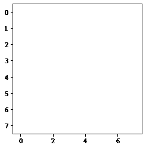*

*我们得到一个完全白色的图像！*

# *给定一个 RGB 图像数据结构，我们如何获得灰度？*

*你大概能猜到我们需要做什么。让我们将所有像素的亮度设置为`0`和`255`之间的某个值。我们将在所有三个矩阵中应用相同的值:*

```
*greyscale = deepcopy(all_pixels_off)
greyscale[:, :] = 150
print(greyscale)[[[150 150 150 150 150 150 150 150]
  [150 150 150 150 150 150 150 150]
  [150 150 150 150 150 150 150 150]
  [150 150 150 150 150 150 150 150]
  [150 150 150 150 150 150 150 150]
  [150 150 150 150 150 150 150 150]
  [150 150 150 150 150 150 150 150]
  [150 150 150 150 150 150 150 150]][[150 150 150 150 150 150 150 150]
  [150 150 150 150 150 150 150 150]
  [150 150 150 150 150 150 150 150]
  [150 150 150 150 150 150 150 150]
  [150 150 150 150 150 150 150 150]
  [150 150 150 150 150 150 150 150]
  [150 150 150 150 150 150 150 150]
  [150 150 150 150 150 150 150 150]][[150 150 150 150 150 150 150 150]
  [150 150 150 150 150 150 150 150]
  [150 150 150 150 150 150 150 150]
  [150 150 150 150 150 150 150 150]
  [150 150 150 150 150 150 150 150]
  [150 150 150 150 150 150 150 150]
  [150 150 150 150 150 150 150 150]
  [150 150 150 150 150 150 150 150]]]*
```

*绘制它，我们得到:*

*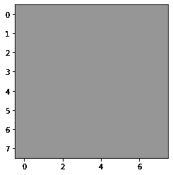*

*嘣！我们自己有一个灰色的形象。*

# *NumPy art:我们来做一个火辣的粉色棋盘吧！*

*快速搜索一下，我就知道**【粉红佳人】**的 RBG 值是这样的:*

```
*red = 255
green = 105
blue = 180*
```

*这是我们将要做的:*

*   *我们将复制三份我们原来的`8x8`棋盘阵列。一个代表红色通道。另一个代表绿色通道。最后一个代表蓝色通道。*
*   *然后，我们将改变每个通道的像素强度，以匹配上面的粉红色 RBG 值。我们将改变原始黑色像素的值(即零)。*
*   *一旦我们完成了这些，我们将创建一个`3x8x8`数组，它将代表我们在 RGB 颜色空间中的棋盘。*

*当我们绘制图像时，我们将有希望看到一个神话般的，粉红色的棋盘。我们开始吧！*

*首先，副本:*

```
*red_channel = deepcopy(chessboard)
green_channel = deepcopy(chessboard)
blue_channel = deepcopy(chessboard)*
```

*接下来，像素值:*

```
*red_channel[np.where(red_channel == 0)] = 255
green_channel[np.where(green_channel == 0)] = 105
blue_channel[np.where(blue_channel == 0)] = 180*
```

*让我们创建我们的`3x8x8`数组，其中`3`代表我们的通道:*

```
*hot_pink_chessboard = np.array([red_channel, green_channel, blue_channel]).astype(np.uint8)*
```

*现在开始策划！请击鼓…*

*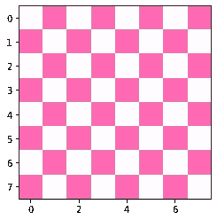*

*万岁！那确实是一个漂亮的棋盘。*

# *迷幻猫*

*让我们用我们对图像的了解来搞乱我的猫 Elsa 和 Smooshie 的图像。*

*我们将使用`cv2`包将我们的猫图像读入 Python。`cv2`可以通过发布`pip install opencv-python`来安装。*

```
*import cv2
elsa = cv2.imread('./elsa_original.jpg')*
```

*恼人的是，`cv2`以不同的通道顺序存储图像。代替 RGB，我们有一个 BGR 通道排序。所以我们现在有一个 BGR 的图像。我们可以看到颜色有点偏离:*

```
*_ = plt.imshow(elsa)*
```

*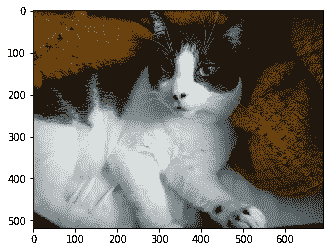*

*我们现在将重新排列我们的频道，看看我们的图像是否看起来更好:*

```
*elsa = cv2.cvtColor(elsa, cv2.COLOR_BGR2RGB)
_ = plt.imshow(elsa)*
```

*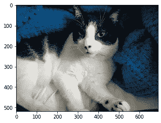*

*那就好多了！*

*让我们增加红色通道的像素强度。假设我们想要将`50`添加到红色通道的像素亮度中。当使用`numpy.uint8`数据类型时，如果`current pixel intensity + 50 > 255`，我们的像素强度环绕并从零开始计数。这是一个**整数溢出**的例子。*

*为了避免这种情况，我们将使用一个次优但快速的解决方案。我们将把 NumPy 数组转换为`numpy.uint16`数据类型，它的上限是`65,535`。我们会给每个像素强度加上`100`。`imshow`自动裁剪数组，使其最大值为`255`，这样我们就可以直接绘制图像了。*

```
*elsa_int16 = elsa.astype(np.int16)
elsa_int16 = np.moveaxis(elsa_int16, 2, 0)elsa_red = deepcopy(elsa_int16)
elsa_red[0, :] += 100_ = plt.imshow(np.moveaxis(elsa_red, 0, 2))*
```

*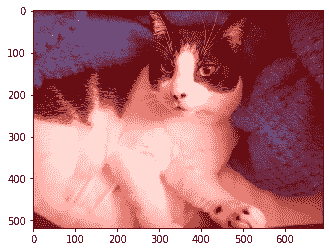*

*艾尔莎绝对有红色调！*

*让我们用绿色通道重复:*

```
*elsa_green = deepcopy(elsa_int16)
elsa_green[1, :] += 100
_ = plt.imshow(np.moveaxis(elsa_green, 0, 2))*
```

*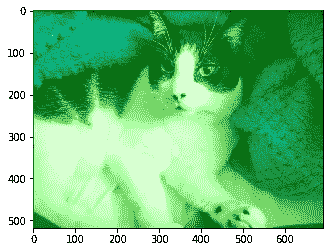*

*是的，绝对更环保！最后，蓝色通道:*

```
*elsa_blue = deepcopy(elsa_int16)
elsa_blue[2, :] += 100
_ = plt.imshow(np.moveaxis(elsa_blue, 0, 2))*
```

*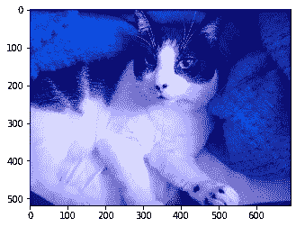*

*是的，绝对是蓝色的。*

*让我们将任意数字添加到每个通道，看看我们会得到什么:*

```
*elsa_psychedelic = deepcopy(elsa)
elsa_psychedelic = np.moveaxis(elsa_psychedelic, 2, 0)elsa_psychedelic[0, :] += 150
elsa_psychedelic[1, :] += 5
elsa_psychedelic[2, :] += 50_ = plt.imshow(np.moveaxis(elsa_psychedelic, 0, 2))*
```

*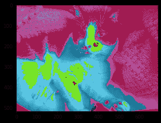*

*看起来很酷，艾尔莎！斯穆希呢？*

```
*smooshie = cv2.imread('./smooshie_original.jpg')
smooshie = cv2.cvtColor(smooshie, cv2.COLOR_BGR2RGB)
_ = plt.imshow(smooshie)*
```

*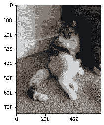*

*让我们给 Smooshie 的照片添加一些不同的数字:*

```
*smooshie_psychedelic = deepcopy(smooshie)
smooshie_psychedelic = np.moveaxis(smooshie_psychedelic, 2, 0)smooshie_psychedelic[0, :] += 85
smooshie_psychedelic[1, :] += 10
smooshie_psychedelic[2, :] += 175_ = plt.imshow(np.moveaxis(smooshie_psychedelic, 0, 2))*
```

*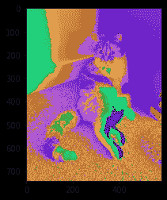*

*我们有两只迷幻猫！*

> **(* 排队《你爱的阳光》)*

# *结论*

*我们已经学会了如何将图像表达为可以在 Python 中操作的数据。我们一路上做了一个热粉色的棋盘和一些迷幻的猫照！*

*我希望这篇文章已经给了你处理图像核等主题所需的基础，这些主题对于理解卷积神经网络如何工作很重要。*

*下次见。*

*贾斯廷*

**原载于 2019 年 12 月 14 日*[*https://embracingtherandom.com*](https://embracingtherandom.com/python/images/images-as-data-structures/)*。**