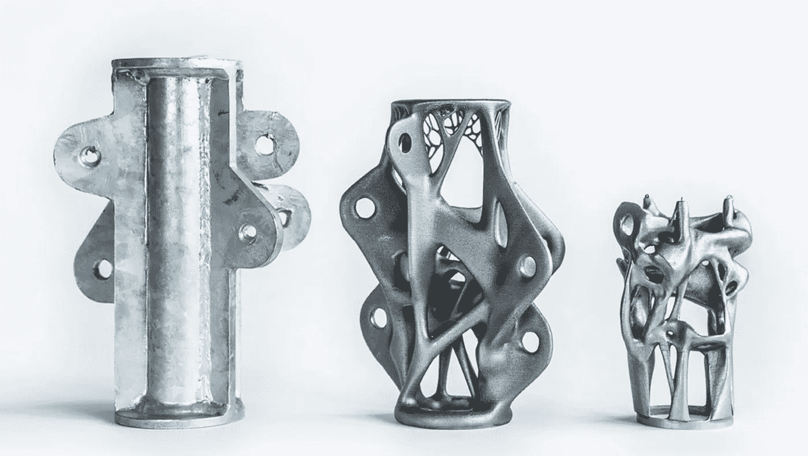
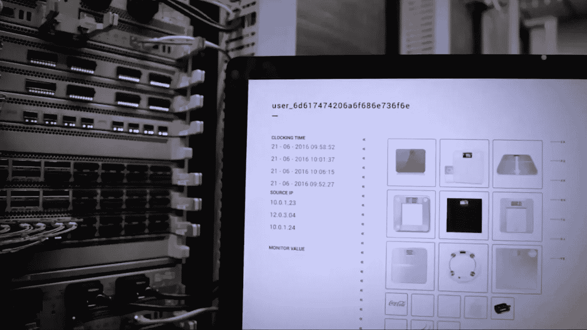
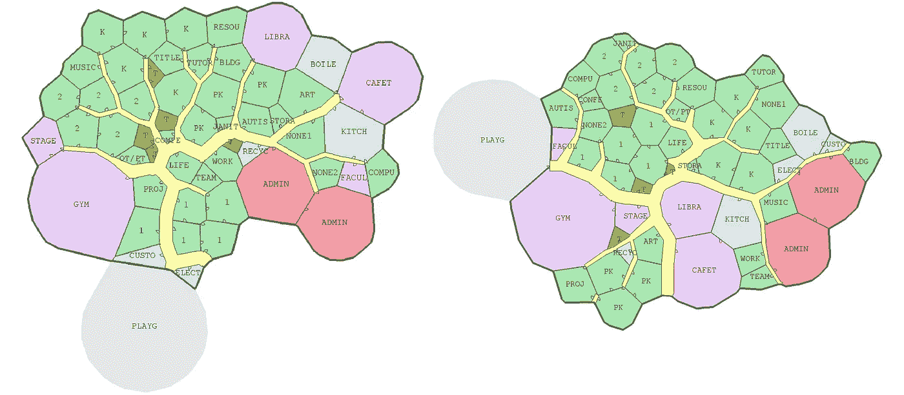

# 幻想工程和复活

> 原文：<https://towardsdatascience.com/imagineering-resurrections-883506f2bcf9?source=collection_archive---------19----------------------->

Protohouse (2012) by Gilles Retsin and Softkill Design. A house structurally optimized for minimal volume and uniform stress. Image: [ArchDaily](https://www.archdaily.com/335887/3-d-printing-protohouse-1-0-and-protohouse-2-0-softkill-design/5129808eb3fc4ba8500000b4-3-d-printing-protohouse-1-0-and-protohouse-2-0-softkill-design-image)

## 生成式设计描绘了想象的新领域，同时重组了过去的元素。这与我们现有系统的运作方式不协调。

新一代设计技术[赋予设计师超能力](https://www.dezeen.com/2017/02/06/generative-design-software-will-give-designers-superpowers-autodesk-university/)。他们指的是为设计者设计的一套基于算法的技术。[他们不仅是*制造*的工具，更是*思考*](https://www.e-flux.com/architecture/positions/175265/republics-of-makers/) 的工具。

创成式设计技术通过让设计者指定设计问题的参数来工作。使用聪明的算法和大量的处理能力，[生成式设计软件遵循一个进化过程](https://www.autodesk.co.uk/solutions/generative-design)，快速循环通过数千个——如果不是数百万个——设计选择，测试配置并从每次迭代中学习什么可行什么不可行。然后，设计师从无数生成的选项中进行策划和选择。

这些工具非常有用。他们可以优化材料的使用，加快设计过程，创造艺术，想象全新的产品形式。他们是从*大规模生产*过渡到 [*大规模定制*](https://www.e-flux.com/architecture/positions/175265/republics-of-makers/) *的推动者之一。*生成式设计的未来看起来非常光明。

Tensegrity nodes. Image: [engineering.com](https://www.engineering.com/DesignSoftware/DesignSoftwareArticles/ArticleID/16973/Generative-Design-The-Road-to-Production.aspx) courtesy of *Arup*

然而，生成式设计技术的一个关键问题是，它们所实现的输出并不完全符合我们现有系统的规则。虽然我们的法律是围绕静态、类别和稀缺建立的，但生成式设计系统会产生流动、梯度和大量的解决方案。

例如，专利法依赖于根据独创性和实用性对技术进行分类。生成式设计产生了无数模糊了这两种分类的设计。他们质疑谁制造了什么，谁拥有什么，以及谁应该拥有什么。

我们的社会系统和生成设计系统之间的不一致表明，如果生成设计的用途扩大，将不得不做出一些让步。这篇文章没有提供这样的解决方案。相反，它概述了生成式设计技术与我们的规则和法律之间的四个摩擦领域。如果这些摩擦被认为会愈演愈烈，那么我们就有责任以相应的紧迫感做出回应。

# I .(去)个性化媒体

对于它们的许多用例，创成式设计技术不依赖于先前的数据来生成解决方案。例如，可以通过处理一组参数来设计桥梁，而不需要参考预先存在的结构。

但是数据可以作为有用的参数来指导解决方案的创建。这在 2016 年谷歌泄露的内部视频中得到了说明，该视频强调了一种推测性的用例，即用户的详细数据被用于设计“个性化”产品。在这种情况下，我们未来的自己不仅会收到定制的媒体信息，还会收到定制的物理媒体。

The Selfish Ledger (2016) by Google. Source: [The Verge](https://www.theverge.com/2018/5/17/17344250/google-x-selfish-ledger-video-data-privacy)

收到认识到我们独特需求的定制产品的前景令人兴奋，但也提出了这样做的合适范例的问题。

哈佛大学社会学家 Shoshana Zuboff 提出了当前数字范式的一个特征。她称之为[监督资本主义](https://en.wikipedia.org/wiki/Surveillance_capitalism)，这是一种市场逻辑，公司从人类经验中积累大量数据，将这些数据组织成未来行为的预测模型，并拍卖外部实体修改这种行为的能力。在这个体系中,“给予”给我们的东西是达到他人目的的手段。

由于我们生活中的个人物品可能会受到生活数据的影响，我们需要谨慎对待这些数据收集和使用背后的商业模式。如果一个数字系统的可用性取决于它改变我们行为以消费更多的能力，我们希望我们最亲密的物品也这样做吗？

决定数字服务的规则和边界的问题还没有解决。随着数字领域与物理领域的融合，它们将会复合。

# 二。重构的真实性

创成式设计技术可以用来模拟和重新配置已经存在的事物。已经有很多关于“deepfakes”的影响的讨论，deep fakes 是深度学习的一种应用，它基于真实的副本创建假的照片、视频和文字。但是很少有人讨论整部作品如何被拆开、合成和复活。

艺术界现在正在见证“已故艺术家”的“新作品”。一个著名的例子是[下一个伦勃朗](https://www.nextrembrandt.com)，这是一幅模仿伦勃朗风格的 3D 打印画，伦勃朗是一位去世已久的 17 世纪荷兰画家。该项目由荷兰国际集团发起，荷兰国际集团是一家荷兰跨国银行集团“[，寻求一种创新的方式，并在竞争对手中脱颖而出](https://www.jwt.com/en/work/thenextrembrandt)——并利用了微软的技术诀窍。这幅名为“T4”的肖像画由 1.48 亿像素组成，取材于伦勃朗作品中的 168，263 个片段。

The Next Rembrandt (2016). It’s not a Rembrandt, but it looks like one. Source: [The Next Rembrandt](https://www.nextrembrandt.com)

> “我们观察了许多伦勃朗的画作，扫描了它们的表面纹理、元素构成以及使用的颜料种类。如果你想虚拟生成一幅伦勃朗的画，这就是你需要的信息。”— Joris Dik，代尔夫特技术大学

最近，伦敦大学学院的研究人员使用了一种[神经转移风格](https://arxiv.org/abs/1909.05677)技术来“恢复”毕加索著名的“蓝色吉他手”下面的一幅被涂掉的画。他们的过程使用了隐藏画作的红外和 x 射线图像，以及毕加索其他作品的“风格”图像，来重现这幅画。基本的算法是通用的，可以将任何图像转换成另一个艺术家的风格。

伦勃朗和毕加索会因为复制他们作品的算法而在坟墓里打滚吗，或者他们会赞同这些(再)创造的叛逆行为吗？活着的艺术家呢？

像前面提到的专利法一样，我们的系统是围绕类别设计的。他们裁定事物是真是假，原件还是复印件，专利还是专利侵权，等等。

生成设计引入了真实、现实、信任和价值的粒度。新的规则可能需要被书写——或者甚至可能产生。

# 三。**一个**分布式网络

除了 deepfakes 的利用性质之外，生成式设计技术有可能被用于明显的恶意目的。例如，生成对抗网络(GANs)，一种算法，已经被麻省理工学院技术评论[认定为网络威胁，因为它们能够入侵系统。一个尚未看到的风险是，生殖设计可能有助于创造以前无法想象的武器。](https://www.technologyreview.com/s/612713/five-emerging-cyber-threats-2019/)

The Shuty (2015) by Defence Distributed. A semi-automatic gun made of metal and plastic parts. The plastic parts are 3D printed, while the metal parts can be purchased from typical hardware stores. Source: [YouTube](https://www.youtube.com/watch?v=hgYk2h2b6Ng)

在线网络通过扩散和普及对抗性算法和设计，加剧了这种潜在的危害。

一个这样的例子是 3D 打印枪的蓝图和 CAD 模型是如何在发明后不久就在网上传播的。虽然一名美国联邦法官确实批准了一项针对 Defense Distributed(发布该设计的组织)的全国性禁令，但一旦设计被共享，它们很少会被取消共享。

限制生成设计技术的对抗性使用及其设计的传播没有简单的答案。开发人员很难将约束编码到他们的工具中。设计师可以被要求选择加入行为准则——但这些可以被忽略。政府或平台可以尝试监控内容，但过去的努力基本无效。

斯图尔特·布兰德曾打趣道，“[信息想要自由。](http://www.rogerclarke.com/II/IWtbF.html)“互联网和生成式设计技术的融合表明在这个方向上又前进了一步——无论是字面上还是象征性的——这将是危险的。

# 四。像国家一样产生

生成式设计技术非常适合优化，但它们只能优化可测量的内容。这可能会引入许多设计问题，这些问题源于以下前提:

*   测量只能得到现实的一部分。
*   测量可能会被扭曲，尤其是当受试者知道他们正在被测量的时候。
*   没有或不能衡量的东西可能会被忽略。

这种对可测量性的偏好在智能城市计划中是有先见之明的。亚当·格林菲尔德[写道](https://en.wikipedia.org/wiki/Radical_Technologies)支撑这些倡议的是一种隐含的世界观，即“世界在原则上是完全可知的，其内容是可计数的，它们之间的关系能够在技术系统的状态下被有意义地编码，没有偏见或扭曲[……]那么，如果对制定合理的公民政策至关重要的信息在某种程度上从它们的探测中缺失，存在于它们之间的空间中，或者来自于我们着手测量的世界的任何质量和我们对它的物质经验之间的相互作用，那又会怎么样呢？”

在智能城市出现之前，詹姆斯·c·克拉克将这种心态称为高级现代主义。在他的书《[看起来像一个国家](https://www.amazon.co.uk/Seeing-Like-State-Condition-Institution/dp/0300078153)》中，他认为善意的大规模项目之所以失败，是因为没有——也不可能——充分理解复杂的相互依存关系，有利于使事物清晰易读。它将我们引向巴西利亚这样的城市:设计合理，却缺乏内在生活。

创成式设计面临同样的问题。乔尔·史密斯的实验研究项目“进化平面图”强调了这一点。该项目探索了一所小学的推测性、优化的平面布局——考虑了交通流量、材料使用和消防通道等因素。这个项目很有创意，但是我们应该对这种想法如何应用于现实世界持谨慎态度。像儿童之间的社会互动这样的事情，是无法通过量化来完全理解的。

*Evolving Floorplans (2018) by Joel Smith. An elementary school.* Left: Optimized for minimizing traffic flow between classes and material usage. Right: Also optimized for minimizing fire escape paths. Source: [Joelsmith.net](https://www.joelsimon.net/evo_floorplans.html)

对于这个问题，似乎确实有一个明确的解决方案:一个深思熟虑的设计过程。生成式设计软件的创造者之一 Autodesk 就用它的软件设计了它的多伦多办公室。通过提出一个框架良好的问题，让员工参与进来，并仔细策划解决方案，他们找到了一个原始设计，这是任何人和计算机都无法独立构思的。

Toronto Office (2018) by Autodesk. Source: [YouTube](https://www.youtube.com/watch?v=ZQmfgGKtlXQ)

然而，如果我们生活中的许多事情都是例证的话，深思熟虑的设计远非无处不在。生成式设计技术只会基于可以测量的东西进行设计，而忽略不可测量的东西太容易了。在生成性设计的所有产品和服务中培养对这些考虑的警觉可能是一个持续的挑战。

# 综上

生成式设计技术是超级工具，它引入了一种围绕框架问题、观察难以理解的操作和管理结果的新设计实践。他们通常像外星人一样的输出反映了他们外星人的内部运作，莫名其妙地将过去和假设的碎片编织在一起。它们非常有用。

对我们当前社会系统中的生成设计产品的简要审视表明，工具、规则或法律可能需要改变或再生，以激发未来的利益并减轻伤害。

**喜欢你读的书吗？**关注我[中](https://medium.com/@cneels)、 [LinkedIn](https://www.linkedin.com/in/chrisneels/) ，或者 [Twitter](https://twitter.com/chrneels) 。