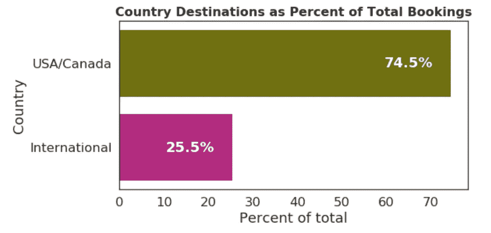
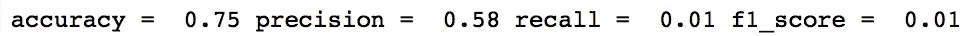
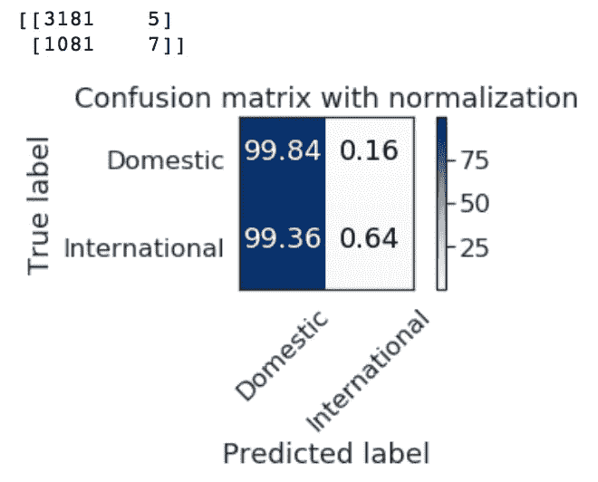
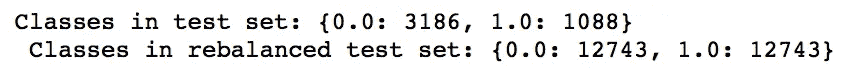
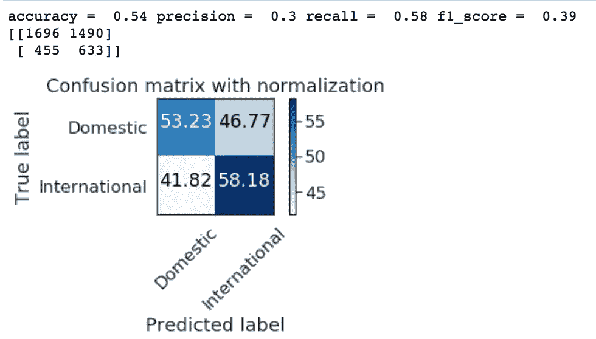
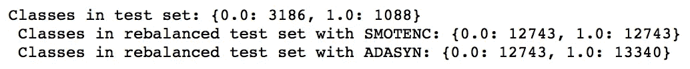
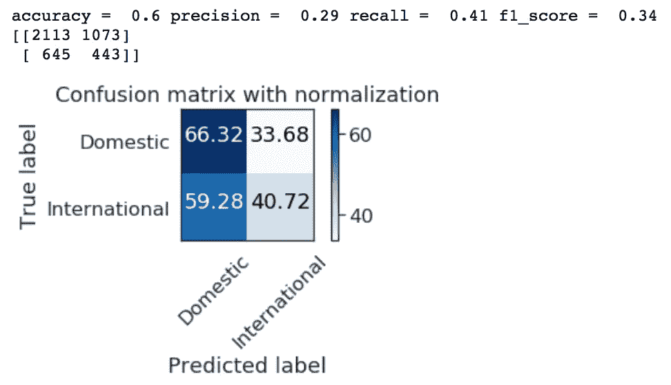
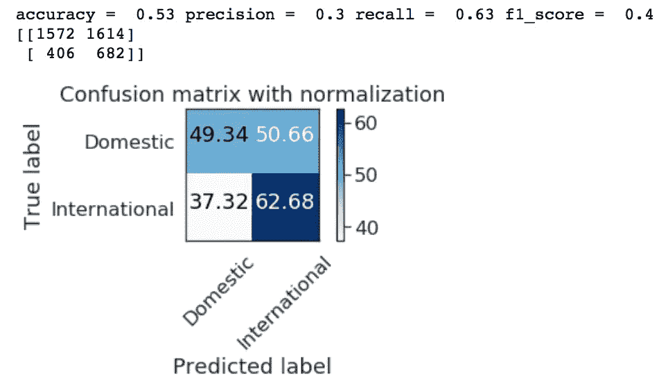
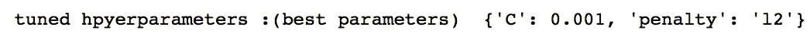
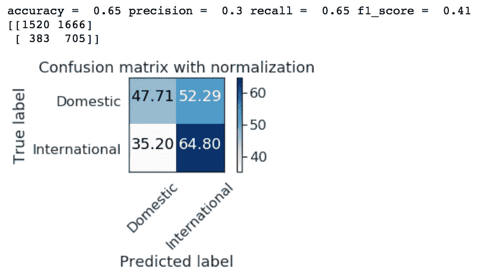

# 不平衡的类:第 1 部分

> 原文：<https://towardsdatascience.com/imbalanced-class-sizes-and-classification-models-a-cautionary-tale-3648b8586e03?source=collection_archive---------9----------------------->


## 避免分类中的不平衡分类陷阱

在最近的一个数据科学项目中，我开发了一个监督学习模型，对度假屋网站 Airbnb 的首次用户的预订位置进行分类。[作为 2015 年 Kaggle 竞赛的一部分，该数据集可在 Kaggle](https://www.kaggle.com/c/airbnb-recruiting-new-user-bookings) 上获得。

在我的项目中，我决定将用户分为两组:一组是在美国和加拿大境内预订首次旅行的用户，另一组是在国际其他地方预订首次旅行的用户，这实质上是将问题转化为一个二元分类问题。听起来很简单，对吧？

问题是分类目标(预订位置)非常不平衡。近 75%的首次用户预订了美国和加拿大境内的旅行。在我的初始模型显示了有希望的结果之后，对模型性能度量的进一步检查突出了一个关键问题，即当试图用不平衡的类大小执行二进制分类时。这篇文章旨在强调在构建具有不平衡类的分类模型时要注意的一些陷阱，并强调一些处理这些问题的方法。

**数据**

这张图显示了我的目标群体中固有的严重不平衡:

```
import matplotlib.pyplot as plt
import pandas as pd
import numpy as np
import pickle
import seaborn as snsdf = pd.read_pickle('data_for_regression_20k.pkl')sns.set_style("white")
dests2 = df.groupby('country_USA_World_bi').agg({'country_USA_World_bi':['count']}).reset_index()
dests2.columns = ['dest', 'count']
dests2['pct'] = dests2['count']*100/(sum(dests2['count']))x = dests2['dest']
y = dests2['pct']
palette = ['olive','mediumvioletred']fig, ax = plt.subplots(figsize = (8,4))
fig = sns.barplot(y, x, estimator = sum, ci = None, orient='h', palette=palette)
y_lab = ['USA/Canada', 'International']
ax.set_yticklabels(labels=y_lab, ha='right')for i, v in enumerate(y):
    ax.text(v - 15, i + .05, str(int(v)+.5)+'%', color='white', fontweight='bold')plt.title('Country Destinations as Percent of Total Bookings',size = 16, weight = 'bold')
plt.ylabel('Country')
plt.xlabel('Percent of total');
```



Close to 75% of users booked vacation rental in the U.S.A. and Canada

在将逻辑回归分类器应用于我的数据之前，我将数据分为训练集(80%)和测试集(20%)。由于国际旅行者的代表性不足，我使用了分层参数来确保两个目标类都在测试集中得到了体现。然后，我使用一个标准标量对训练和测试特性集进行了标准化。

```
from sklearn.model_selection import train_test_split
from sklearn.preprocessing import StandardScaler
from sklearn.metrics import precision_score, recall_score, precision_recall_curve,f1_score, fbeta_score, make_scorery = df['country_USA_World_bi']  
X = df.drop(['country_dest_id','country_USA_World_bi','month_created', 'day_created', 'month_active', 'day_active'], axis = 1)Xtrain, Xtest, ytrain, ytest = train_test_split(X, y, test_size=0.2, stratify=y,random_state = 88)std_scale = StandardScaler()
X_train_scaled = std_scale.fit_transform(Xtrain)
X_test_scaled = std_scale.transform(Xtest)
```

我运行的第一个模型是逻辑回归，因为逻辑回归包括特征系数(这有助于可解释性)。我用默认的 hypterparameters 拟合了一个初始模型，并惊喜地发现，在任何 hypter parameter 调整之前，该模型有 75%的准确性。很自然地，我发现自己在想这是不是好得不像真的。回想 75%的用户在美国/加拿大境内旅行，难道我每次只需猜测目的地就能有 75%的准确率吗？

事实上，模型精度(预测的国际预订实际上是国际预订的比例)、模型召回率(模型正确识别的国际预订的比例)和 f1 分数(两者的平衡)都非常差。

出于这个项目的目的，我对回忆分数最感兴趣，因为我认为模型能够准确预测将进行国际旅行的用户是最有用的(因为那些进行国际旅行的用户更有可能是具有较大旅行预算的狂热旅行者)。然而，鉴于最初的回忆分数只有 0.01，我还有很长的路要走，以改善这个模型！

```
from sklearn.linear_model import LogisticRegressiondef fit_logistic_regression_classifier(X_training_set, y_training_set):
    logreg = LogisticRegression(random_state=88)
    model = logreg.fit(X_training_set, y_training_set)
    y_pred = model.predict(X_test_scaled)
    print('accuracy = ',model.score(X_test_scaled, ytest).round(2),
          'precision = ',precision_score(ytest, y_pred).round(2), 
          'recall = ',recall_score(ytest, y_pred).round(2), 
          'f1_score = ',f1_score(ytest, y_pred).round(2)
         )
    return(y_pred)
y_pred = fit_logistic_regression_classifier(X_train_scaled, ytrain)
```



混淆矩阵是一个很好的工具，可以形象化模型被混淆的程度。在 *sklearn* 中的混淆矩阵给出了根据实际类别预测的每个类别中观察值数量的原始值计数。plot_confusion_matrix()函数给出了每个实际类和预测类中值的百分比的可视化表示。

```
import itertools
from sklearn.metrics import confusion_matrix
def make_confusion_matrix(cm, classes,title='Confusion matrix',cmap=plt.cm.Blues):
    print(cm)
    # Normalize values
    cm = cm.astype('float')*100 / cm.sum(axis=1)[:, np.newaxis]
    plt.imshow(cm, interpolation='nearest', cmap=cmap)
    plt.title(title)
    plt.colorbar()
    tick_marks = np.arange(len(classes))
    plt.xticks(tick_marks, classes, rotation=45)
    plt.yticks(tick_marks, classes)fmt = '.2f'
    thresh = cm.max() / 2.
    for i, j in itertools.product(range(cm.shape[0]), range(cm.shape[1])):
        plt.text(j, i, format(cm[i, j], fmt),
                 horizontalalignment="center",
                 color="white" if cm[i, j] > 50 else "black")
    plt.ylabel('True label')
    plt.xlabel('Predicted label')
    plt.tight_layout()
def plot_confusion_matrix(y_test_set, y_pred):
    class_names = ['Domestic','International']
    cnf_matrix = confusion_matrix(y_test_set, y_pred)
    np.set_printoptions(precision=2)
    plt.figure()
    make_confusion_matrix(cnf_matrix, classes=class_names, title='Confusion matrix with normalization');
```

该图表明我的直觉是正确的——该模型将几乎 100%的观察结果分类为国内旅行者，因此有 75%的时间达到了目标！

```
plot_confusion_matrix(ytest, y_pred)
```



**1。随机过采样**

[不平衡学习库](https://imbalanced-learn.readthedocs.io/en/stable/over_sampling.html)包括多种方法来重新平衡类别，以获得更准确的预测能力。我尝试的方法叫做随机过采样。根据[文档](https://imbalanced-learn.readthedocs.io/en/stable/over_sampling.html)，“随机过采样可用于重复一些样本，并平衡数据集之间的样本数量。”基本上，这种重新平衡方法使用目标类的随机抽样和替换来获得训练集中每个类的平衡表示。事实上，在将随机抽样器应用于我的训练集之后，我在每个目标类中都有 12，743 个观察样本，而我的基线场景是 3，186 个国内预订和 1，088 个国际预订。

```
from imblearn.over_sampling import RandomOverSamplerros = RandomOverSampler(random_state=88)
X_resampled, y_resampled = ros.fit_sample(X_train_scaled, ytrain)yvals, counts = np.unique(ytest, return_counts=True)
yvals_ros, counts_ros = np.unique(y_resampled, return_counts=True)
print('Classes in test set:',dict(zip(yvals, counts)),'\n',
      'Classes in rebalanced test set:',dict(zip(yvals_ros, counts_ros)))
```



和以前一样，我用默认参数拟合了一个逻辑回归分类器，并观察了模型的性能指标和混淆矩阵。由于该模型不再能在 75%的时间内正确猜测国内位置，其性能显著下降:准确率降至 54%。

然而，回想一下，我的兴趣指标增加了——从 0.01 增加到 0.58。在测试集中提供平衡的班级规模显著提高了模型预测少数民族班级的能力(在我的例子中，Airbnb 在国际地点的预订)。

```
y_pred_ros = fit_logistic_regression_classifier(X_resampled, y_resampled)
plot_confusion_matrix(ytest, y_pred_ros)
```



**2。SMOTE 和 ADASYN**

合成少数过采样技术(SMOTE)和自适应合成(ADASYN)是对少数类进行过采样的另外两种方法。与对现有观测值进行过采样的随机过采样不同，SMOTE 和 ADASYN 使用插值在少数类的现有观测值附近创建新观测值。

对于 SMOTE 重新平衡，我使用了 SMOTENC 对象，因为我的大多数特征(除了六个之外)都是非连续的(即分类的)特征。就像以前一样，我最终得到了一套平衡的训练。

ADASYN 给了我一个新的培训集，其中约 49%的旅行者去了美国/加拿大，51%的旅行者去了国外。这种(微不足道的)不平衡是由于 ADASYN 根据难度的加权分布在困难点周围创建新数据点的方式造成的([见 he 等人，2008](http://www.ele.uri.edu/faculty/he/PDFfiles/adasyn.pdf) )。

就像随机过采样一样，模型对*所有*目的地进行分类的能力(准确性)会随着过采样而下降。另一方面，SMOTE 和 ADASYN 都提高了模型对少数类的分类能力(回忆)。

```
from imblearn.over_sampling import SMOTENC, ADASYN
smote_nc = SMOTENC(categorical_features=list(np.arange(7,80)), random_state=88)
X_smoted, y_smoted = smote_nc.fit_resample(X_train_scaled, ytrain)adasyn = ADASYN(random_state=88)
X_adasyn, y_adasyn = adasyn.fit_resample(X_train_scaled, ytrain)yvals, counts = np.unique(ytest, return_counts=True)
yvals_smt, counts_smt = np.unique(y_smoted, return_counts=True)
yvals_ads, counts_ads = np.unique(y_adasyn, return_counts=True)print('Classes in test set:',dict(zip(yvals, counts)),'\n',
      'Classes in rebalanced test set with SMOTENC:',dict(zip(yvals_smt, counts_smt)),'\n',
      'Classes in rebalanced test set with ADASYN:',dict(zip(yvals_ads, counts_ads)))
```



```
y_pred_smt = fit_logistic_regression_classifier(X_smoted, y_smoted)
plot_confusion_matrix(ytest, y_pred_smt)
```



```
y_pred_ads = fit_logistic_regression_classifier(X_adasyn, y_adasyn)
plot_confusion_matrix(ytest, y_pred_ads)
```



**3。平衡类网格搜索**

由于采用 ADASYN 过采样的基线模型在召回率方面表现最佳，因此我对这个测试集进行了网格搜索，以找到进一步优化模型性能的参数。

```
from sklearn.model_selection import GridSearchCV
grid = {"C":np.logspace(-3,3,7), "penalty":["l1","l2"]}# l1 lasso l2 ridge
logreg = LogisticRegression(random_state=88)
logreg_cv = GridSearchCV(logreg,grid,cv=5,scoring='recall')
logreg_cv.fit(X_adasyn, y_adasyn)
print("tuned hpyerparameters :(best parameters) ", logreg_cv.best_params_)
```



具有 0.001 的 C 参数和 L2 正则化惩罚的逻辑回归模型具有 0.65 的改进的回忆分数。这意味着该模型能够有效地抓住 65%的将在国际上预订 Airbnbs 的新用户。

```
y_pred_cv = logreg_cv.predict(X_test_scaled)
print('accuracy = ',logreg_cv.score(X_test_scaled, ytest).round(2),
        'precision = ',precision_score(ytest, y_pred_cv).round(2), 
        'recall = ',recall_score(ytest, y_pred_cv).round(2), 
        'f1_score = ',f1_score(ytest, y_pred_cv).round(2)
        )
plot_confusion_matrix(ytest, y_pred_cv)
```



虽然平衡类和超参数调整显著提高了模型的召回分数，但模型精度仍然很低，只有 0.3。这意味着，只有 30%被归类为国际旅行者的用户实际上在国际上预订 Airbnbs。在商业环境中，像这样的模型可以用于根据预测的预订目的地通知度假屋的定向广告。这意味着 70%收到建议的用户，比如说，可以俯瞰埃菲尔铁塔的房子，实际上会考虑在国内旅行。这种错误定位不仅与该集团无关，而且未能向美国/加拿大集团传播相关广告可能意味着随着时间的推移会损失收入。

现在，我已经通过对少数类进行过采样解决了模型性能的高估问题，接下来的步骤可能包括额外的特征工程，以梳理出更多的信号并拟合替代分类算法(如 K-最近邻或随机森林分类器)。

**结论**

在这个例子中，一旦我重新平衡了目标类的大小，模型的准确性就会显著下降。即使在使用 gridsearch 交叉验证进行超参数调整后，逻辑回归模型的准确性也比具有不平衡类别的基线模型低 10 个百分点。

这个例子说明了考虑类别不平衡的重要性，以避免高估分类模型的准确性。我还用工作代码概述了通过过采样(随机过采样、SMOTE 和 ADASYN)重新平衡类的三种技术。关于每种技术的更多信息可以在[不平衡学习文档](https://imbalanced-learn.readthedocs.io/en/stable/over_sampling.html)中找到。