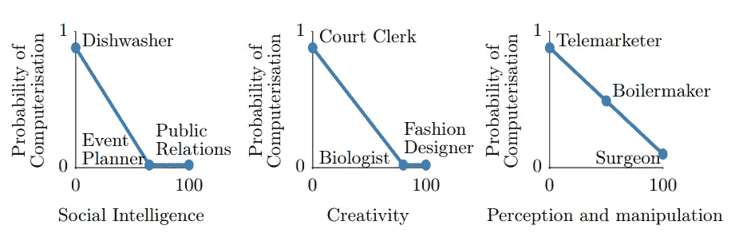
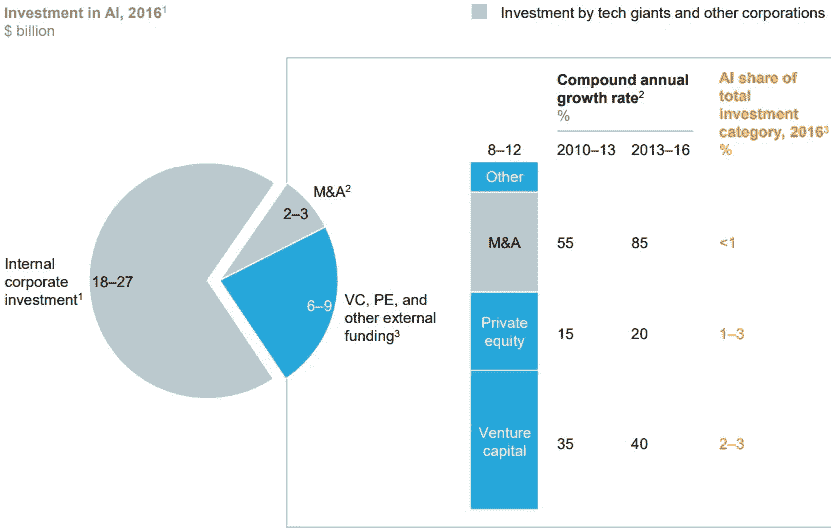

# 自动化对经济的影响

> 原文：<https://towardsdatascience.com/impact-of-automation-on-the-economy-33ef17352f5b?source=collection_archive---------14----------------------->

这篇文章是为 Darakhshan Mir 博士在巴克内尔大学的计算机和社会课程写的。我们讨论技术中的问题，并用伦理框架来分析它们。

Photo by [Rock'n Roll Monkey](https://unsplash.com/@rocknrollmonkey?utm_source=medium&utm_medium=referral) on [Unsplash](https://unsplash.com?utm_source=medium&utm_medium=referral)

> 在一个自动驾驶汽车、智能语音助手和网飞推荐的世界里，有必要就人工智能如何影响社会进行对话。

最近一段时间，我们看到人工智能(AI)出现了巨大的增长。人工智能系统正变得越来越普遍。通常，关于人工智能的讨论围绕着自动化如何影响就业市场。在这篇文章中，我试图回答这个问题，主要是引用弗曼等人的观点。下面，我将讨论就业市场的趋势，以及自动化影响总体经济格局的几种方式。

# —就业市场的趋势

1942 年，经济学家约瑟夫·熊彼特创造了短语*创造性破坏*，指的是一个过程，通过这个过程，一个现有的生产系统被一个更具创新性的系统所取代，从而**提高劳动生产率**【2】。这样的过程产生了“经济失败者”，他们注定会在变革中遭受损失。一些人可能会被减薪，而另一些人可能会完全失业。凯恩斯将后者描述为，

> “由于我们发现节约使用劳动力的方法的速度超过了我们发现劳动力新用途的速度而导致的失业”

**Figure 1:** A look at which jobs are more likely to be automated based on the skills required for those jobs [6]. If you’re curious about the probability of computerization for a specific job, check out [https://willrobotstakemyjob.com/](https://willrobotstakemyjob.com/). The estimates are based on US data.

历史证据表明，虽然某些工作可能面临迫在眉睫的风险，但从长远来看，新的工作通常会出现在互补行业[4]。虽然说起来容易做起来难，但重要的是人们要适应这个不断变化的市场。不幸的是，我们已经看到了劳动力参与率的“长期下降”，因为个人无法跟上工作场所所需的技能。这提出了一个关键问题。

> 谁该为缺乏劳动力参与负责？

使用一组**人**(例如工程师)**作为建立系统**的手段，将另一组人(例如低技能劳动者)排除在工作之外，技术部门应该受到指责吗？这种排斥在资本主义经济中似乎很难避免，因为企业总是竞相(通过创新)实现利润最大化。那么，是我们的教育制度不能使个人为新的工作做好准备吗？还是政府对人工智能的发展监管过于宽松？

这些都是很难回答的问题，也没有放之四海而皆准的解决方案。即使一个有自动化的社会与没有自动化的社会产生相同或更大的经济产出，忽视(尽管是无意的)最脆弱的利益相关者(即低技能工人)的需求也是不公平的。在这种情况下，我们能希望做的最好的事情就是投资再培训工人，以促进公共利益。

# **—AI 成长的副作用**

## 初创企业的进入壁垒

自本世纪初以来，人工智能相关的初创企业每天都在获得更多的资金[7]。然而，像谷歌和百度这样的科技巨头主导了大部分投资，而其他公司(科技或其他)则被留下来追赶。这给创造“成熟的人工智能经济”带来了一些挑战，在某种程度上，这为现有者和进入者提供了公平的竞争环境。

**Figure 2:** Top 35 high tech companies invest a whopping $18-27 bn in AI. Here, M&A refers to mergers and acquisitions and PE refers to Private Equity. To learn more, check the full [MGI report](https://www.mckinsey.com/~/media/mckinsey/industries/advanced%20electronics/our%20insights/how%20artificial%20intelligence%20can%20deliver%20real%20value%20to%20companies/mgi-artificial-intelligence-discussion-paper.ashx).

随着互联网的成熟，我们观察到客户停止使用现有平台并转向新平台的“转换成本”越来越高。像谷歌搜索这样的平台享有先发优势，能够**收集他们的用户数据以进一步巩固他们的市场优势**。大多数人工智能应用依赖于机器学习[7]，因此大数据集的不可用性对人工智能初创公司来说是一个重大障碍。

一些人认为，那些花费资源精心制作一个好数据集的公司应该有权根据需要分发它。另一方面，有理由相信数据本身属于用户。为了解决这些对立的利益相关者利益，[1]提出了数据可移植性的概念，它“允许客户将他们的数据从一个提供商带到另一个提供商。”虽然这是朝着正确方向迈出的一步，但作者也承认，需要进一步的工作来确定大型数据集如何影响市场。

关于数据的可移植性，有关于数据安全性的问题，以及客户是否应该能够“拥有”基于人工智能的应用程序对其行为做出的推断[8]。因此，任何未来的监管第三方机构的作用是确保公司遵守道德数据实践标准，并将用户的福祉(身体、社会或情感)放在首位。

**收入不平等**

自动化的怀疑者担心人工智能会导致收入水平的巨大差异。弗曼等人写道，

> “替代非熟练工人和补充熟练工人的技术将导致非熟练工人的相对工资下降”

这种担忧导致人们重新审视诸如普遍基本收入(UBI)、工资补贴和就业保障等提议。可以理解的是，这些提议没有一个是万无一失的，否则早就付诸实施了。尤其是 UBI，它看起来雄心勃勃，因为除了每年 1 万亿美元的融资之外，它还需要增加近 50%的税收[1]。

正如我们一次又一次看到的那样，收入不平等会导致已经处于不利地位的社会阶层陷入恶性反馈循环。在人工智能取代低技能劳动力的背景下，缩小贫富差距的最佳政策是什么？

# —最终想法

我们的社会离“人工智能接管”(一般的人工智能)还很远，我们还没有看到该领域的突破，尽管机器学习中特定任务的进步已经吸引了所有人。然而，这不应该成为我们不去思考如何监管人工智能的借口。

低技能工人尤其容易受到自动化的影响，其中一些人甚至无法从失业中恢复过来。此外，作为一家初创企业，由于缺乏竞争和无法获得“[标准化数据集](https://ainowinstitute.org/AI_Now_2017_Report.pdf)，进入该领域变得越来越困难所有这些都引发了一系列伦理讨论，比如谁应该为工作岗位的流失指责*以及谁拥有用户数据的权利，这是每个人工智能应用程序所依赖的关键。*

世界各地的政策制定者都试图设计出监管人工智能的框架。然而，正如[9]所指出的，他们都没有讨论他们对未来社会的愿景。这项研究的作者认为，只有了解我们未来的优先事项，我们才能全面解决这篇文章中提出的问题。

## 参考

[1]弗曼，杰森和罗伯特·西曼。“人工智能与经济。”*创新政策与经济* (2019)。

[2]熊彼特，约瑟夫。“创造性破坏。”*资本主义、社会主义和民主* 825 (1942)。

[3]凯恩斯，约翰·梅纳德。1930.“我们子孙后代的经济可能性。”*劝导随笔* (2010)。

[4]戴维·h·奥特尔，“为什么仍然有这么多工作？工作场所自动化的历史和未来。”*《经济透视杂志》* (2015)。

5 经济顾问委员会。*总裁经济报告* (2016)。

[6]弗雷、卡尔·贝内迪克特和迈克尔·奥斯本。"就业的未来:工作对计算机化有多敏感？"*技术预测与社会变革* (2017)。

[7]布欣，雅克等人。艾尔。"人工智能:下一个数字前沿？" *MGI 报告，麦肯锡全球研究院*(2017 年 6 月)。[链接](https://www.mckinsey.com/business-functions/mckinsey-analytics/our-insights/how-artificial-intelligence-can-deliver-real-value-to-companies)。

[8]塔克，凯瑟琳。“隐私和创新。”载于*创新政策与经济*，第 11 卷(2012)。芝加哥:芝加哥大学出版社。

[9] Cath，Corinne 等人，“人工智能和‘好社会’:美国、欧盟和英国的方法。”*科学与工程伦理* (2018)。

[10]史蒂文·n·德劳夫，“持久收入不平等理论”*经济增长杂志* 1.1 (1996)。

如果你喜欢这个，请看看我的其他[媒体文章](https://medium.com/@ymittal)和我的个人博客。请在下面评论我该如何改进。