# 自然语言处理中使用迁移学习的影响

> 原文：<https://towardsdatascience.com/impact-of-using-transfer-learning-in-nlp-59ffc4ffb806?source=collection_archive---------30----------------------->

## 我们分析了基于从零开始训练的语言模型或使用语料库 wikitext-103 的预训练模型对电影评论情感进行分类的影响


Photo by [Riccardo Annandale](https://unsplash.com/@pavement_special?utm_source=medium&utm_medium=referral) on [Unsplash](https://unsplash.com?utm_source=medium&utm_medium=referral)

## 背景

在 NLP 的不同分类工作中，我们使用了 [ULMFiT](https://arxiv.org/pdf/1801.06146.pdf) 。我们可以在用于推文姿态分类的[NLP 迁移学习](/transfer-learning-in-nlp-for-tweet-stance-classification-8ab014da8dde)和用于文本分类的[通用语言模型微调-ULMFiT](https://medium.com/bitbroker-labs/universal-language-model-fine-tuning-for-text-classification-ulmfit-73ea2b383926) 中找到两篇关于这种方法的优秀文章。

ULMFiT 已经在 fastai 库的版本 1 中实现了，他们开发了一些技术，使得迁移学习变得非常方便。

在[原始文件](https://arxiv.org/pdf/1801.06146.pdf)中，ULMFiT 包括三个阶段:

*   使用通用领域数据集在捕获高级自然语言特征的语料库上训练语言模型。
*   调整和微调第一阶段创建的语言模型，并使用迁移学习在目标数据集上创建新的模型语言。
*   使用在第二阶段调整的模型语言学习来创建和微调分类器。

本文的主要目的是衡量从第三阶段(分类器)、从预先训练的语言模型(第二阶段)或直接从零开始之间的差异和影响。

换句话说，第二阶段模型是在有和没有迁移学习的情况下创建的，比较初始结果。

在本文的第一部分，我们将导入数据集并执行必要的数据转换操作。

然后，我们将测量使用从另一个已经训练好的模型接收迁移学习的语言模型的影响，或者直接从数据集创建语言模型的影响，并比较两种结果。

最后，我们将使用上一节中创建的最好的语言模型来开发 NLP 上的情感分类器。

## 数据集

用于二元情感分类的[数据集](http://ai.stanford.edu/~amaas/data/sentiment/)由 Andrew Maas 等人管理，包含 IMDB 上总共 100，000 条评论。其中 25，000 个标记为阳性和阴性用于训练；另外 25，000 个被标记用于测试。

还有另外 50，000 个未标记的数据，我们将用于创建我们的模型语言学习。

```
df = pd.read_csv(path/'texts.csv')
df.head()
```

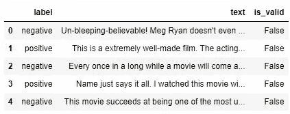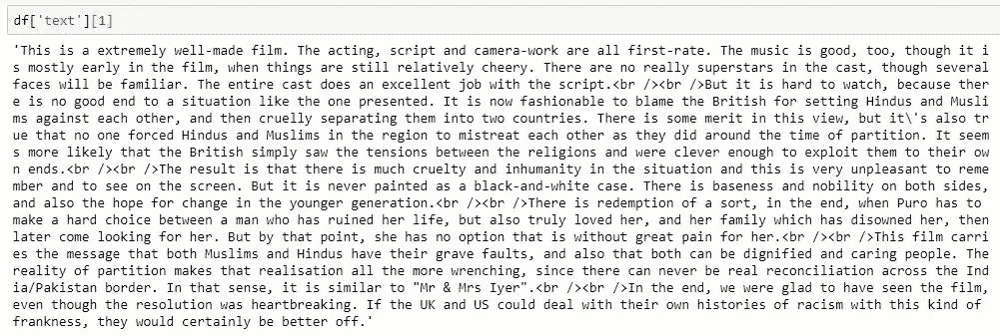

# 第 1 部分-导入数据集和要素工程

> “由于文本是由单词组成的，不能直接对它们应用数学函数，我们首先必须将它们转换成数字。在 fastai 中，这是通过两个不同的步骤完成的:标记化和数值化。在 fastai API 中，TextDataBunch 为我们做了这些*。”

```
%reload_ext autoreload
%autoreload 2
%matplotlib inline
from fastai.text import *
path = untar_data(URLs.IMDB_SAMPLE)
data_lm = TextDataBunch.from_csv(path, 'texts.csv')
```

## 标记化

```
data = TextClasDataBunch.from_csv(path, 'texts.csv')
data.show_batch()
```

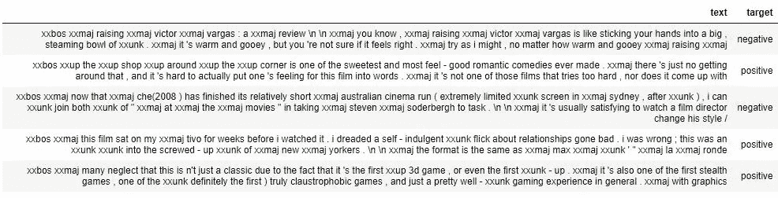

## 数字化

一旦我们从文本中获得了标记，TextDataBunch 就会通过创建一个包含所有使用过的单词的列表来转换成整数。默认情况下，最大词汇量为 60，000，并替换那些没有被未知令牌 UNK 切断的词汇。

从 id 到令牌的对应关系存储在一个名为 itos 的字典中的 vocab 属性中。

```
data.vocab.itos[:10]
```

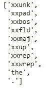

现在，如果我们查看数据集，我们会看到标记化的文本如下:

```
data.train_ds[0][0]
```

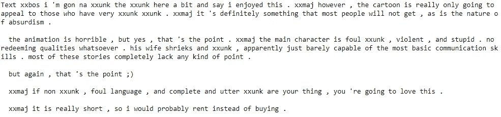

如果我们看所有的火车，都是数字:

```
data.train_ds[0][0].data[:10]
```

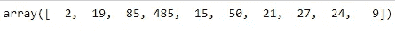

# 第 2 部分—创建语言模型学习


Photo by [Conor Luddy](https://unsplash.com/@opticonor?utm_source=medium&utm_medium=referral) on [Unsplash](https://unsplash.com?utm_source=medium&utm_medium=referral)

## 语言建模

“一个语言模型试图通过层次化的表征来学习自然语言的结构，因而既包含低级特征(词的表征)，也包含高级特征(语义)。语言建模的一个关键特征是它是生成性的，这意味着它的目标是在给定一个单词序列的情况下预测下一个单词。它能够做到这一点，因为语言模型通常是以无监督的方式在非常大的数据集上训练的，因此该模型可以以比单词嵌入更深入的方式“学习”语言的句法特征。

在他的文章中，Sebastian Ruder 做了一个非常优雅的工作，强调了为什么语言建模对于广泛的自然语言处理任务如此强大。未标记的语言数据相对容易获得(它可以以大型文本语料库的形式免费获得)，因此通过向语言模型提供足够大的数据集，现在可以对数十亿个单词进行无监督的预训练，同时融入更深入的语言语法知识。"⁴

我们将使用 fastai 的 API 中的 language_model_learner，这是一种学习者⁵，它采用一组配置，从数据集中假设一个语言模型。

Language_model_learner 承认属性“pre-trained (Bool)”，其默认选项为 True，并假设每种语言都有一个迁移学习模型。

## 从头开始创建我们的语言模型学习

这种技术已经被用来为不同的习语创建一个语言模型，这里是[一篇文章](/pre-trained-language-model-in-any-language-7531ea7217d4)在 Vietnamese⁶.有一个极好的例子

```
path = untar_data(URLs.IMDB)
data_lm = (TextList.from_folder(path)
.filter_by_folder(include=['train', 'test', 'unsup'])
.split_by_rand_pct(0.1)
.label_for_lm()
.databunch(bs=bs))data_lm.save('data_lm.pkl')
```

> “我们必须为语言模型使用一种特殊的`TextDataBunch`,它会忽略标签(这就是为什么我们在任何地方都放 0 ),在将它们连接在一起之前，会在每个时期对文本进行洗牌(仅用于训练，我们不会对验证集进行洗牌),并且会发送按顺序读取该文本的批处理，目标是句子中的下一个单词。*"

```
data_lm = load_data(path, 'data_lm.pkl', bs=bs)
data_lm.show_batch()
```

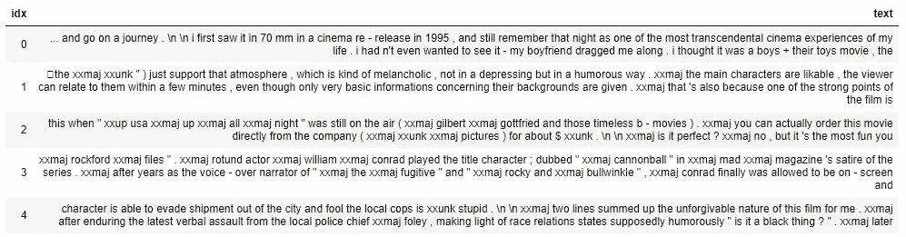

在这里，我们向 API 表明，我们希望“学习”模型不采用预训练迁移学习的默认权重，而是在不假设预训练的情况下开始:

```
learn = language_model_learner(data_lm, AWD_LSTM, **pretrained=False**, drop_mult=0.3)
```

在调整学习率和训练之后，我们获得了 0.284114 的准确度

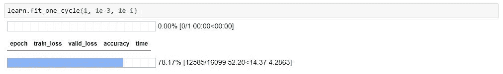

## 使用预训练模型进行迁移学习

在 fastai 中使用的更大数据集上预先训练的模型是维基百科的一个清理过的子集，名为 [wikitext-103](https://einstein.ai/research/blog/the-wikitext-long-term-dependency-language-modeling-dataset) 。

> “我们将使用英语语言的‘知识’来构建我们的分类器，但首先，像计算机视觉一样，我们需要根据我们的特定数据集微调预训练模型。因为人们在 IMDB 上留下的评论的英文和维基百科的英文不一样，我们需要稍微调整一下模型的参数。此外，可能有一些词在评论数据集中非常常见，但在维基百科中几乎不存在，因此可能不是模型训练的词汇表的一部分。*"

```
learn = language_model_learner(data_lm, AWD_LSTM, drop_mult=0.3)
learn.lr_find()
learn.recorder.plot(skip_end=15)
```

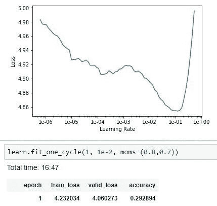

## 准备要在分类器中使用的模型

不仅要为下一个零件保存模型，还要保存它的编码器。这一部分非常重要，因为要重用这个模型，单词列表和它们的 id 必须相同。

```
**learn.save_encoder('fine_tuned_enc')**
```

# 第 3 部分—电影评论情感分类器:采用模型


Photo by [Georgia Vagim](https://unsplash.com/@georgiavagim?utm_source=medium&utm_medium=referral) on [Unsplash](https://unsplash.com?utm_source=medium&utm_medium=referral)

```
path = untar_data(URLs.IMDB)
data_clas = (TextList.from_folder(path, vocab=data_lm.vocab)
.split_by_folder(valid='test')
.label_from_folder(classes=['neg', 'pos'])
.databunch(bs=bs))data_clas.save('data_clas.pkl')
data_clas = load_data(path, 'data_clas.pkl', bs=bs)
```

我们创建分类器，并将其指定为前一阶段的编码器。

```
learn = text_classifier_learner(data_clas, AWD_LSTM, drop_mult=0.5)
**learn.load_encoder('fine_tuned_enc')**
```

***结果……***

***左边，模型语言从零开始，右边，模型用迁移学习:***

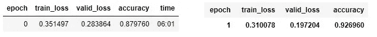

最后，在调整学习率和一些额外的训练之后，我们在电影评论数据集上获得了一个准确率为 0.943960 的情感分类器。

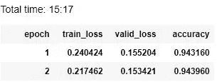

# 摘要

我们已经试验了来自先前数据体的预训练语言模型和从头开始的语言模型的应用，在使用迁移学习时获得了更好的结果。

使用 fastai 和 UMLFiT 的工具，我们可以通过维基百科的数据语料库来应用这一点，以任何语言进行预训练，这在 NLP 中是一个很大的优势，因为工具和数据集的偏见是英语。

最后，记住在语言模型和文本分类器之间保持编码器是非常重要的。这个练习的基础是来自 [fastai 课程](https://fast.ai course/)第 3 和第 4 课的 token，在那里你可以找到完整的代码和对数据集的访问。

我希望这篇文章有助于看到在 NLP 中使用迁移学习的积极影响，类似于在计算机视觉中使用的迁移学习。欢迎任何更正、评论或想法。

## 参考

[1][https://course.fast.ai/](https://course.fast.ai/)

[2][http://ai.stanford.edu/~amaas/](http://ai.stanford.edu/~amaas/)

[3]https://www.imdb.com/

[4][https://towards data science . com/transfer-learning-in-NLP-for-tweet-stance-class ification-8ab 014 da 8d de](/transfer-learning-in-nlp-for-tweet-stance-classification-8ab014da8dde)

[5][https://docs.fast.ai/basic_train.html#Learner](https://docs.fast.ai/basic_train.html#Learner)

[6][https://towards data science . com/pre-trained-language-model-in-any-language-7531 ea 7217d 4](/pre-trained-language-model-in-any-language-7531ea7217d4)

[*]本文中的许多概念都直接来自于第 3 课和第 4 课 [fast.ai 课程](https://course.fast.ai/)