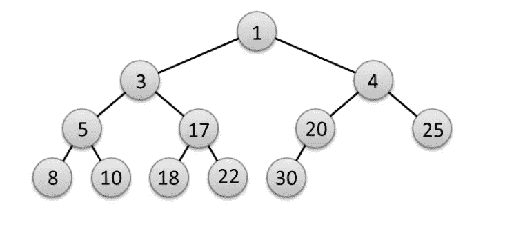
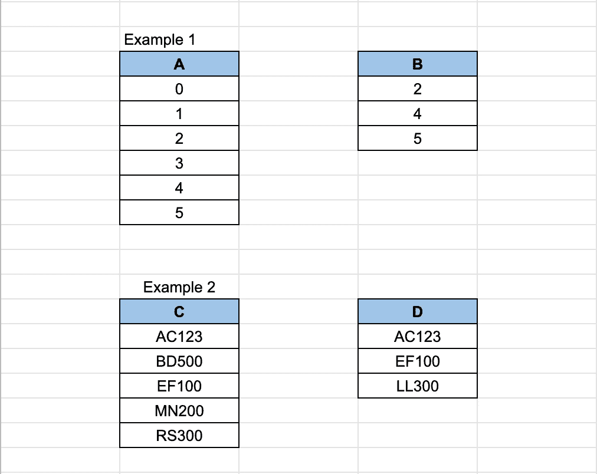

# 使用 Python Pandas 数据帧与最小堆数据结构

> 原文：<https://towardsdatascience.com/implement-a-min-heap-to-solve-performance-issue-with-data-processing-1f7f891a4ec0?source=collection_archive---------17----------------------->


Photo by [Marian Kroell](https://unsplash.com/@mkunsplash84?utm_source=medium&utm_medium=referral) on [Unsplash](https://unsplash.com?utm_source=medium&utm_medium=referral)

# 介绍

最近我花了很多时间研究基本的数据结构，包括栈、队列、堆和树。它教会了我用以下不同的方式解决问题(代码):

*   总是寻找最简单、最有效、最优雅的方式(可读性是金)
*   审查，审查和审查，以提高代码的效率(是否有重复的部分？我能换一种方式做吗？有些步骤是多余的吗？)
*   在选择你可以使用的工具(框架、数据结构、算法)时，要实际考虑

阅读理论只是一个开始，在我看来，巩固所学知识的最好方法是将其应用到现实世界的问题中。幸运的是，我参与的一个项目中有一部分可以利用`Min Heap`的实现，也就是通常所说的`Priority Queue`。



An example of a **Binary Min Heap**, visualised in a tree structure.

我在下面几节中概述了实现:

*   问题是
*   在最小堆实现之前
*   在最小堆实现之后
*   参考

# 问题是

任务很简单:从所有满足**包含依赖规则**的输入表中找到所有**列对**。规则是，对于每个列对，一列的所有值都必须存在于它的列对中。下面是为了更容易理解的例子。



In **Example 1**, there were 2 checks performed: 1) column A in column B and 2) column B in column A. The valid column pair in this example is 2) **column B in column A**, because all values in column B exists in column A (inclusion dependency rule satisfied). In **Example 2,** both checks 1) column C in column D and 2) column D in column C are invalid, because the value LL300 only exists in column D.

现在，您可能会想，为什么要让事情变得复杂呢？您可以通过检查每一对，一列中的所有值是否都包含在另一列中，来应用强力方法。问题是大约有 900 个表，每个表都有不同数量的列。简而言之，当使用暴力方法时，要花很长时间来完成检查。

# 在最小堆实现之前

我最初的方法比暴力方法稍微好一点，但是，它仍然需要很长时间来运行。本质上，应用了`Single Pass`算法。这意味着在找出列对时，所有数据(或值)将只被读取一次，而不是多次(想想暴力方法，您将多次读取相同的列/值)。

为此，我使用`pandas`库构建了一个单独的`data frame`，存储所有表中的所有列，包括它们的值。最后的`data frame`看起来是这样的。

```
A       B     C
index
0        nan     0.0   0.0
1        1.0     nan   1.0
2        2.0     nan   2.0
3        nan     3.0   3.0
```

让我通过这些步骤来了解上面的`data frame`:

*   对于每个表中的每一列，将其唯一值存储在一个`list`中，按升序排序
*   从所有列中获取所有唯一值，将它们存储在一个`list`中，按升序排序，例如按照上述`data frame`的`[0, 1, 2, 3]`
*   构造一个`data frame`并将其`index`设置为包含来自**步骤 2** 的所有唯一值的`list`
*   通过`index`上的`left join`合并从**步骤 1** 到**步骤 3** 的所有列表(当一列没有特定值时，会在最后的`data frame`中产生一个`nan`条目)，例如，列`A`没有`[0, 3]`。

> 注意，由于`*nan*`值的形成，`*data frame*`中的列类型不是`*float64*`。那些列的原始值实际上是`*int64*`。

在迭代`data frame`中的每一行之前，我们需要初始化一个包含初始包含依赖列列表的`dictionary`。等等，什么？让我给你展示一下`dictionary`的样子，让你明白这一点。

```
inclusion_dict = {'A': ['B', 'C'],
                  'B': ['A', 'C'],
                  'C': ['A', 'B']}
```

现在更有意义了？因此，基本上，我们初始化所有可能的列对(例如，列 B 中的列 A，列 C 中的列 A，表示为字典条目`'A': ['B', 'C']`，等等。)作为我们迭代前的起点。当我们迭代`data frame`中的每一行时，`inclusion_dict`将会相应地更新(更多信息见下文)。

好了，让我们来谈谈迭代。下面是执行迭代的代码。

```
def sp_algorithm(dataframe, inclusion_dict): # for each value, get all columns that contains it
    for val in dataframe.index: cols_list = dataframe.columns[dataframe.isin([val]).any()] # for each column in inclusion_dict.keys(), intersect its values with cols_list to get the remaining column pairs candidates
        for key_col in inclusion_dict.keys(): column_val = dataframe.loc[val, key_col]# if the current column value is null, then do nothing
            if (column_val == column_val) & (column_val != ''):
                col_dict[key_col] = list(set(col_dict[key_col]).intersection(cols_list))
```

提醒一下，这是`data frame`。

```
A       B     C
index
0        nan     0.0   0.0
1        1.0     nan   1.0
2        2.0     nan   2.0
3        nan     3.0   3.0
```

在`data frame`行的每次迭代中，会发生以下情况:

*   `cols_list`:获取包含当前索引值的所有列(只是它们的名称)`val`
*   对于`inclusion_dict`中的每一列(字典的`key`),根据位置`.loc`在`data frame`中获取其值
*   检查**第二步**的值是否为`nan`和/或`''`，如果不是，通过与`cols_list`相交更新`inclusion_dict`。例如，在上面的`data frame`的第一次迭代中，`cols_list`将是`['B', 'C']`，因为它们包含值`0`。当我们查找`inclusion_dict`时，`key_col = 'A'`将被跳过，因为它在`if statement`中返回`False`，因为它是`nan`(参见`data frame`中索引`0`处的`A`列)。对于`key_col = 'B'`，我们将把它当前的`inclusion_dict`值与`cols_list`相交，这样我们就有了`['C']`。这是因为`['A', 'C']` **与`['B', 'C']`相交的**就是`['C']`。对于`key_col = 'C'`，其`inclusion_dict`剩余值将为`['B']`。

> 嗯，上面的一系列代码实际上工作并产生了我想要的结果，但是，运行时间非常慢！所以，我开始问自己一个问题，如果数据库大得多，如果有更多的表和列要处理怎么办？

此外，每次在`sp_algorithm`运行时代码中出现错误，我都必须从头重新运行整个程序，这花费了我很长时间。代码看起来也不可读，难以理解，并且可能不可持续。

# 在最小堆实现之后

多亏了`Min Heap`数据结构，我能够将运行时间提高 10 到 60 倍，这取决于数据库(大小、表计数、列计数、唯一值计数等。)!

无论如何，这是一个巨大的进步！我不必整夜运行我的代码，希望没有任何东西会中断，并在早上第一件事就是检查它。现在，我可以随时运行代码，并在几分钟内得到结果，而不是几个小时。

事不宜迟，下面是实现代码。

```
# inclusion_dict from above
inclusion_dict = {'A': ['B', 'C'],
                  'B': ['A', 'C'],
                  'C': ['A', 'B']}# instead of a data frame, a dictionary is used to store columns from all tables
# column_dict stores sorted (ascending order) unique values from all columns from all tables
column_dict = {'A': [1, 2], 
               'B': [0, 3],
               'C': [0, 1, 2, 3]}def sp_algorithm(column_dict):
    # initialise min heap
    min_heap = [] for column in column_dict:
        vals = column_dict[column] for val in vals:
            tup = (val, column)
            heapq.heappush(min_heap, tup) while min_heap: # get the smallest value in the heap
        att = [] current_smallest, var = heapq.heappop(min_heap)
        att.append(var) # pop all elements where values are equal to current smallest and put them in att list
        while min_heap and min_heap[0][0] == current_smallest:
            next_var = heapq.heappop(min_heap)[-1]
            att.append(next_var) # update inclusion_dict
        for a in att:
            if a in inclusion_dict:
                inclusion_dict[a] = list(set(inclusion_dict[a]).intersection(att))# final inclusion_dict should look like
inclusion_dict = {'A': ['C'],
                  'B': ['C'],
                  'C': []}
```

`inclusion_dict`最后的结果基本上说:

*   列 A 可能依赖于列 C，因为它的所有值都在列 C 中
*   列 B 可能依赖于列 C，因为它的所有值都在列 C 中
*   列 C 在此上下文中没有依赖关系，因为列 A 和列 B 都不包含列 C 中的所有值

> 我希望这能给你一个在项目中实现`*Min Heap*`的潜在好处的想法。正如我前面提到的，思考并重新思考你可以使用哪些工具，并明智地选择。

`Min Heap`背后的理论不在本文讨论范围之内。本文的主要目的是向您展示一个真实世界中的`Min Heap`实现。别担心，只要在谷歌上搜索一下，你就会在`Min Heap`上找到大量的资源。

# 参考

上面描述的技术来自一篇讨论**单程包含依赖识别(SPIDER)** 算法的论文。你可以在这里了解更多信息[。](https://hpi.de/fileadmin/user_upload/fachgebiete/naumann/publications/2010/HPI_34_Efficient_and_Exact_Computation_of_Inclusion_Dependencies_for_Data_Integration.pdf)

前往**章节 2.2.2** 和 **2.2.3** 了解**蜘蛛**算法的更多细节。

就`Heap`理论而言，你可以在谷歌上找到很多参考资料。这里有一本[你可以读。](https://www.pythoncentral.io/priority-queue-beginners-guide/)

# 最后的话

这是我写的第一篇有点冗长的文章，所以，如果你觉得有用，请留下你的反馈、评论或给我鼓掌或加书签。

欢迎提出任何问题或在下面留下建议。

干杯！🙂