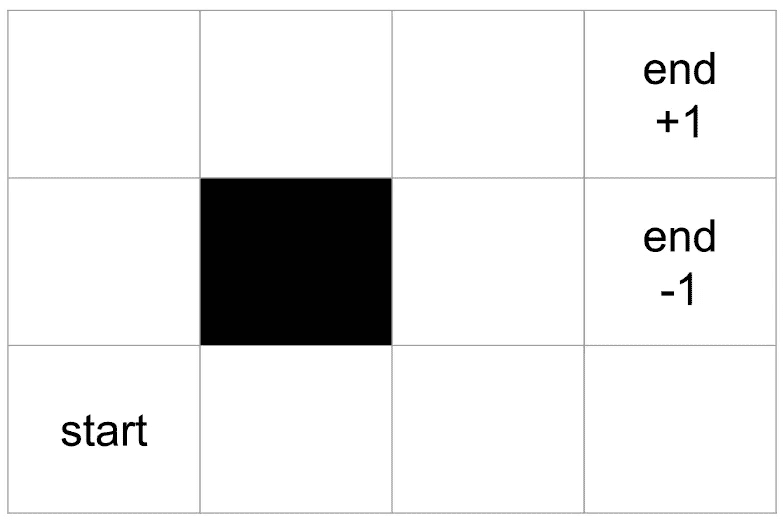
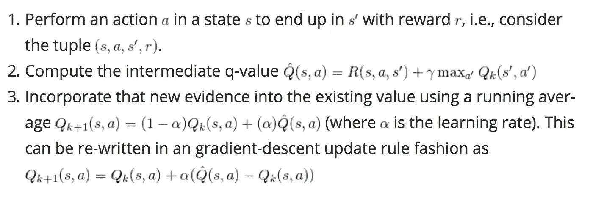
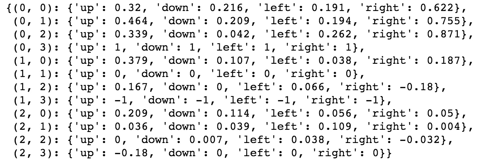

# 用 Q-Learning 实现网格世界

> 原文：<https://towardsdatascience.com/implement-grid-world-with-q-learning-51151747b455?source=collection_archive---------3----------------------->

## 强化学习在网格游戏中的应用

在[之前的故事](https://medium.com/@zhangyue9306/reinforcement-learning-implement-grid-world-from-scratch-c5963765ebff)中，我们谈到了如何使用值迭代实现一个确定性的网格世界游戏。这一次，让我们进入一种更普遍的强化学习形式——Q 学习。

# 提高一个档次

鉴于 *V(s)* 是从状态到该状态的估计值的映射，Q 函数— *Q(s，a)* 只是与 V 函数不同的一个分量。当你处于特定的状态时，不要认为你得到了一个值，向前想一步，你处于一种状态，通过采取特定的行动，你得到了相应的值。本质上，这两种功能没有区别，只是通过将状态与行动绑定在一起方便了我们的生活。例如，回想一下使用值迭代的 grid world 的结果，我们得到了每个状态的估计值，但是为了拥有我们的策略 *π(s，a)* ，这是从状态到动作的映射，我们需要更进一步，选择可以达到下一个状态的最大值的动作。然而，在 Q 函数中，状态和动作首先是成对的，这意味着当一个人拥有最佳 Q 函数时，他就拥有该状态的最佳动作。

除了 Q-function，我们还将为我们的游戏增添更多乐趣:

*   代理操作是不确定的
*   报酬随比率γ衰减

非确定性意味着代理将不能去它想要去的地方。当它采取一个动作时，它将有可能在不同的动作中崩溃。

衰变率γ在 0 和 1 之间。它表示代理人对未来奖励的关心程度，1 表示奖励永不衰减，代理人同样关心未来的所有奖励，0 表示代理人只关心当前状态的奖励。这个因素有助于调整代理人的长期愿景——想象一下像围棋这样的战略游戏，有时在当前状态下看似愚蠢的行动在长期利益和胜利方面是值得的。

就是这样！让我们着手实施。[ [完整代码](https://github.com/MJeremy2017/RL/blob/master/GridWorld/gridWorld_Q.py)

# 电路板设置

Board

董事会设置与之前讨论的基本相同，唯一的区别是代理采取行动。当它采取行动时，它将有 0.8 的概率进入期望的状态，并有相等的概率处于垂直状态。也就是说，如果代理人选择向上，那么它有 0.8 的概率向上，0.1 的概率向左和向右。

在确定代理的下一个位置时，我们将采取返回`chooseActionProb()`的操作，并利用我们已经定义的`nxtPosition()`函数。

`nxtPosition()`函数接受一个动作，验证该动作的合法性并返回该动作的状态。

# 代理人

让我们跳到主课程——如何通过迭代计算和更新 Q 值。

Q-value update

首先，在每一步，代理采取行动`a`，收集相应的奖励`r`，并从状态`s`移动到`s'`。所以每一步都要考虑一整对`(s, a, s',r)`。

其次，我们给出当前 *Q* 值的估计，它等于当前奖励加上下一状态的最大 *Q* 值乘以一个衰减率γ。值得注意的一点是，我们将所有中间奖励设置为 0，因此代理在结束状态之前无法收集任何非零奖励，无论是 1 还是-1。(这不是强制性的，你可以尝试其他奖励，看看代理如何行动)

最后，我们通过将α乘以一个**时间差**(新的估计值和当前值之间的差)来更新当前 *Q* 值的估计值。

## q 值初始化

整个更新与值迭代非常相似，尽管 *Q* value 认为动作和状态是一对。当初始化 *Q* 值时，我们需要将每个状态和每个动作设置为 0，并将它们存储在字典中作为`Q_value[state][action]=0`。

## 行动

就采取行动而言，仍将基于我们在[勘探&开采](https://medium.com/@zhangyue9306/reinforcement-learning-implement-grid-world-from-scratch-c5963765ebff)中讨论的勘探率。当代理利用状态时，它将根据当前估计的 *Q* 值采取最大化 *Q* 值的行动。

## 更新 Q 值

类似于数值迭代， *Q* 数值更新也是以相反的方式进行，每次更新将在游戏结束时进行。

在游戏结束时，我们显式地将最后一个状态的所有行为设置为当前奖励，即 1 或-1，但这部分是可选的，它有助于更快地收敛。以下部分与值迭代相同，只是我们在这里加了一个`decay_gamma`(注:`self.decay_gamma * reward`应该是`self.decay_gamma * reward + 0`作为我们设置为 0 的当前状态的奖励)。

# 玩游戏

我们开球吧！玩了 50 轮之后，我们有了下面的状态-动作对的更新。

result after 50 rounds

我们从`(2, 0)`开始，最大行动应该是值为`0.209`的`up`，然后到达`(1, 0)`，从那里最佳行动仍然是值为`0.339`的`up`，以此类推……最后我们得到我们的策略`up -> up -> right -> right -> right`。我们可以看到，通过传播和更新，我们的代理足够聪明，可以在每个状态下产生最佳行动。Q-learning 的一个好处是，与基本值迭代相比，我们可以直接获得每个状态下的最佳行动。

请在这里查看完整代码，如果您发现任何警告，欢迎评论或投稿！