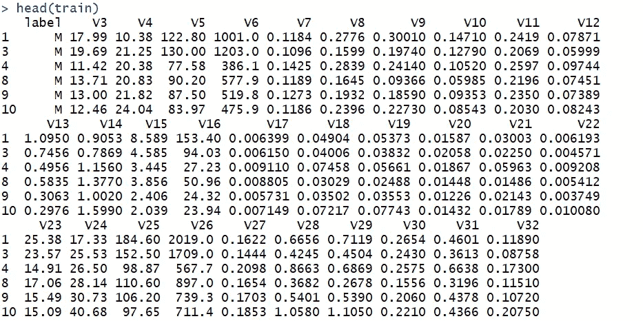

# 在 R 中实现随机森林

> 原文：<https://towardsdatascience.com/implement-random-forest-in-r-b00b69eb8501?source=collection_archive---------13----------------------->

## 随机森林在乳腺癌患者分类中的实际应用


Photo by [Rural Explorer](https://unsplash.com/@ruralexplorer?utm_source=medium&utm_medium=referral) on [Unsplash](https://unsplash.com?utm_source=medium&utm_medium=referral)

# **什么是随机森林(RF)？**

为了理解 RF，我们需要首先理解决策树。 [Rajesh S. Brid](https://medium.com/@rajesh_brid?source=post_page-----dc506a403aeb----------------------) 给[写了一篇关于决策树的详细文章](https://medium.com/greyatom/decision-trees-a-simple-way-to-visualize-a-decision-dc506a403aeb)。我们不会过多地讨论决策树的定义，因为这不是本文的目的。我只想快速总结几点。决策树是一系列是/否问题。对于树的每一级，如果你的答案是肯定的，你就属于一个类别，否则，你就属于另一个类别。你将回答这一系列是/否的问题，直到你到达最后一类。你将被归入那一组。


Taken from [here](https://www.aitimejournal.com/@akshay.chavan/a-comprehensive-guide-to-decision-tree-learning)

对于我们用来训练的数据，树工作得很好，但是当涉及到新的数据样本时，它们的表现并不好。幸运的是，我们有随机森林，它是许多具有灵活性的决策树的组合，因此导致了准确性的提高。

在这里，我不会过多地讨论 RF 的细节，因为我们可以从外部的各种来源了解它背后的数学原理。[这里的](/understanding-random-forest-58381e0602d2)就是其中之一。

本文更多的是关于 RF 在癌症患者分类中的实际应用，所以我将直接进入编码部分。现在让我们打开 Rstudio，动手干一场:)

# 在 R 中实现 RF

首先，我们需要加载以下包。如果您不能加载它们，很可能您还没有安装它们。所以请在加载下面的包之前先这样做。

```
library(ggplot2)
library(corrplot)
library(reshape2)
library(ggthemes)
library(dplyr)
library(randomForest)
Wisconsin = read.table(url(paste0("[https://archive.ics.uci.edu/ml/machine-learning-databases/](https://archive.ics.uci.edu/ml/machine-learning-databases/)",
"breast-cancer-wisconsin/wdbc.data")),header=FALSE,sep=",",nrows=570)
```

我直接从 web 链接中读取数据，并将数据集命名为 Wisconsin。让我们稍微检查一下数据

```
head(Wisconsin)
```


V1 是 ID，所以它与我们这里的分析无关。V2 是分类结果，“M”代表“恶性”，“B”代表“良性”。剩下的只是关于癌症诊断信息的变量。

现在我想把 M 和 B 改成真和假，以便于解释。

```
Wisconsin$V2 <- Wisconsin$V2 == “M”
```

**预处理数据**

首先，我们将数据混洗并分成训练和测试。我们决定七三分成。

```
set.seed(2019)test_size = floor(0.3 * nrow(Wisconsin))
samp = sample(nrow(Wisconsin), test_size,replace = FALSE)y_train = Wisconsin[-samp,2]
x_train = Wisconsin[-samp,-c(1,2)] #since the first column is just ID
y_test= Wisconsin[samp,2]
x_test = Wisconsin[samp,-c(1,2)] #since the first column is just ID**#convert labels to categorical**
y_train = factor(y_train)
y_test = factor(y_test)
```

我们应该注意，RF 只在响应变量是一个 ***因子*** 时才起作用。**刚才我们把‘M’和‘B’转换成 TRUE 和 FALSE 的时候，这个变量的类型是逻辑的。因此，我们需要使用 factor()函数**将其转换为 factor。

现在让我们将 x 和 y 组合起来，形成训练集和测试集。

```
#Create training set and testing set
train = cbind(y_train,x_train)
test = cbind(y_test,x_test)
```

训练集将用于训练 RF 模型，测试集将用于测试模型的性能。现在让我们给我们的响应变量命名。在这里，我把它命名为“标签”

```
colnames(train)[1] = ‘label’
colnames(test)[1] = ‘label’
```

它现在看起来像这样



**拟合随机森林模型**

现在一切准备就绪。我们可以开始拟合模型了。这一步很容易。

包中的“randomForest()”函数使随机森林模型适合数据。除了包括数据集和指定公式和标签之外，该函数的一些关键参数包括:

1. **ntree** :要种植的树木数量。默认值为 500。

2. **mtry** :每次分割随机选择的变量个数。在这个例子中，我们使用 p 的平方根(p 表示预测值的数量)。请注意，对于回归分析，一般规则是使用 mtry = p/3，这也是该参数在回归中的默认值。

3.**重要性**:如果为真，模型将计算特征的重要性，以供进一步分析。(默认值=假)

4.**邻近度**:如果为真，模型将包含一个 N*N 矩阵，代表邻近度。

5. **maxnodes** :树可以拥有的最大终端节点数。

6.**娜**。**动作**:指定如何处理缺失数据的功能。

由于有 30 个独立变量，我们将 **mtry** 设为 30 的平方根，然后拟合模型

```
mtry = sqrt(30)
model_1 = randomForest(label~., data = train, importance = TRUE)
```

就是这样。简单不是吗？现在我们已经有了一个射频模型

```
print(model_1)
```


出袋 OOB 误差估计率为 3%，这是非常好的，即 97%的准确度。如果我们看混淆矩阵，我们可以看到分类误差相当低。这表明我们的 RF 模型在分类训练集方面表现良好。

让我们用测试集来测试这个模型。

```
pred_1 = predict(model_1, x_test)
table(y_test, pred_1)accuracy_m1 = mean(y_test == pred_1)
```


看起来我们的模型在测试集上表现也很好，准确率达到 95%。

**可变重要性**

```
varImpPlot(model_1)
```


Importance of variables in the model. **The higher the rank, the more important the variables**

我们可视化绘图的另一种方法是使用 **ggplot 包。**请注意，下面的代码是为了可视化“平均降低准确度”。要得到“平均下降基尼系数”，只需将下面的粗体字改为“MeanDecreaseAccuracy”(无间距)。

```
importance = importance(model_1)
varImportance = data.frame(Variables = row.names(importance),
 Importance =round(importance[, “**MeanDecreaseAccuracy**”],2))rankImportance=varImportance%>%mutate(Rank=paste(‘#’,dense_rank(desc(Importance))))ggplot(rankImportance,aes(x=reorder(Variables,Importance),
 y=Importance,fill=Importance))+ 
 geom_bar(stat=’identity’) + 
 geom_text(aes(x = Variables, y = 0.5, label = Rank),
 hjust=0, vjust=0.55, size = 4, colour = ‘white’) +
 labs(x = ‘Variables’) +
 coord_flip() + 
 theme_classic()
```


Mean Decrease Accuracy

结果和我们之前得到的图类似。结果显示变量 V25、V30、V26 和 V23 是最重要的。


Mean Decrease Gini

使用平均下降基尼系数，我们得到 V25、V23 和 V26 作为最重要的变量。

# 结论

本文展示了如何实现一个简单的随机森林模型来解决分类问题。我没有深入研究如何调整参数以优化模型，因为分类的准确度如此之高，我认为简单的模型就足够了。然而，在现实生活中，还有其他更复杂的分类问题需要我们调整参数以获得最佳模型，我将在下一次单独撰写一篇文章。但重要的是要记住总是从简单的模型开始，然后从那里建立模型以获得更好的预测。

谢谢你的时间。我希望这篇文章能帮助你们，尤其是那些以前从未尝试过在 R 中实现 RF 的人，更好地了解如何实现。如果您有任何意见或问题，请告诉我。

祝您愉快，编程愉快:)