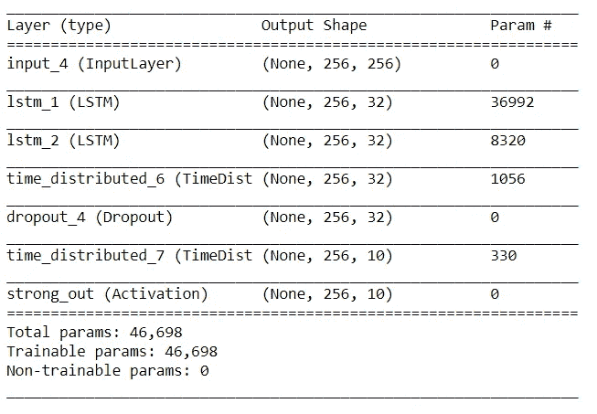

# RNN、LSTM 和 GRU 的实施情况

> 原文：<https://towardsdatascience.com/implementation-of-rnn-lstm-and-gru-a4250bf6c090?source=collection_archive---------4----------------------->


Recurrent Neural Network

递归神经网络是一类人工神经网络，其中节点之间的连接沿着时间序列形成有向图。与前馈神经网络不同，递归神经网络使用其内部状态存储器来处理序列。递归神经网络的这种动态行为使得它们非常有用，并且可应用于音频分析、手写识别和一些这样的应用。

## Keras 中简单的 RNN 实现。

数学上，简单的 RNN 可以用公式表示如下:


其中 x(t)和 y(t)是输入和输出向量，Wᵢₕ、Wₕₕ和 Wₕₒ是权重矩阵，fₕ和 fₒ是隐藏和输出单元激活函数。

具有 2 个简单 RNN 层的 RNN 的实现可以如下所示，每个层具有 32 个 RNN 单元，随后是用于 10 个类别分类的时间分布密集层:

```
def get_model(_rnn_nb, _fc_nb):spec_start = Input((256,256))
 spec_x = spec_start
 for _r in _rnn_nb:
 spec_x = SimpleRNN(_r, activation=’tanh’, dropout=dropout_rate, recurrent_dropout=dropout_rate, return_sequences=True)(spec_x)for _f in _fc_nb:
 spec_x = TimeDistributed(Dense(_f))(spec_x)
 spec_x = Dropout(dropout_rate)(spec_x)spec_x = TimeDistributed(Dense(10))(spec_x)
 out = Activation(‘sigmoid’, name=’strong_out’)(spec_x)_model = Model(inputs=spec_start, outputs=out)
 _model.compile(optimizer=’Adam’, loss=’binary_crossentropy’,metrics = [‘accuracy’])
 _model.summary()
 return _model
```

参数:

```
rnn_nb = [32, 32] # Number of RNN nodes. Length of rnn_nb = number of RNN layers
fc_nb = [32] # Number of FC nodes. Length of fc_nb = number of FC layers
dropout_rate = 0.5 # Dropout after each layer
```

模型总结如下:


Summary.

## LSTM 在喀拉斯的实施。

LSTM，也被称为长短期记忆，是一种具有反馈连接的 RNN 架构，这使得它能够执行或计算图灵机可以执行的任何事情。

单个 LSTM 单元由一个单元、一个输入门、一个输出门和一个遗忘门组成，这有助于单元记忆任意时间的值。这些门控制着进出 LSTM 细胞的信息流。

LSTM 单元的隐藏状态 hₜ可以计算如下:


这里， ***i，*f，o**分别称为输入、遗忘和输出门。注意，它们具有完全相同的方程，只是具有不同的参数矩阵( ***W*** 是在前一隐藏层和当前隐藏层的递归连接， ***U*** 是将输入连接到当前隐藏层的权重矩阵)。

LSTM 的 Keras 实现具有 2 层 32 个 LSTM 单元，每层用于上述 10 个类别分类的任务，可以说明如下:

```
def get_model(_rnn_nb, _fc_nb):spec_start = Input((256,256))
 spec_x = spec_start
 for _r in _rnn_nb:
 spec_x = LSTM(_r, activation=’tanh’, dropout=dropout_rate, recurrent_dropout=dropout_rate, return_sequences=True)(spec_x)for _f in _fc_nb:
 spec_x = TimeDistributed(Dense(_f))(spec_x)
 spec_x = Dropout(dropout_rate)(spec_x)spec_x = TimeDistributed(Dense(10))(spec_x)
 out = Activation(‘sigmoid’, name=’strong_out’)(spec_x)_model = Model(inputs=spec_start, outputs=out)
 _model.compile(optimizer=’Adam’, loss=’binary_crossentropy’,metrics = [‘accuracy’])
 _model.summary()
 return _model
```

参数:

```
rnn_nb = [32, 32] # Number of RNN nodes. Length of rnn_nb = number of RNN layers
fc_nb = [32] # Number of FC nodes. Length of fc_nb = number of FC layers
dropout_rate = 0.5 # Dropout after each layer
```

模型总结如下:



Summary.

## GRU 在喀拉斯的实施。

GRU 被称为门控循环单元，是一种 RNN 建筑，类似于 LSTM 单元。GRU 由复位门和更新门组成，而不是 LSTM 的输入、输出和遗忘门。

复位门决定如何将新的输入与先前的存储器相结合，而更新门定义要保留多少先前的存储器。如果我们将 reset 设置为全 1，将 update gate 设置为全 0，我们又会得到简单的 RNN 模型。

对于 GRU，隐藏状态 hₜ可以计算如下:


这里 ***r*** 是复位门， ***z*** 是更新门。

GRU 的实施情况可以说明如下:

```
def get_model(_rnn_nb, _fc_nb):spec_start = Input((256,256))
 spec_x = spec_start
 for _r in _rnn_nb:
 spec_x = GRU(_r, activation=’tanh’, dropout=dropout_rate, recurrent_dropout=dropout_rate, return_sequences=True)(spec_x)for _f in _fc_nb:
 spec_x = TimeDistributed(Dense(_f))(spec_x)
 spec_x = Dropout(dropout_rate)(spec_x)spec_x = TimeDistributed(Dense(10))(spec_x)
 out = Activation(‘sigmoid’, name=’strong_out’)(spec_x)_model = Model(inputs=spec_start, outputs=out)
 _model.compile(optimizer=’Adam’, loss=’binary_crossentropy’,metrics = [‘accuracy’])
 _model.summary()
 return _model
```

参数:

```
rnn_nb = [32, 32] # Number of RNN nodes. Length of rnn_nb = number of RNN layers
fc_nb = [32] # Number of FC nodes. Length of fc_nb = number of FC layers
dropout_rate = 0.5 # Dropout after each layer
```

模型摘要:


Summary.

## 网络的比较。

*   从我的经验来看，如果你在做语言建模(不确定其他任务)，GRUs 在**较少的训练数据**上比 LSTMs 训练得更快和表现更好。
*   **gru 更简单**，因此更容易修改，例如在网络有额外输入的情况下增加新的门。一般来说代码更少。
*   理论上，lstm 应该**比 GRUs 记住更长的序列**，并且在需要模拟远距离关系的任务中胜过它们。
*   从上面的模型总结中可以看出，gru**的参数复杂度也比 LSTM 低。**
*   简单的 rnn 只有简单的循环操作，没有任何门来控制信元之间的信息流。