# 如何使用合适的批量获得 4 倍的加速和更好的泛化能力

> 原文：<https://towardsdatascience.com/implementing-a-batch-size-finder-in-fastai-how-to-get-a-4x-speedup-with-better-generalization-813d686f6bdf?source=collection_archive---------7----------------------->

有一次在推特上，我看到了杰瑞米·霍华德引用 Yann LeCun 关于批量的对话:

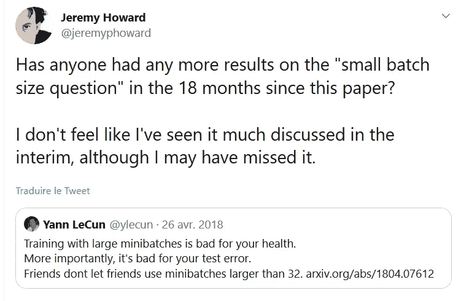

Batch size discussion on Twitter

自从我遇到 Fastai 的非常好的**学习率查找器**以来，这个主题一直在我脑海中的某个部分，我一直想知道是否有一个有用的**批量大小查找器**，人们可以使用它快速开始训练他们的模型具有良好的批量大小。

作为一个提醒，Fastai 中使用的学习率查找器通过测试不同的学习率来找到正确的学习率，以找到哪一个能最大程度地减少损失。更详细的解释可以在这里找到:[https://sgu gger . github . io/how-do-you-find-a-good-learning-rate . html](https://sgugger.github.io/how-do-you-find-a-good-learning-rate.html)

拥有一个批量查找器的想法在我脑海中已经存在了很长时间，在从 Jeremy 那里获得了动力之后，我已经决定开始实现用于训练神经网络的批量查找器的旅程。

今天我想分享实现一篇论文的旅程和目的地，因为它们在我看来都很有趣，也许会激励你去尝试更多的东西！

**一、大小故事**

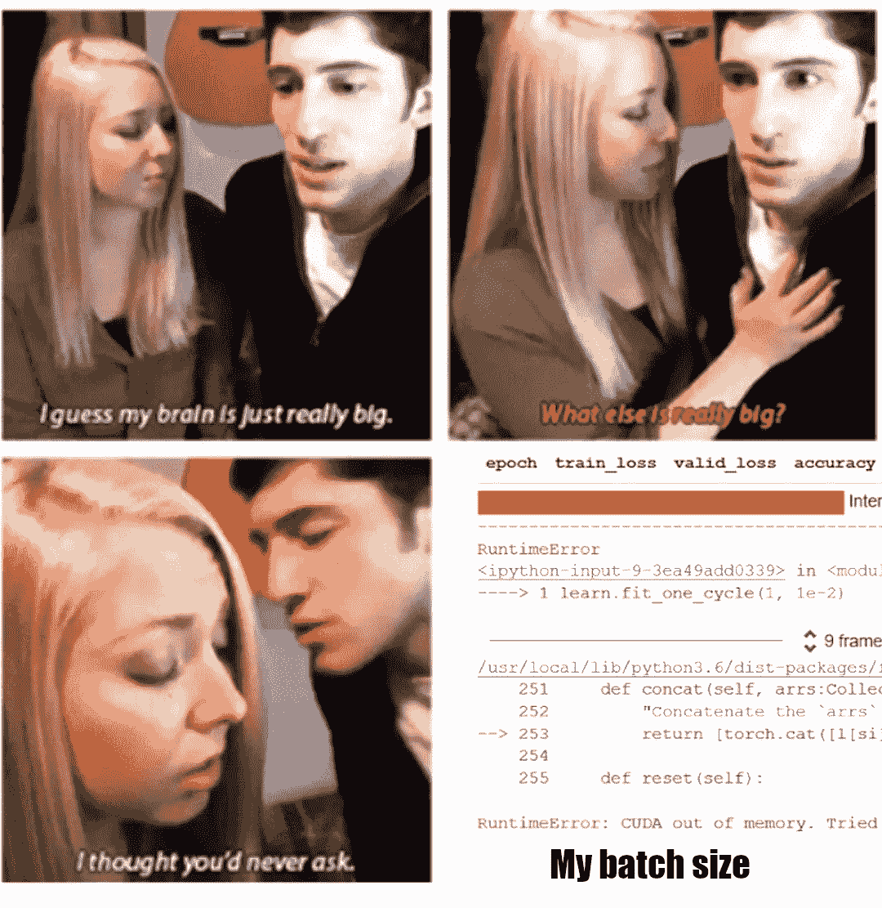

OC meme about batch size

一个普遍的看法是，您不应该使用大批量，因为这只会导致模型过拟合，并且您可能会耗尽内存。虽然后者显然是正确的，但前者比后者更复杂，为了回答这个问题，我们将稍微深入一点 OpenAI 论文[“大批量训练的经验模型”](https://arxiv.org/pdf/1812.06162.pdf)。

这篇我推荐阅读的文章解释了许多简单的想法，值得记忆。

首先，我们的目标是通过随机梯度下降法来最小化损失，并且有一个真正的基础景观，在此基础上我们将最小化损失。尽管如此，我们无法获得整个数据集的真实梯度(或者更准确地说，是整个分布的梯度)，**因此，我们必须用有限的批量来近似梯度。**

因为我们对一批进行平均，如果我们的批量很小，就会有很多噪声，我们可能只训练噪声模型。尽管如此，应用几个连续的更新将朝着正确的方向推进，但我们还不如直接使用更大的批处理大小，这在计算上更有效，并直接平均掉噪声。尽管如此，在达到一定规模后，**如果您的梯度已经很精确，那么再增加批量规模就没有意义了**，因为这只是一种计算上的浪费，精度上的收益很小。

此外，通过使用更大的批量(达到 GPU 允许的合理数量)，我们可以加快训练速度，因为这相当于迈出几大步，而不是迈出许多小步。因此，对于更大的批量，对于相同数量的历元，**我们有时可以获得 2 倍的计算时间！**

第二，有一个统计称为“**简单噪声标度**，它帮助我们确定什么是好的批量，它被定义为:

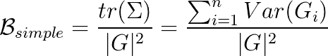

Simple Noise Scale equation

其中 ***G*** 是在 n 个参数上我们损失 ***L*** 的真实梯度。

在不深入研究这篇论文的详细内容的情况下，我们的想法是，如果我们使用小于简单噪声标度的批量大小，我们可以通过增加批量大小来加快训练速度，相反，如果我们使用大于简单噪声标度的过大批量大小，我们只会浪费计算能力。

为了更好地理解这一统计数据的含义，让我们来研究一下每个术语:

*   分子是梯度中每个变量的方差之和。这是对梯度中存在的**噪声**的测量。
*   分母是梯度的平方范数，我们称之为**标度**，给出了梯度接近于零的局部最小值的接近程度的度量。

因此，梯度越大，我们想要的批量就越大，这很自然，因为我们想要在正确的方向上采取梯度步骤。相反，如果梯度没有噪声，我们将从较小的步长中受益更多，因为我们不需要平均大量的观察值并分别使用它们。

另一方面，我们越接近最小值，批量越大，因为我们越接近局部最小值，我们希望采取更谨慎的步骤，因为我们不希望超过它而错过正确的方向。

最后，简单的噪声标度为我们提供了一个工具来回答“较大的批量会使我们过度适应，而较小的批量有助于调整”这个问题:

不一定！如果您的任务已经很复杂，并且近似梯度会有噪声，那么您可能会有兴趣使用更大的批量，以确保您的模型不会在太多的噪声上进行训练。**不是说较大的批量会使你过度拟合，而是较小的批量会通过噪声注入增加更多的正则化**，但是如果你连拟合都不合适，你还要增加正则化吗？

**二。实施文件**

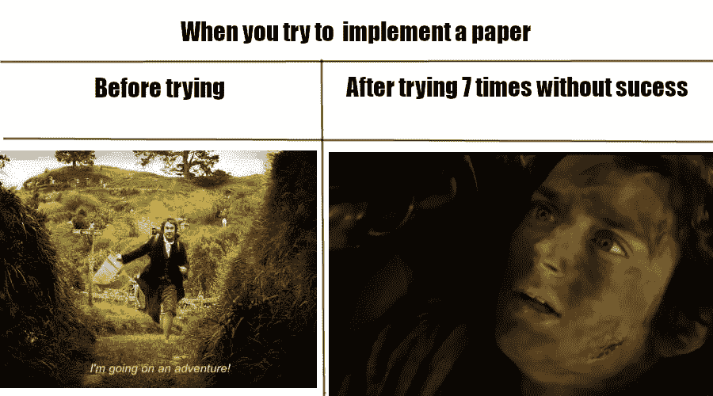

OC meme of my journey

现在，我们已经了解了为什么选择正确的批量大小很重要，以及我们如何通过简单的噪声比例统计找到合适的批量大小，现在是时候实施了！好吃！

记住，简单的噪声比例公式是:

Simple Noise Scale equation

问题是，我们不仅需要知道真实的梯度，还需要知道这个梯度的方差，这就更加困难了。为了解决这个问题，作者提出了两种不同的统计方法来逼近简单噪声标度的分子和分母。

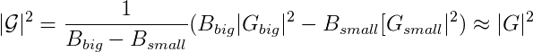

Estimator for the scale

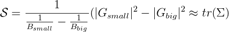

Estimator for the noise

这里，我们使用两个不同的批量大小， ***B 大和 B 小*** ，使用以下公式计算实际梯度的两个不同估计值:

Approximate gradient for a given batch size

一旦有了这两个近似值，我们就可以用下面的公式来计算简单的噪声比例:

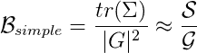

Approximation of the Simple Noise Scale

为了确保该估计量具有低方差，作者在整个训练过程中计算了几个简单的噪声尺度估计量，并对其进行了平均。

正如论文中所解释的，一种自然的方法是利用几个 GPU 来计算每个 GPU 的局部梯度，这将是小梯度，然后将其与不同 GPU 之间的平均梯度进行比较，这将是大梯度。尽管如此，这种方法假设我们有一个多 GPU，但对我们大多数人来说并不是这样。

因此，必须找到一种有效的方法来为单个 GPU 实现这一点，而这在原始论文中没有描述。这就是我开始的地方，现在我将与你分享我如何解决这个问题的理由！

文章其余部分使用的代码可以在这里找到:[https://colab . research . Google . com/drive/15 ltg _ r 03 yqswshz 0 jo 4xaowixlmxmemv](https://colab.research.google.com/drive/15lTG_r03yqSwShZ0JO4XaoWixLMXMEmv)

在第一行代码中，我设置了一个 Fastai 环境来在 MNIST 上运行一个模型，因为这个数据集已经在论文中进行了测试，他们得到了平均 900 的简单噪声标度。

我不会详细解释代码，因为我要花一整篇文章来解释 Fastai 如何将所有东西与他们的 API 放在一起，但是代码应该是一个好的开始。如果你想进一步了解代码，请在评论中告诉我，我可以解释它，甚至可以写一篇关于编码部分的文章。

**A .使用指数移动平均线的第一种方法**

由于我没有多 GPU 设置，所以我发现论文中提出的统计数据并没有真正的帮助，我想我可以跳过它，通过进行近似，直接计算方差的总和:

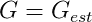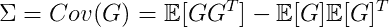

首先，我用给定批次的估计梯度来近似真实梯度。

然后，由于协方差矩阵的计算可以被视为两个平均值，我试图用指数移动平均值来近似它，因为我不想在训练中存储许多梯度。

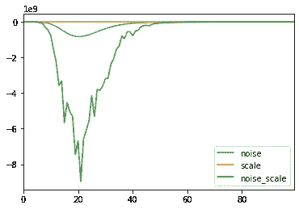

Running average of noise, scale, and Simple Noise Scale over batches computed

正如您在这里看到的，结果很奇怪，简单噪声标度太不稳定，噪声比噪声大得多，这给出了一个非常负的简单噪声标度，没有意义。

**B .存储梯度**

我们看到，使用指数移动平均并不是逼近协方差矩阵的好主意。

解决这个问题的另一种方法是简单地预先设置若干个***【N】***梯度来保持，然后我们将简单地计算 ***N*** 不同的梯度，并使用那些 ***N*** 梯度来近似协方差矩阵。

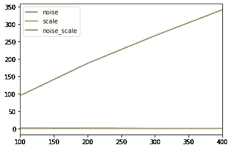

它开始显示结果，但是它的计算方式很复杂:x 轴是我存储的批次数量，以这种方式计算简单的噪声范围。虽然它似乎提供了某种结果，但实际上并不可用，因为我已经存储了数百个渐变！

**C .进行两次培训**

又一次失败后，我决定按照论文的思路，计算他们的两个统计量。尽管如此，当我只有一个 GPU 时，我需要有一种方法在训练期间获得两个不同大小的批次。

然后我想，当我可以用两种不同的批量大小运行两个训练时期，然后再计算它时，为什么要运行一个训练时期呢？

于是我带着这个想法去做了，用 **B 大** = ***2 * B 小*** ，这将允许我计算它们各自的梯度，并使用它们来计算 ***G*** 和 ***S*** 如文中所述以指数移动平均的方式。

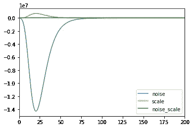

哎哟！与第一种方法一样，它产生了奇怪的结果！此外，当我想到这一点时，我得到的批次可能在两次运行之间并不相同，因为没有什么会强制将小批次包含在大批次中。此外，我需要运行两个训练时期来计算这一点，所以它不是很好。

**D .连续批次**

最后，我意识到最好的方法似乎是第二种，但有些东西必须修改，因为我不想保留大量的梯度来计算统计数据。

然后，一个非常简单但有效的想法出现在脑海中:如果我不是像论文中那样以平行的方式对几个批次进行平均，而是以连续的方式对连续的批次进行平均，会怎么样？

这仅仅意味着我只需要设置一个参数，我调用***【n _ batch】***这是在计算大梯度和小梯度之前我必须存储的批次号，然后我将能够以连续的方式计算论文的统计数据！

以这种方式实现后，我得到了以下结果:

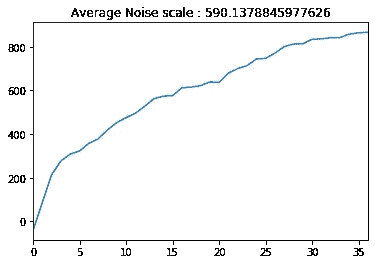

她真是个美人！在论文中，他们描述了增长趋势是可以预期的，因为噪声更可能保持不变，而梯度的规模将随着我们越来越接近最小值而减小，这将导致简单噪声规模的增长。

因为我们很可能没有相同的设置，我也没有访问他们的代码，所以我们的结果略有不同，但在论文中，作者提到了一个简单的噪声标度，从大约 50 开始，到 900，这才是重要的。考虑到理论和实践中的许多近似值，结果可能会有所不同，但正如论文中所解释的那样，差异不应超过一个数量级。

因此，在这个漫长的旅程之后，似乎有一个实现正在工作，尽管本文对此没有提供什么帮助，最好的部分是，要在实践中使用它，您只需要一行代码！

这里的参数对应于:

*   学习:快速学习者。
*   lr:完成一个训练循环的学习率，可以使用 lr_find()找到
*   num_it:您想要处理的批次数量，可以设置为 ***【无】*** ，它会在一个时期内自动训练。
*   n_batch:在计算简单噪声标度之前要存储的批次数量。20 似乎可以很好地完成不同的任务。
*   beta:指数移动平均的 beta 参数，用于计算方差和以及渐变的比例。如果绘图太不规则，如果需要，尝试增加到 0.999 或更大，或者增加 n_batch 参数。

**三世。在不同任务上测试批量查找器**

Time to take big steps !

现在我们有了一个工作的实现，看看它在实践中如何帮助找到一个好的批量大小会很有意思。

首先，我们将研究罗斯曼数据集。这个数据集已经在 Fastai courses v3 中进行了探索，您可以在这里找到:[https://github . com/Fastai/course-v3/blob/master/nbs/dl1/lesson 6-rossmann . ipynb](https://github.com/fastai/course-v3/blob/master/nbs/dl1/lesson6-rossmann.ipynb)

在这里，我将简单地运行我的批量大小查找器，并进行与原来完全相同的训练，但是批量大小考虑了简单的噪声标度。

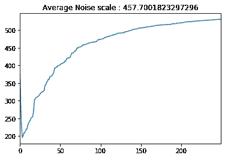

现在如何解读这一点？这意味着，对于给定的学习速率，训练似乎收敛到大约 500 的简单噪声标度，即噪声和标度在训练的后期稳定。因此，计算时间和效率之间的最佳权衡似乎是批处理大小为 512。

在使用批量大小 512 和 64 运行相同的训练后，我们可以观察到一些情况。

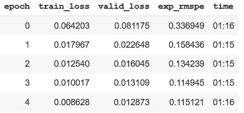

First one-cycle training with batch size 512

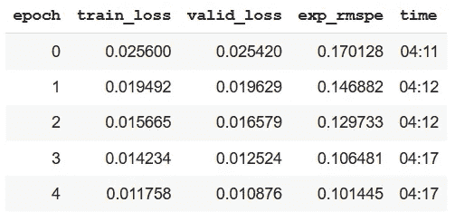

First one-cycle training with batch size 64

批量大小为 512 时，**培训速度比批量大小为 64 时快近 4 倍**！此外，即使批量大小 512 采取更少的步骤，最终它具有更好的训练损失和稍差的验证损失。

然后，如果我们查看每个批量的第二个训练周期损失:

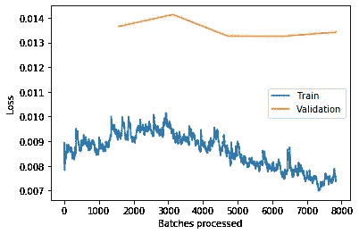

Second one-cycle training losses with batch size 512

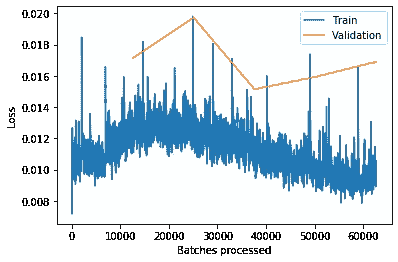

Second one-cycle training losses with batch size 64

我们可以看到，与批量大小为 512 的情况相比，批量大小为 64 的情况下，训练更加不稳定，因为验证损失继续减少。

最后，我们可以观察到最后一个培训周期的以下结果:

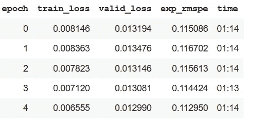

Last one-cycle training losses with batch size 512

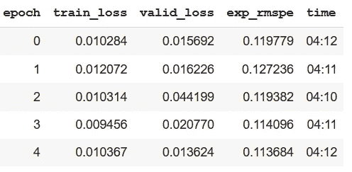

Last one-cycle training losses with batch size 64

所以最后，如果我们总结 Rossmann 的结果，使用 512 而不是 64 的批量

*   减少 4 的训练时间
*   提供了更好的训练和验证损失，以及感兴趣的度量，这里是 exp_rmse

我研究过文本和图像数据，但考虑到它们要重得多，尤其是具有巨大身体的预训练模型，当我尝试以批量大小运行训练时，我遇到了 CUDA 内存不足，所以我不会在这里显示结果，但你可以在 Colab 笔记本上看看。

**结论**

贯穿这篇文章我们看到了很多东西！我希望你喜欢这次旅行，如果有什么事情你必须记住的话，那就是:

*   没有神奇的批量大小数字，例如 32，它取决于您的数据的复杂性，以及您的 GPU 约束。我们看到，小批量可以通过噪声注入帮助调整，但如果你想学习的任务很难，这可能是有害的。而且，跑很多小步会花更多的时间。相反，大批量确实可以加快你的训练，甚至有更好的泛化性能。
*   一个很好的方法是使用[“大批量培训的经验模型”](https://arxiv.org/pdf/1812.06162.pdf)中介绍的简单噪音等级度量。我在这里提供了第一个快速的实现:【https://github.com/DanyWind/fastai_bs_finder】。您可以在自己的数据集上尝试它，特别是在推荐系统或表格模型上，在那里您不太可能遇到 CUDA 内存不足的问题。
*   不要犹豫去尝试一些事情，一个小小的推动有时可以推动你做好事！我大概在 6 个月前看到了这篇论文，但我并没有真正注意到它，直到我真正尝试(并且失败了很多次)去实现它。但是现在，我不仅可以与大型社区分享这些结果，它还帮助我更好地理解批量大小是如何工作的，以及它的常见概念可能是错误的。所以不要犹豫，现在就实施酷的东西，即使它不直接工作也没关系，旅程比目的地更有价值！

所以，我希望你喜欢读这篇文章，如果能得到你的反馈，那就太好了，我会在未来试着发布更多的文章。

如果您有任何问题，请不要犹豫，通过 [Linkedin](https://www.linkedin.com/in/dhuynh95/) 联系我，您也可以通过 [Twitter 找到我！](https://twitter.com/dhuynh95)