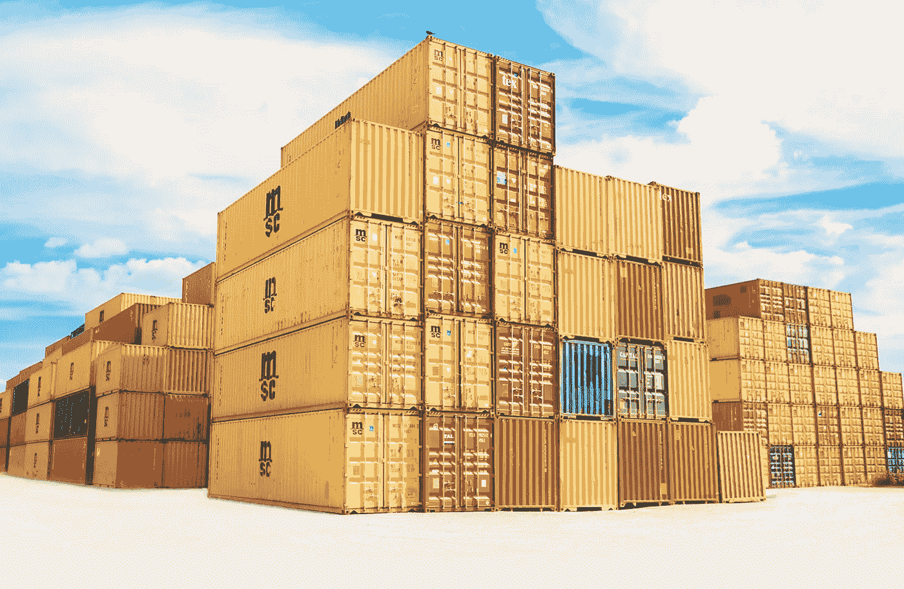
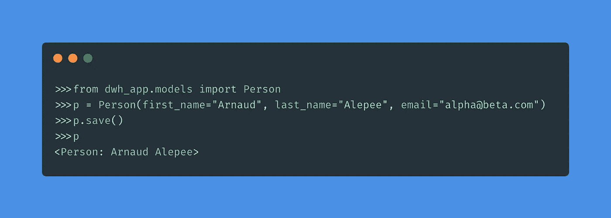
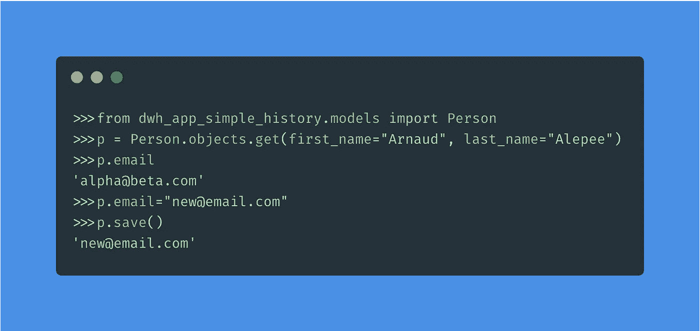
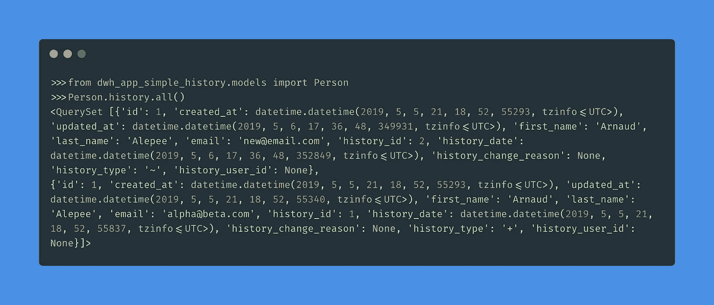
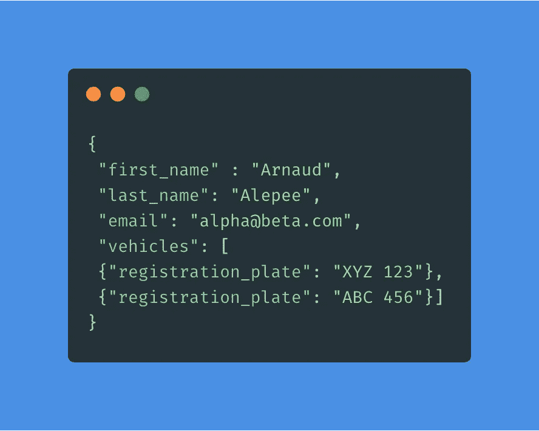
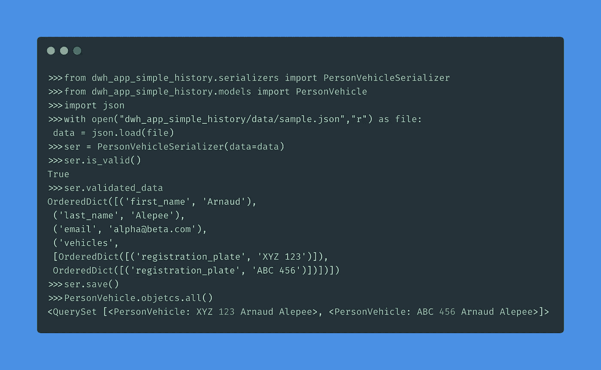
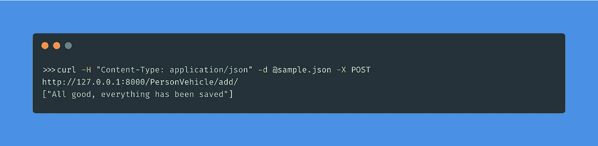

# 用 Django 实现数据仓库

> 原文：<https://towardsdatascience.com/implementing-a-data-warehouse-with-django-e4856c92f146?source=collection_archive---------2----------------------->



在本文中，我们将介绍如何利用 Django 及其 rest 框架来实现数据仓库。我们将特别关注来自外部 API 的数据源，但是同样的原则也适用于任何其他类型的数据源:平面文件或直接 ODBC 连接。

使用 Django 实现数据仓库的一个主要好处是，您将能够使用 Python 处理任何组件或任务:ETL、查询、数据操作、报告、web 应用程序应用程序…

请注意，Django 可能不适合您的用例，但是同样的原则也适用。

本文使用的所有代码都可以在 [GitHub](https://github.com/aalepere/djangowarehouse) 上找到。

## 什么是数据仓库？

数据仓库的实现通常是为了整合整个公司的不同数据源。在我们的案例中，我们使用不同的外部和内部 API 来整合所有这些信息，以便进行分析、报告和预测建模。

主要挑战是将不同来源的数据提取、转换和加载为一种通用格式，并能够跟踪数据随时间的变化。

我们将在下面的章节中详细介绍这些挑战。

## Django 和 rest 框架

Django 是开源的 web 框架模板；并遵循模型、视图、模板(MVT)设计模式。

在本文中，我们将主要关注 Django 架构的模型组件。为了能够与数据库交互，Django 使用了对象关系映射器；这意味着它们将被表示为 Python 类，而不是使用 SQL 表。这意味着我们可以使用 Python 执行任何 CRUD 操作，而无需直接与 SQL 或数据库本身进行交互。
这将是我们数据仓库实现的关键，因为我们将利用这个 ORM 来执行插入和更新。

Rest-Framework 是 Django 生态系统的一部分，是创建 web APIs 的有用工具包。
我们将使用的框架组件称为序列化器；它允许将复杂的数据结构序列化为一个呈现的 JSON(典型的 GET 请求)，还允许在首先验证传入的数据(也称为反序列化)之后解析要转换回复杂类型的数据。
这在我们的情况下将非常有用，因为我们可以利用反序列化来确保信息以正确的格式出现，并且我们可以将每个元素映射到数据仓库中的正确字段。
-[https://www.djangoproject.com/](https://www.djangoproject.com/)
-[https://www.django-rest-framework.org/](https://www.django-rest-framework.org/)

## 基本模型

一旦我们创建了 Django 项目和应用程序([https://docs.djangoproject.com/en/2.1/intro/tutorial01/](https://docs.djangoproject.com/en/2.1/intro/tutorial01/))；我们现在可以创建我们的模型了。

*Models.py* 将包含所有允许 Django ORM 与数据库交互的逻辑； *models.py* 中的每个类都是数据库中的一个物理表。

在这个例子中，我们将创建 3 个表:
-*Person*；通过名字和姓氏
- *车辆*唯一识别的自然人的实例；通过其注册号
- *人员车辆*唯一识别的车辆；一个人拥有车辆的例子

```
from **django.db** import **models**class **Person**(models.Model):
 *“”” Person class identifies a unique physical person by its first name, last name and email “””*created_at = models.DateTimeField(auto_now_add=True)
 updated_at = models.DateTimeField(auto_now=True)
 first_name = models.CharField(max_length=100)
 last_name = models.CharField(max_length=100)
 email = models.CharField(max_length=100)def __str__(self):
 return “{} {}”.format(self.first_name, self.last_name)class **Vehicle**(models.Model):
 *“”” Vehicle class uniquely with the registration plate number “””*created_at = models.DateTimeField(auto_now_add=True)
 updated_at = models.DateTimeField(auto_now=True)
 registration_plate = models.CharField(max_length=100)def __str__(self):
 return self.registration_plateclass **PersonVehicle**(models.Model):
 *“”” PersonVehicle register the relationship between a vehicle in a person,
 in other words, the owner of the vehicle at a given point in time “””*created_at = models.DateTimeField(auto_now_add=True)
 updated_at = models.DateTimeField(auto_now=True)
 vehicle = models.ForeignKey(Vehicle, on_delete=models.PROTECT)
 person = models.ForeignKey(Person, on_delete=models.PROTECT)def __str__(self):
 return “{} {}”.format(self.vehicle, self.person)
```

*created_at* 、 *updated_at* 是两个自动生成的字段，将记录创建或更新记录的日期时间。

*保护*将禁止删除任何与其他表有关系的记录。如果您希望删除与该记录相关的所有记录，也可以使用*级联*。

现在我们已经创建了我们的模型，我们可以通过 Django shell ( *)插入信息。/manage.py shell* ):



## 跟踪更改

为了能够跟踪随时间的变化，我们将使用*简单历史*；它允许在每次创建/更新/删除时存储 Django 模型状态:[https://django-simple-history.readthedocs.io/en/2.7.0/](https://django-simple-history.readthedocs.io/en/2.7.0/)

```
from django.db import models
from **simple_history.models** import **HistoricalRecords**class Person(models.Model):
 *“”” Person class identifies a unique physical person by its first name, last name and email “””*created_at = models.DateTimeField(auto_now_add=True)
 updated_at = models.DateTimeField(auto_now=True)
 first_name = models.CharField(max_length=100)
 last_name = models.CharField(max_length=100)
 email = models.CharField(max_length=100)
 **history = HistoricalRecords()**class Meta:
 **unique_together = ((“first_name”, “last_name”),)**def __str__(self):
 return “{} {}”.format(self.first_name, self.last_name)class Vehicle(models.Model):
 *“”” Vehicle class uniquely with the registration plate number “””*created_at = models.DateTimeField(auto_now_add=True)
 updated_at = models.DateTimeField(auto_now=True)
 registration_plate = models.CharField(max_length=100)def __str__(self):
 return self.registration_plateclass PersonVehicle(models.Model):
 *“”” PersonVehicle register the relationship between a vehicle in a person,
 in other words, the owner of the vehicle at a given point in time “””*created_at = models.DateTimeField(auto_now_add=True)
 updated_at = models.DateTimeField(auto_now=True)
 vehicle = models.ForeignKey(Vehicle, on_delete=models.PROTECT)
 person = models.ForeignKey(Person, on_delete=models.PROTECT)
 **history = HistoricalRecords()**class Meta:
 **unique_together = ((“vehicle”),)**def __str__(self):
 return “{} {}”.format(self.vehicle, self.person)
```
```

请注意，我们在每个模型中添加了字段 *history* ，以便跟踪随时间的变化。这些更改将存储在前缀为*历史*的镜像表中。

为了能够跟踪变更，我们还需要定义*代理键，*这些键是记录唯一性的业务定义。例如，在 *Person* 表中，我们将 *first_name* 和 *last_name* 定义为 *unique_together* ，这意味着这些字段将不可更新，但是 *email* 是可更新的。

现在让我们尝试修改我们之前记录的记录:



现在让我们看一下历史表，看看这些变化是如何记录的:



## 序列化程序

如前所述，在将输入数据插入相关的 SQL 表之前，将使用序列化程序来解析和验证输入数据。

现在让我们假设一个外部源通过 REST API 以下面的 JSON 格式向我们提供信息:



JSON 提供了此人的身份和当前属于此人的车辆列表，以下是将用于解析此 JSON 的序列化程序:

```
from **rest_framework** import **serializers**from dwh_app_simple_history.models import Person, PersonVehicle, Vehicleclass **VehicleSerializer**(serializers.Serializer):
 *“””
 Nested serializer within the JSON source; in this example all vehicles that belong to the
 person nested in the JON as a list of all active vehicles.
 “””*registration_plate = serializers.CharField(max_length=100)class **PersonVehicleSerializer**(serializers.Serializer):
 *“””
 Serializer that will be used to deserialize the json to be then imported in the datawarehouse
 “””*first_name = serializers.CharField(max_length=100)
 last_name = serializers.CharField(max_length=100)
 email = serializers.CharField(max_length=100)
 vehicles = VehicleSerializer(many=True)def **save**(self):
 *“””
 Overwrite the save function on the serializer to be able to control how we want to
 insert/update the data provided by the source in our datawarehouse.
 “””*# First update or create the person
 person_obj, created = **Person.objects.update_or_create**(
 first_name=self.validated_data[“first_name”],
 last_name=self.validated_data[“last_name”],
 defaults={“email”: self.validated_data[“email”]},
 )# Then create each Vehicle and link it to the person created before
 for vehicle in self.validated_data[“vehicles”]:
 vehicle_obj, created =  **Vehicle.objects.get_or_create**(registration_plate=vehicle[“registration_plate”])

personvehicle_obj, created = **PersonVehicle.objects.update_or_create**(
 vehicle=vehicle_obj, defaults={“person”: person_obj}
 )
```

首先，我们创建了一个嵌套的序列化器 *VehicleSerializer* 来解析一辆车的实例，然后在父序列化器 *PersonVehicleSerializer* 中，我们可以使用参数 *many=True* 来告诉 Django 它们可以是多辆车。

为了正确保存所有信息，我们重写了 *save()* 方法，首先我们创建或更新 *Person* ，然后为嵌套字典中的每辆车创建一个 *Vehicle* ，然后将它链接到 *PersonVehicle* 中的 *Person* 。



请注意，如果需要，可以通过添加验证或转换规则来丰富序列化程序，就像在传统的 ETL 实现中一样。

## 视图

在前面的例子中，我们使用 JSON 文件和 Django shell 将数据插入到我们的数据仓库中。

现在让我们假设信息不是由外部提供者提供的，而是公司架构的源系统向数据仓库发送信息。这可以通过添加一个允许通过一个 *POST* API 请求插入数据的*视图*来实现。

```
from django.shortcuts import render
from **rest_framework.decorators** import **api_view**
from **rest_framework.response** import **Response**from dwh_app_simple_history.serializers import **PersonVehicleSerializer**[@api_view](http://twitter.com/api_view)([“**POST**”])
def PersonVehicle(request):
 *“””
 This view will be called through a POST request to add or update the information provided in
 the request
 “””*# Deserialize the information provided in the request
 ser = PersonVehicleSerializer(data=request.data)# Validate the information provided
 ser.is_valid(raise_exception=True)# Save the information in the datawarehouse
 ser.save()return Response({“All good, everything has been saved”})
```

正如你所看到的，我们使用了与 Django shell 中相同的序列，但是使用了 *api_view* decorator 将这个端点暴露给另一个系统或用户。这意味着我们现在可以从任何系统与我们的数据仓库通信(您需要确保您的 Django 服务器正在运行)。



## 结论

在本文中，我们已经介绍了使用 Django 构建数据仓库的所有步骤和组件:
——使用 Django ORM 创建第三范式数据模型；
-使用简单的历史记录来跟踪随时间的变化；
-使用 serializer rest 框架对来自外部提供者或内部系统的信息进行反序列化，并将结果保存在数据仓库中；和
——使用来自 rest 框架的视图，允许源系统通过 POST 请求发送信息。

以上所有内容应该为构建您的数据仓库提供了足够的信息，当然，您必须浏览所有不同的来源，了解数据将如何在下游以最有效的方式建模数据，并在您的 ETL 中添加所有转换/验证规则。