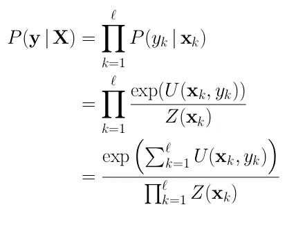
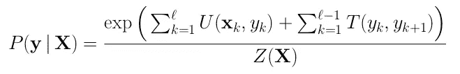
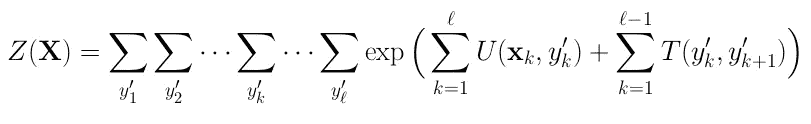
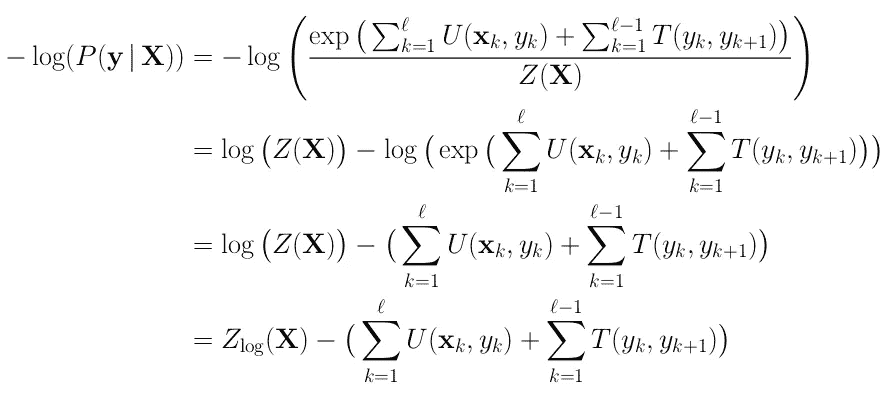
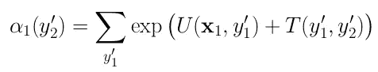
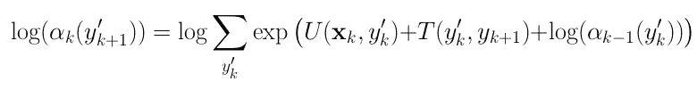
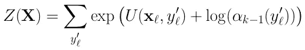
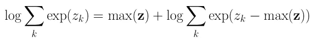
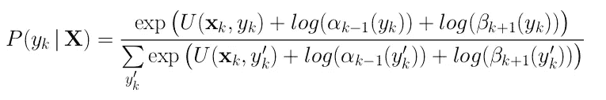
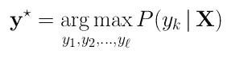

# 在 PyTorch 中实现线性链条件随机场

> 原文：<https://towardsdatascience.com/implementing-a-linear-chain-conditional-random-field-crf-in-pytorch-16b0b9c4b4ea?source=collection_archive---------4----------------------->


Random fields 😝. Photo by [Matthew Miles](https://unsplash.com/@matthewmiles?utm_source=medium&utm_medium=referral) on [Unsplash](https://unsplash.com?utm_source=medium&utm_medium=referral)

嗨伙计们！这是我在 Medium 上的第一篇帖子。我希望你喜欢它！

在过去的日子里，我使用 PyTorch 从头开始实现了一个 CRF 模型。我这样做的想法是为了更好地理解 CRF 模型是如何工作的。我在网上找到了很多关于 CRFs 的内容，包括博客帖子、教程和书籍。我还看了 Hugo Larochelle 的关于 CRF 模型的系列视频讲座，发现它们非常直观。

看完之后，我决定用 PyTorch 从头开始实现这些数学方程(不用担心梯度！).所以，这就是这篇帖子的目的！与您分享一个关于如何实施(*线性链* ) CRF 模型的简单易懂的指南！

*免责声明:CRF 是任何无向图结构的概括，例如序列、树或图。在这篇文章中，我将重点关注顺序结构，这意味着我们的模型将只以先前的转换为条件。这种参数化被称为线性链 CRF。在这篇文章的其余部分，我将使用缩写 CRF 来命名一般的 CRF 和它的线性链对应物*互换*。*

在这篇文章中，我不会描述使用 CRFs 的原因和它的应用。我想如果你正在读这篇文章，是因为你已经知道了所有这些，而且你只对技术部分感兴趣。也就是说，我将介绍它背后的一些基本理论，并介绍用于编写代码的符号。

总之，在这篇文章中，你会看到:

1.  通用报告格式背后的基本理论；
2.  给定一系列观察值，如何找到最可能的标签序列；
3.  如何在给定标签的情况下计算一系列观察值的分数；
4.  如何计算配分函数来归一化这个分数；
5.  如何在对数空间中实现它们(数值稳定)。

**在下一篇文章中:**如何向量化 *for 循环*以使并行计算机单元的计算更容易(比如说 GPU🙌).在这里先睹为快矢量化代码。

# 幕后的基本理论

最初的条件随机场论文发表于本世纪初[【1】](https://repository.upenn.edu/cgi/viewcontent.cgi?referer=https://en.wikipedia.org/&httpsredir=1&article=1162&context=cis_papers)。从那以后，机器学习社区一直在到处应用 CRF，从计算生物学和计算机视觉到自然语言处理。在 google scholar 上用“使用 CRF”和“使用条件随机场”这样的关键词快速搜索，会得到大约 20000 个答案。

在过去的几年中，CRFs 模型与 LSTMs 相结合以获得最先进的结果。在 NLP 社区中，在 BiLSTM 上堆叠 CRF 层被认为是在序列标记问题上实现更高准确性的经验法则。你可以看到一些例子[在这里](https://github.com/sebastianruder/NLP-progress/blob/master/english/part-of-speech_tagging.md)和[在这里](https://github.com/sebastianruder/NLP-progress/blob/master/english/semantic_role_labeling.md)。

在序列分类问题中，我们的主要目标是在给定一个序列向量( **X** )作为输入的情况下，找到一个标签序列( ***y*** )的概率。这表示为条件概率*P*(**y***|**X**)。*

*首先，让我们定义一些改编自 Larochelle 的类的符号:*

*   *训练集:输入和目标序列对 *{(* **X** *i，* **y** *i)}**
*   *向量的第 *i-* 个输入序列:**x***I =[***x***1、…、***x**ℓ*
*   **标签的第 *i-* 个目标序列:**y**t46】I =【y1，…，y ℓ】**
*   **ℓ是序列长度。**

**假设时间独立，对于一个样本( ***X*** *，* ***y*** )，在一个常规的分类问题中，我们通过乘以每个项目在 *k-t* 处的概率来计算*P*(**y***|***X******

****

**请注意，我们正在使用标准化的指数对*P(yk |***x***k)*进行建模。这类似于神经网络中广泛使用的 *softmax* 变换。这是使用 *exp* 函数 *:* 的一些直觉**

1.  ****下溢:**当我们将非常小的数相乘时，我们得到的是一个更小的数，它可能会发生*下溢*。**
2.  ****非负输出:**所有值都映射在 0 和+inf 之间。**
3.  ****单调递增:**将高值向上推，低值向下推。这与 *argmax* 操作有相似的效果。更多[此处](https://datascience.stackexchange.com/questions/23159/in-softmax-classifier-why-use-exp-function-to-do-normalization)。**

**我们从帽子里拿出两个符号: *U 和 z。*让我们看看它们是什么。**

***U* ( *x，y* ) 被称为我们的**排放量**或**一元分数** *。*这只是给定我们在第 *k* 时间步的 **x** 向量的标签 *y* 的分数。你可以把它看作是 BiLSTM 的第 k 个输出。其实理论上我们的 **x** 向量可以是你想要的任何东西。实际上，我们的 **x** 向量通常是周围元素的串联，就像滑动窗口中的单词嵌入。在我们的模型中，每个*一元*因子由一个可学习的权重加权。如果我们把它们看作 LSTM 输出，这就很容易理解了。**

***Z*(*x*)*俗称**分区函数**。我们可以把它看作一个归一化因子，因为我们想得到最终的概率。这类似于 *softmax* 函数的分母。***

**到目前为止，我们描述了一个带有“最终 softmax 激活”的常规分类模型，以便获得概率。现在我们将添加新的可学习权重来模拟标签 *yk* 被 *yk+1 跟随的几率。*通过建模，我们在连续的标签之间创建了一个依赖关系。因此，名为*直链 CRF！*为了做到这一点，我们将之前的概率乘以 *P(yk+1 | yk)，*我们可以使用指数属性将其重写为一元分数*U*(***x****，y* )加上可学习的**转换分数** *T* ( *y，y* )**

****

**在代码中， *T* ( *y，y* ) 可以看作一个具有形状 *(nb_labels* ，*nb _ labels)*的矩阵，其中每个条目都是一个可学习的参数，表示从第*个*标签到第*个*标签的过渡。让我们回顾一下我们所有的新变量:**

*   ****排放或一元分数** *(U):* 分数代表在给定输入的情况下*yk*x*k .***
*   ****过渡分数** *(T):* 代表可能性的分数 *yk* 后跟 *yk+1***
*   *****分区函数****【Z】:*归一化因子为了得到序列上的概率分布。**

**唯一需要正确定义的是配分函数 *Z:***

****

**结果是计算 *Z* (X)并不简单，因为我们有太多的嵌套循环😖。它是在每个时间步*标签集上所有可能组合的总和。*更准确地说，我们在标签集上进行ℓ计算。这给了我们一个时间复杂度 *O(|y|^* ℓ *)。***

**幸运的是，我们可以利用循环依赖，并使用动态编程来有效地计算它！完成这项工作的算法被称为**正向算法**或**反向算法—** ，这取决于你在序列上迭代的顺序。不要与神经网络中使用的前向和反向传播混淆。**

**这就是我们开始实施之旅所需了解的全部内容！如果你在我的解释中迷失了，有很好的资源可以更详细地解释 CRF。比如埃德温·陈的这篇精彩的教程，或者萨顿和麦卡勒姆的这篇内容丰富的教程，或者迈克尔·柯林斯的这篇直截了当的笔记。**

# **密码**

**让我们通过创建一个从 PyTorch 的 *nn 继承而来的名为 CRF 的类来开始我们的代码。模块*以便自动跟踪我们的坡度。此外，我为句子的开头/结尾添加了特殊的标记，并添加了一个特殊的标志来通知我们是否正在传递批量优先维度的张量。**

**我们还可以为 pad id 添加一个特殊的令牌。如果我们这样做，我们必须确保强制约束以防止从填充的过渡*和从*填充到*填充的过渡——除非我们已经处于填充位置。我们可以看到，我们的转换分数 *T* 被表示为矩阵 *self.transitions* ，并使用 *torch.parameter.* 进行编码。这样，PyTorch 将通过 autodiff 学习这些权重！太好了！***

# *定义损失函数*

*在监督分类问题中，我们的目标是在训练期间最小化期望误差。我们可以通过定义一个损失函数 *L* 来做到这一点，该函数将我们的预测和我们的真实标签作为输入，如果它们相等，则返回零分，如果它们不同，则返回正分——指示错误。*

*注意，我们正在计算*P*(**y***|**|*X***)，这是我们想要最大化的东西。为了将这作为一个最小化问题，我们取这个概率的负对数。这也被称为*负对数似然损失(NLL-Loss)。*在我们的例子中，我们得到:*L =*-*log*(*P*(**y***|***X***)。应用 log-properties，如*log(a*/*b)= log(a)-log(b)*，我们得到:***

****

**其中 *Z_log* 表示我们在计算配分函数时取 *log* 。当我们应用向前算法时，这将使事情变得更容易。因此，让我们检查一下这部分的代码:**

**我们的*正向*传递仅仅是 *NLL 损失*(不要与计算 Z(X)的正向算法混淆)，其中我们在常规的 *log_likelihood* 方法前面插入了减号。 *log_likelihood* 通过首先计算分数和对数分割方法，然后彼此相减来计算。此外，我们向这些方法传递一个掩码矩阵，以便它们可以忽略与填充符号相关的计算。为了完整起见，掩码矩阵如下所示:**

```
**input = [['lorem', 'ipsum 'dolor', 'sit', 'amet'],
         ['another', 'sentence', 'here', '<pad>', '<pad>']]mask = [[1, 1, 1, 1, 1],
        [1, 1, 1, 0, 0]]**
```

# **计算分子:分数**

**由于我们将 *log* 应用于 *exp* 函数，分子就是我们在每个时间步长的发射和跃迁分数的总和。在代码中:**

**为了理解这段代码，您必须认为批处理中的每个句子的所有操作都是相同的。因此，我们首先通过调用`tags[:, 0]`来获取每批中第一个单词的标签。类似地，我们对时间步长维度上的掩码求和，以获得一个长度列表，对于上一个示例来说是`[5, 3]`。在实践中，它返回了一个*火炬。长型*带外形`(batch_size,)`。例如，让我们看看第 28 行:**

```
**emissions[:, 0].gather(1, first_tags.unsqueeze(1)).squeeze(1)**
```

1.  **首先，我们从第一个时间步长`emissions[:, 0]`中选择所有批次，它返回一个形状为`(batch_size, nb_labels)`的张量。**
2.  **然后，我们希望只从形状为`(batch_size,)`的*long tenser*`first_tags`中的列( *dim=1* )中选择值。由于`emissions`是一个 2D 矩阵，我们*取消`first_tags`的最后一个维度*得到形状`(batch_size, 1)` : `first_tags.unsqueeze(1)`**
3.  **现在它们有了相同的形状，我们可以使用*聚集*函数在`emissions` : `emissions[:, 0].gather(1, first_tags.unsqueeze(1))`的指定维度中选择`first_tags`内的值**
4.  **最后，这将产生一个形状为`(batch_size, 1)`的矩阵，所以我们*将*压缩回去，得到一个 1D *长传感器。***

**整个代码都使用这个简单的过程来选择指定维度内的一组标签。**

**关于这段代码，我想说的最后一件事是我们如何忽略与填充符号相关的分数。解决这一问题的思路非常简单:我们在两个向量(分数和掩码向量)之间执行逐元素乘法，以在与填充位置相关联的时间步长中将分数清零。**

# **计算配分函数:正向算法**

**既然我们已经计算了分数，让我们把注意力集中在分母上。为了有效地计算配分函数，我们使用了向前算法。我将简要描述它，并展示我们如何在对数空间中计算它。**

**正向算法的伪代码如下:**

**1)初始化*y’2:*的所有值**

****

**2)对于 *k=2 到* ℓ-1，对于*y’k+1*(对数空间) *:* 的所有值**

****

**3)最后:**

****

**请注意，在第二步中，我们记录了 exp 的总和。这可能会有问题:如果一个给定标签的分数太大，那么指数将很快增长到一个非常大的数字。因此，在我们最终获取日志之前，我们可能会发现一个*溢出*。幸运的是，有一个技巧可以使这个操作稳定:**

****

**左边等于右边的证明看起来是这样的:**

```
**_ = log sum(exp(zk))
  = log sum(exp(zk-c) * exp(c))
  = log exp(c) + log sum(exp(zk-c))
  = c + log sum(exp(zk-c))**
```

**设置 *c* 为 *max* ( *z* )我们就完成了。此外，PyTorch 已经在`torch.logsumexp`中为我们提供了这个稳定的实现。现在让我们使用 PyTorch 对上面的算法进行编码:**

**上面的代码与我们在分子中计算分数的方式非常相似。其实我们是在计算分数！但是现在我们通过查看以前的迭代来积累它们。我添加了关于形状的注释，这样你就能明白发生了什么。**

**这里只有一件事我们以前没有看到(*种*):**

*   **在这一行中，如果我们没有到达填充位置，我们就用新的值来改变 alpha 的当前值，否则就保持相同的值。要了解这是如何工作的，请看这个例子，当我们在时间步长 *i=1* 时:**

```
**>>> mask
tensor([[1., 0., 0.],
        [1., 1., 0.],
        [1., 1., 1.]])

>>> alphas
tensor([[-0.7389, -0.6433, -0.0571, -0.3587, -2.1117],
        [ 1.0372,  1.8366, -0.9350, -1.2656, -0.5815],
        [ 0.1011,  0.7373,  0.0929, -0.8695,  0.7016]])>>> new_alphas
tensor([[11.1889, 10.6471, 11.0028, 11.0248, 11.0909],
        [10.3975, 11.0104,  8.5674, 10.2359, 13.9150],
        [10.1440,  9.9298, 11.3141, 10.1534, 10.3397]])>>> is_valid = mask[:, 1].unsqueeze(-1)
>>> is_valid
tensor([[0.],
        [1.],
        [1.]])>>> is_valid * new_alphas + (1 — is_valid) * alphas
tensor([[-0.7389, -0.6433, -0.0571, -0.3587, -2.1117],
        [10.3975, 11.0104,  8.5674, 10.2359, 13.9150],
        [10.1440,  9.9298, 11.3141, 10.1534, 10.3397]])**
```

**我们已经更新了第二和第三序列，但没有更新第一序列，因为在时间步 *i=1* 我们到达了填充位置。**

**作为一个很好的观察，你可以看到一旦我们取了 *logsumexp* 我们就已经在日志空间中了！所以，我们可以把α的值加到我们的分数上。最后，我们在最后的时间步再进行一次 *logsumexp* 操作，返回到达句子末尾的最终值——所以我们仍然在 log-space 中。**

**这个算法的时间复杂度是 O(𝓁| *y* |)，这比我们用朴素方法得到的指数界限低得多。**

# **寻找标签的*最佳*序列**

**现在我们已经计算了配分函数，我们几乎完成了所有的工作。如果我们也计算向后算法——它只是向后遍历序列——我们可以找到在每个时间步长最大化*P*(**y***k*|**X**)的标签 *k.* 有趣的是，如果我们假设 CRF 是真实分布，这个将是最优解。它可以这样表述:**

****

**其中 *α* 分数来自正向算法，而 *β* 分数来自反向算法。为了找到标签 **y** *的最佳序列，我们可以在每个时间步长取 *argmax* :**

****

## **维特比算法**

**但是，事实证明我们不需要计算反向算法来找到最可能的标签序列。取而代之的是，我们可以在向前算法期间简单地跟踪每个时间步长的最大分数。一旦我们完成了，我们就可以沿着 max 运算( *argmax* )的反向轨迹，以便**解码**使分数最大化的序列。这正是下面的代码所做的:**

**这种算法被称为维特比算法。这与我们在 log_partition 函数中使用的前向算法几乎相同，但我们没有对整个序列使用常规分数，而是使用最大分数和使这些分数最大化的标签*。*换句话说，我们用 *torch.max* 代替了 *torch.logsumexp* 操作，它一起返回 *max* 和 *argmax* 。**

**所以，我们现在需要做的一切就是挑选这些最终的标签，并沿着向后的轨迹找到" *argmax"* 标签的整个序列。上面代码的延续如下:**

**请注意，对于每个样本，我们都在对该样本的回溯进行迭代，并且在每个时间步长中，我们都在`best_path`的开头插入了使分数最大化的标签。因此，在最后，我们有一个列表，其中第一个元素对应于序列的第一个标签，最后一个元素对应于最后一个标签有效标签(*见第 15 行*)。还要注意。python 中的 insert(0，)是 O(n)，所以更快的方法是使用。append()并在以后反转列表。**

**就是这样！当我们为批次中的所有样本计算 *find_best_path* 操作时，我们就完成了！**

# **把所有的放在一起**

**完整的代码可以在这里找到:[https://github.com/mtreviso/linear-chain-crf](https://github.com/mtreviso/linear-chain-crf)。看看`main.py`和`bilstm_crf.py`看看实践中的 CRF！**

# **结论**

**这个帖子比我预想的要长😛。请随意让这段代码更有效率，并留下评论告诉我们你是如何做到的🙂。**

**最后，我认为值得一提的是，如果你想在生产中使用 CRF 模型，我强烈建议你使用一个经过充分测试的高效实现，比如[这个伟大的 pytorch 包](https://github.com/kmkurn/pytorch-crf)，或者由 [allennlp 库](https://github.com/allenai/allennlp)提供的那个。**

**在下一篇文章中，我们将看到如何对循环*进行矢量化，以计算配分函数和维特比算法。***

# **更多信息**

**通用报告格式只是众多连续模型中的一种。我强烈推荐你看一看[诺亚·史密斯关于序列模型的演讲](http://lxmls.it.pt/2016/sequencemodels.smith.7-23-16.pdf)或者[安德烈·马丁斯的演讲](https://andre-martins.github.io/docs/dsl2018/lecture_05.pdf)来看看这篇文章中提出的算法的一些可视化例子。或者更好的是，你可以参加下一届 [Lisbon 机器学习暑期学校](http://lxmls.it.pt/2019/)，它将涵盖序列模型和许多关于机器学习和自然语言处理的有趣主题！**

# **参考**

*   **Hugo Larochelle 关于 CRFs 的讲座:[http://www . DMI . usherb . ca/~ la rochelle/neural _ networks/content . html](http://www.dmi.usherb.ca/~larocheh/neural_networks/content.html)**
*   **Pytorch 教程—高级:制定动态决策和 Bi-LSTM 通用报告格式:[https://py torch . org/tutorials/初学者/nlp/advanced_tutorial.html](https://pytorch.org/tutorials/beginner/nlp/advanced_tutorial.html)**
*   **Michael Collins 关于对数线性模型、MEMMs 和 CRF 的注释:[http://www.cs.columbia.edu/%7Emcollins/crf.pdf](http://www.cs.columbia.edu/%7Emcollins/crf.pdf)**
*   **迈克尔·科林斯关于向前向后算法的笔记:[http://www.cs.columbia.edu/~mcollins/fb.pdf](http://www.cs.columbia.edu/~mcollins/fb.pdf)**
*   **Sutton 和 McCallum 的教程—条件随机字段介绍:[https://home pages . INF . ed . AC . uk/csutton/publications/crftutv 2 . pdf](https://homepages.inf.ed.ac.uk/csutton/publications/crftutv2.pdf)**
*   **Edwin Chen 博文:[http://blog . echen . me/2012/01/03/introduction-to-conditional-random-fields/](http://blog.echen.me/2012/01/03/introduction-to-conditional-random-fields/)**
*   **Ravish Chawla 的条件随机字段概述:[https://medium . com/ml 2 vec/Overview-of-Conditional-Random-Fields-68 a2a 20 fa 541](https://medium.com/ml2vec/overview-of-conditional-random-fields-68a2a20fa541)**

**🔍*特别感谢@flassantos31、@erickrfonseca 和@thales.bertaglia 对本帖的审核。***

**🔮回顾后感谢: [André Luís Macêdo Farias](https://medium.com/u/a800706492c5?source=post_page-----16b0b9c4b4ea--------------------------------) 指出了使用朴素方法计算 *Z* 的正确时间复杂度。**