# 用五个步骤实现用于文本分类的朴素贝叶斯分类器

> 原文：<https://towardsdatascience.com/implementing-a-naive-bayes-classifier-for-text-categorization-in-five-steps-f9192cdd54c3?source=collection_archive---------2----------------------->

## 我希望我以前有朴素贝叶斯分类器指南

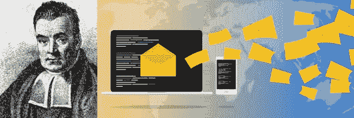

Thomas Bayes (1701–1761) author of the Bayes’ theorem

> 朴素贝叶斯是一种常用于文本分类的学习算法。

朴素贝叶斯分类器的一些应用是:

*   **(自动)对文件夹**中的电子邮件进行分类，因此收到的电子邮件信息会进入**:**“家人”、“朋友”、“更新”、“促销”等文件夹。
*   **(自动)工作列表的标记。给定一个原始文本格式的工作列表，我们可以给它分配标签，如:“软件开发”、“设计”、“营销”等。**
*   **(自动)产品分类。给定一个产品描述，我们可以将其分类，如:“书籍”、“电子产品”、“服装”等。**

本文的其余部分将提供必要的背景知识和直觉，通过五个步骤从头构建一个朴素贝叶斯分类器。

# 第一步。确定训练朴素贝叶斯分类器的先决条件

如前所述，贝叶斯分类器在文本分类中的应用是无止境的。唯一的先决条件是，对于我们希望将文本片段进行分类的每个类别( *class)* ，都有一组现有的*示例*。

例如，对于工作列表分类示例，我们需要一组已知针对“软件开发人员”的工作列表，一组已知针对“设计人员”的工作列表，以及一组针对“营销人员”的工作列表。

在这种情况下，有三个类(“软件开发”、“设计”和“营销”)。利用每个类别中的工作列表样本，我们可以训练一个朴素贝叶斯分类器，以便自动对*新的*工作列表进行分类。

我们将在本文剩余部分探讨的示例是**垃圾邮件/垃圾邮件分类，**因此，有两个类别:“垃圾邮件”和“垃圾邮件”(即非垃圾邮件)。如前所述，唯一的先决条件是拥有已知为垃圾邮件的现有*训练集*和已知为垃圾邮件的训练集*。*

为了说明清楚，我们的训练集将由三封垃圾邮件和三封垃圾邮件组成(下面的图片是可点击的，因此您可以放大并阅读每封邮件):

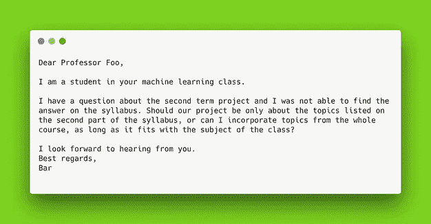

Examples of HAM emails.

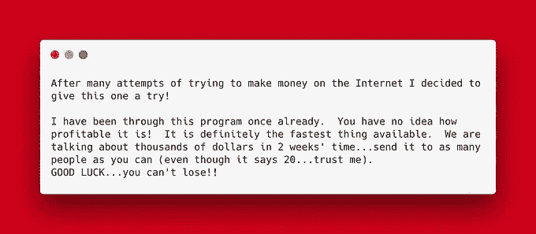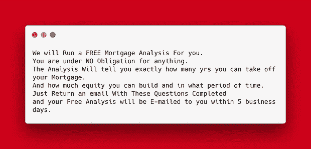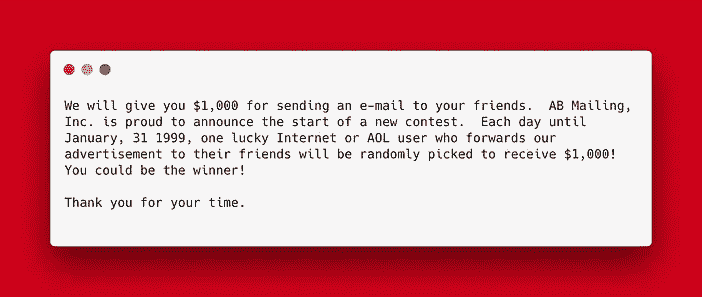

Examples of SPAM emails.

请注意，在生产级垃圾邮件过滤器中，训练集的大小(即，已知垃圾邮件和 Ham 电子邮件的数量)通常要大得多，然而，我们将在此开发的概念和直觉确实适用。

# **步骤二。计算每个类别的术语文档矩阵(TDM)**

术语-文档矩阵(TDM)由出现在一组文档中的词频列表组成。

TDM 矩阵是由 *n* 个字和 *m* 个文档组成的稀疏矩形矩阵。之所以说它稀疏，是因为它包含的大部分都是零。TDM 矩阵的条目( *i，j* )表示单词“*I”*在文档“*j”*中的出现频率。

对于考虑英语中所有单词的英语垃圾邮件分类器，单词的数量( *n* )大约为 170k。至于每节课的例题数量，一般规律是越多越好:-)。然而，实际上，几千条信息给出了合理的预测。对于垃圾邮件检测任务，垃圾邮件标记数据的实际来源是 [SpamAssassin](https://spamassassin.apache.org/) 。

以下图片摘自垃圾邮件和垃圾邮件类别的 TDM 矩阵:

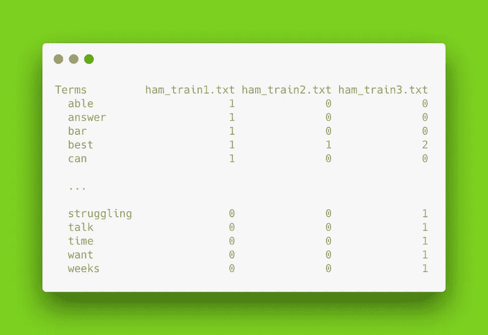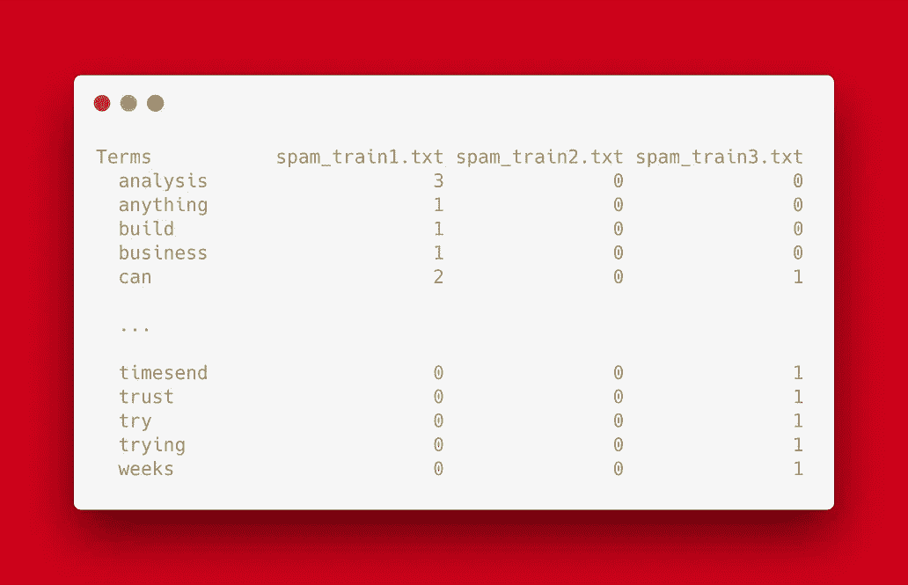

Term document matrix excerpts for the HAM and SPAM emails.

# 九月三日。计算频率

一旦为每个类别计算了 TDM 矩阵，下一步就是计算每个术语的频率和出现次数:

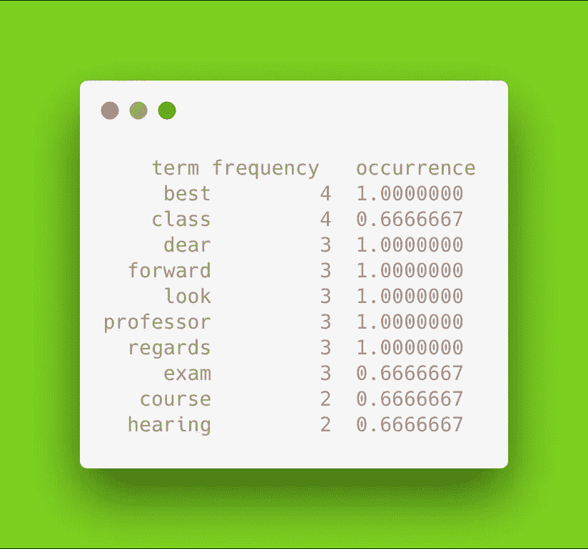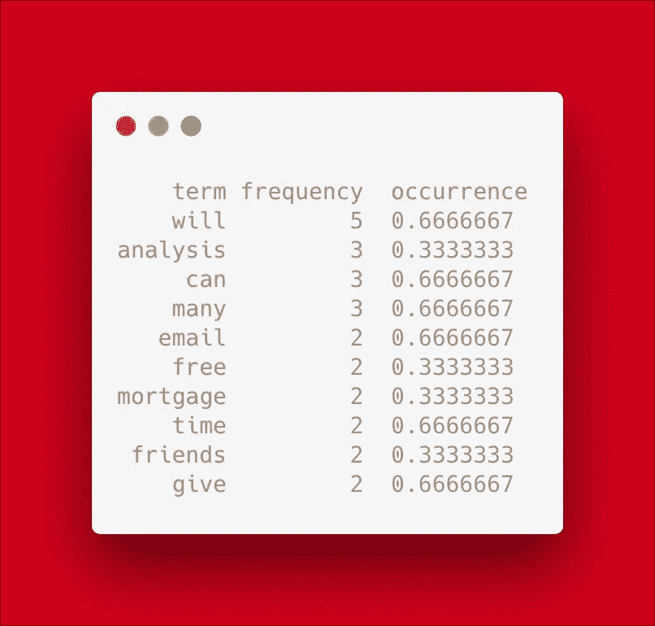

Top 10 terms sorted by frequency for the HAM and SPAM classes.

根据原始频率计数，您可以推断垃圾邮件包含高频术语，如“免费”，而垃圾邮件包含高频术语，如“考试”。这就是分类器将能够区分一个类和另一个类的方式。

“频率”列是每个术语在所有文档中出现的次数，即 TDM 矩阵各列的总和。“出现”列是每个术语在所有文档中出现的时间百分比。

“频率”和“出现”列都可以用于计算概率估计，但是，“出现”列是优选的，因为它被限制在 0 和 1 之间。

# **第四步。回想一下朴素贝叶斯法则**

根据基本概率，假设另一个事件 **B** 也发生了，那么一个事件 **A** 发生的概率是多少？按顺序的话，**A**给 B 的概率是多少？

Probability of A given B.

从下面的文氏图中

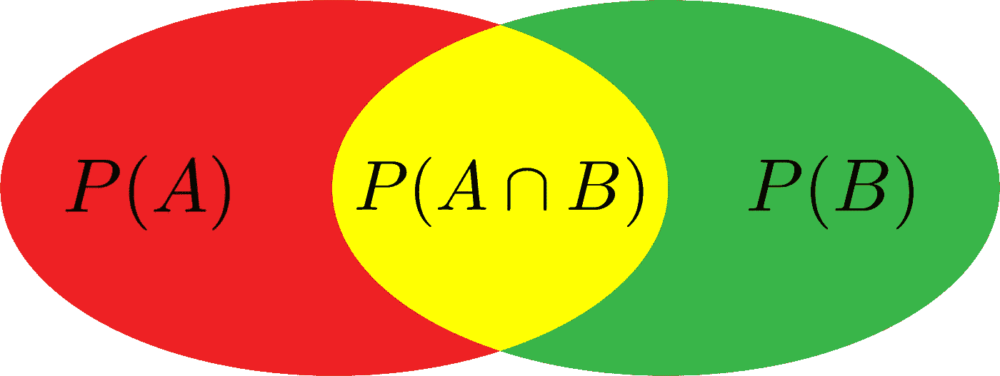

我们可以看到，给定 B 的概率是 A 和 B (交集)发生的**概率除以 B** 发生的**概率**，**即:**

Eq. 1

现在，假设 A 也发生了，那么 B 发生的概率呢？根据前面的公式，我们得到:

Eq. 2

从文氏图中可以看出

因此，通过等式。1 和 Eq。2 我们得到贝叶斯定理:

**Bayes theorem**

鉴于贝叶斯定理在概率论中的重要性，每个术语都有一个名称:

Naming terms in Bayes theorem

简单来说，“**先验**”*P(A)*、“**证据**”*P(B)*是指相互独立地观察到 A 和 B 的概率，而“**后验**”和“**似然**是观察到给定 B 的**条件** **概率**，反之亦然。

回到我们在垃圾邮件或 Ham 中的电子邮件分类示例，我们要计算的概率是:

其中 **x** 是包含来自垃圾邮件的单词的特征向量:

Feature vector **x** composed of **n** words coming from spam emails.

*朴素贝叶斯*结果是“**可能性**”是在一组垃圾邮件或业余电子邮件中看到每个单词的个体概率的乘积。我们在步骤 3 中计算了这些概率，并将它们存储在“发生”列中。形式上:

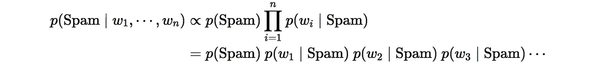

注意“**证据**”是一个仅取决于特征的常数因子，因此在前面的等式中为“**可能性**”计算引入了比例符号。

此外，由于我们的数据集有 3 封垃圾邮件和 3 封垃圾邮件，我们知道“**优先于**”*P(垃圾邮件)*是 50%。

总之，由于我们在贝叶斯定理中有所有必要的术语(“**可能性**”、“**先验**”和“**证据**”)，我们可以继续计算“**后验**”概率。回答这个等式的概率是，给定的(看不见的)电子邮件是垃圾邮件的概率是多少？

> 回想一下，朴素贝叶斯分类器的主要假设是每个特征(单词)彼此独立。

# **第五步。计算收到垃圾邮件的概率**

假设我们计算了垃圾邮件或业余爱好者电子邮件中出现的术语的概率数据库，我们可以继续进行*朴素贝叶斯分类器*的最后一步，即分类。

正式的决策规则是:

Decision rule: pick the most probable hypothesis.

这意味着，对于每个传入的电子邮件，我们必须计算此类电子邮件是垃圾邮件和垃圾邮件的概率(即，对于每个类)，并且我们的最终验证将由最大概率给出。

以下面的电子邮件为例:

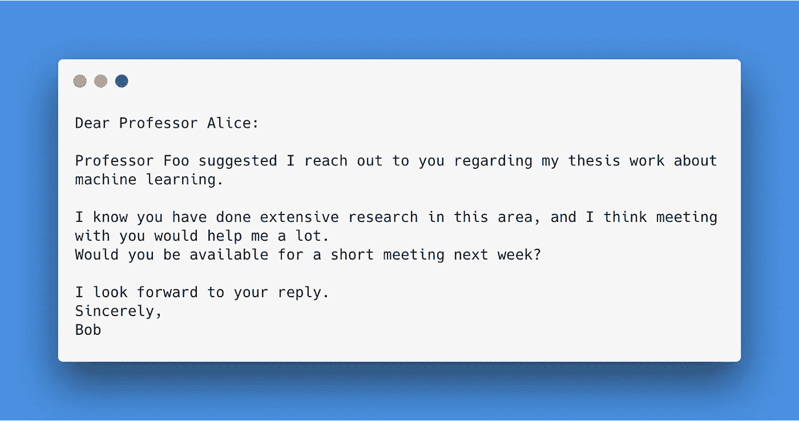

Test HAM email.

假设不在我们的训练集中的单词的任意小概率为 1e-2，则每个类别的概率为:

表明该电子邮件是垃圾邮件。

关于小数字的链乘的注释(感谢 [jgrahamc](https://news.ycombinator.com/user?id=jgrahamc) ):

【http://getpopfile.org/docs/faq:bayesandlogs】
参考:“实际上，取概率的 log()是有用的，这样你就可以处理对数的和，而不是乘以小的浮点数”

## 参考资料和源代码:

[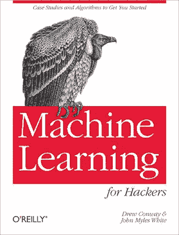](https://amzn.to/2Xjkuqa)

文件处理、TDM 矩阵计算、频率、最终分类和示例电子邮件的源代码可以在这个存储库中找到:[**https://github . com/gchave z2/code _ machine _ learning _ algorithms**](https://github.com/gchavez2/code_machine_learning_algorithms)。

该代码大量借鉴了 O'Reilly Media 出版的[Conway&Myles Machine Learning for Hackers 一书第 3 章](https://amzn.to/2Xjkuqa)，该书还提供了一个更大的垃圾邮件和业余邮件数据库，以及估计不在训练集词汇中的单词概率的策略。

*我是劳伦斯伯克利国家实验室的博士后，在那里从事机器学习和高性能计算的交叉工作。*

*如果你觉得这篇文章很有趣，请随意打个招呼，联系 LinkedIn* *，我总是很乐意与该领域的其他专业人士交流。*

*一如既往:非常感谢评论、问题和分享！❤️*

No Spam, ever.