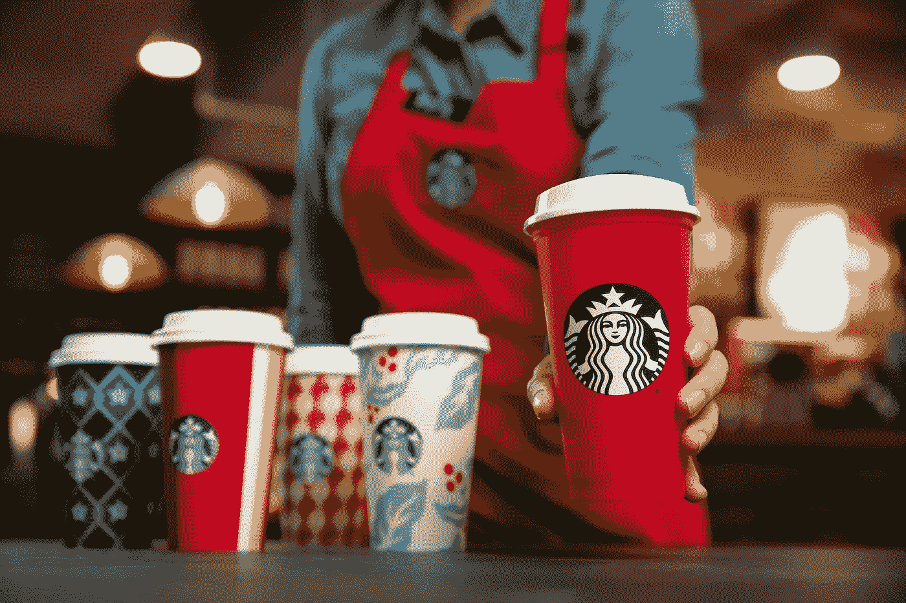
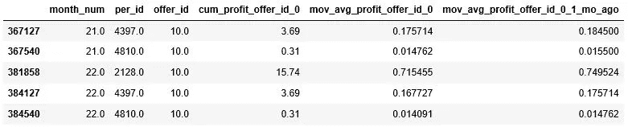
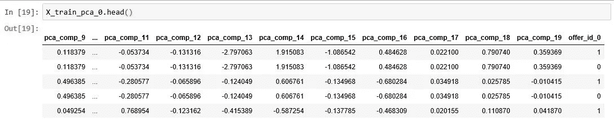
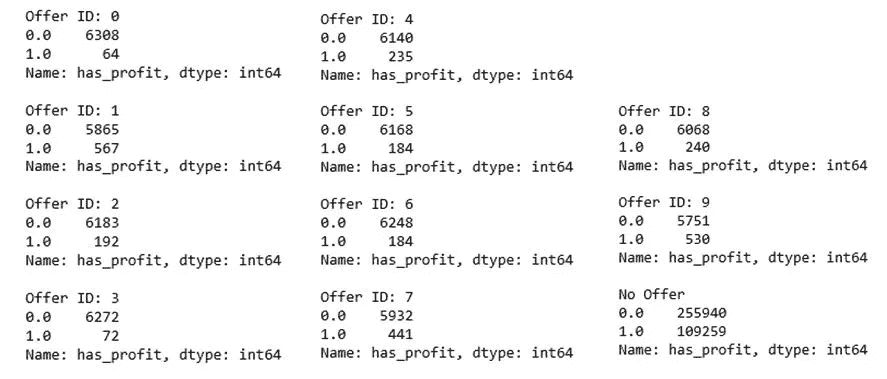
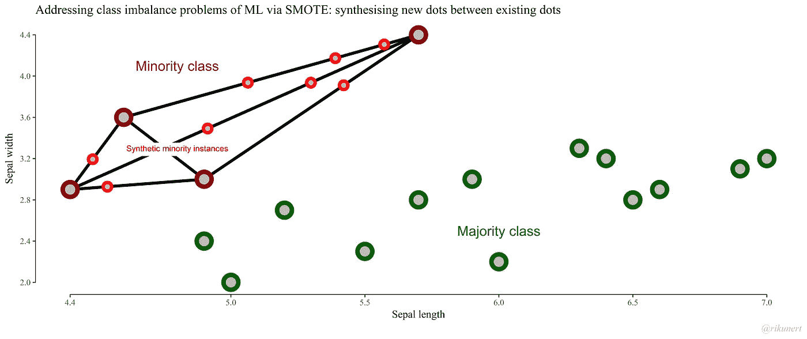
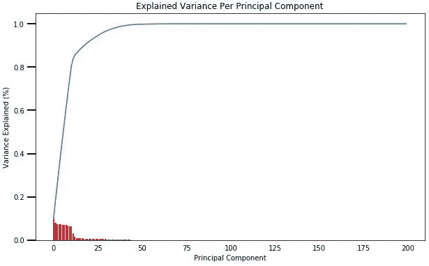
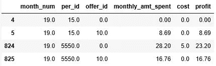

# 用机器学习实现星巴克的盈利促销策略(下)

> 原文：<https://towardsdatascience.com/implementing-a-profitable-promotional-strategy-for-starbucks-with-machine-learning-part-2-8dd82b21577c?source=collection_archive---------18----------------------->

在这个系列中，我们将为星巴克设计一个促销策略，并介绍从数据预处理到建模的整个过程。这是我为 Udacity 数据科学家纳米学位顶点项目提供的解决方案。

*在本系列的最后部分，我们将介绍特征工程、隆起模型的实施、附加模型和数据调整以及项目结果。*

[*链接*](https://medium.com/@joshxinjielee/implementing-a-profitable-promotional-strategy-for-starbucks-with-machine-learning-part-1-2f25ec9ae00c) *到本文第 1 部分。*

*本文附带的代码可以在* [*这里*](https://github.com/joshxinjie/Data_Scientist_Nanodegree/tree/master/capstone) *找到。*

# 七。特征工程

只有 4 个人口统计属性的工作，特征工程可以证明是有益的。

顾客经常在很长一段时间内没有得到促销。因此，累积值和移动平均值将用于捕捉客户过去的交易行为。

将计算以下统计数据的累积和:

1.  总支出
2.  交易数量
3.  收益

例如，时间 N 的累计利润将为

*N 时累计利润= 0 时累计利润+…+N-1 时累计利润*

请注意，第 N 个月的累积和的计算将基于第 0 个月到第 N-1 个月的值，以避免数据泄漏。

同样，计算相同统计数据的移动平均数(滚动平均数)。例如:

*N 时利润移动平均值=**N 时累计利润/月数*

将为每个“报价 id”计算累积统计数据和移动平均值，包括非促销情况(由“报价 id 10”表示)，以及累积基础(所有报价和无报价)。

例如，我们将计算:

*   *报价 id 0 在时间 N 的累计利润*
*   *报价 id 1 在时间 N 的累计利润*
*   …
*   *报价 id 10 在时间 N 的累计利润*
*   *id 为 0–10 的所有报价在时间 N 的总累计利润*

此外，每笔交易的累计支出(总支出/总交易次数)和每笔交易的累计利润(总利润/总交易次数)也将被添加。

任何缺失的值都将用 0 填充，因为空值表示客户尚未进行任何交易。

最后，将计算这些工程特性的 1 个月滞后，以使我们的模型能够捕捉交易行为的最新变化。

由于第 0 个月之前没有上一个月，因此第 0 个月的工程特性和第 1 个月的 1 个月延迟特性将完全由空值组成。因此，我们将从训练数据中丢弃月份 0 和 1。

同样，由于创建了大量的特性，我不会在本文中一一列出。要了解更多细节，请参考我的 [GitHub](https://github.com/joshxinjie/Data_Scientist_Nanodegree/tree/master/capstone) 存储库上的代码，位于文件*generate _ monthly _ data . ipynb*下。

Examples of engineered features

# 八。指标提升模型和推广策略

我们将使用单一模型来预测促销和非促销风险的利润概率。在训练阶段，创建一个指示变量来跟踪来自 *monthly_data* 的数据点是否属于促销。

每种类型的报价都有自己的模型，因此每个模型有一个指标变量就足够了。稍后将讨论使用单独模型的基本原理。

Training Features for promotion ‘offer id 0’. The column ‘offer_id_0’ serves an indicator variable that tracks if a data point belongs to ‘offer_id_0’ (indicator=1), or if it belongs to a non-offer instance (indicator=0). Note that the other training features have been reduced with PCA, a process which we will discuss shortly.

一旦模型被训练，它可以被用来制定我们的促销策略。

在测试我们的策略时，为了预测个人是否应该获得晋升，我们可以通过将指标变量设置为 1 来预测个人在获得晋升时的利润概率。接下来，我们可以通过将指标变量设置为 0 来预测个人在没有获得晋升时的盈利概率。

请注意，相同的模型用于预测促销期和非促销期的利润概率。只有输入，特别是指示变量，在程序中被改变。

如果概率差(也称为抬升效应)大于 0，我们将发送促销。这是因为与没有晋升相比，得到晋升的个人更有可能创造利润。

*提升效应=获得促销时的盈利概率—未获得促销时的盈利概率*

或者，可以使用回归模型来模拟促销活动相对于非促销活动的预期利润额。这可能会告诉我们，通过向个人发送报价，我们可以期望获得多少利润。

对于这个项目，我决定将重点放在利润的概率建模上，而不是利润的预期金额。

此外，还有其他类型的提升模型可用于此任务。

一个这样的例子是使用两个独立的模型来测量提升效应。在这种情况下，一个模型将根据促销数据进行训练，而另一个模型将根据非促销数据进行训练。两个模型预测概率之间的差异将表明抬升效应。

有关其他提升模型的更多信息，请查看这篇文章。

# 九。附加数据和模型调整

在我们讨论建模结果之前，我们将做一些最后的调整。

## 对每种优惠类型使用单独的模型

对所有报价类型使用单一模型的初始试验导致了不令人满意的结果。这可能是因为在不同的报价类型之间，有利可图的实例的数量差别很大。因此，某些优惠类型的正面实例可能比其他优惠类型的权重更大。

Distribution of labels between the different offer types.

也有可能不同的报价类型共享很少的共同信号，可用于识别有利可图的报价。

因此，决定为每种报价类型创建单独的模型。

每个模型将集中于对单一报价类型的促销和非促销支出的差异建模。

## 使用月度数据的子集

此外，每月数据的缩减子集用于训练每个模型。

主要目标将是模拟个人在收到报价的几个月中的交易行为，并确定他们中的哪些人可能在促销期间比非促销期间花费更多的钱。

只有发送相关要约的月份才会包含在数据集中。此外，我们将只包括那些在这几个月中有促销和非促销交易记录的个人。

例如，假设我们正在处理一个报价 id 为 0 的模型。如果个人 id 1 在第 1 个月收到“优惠 id 0”，则个人 id 1 在第 1 个月的促销和非促销支出将包括在数据集中。如果个人 id 2 在第 1 个月没有收到优惠 id 0，则个人 id 2 在第 1 个月的信息(非促销交易记录)将不包括在内。同样，如果 id 为 1 的人在第 9 个月没有收到 id 为 0 的报价，那么他/她的该月交易信息将不会被使用。

因此，每个报价都有自己独特的月度数据子集。

获取月度数据的子集将允许我们准确地比较同一个人在促销和非促销情况下的月度支出差异。

此外，这种方法将有助于确保模型每个月看到相同数量的促销和非促销风险。这将有助于减少过度适应特定暴露的可能性。

## 标签不平衡

如前所述，标签的价值计数不平衡。数据点更可能是非盈利的 *(has_profit* 标签为 0)而不是盈利的 *(has_profit* 标签为 1)。

如果我们观察促销活动中 *has_profit* 标签的分布，与非促销活动相比，这种不平衡甚至更加明显。对于“优惠 id 0”和“优惠 id 3”的促销来说尤其如此，它们的盈利实例数量极低，而无优惠数据点的盈利实例数量要高得多。

Distribution of labels between the different offer types.

因此，我们需要解决标签之间的不平衡，以便它们在促销和非促销风险之间保持一致。

如果不解决这种不平衡，模型将更倾向于预测促销的标签为 0，尤其是在“报价 id 为 0”和“报价为 3”的情况下。

合成少数过采样技术 SMOTE 将用于对盈利类进行过采样。换句话说，我们将添加带有 *has_profit* 标签 1 的人工创建的人月实例。

SMOTE 允许我们创建新的观测值，其特征值与原始观测值略有不同。

为了创建一个新的样本，它将从数据集中提取一个数据点，并选择它的一个 k-最近邻。然后，它将获取所选邻居和当前数据点之间的向量，并将该向量乘以介于 0 和 1 之间的随机数。最后，它会将结果添加到当前数据点，以创建新的样本。

An overview of SMOTE. Taken from [Rich Data](http://rikunert.com/SMOTE_explained).

这通常是比仅重新采样原始数据更好的方法，这将创建太多重复的数据点，并导致机器学习模型中的过拟合。

由于过采样通常以精度为代价来提高召回率，所以我选择只对促销数据点进行过采样。这是因为非促销数据点已经比促销数据点具有更高的盈利与非盈利标签的比率。

因此，通过仅过采样促销数据点，促销情况下的盈利与非盈利标签的比率将更接近非促销情况。

最后，将仅对训练数据执行过采样。我们希望我们的验证和测试数据能够模拟真实世界中的实际客户行为，在真实世界中，很可能只有少数客户会每月为公司创造利润。

## 缩放和降维

SMOTE 最适用于连续数据。由于我们的数据是分类变量和连续变量的混合物，我们需要将它们转换成连续变量。一种方法是缩放数据集并执行维度缩减。这将生成一个仅包含连续变量的数据集。

进行降维的另一个好处是，在研究期间，大多数客户通常只对单一类型的报价做出反应。客户可能会收到几种类型的优惠，但大多数人通常只会对一种类型的优惠采取行动。因此，对于许多个人来说，大多数优惠类型的历史消费金额将为 0。

由于我们已经根据每种优惠类型的历史消费行为设计了新功能，这些设计的功能中有很大一部分将是稀疏的(许多功能为 0)。因此，降维将有助于减少数据集的稀疏性。

对每种报价类型分别进行标准化和降维。标准标度用于将所有变量标准化为平均值 0 和标准偏差 1，而主成分分析用于降低数据集的维度。

对于大多数报价类型，40 到 50 个维度足以捕获数据集中的大部分差异。由于要素的原始数量约为 200，这表明数据集中的稀疏程度很高。

Scree plot for Discount 10/20/5 (Offer ID 0) promotion

## 公制的

我们促销策略的绩效将通过净增量收入(NIR)来确定，其中:

*NIR =促销收入—促销成本—非促销收入*

这也可以表示为

*NIR =促销利润—非促销利润*

根据我们的战略，NIR 将根据应该收到报价的个人进行计算。换句话说，这些人有积极的提升价值。

因此，NIR 通过向这些个人发送促销来衡量赚了(或赔了)多少。

例如，让我们假设我们正在计算第 19 个月的 NIR。假设我们的促销策略预测 id 为 15 和 5550 的客户将有正的提升值，他们应该得到促销，这些人在第 19 个月的实际交易记录如下:

Offer id 0 is a Discount 10/20/5 promotion. Offer id 10 tracks non-promotional spending

国家清单报告的计算如下:

*近红外光谱=($ 0+$ 23.20)—($ 8.69+$ 16.76)=-$ 2.25*

## 网格搜索

XGBoost 分类器将用于对利润的概率建模，早期停止用于减少模型的过度拟合。精确回忆曲线下的面积，而不是 ROC 曲线下的面积，被用来决定训练何时应该停止。这一选择是由于数据集中类的不平衡，这意味着使用 ROC 曲线下的面积可能会导致过于乐观的情况。

为了确定最佳促销策略，对以下参数进行了网格搜索:上采样率、树的最大深度和最小子权重。网格搜索将评估每组参数的有效性并测试 NIRs。

上采样比率控制我们应该对促销数据点的利润实例( *has_profit* label 为 1)进行多少次过采样。在促销和非促销的情况下，保持盈利与非盈利的平衡并不总是能取得最佳结果。因此，需要改变上采样比率。

最大树深度越大，最小子权重越低，建模能力越高。这意味着该树更能够学习特定样本的特定关系。另一方面，较小的最大树深度和较高的最小子权重将使模型更加保守，并更好地控制过度拟合。

因为报价是在不规则的月份发送的，所以每个报价的测试月份是不同的。一般来说，发送要约的最后一个月将用作测试月，而倒数第二个月将用作验证月。最后，剩下的几个月将分配给训练数据。在大多数情况下，每个报价大约有 3 或 4 个月的培训时间。

对于这个项目，所选择的促销策略不一定是产生最佳验证 NIR 的策略。据观察，在验证月期间表现最好的策略在测试月期间可能不会产生正的 NIRs。

因此，所选择的策略将是产生最高确认 NIR 同时仍产生阳性测试 NIR 的策略。

如果在验证和测试月都没有发现产生阳性 NIR 的策略，将报告产生最高验证 NIR 的策略。

通常情况下，使用测试结果来调整模型并不理想。然而，我们没有足够的月度数据来增加用于验证和测试期的月数。如果有更多的数据可用，我们可以留出额外的几个月来进行验证和测试。这可能会导致结果更加一致，并允许我们避免使用测试结果来调整我们的策略。

因此，这个项目只是为了证明一个有利可图的促销策略的可行性。如果我们想获得可靠且有利可图的促销策略，还需要进一步的改进。

正如我们一会儿将会看到的，不管我们选择什么策略，提升模型产生的结果通常比实验中最初获得的结果好得多。

# X.结果

我们现在将比较从基线策略和我们的提升模型获得的结果。

基线策略将是研究中采用的原始策略。换句话说，在实际实验中收到提议的每个人都会收到基线策略中的提议。

我们的模型的目标是确定这些人的一个较小的子集，这些人在得到促销时可能会比没有得到促销时花费更多。换句话说，提升模型将只向具有正提升值的个人发送促销。

理想情况下，星巴克可以通过将促销活动仅限于最有希望的顾客来实现利润最大化。

## 折扣 10/20/5(优惠 ID 0)

Offer ID 0 是折扣促销，难度 20 美元，奖励 5 美元，有效期 10 天。

基线策略~验证 NIR:108.70 美元，测试 NIR:4，889.48 美元

提升模型~验证 NIR:72.83 美元，测试 NIR:$ 2，163.47 美元

## 折扣 7/7/3(优惠 ID 1)

Offer ID 1 是一个折扣促销，难度为 7 美元，奖励为 3 美元，有效期为 7 天。

基线策略~验证 NIR:185.14 美元，测试 NIR:4，732.18 美元

提升模型~验证 NIR:60.41 美元，测试 NIR:4.61 美元

## 折扣 7/10/2(优惠 ID 2)

Offer id 2 是折扣促销，难度 10 美元，奖励 2 美元。报价有效期为 7 天。

基线策略~验证 NIR:65.88 美元，测试 NIR:5，519.62 美元

提升模型~验证 NIR:12.40 美元，测试 NIR:3.17 美元

## 信息 4/0/0(报价 ID 3)

Offer id 3 是信息化推广，没有难度，没有奖励。它的有效期是 4 天。根据星巴克的说法，这意味着顾客将在 4 天内“感受到”它的影响。可能的解释是，客户将能够在 4 天内查看应用程序中的报价。

基准战略~验证国家清单报告:$4，193.67，测试国家清单报告:$8，754.95

升级模型~验证 NIR: $29.39，测试 NIR:$ 34.26

## BOGO 2010 年 10 月 5 日(报价 ID 4)

Offer id 4 是买一送一的促销活动，难度 10 美元，奖励 10 美元。它的有效期是 5 天。

基线策略~验证 NIR:$ 4，634.69，测试 NIR:$ 7，027.36

升级模型~验证 NIR:12.39 美元，测试 NIR:10.20 美元

## 信息 3/0/0(报价 ID 5)

优惠 id 5 是信息促销，有效期为 3 天。

这些是模型的结果:

基准战略~验证国家清单报告:$5，188.06，测试国家清单报告:$6，707.87

升级模型~验证 NIR:2.19 美元，测试 NIR:130.91 美元

## BOGO 2005 年 7 月 5 日(报价 ID 6)

Offer id 6 是买一送一的促销活动，难度 5 美元，奖励 5 美元。它的有效期是 7 天。

这些是模型的结果:

基线策略~验证 NIR:121.58 美元，测试 NIR:6，542.62 美元

提升模型~验证 NIR:21.81 美元，测试 NIR:10.15 美元

## BOGO 2010 年 10 月 7 日(报价 ID 7)

Offer 7 是买一送一的促销活动，难度 10 美元，奖励 10 美元。优惠 id 7 类似于优惠 id 4，只是它的有效期为 7 天。

基线策略~验证 NIR:65.13 美元，测试 NIR:6，207.28 美元

提升模型~验证 NIR:24.29 美元，测试 NIR:0.73 美元

## BOGO 5 月 5 日(出价 ID 8)

Offer id 8 是买一送一的促销活动，难度 5 美元，奖励 5 美元。它与报价 id 6 相同，只是有效期较短，只有 5 天。

基准战略~验证国家清单报告:$5，779.91，测试国家清单报告:$7，508.97

升级模型~验证 NIR: $481.78，测试 NIR:$ 786.3

## 折扣 10/10/2(优惠 ID 9)

报价 id 9 是我们将讨论的最后一次促销。是难度 10 美元，奖励 2 美元，有效期 10 天的打折促销。它类似于优惠 id 2，只是它的有效期为 10 天，而优惠 id 2 的有效期为 7 天。

基线策略~验证 NIR:104.30 美元，测试 NIR:5，006.65 美元

提升模型~验证 NIR:51.87 美元，测试 NIR:3.02 美元

在所有情况下，我们都能够对基线策略的测试月 NIRs 进行显著改进。

对于 10 种促销类型中的 6 种，我们能够找到在验证和测试月份中有利可图的策略。

我们未能做到的 4 种促销类型是折扣 10/20/5、信息 4/0/0、信息 3/0/0 和 BOGO 5/5/5。

对于我们的策略在信息提供上表现不佳，有两种可能的解释。

首先，由于信息提供缺乏回报，它们的有效性有限。因此，它们对消费者支出的影响可以忽略不计。

或者，它们相对较短的有效期，加上客户没有动力快速“完成”它们，意味着这些促销的真正影响要到以后才能感受到。客户可能会对这些促销活动做出回应，但只能在促销活动结束后。

此外，我们的策略在 10/20/5 折扣促销中的糟糕表现表明，促销的难度(＄20)可能太高，无法激励有意义的客户做出回应。

尽管上述 4 项促销活动的促销策略并不盈利，但它们仍然代表了对基准策略的重大改进。因此，他们的采用将提高星巴克的底线。

在许多促销活动中，我们的提升模型策略在验证月份获得的 NIRs 比最初在实验中获得的略低。然而，这些策略确实显著改善了测试月份的 NIRs。因此，这种权衡是可以接受的。

# XI。结论

## 回答我们的问题

现在让我们回到开始时的问题:

我们能通过采取更具选择性的促销策略来增加星巴克的利润吗？

我们已经证明，提高原始促销策略的有效性并获得更好的回报是完全可能的。在 10 次促销中，有 6 次发现了盈利策略，我们还设法在另外 4 次促销中大幅减少了损失。

然而，我们目前的方法并不能为所有的报价生成正的 NIRs。此外，还有关于结果一致性的问题。为了获得可靠且有利可图的策略，必须进行进一步的改进。如前所述，提升模型可能很难实现。

从这个实验中得出的关键结论是，促销似乎不会在短期内产生明显更高的利润。大多数顾客通常是忠诚的，并且经常愿意购买产品，不管是否有促销活动。

因此，我们在确定要进行促销的个人时需要更有选择性。否则，我们可能会对公司的利润产生不利影响。

## 潜在的改进

我们注意到产生最高验证 NIRs 的策略不能产生阳性测试 NIRs。验证和测试结果之间的不一致可能表明信号不是很强，就是在不同的月份中信号不一致。

考虑到只有一小部分客户对优惠做出了回应，我们没有太多的交易数据可以处理。此外，只有 4 个人口统计属性可用。因此，获取更多的交易和人口统计数据可能有助于改善信号。

或者，我们可以通过多种方式改进我们的提升模型:

1.  仅向提升值高于某个百分点的个人发送促销信息，而不仅仅是提升值为正的个人。
2.  使用回归模型模拟促销和非促销情况下的利润额。
3.  尝试其他提升模型，如双模型法、四象限法等。

尝试所有这些替代方法将相对耗时，因此我没有在这个项目中探索它们。

此外，由于产生的成本，发送这些促销可能会导致短期利润下降，但它们可能会建立客户的忠诚度，并鼓励他们在未来的交易中花费更多的钱。

我们目前的方法没有模拟这些促销的长期影响。因此，解决这个问题的另一种方法是设计一种策略，使未来利润最大化，而不是获得短期利润。在这种情况下，我们的目标将是确定在获得晋升后的未来几个月中可能会花更多钱的人。

*本文附带的代码可以在* [*这里*](https://github.com/joshxinjie/Data_Scientist_Nanodegree/tree/master/capstone) *找到。*

*感谢您阅读本文！如果你有任何想法或反馈，请在下面留下评论或给我发电子邮件到 leexinjie@gmail.com。我很乐意收到你的来信。*