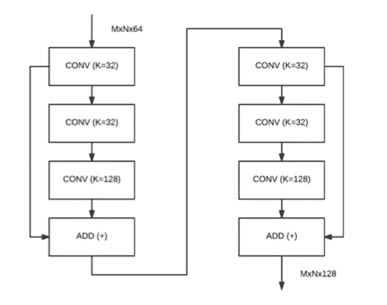
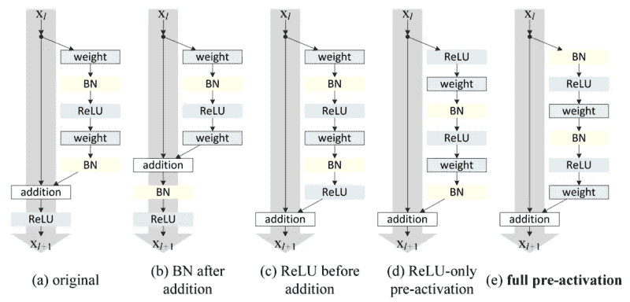
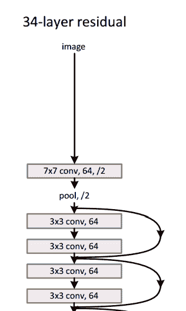
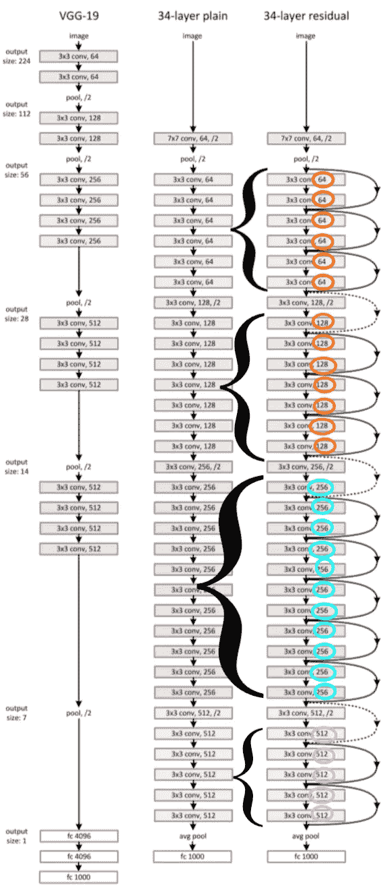

# 从头开始实现 ResNet 模型。

> 原文：<https://towardsdatascience.com/implementing-a-resnet-model-from-scratch-971be7193718?source=collection_archive---------3----------------------->

## ResNet 如何工作的基本描述和理解最先进网络的实践方法。

Source: [https://www.quantamagazine.org/brain-computer-interfaces-show-that-neural-networks-learn-by-recycling-20180327/](https://www.quantamagazine.org/brain-computer-interfaces-show-that-neural-networks-learn-by-recycling-20180327/)

当我在一个深度学习项目中实现 **ResNet** 架构时，这是我习惯的基本、简单的卷积神经网络的一个巨大飞跃。

ResNet 的一个突出特点是在其较大的*宏架构* ***:*** **残余块**内利用了一个*微架构*！

我决定亲自研究这个模型，以便更好地理解它，并研究为什么它在 ILSVRC 如此成功。我在 Adrian Rosebrock 博士的 【用于计算机视觉的深度学习】 [*中实现了完全相同的 ResNet 模型类[1]，*，它遵循了 2015 年 ResNet 学术出版物中的 ResNet 模型，](https://www.pyimagesearch.com/deep-learning-computer-vision-python-book/) [*何等人的*](https://arxiv.org/abs/1512.03385) 【用于图像识别的深度残差学习】[2]。

# 雷斯内特

当 ResNet 首次推出时，它为当时深度神经网络的一个巨大问题提供了一个新的解决方案:消失梯度问题。虽然神经网络是通用函数逼近器，但是在某个阈值，增加更多的层会使训练变得更慢，并且使精度饱和。

Source: [https://towardsdatascience.com/an-overview-of-resnet-and-its-variants-5281e2f56035](/an-overview-of-resnet-and-its-variants-5281e2f56035)

这是由于梯度从最终层到最早层的反向传播——将 0 和 1 之间的数相乘多次会使其变得越来越小:因此，当到达更早的层时，梯度开始“消失”。这意味着早期的层不仅训练速度慢，而且更容易出错。这是一个巨大的问题，因为最早的层是整个网络的构建模块，它们负责识别基本的核心功能！

为了缓解这一问题，ResNet 结合了**身份快捷连接**，本质上跳过了一层或多层的训练——创建了**残差块**。

A single residual block; the original one proposed by He et al. Source: [1]

然后作者提出了一个“优化的”剩余块，增加了一个叫做**瓶颈的扩展。**它将减少前两个 CONV 层中的维度(在最终的 CONV 层中学习的过滤器的 1/4 ),然后在最终的 CONV 层中再次增加。这里有两个剩余模块堆叠在一起。

Source: Deep Learning for Computer Vision using Python: Practitioner Bundle [1]

最后，他等人发表了第二篇关于剩余模块的论文，称为深度剩余网络中的*身份映射*，它提供了剩余模块的更好版本:**预激活剩余模型**。这允许梯度通过快捷连接无障碍地传播到任何较早的层。

我们不是从卷积(*权重*)开始，而是从一系列(*BN*=>*RELU*=>*conv*)* N 层开始(假设正在使用瓶颈)。然后，剩余模块输出*加法*运算，该运算被馈入网络中的下一个剩余模块(因为剩余模块堆叠在彼此之上)。

(a) original bottleneck residual module. (e) full pre-activation residual module. Called pre-activation because BN and ReLU layers occur before the convolutions. Source: [2]

整个网络架构看起来是这样的，我们的模型也类似于此。

Source: [2]

让我们开始用 Python 编码实际的网络。这个具体的实现受到了 He 等人的 Caffe 发行版和的 mxnet 实现的启发。

我们将把它写成一个类( *ResNet* )，这样我们就可以在训练深度学习模型时调用它。

我们从标准的 CNN 导入开始，然后开始构建我们的 *residual_module* 函数。看一下参数:

*   *数据*:输入到剩余模块
*   *K* :最终 CONV 层将学习的滤波器数量(前两个 CONV 层将学习 K/4 个滤波器)
*   *步幅*:控制卷积的步幅(将帮助我们在不使用最大池的情况下减少空间维度)
*   *chanDim* :定义批量归一化的轴
*   *红色*(即减少)将控制我们是减少空间维度(真)还是不减少空间维度(假)，因为并非所有剩余模块都会减少我们的空间体积的维度
*   *reg:* 对残差模块中的所有 CONV 层应用正则化强度
*   *bnEps:* 控制ɛ，负责在标准化输入时避免“被零除”错误
*   *bnMom:* 控制[移动平均线](https://www.coursera.org/lecture/deep-neural-network/exponentially-weighted-averages-duStO)的动量

现在让我们看看函数的其余部分。

首先，我们初始化(标识)快捷方式(连接)，它实际上只是对输入数据的引用。在剩余模块的末尾，我们简单地将快捷方式添加到预激活/瓶颈分支的输出中(第 3 行)。

在第 6–9 行，ResNet 模块的第一个块遵循 BN ==> RELU ==> CONV == >模式。CONV 层通过 *K/4* 滤波器利用 1x1 卷积。请注意，CONV 层的偏置项是关闭的，因为偏置已经在后面的 BN 层中，所以不需要第二个偏置项。

根据瓶颈，第二 CONV 层学习 3×3 的 *K/4* 过滤器。

最后一个块将再次增加维度，应用维度为 1 x 1 的 *K* 过滤器。

为了避免应用最大池，我们需要检查是否有必要减少空间维度。

如果我们被命令减少空间维度，跨度大于 1 的卷积层将被应用于快捷方式(第 2-4 行)。

最后，我们将快捷方式和最终的 CONV 层添加到一起，创建 ResNet 模块的输出(第 7 行)。我们终于有了开始构建深层剩余网络的“基石”。

让我们开始构建*构建*方法。

看看参数*阶段*和*滤波器*(都是列表)。在我们的架构中(如上所示)，我们将 N 个剩余模块堆叠在一起(N =阶段值)。同一*级*中的每个剩余模块学习相同数量的*滤波器*。每个阶段学习完各自的过滤器后，接下来就是降维。我们重复这个过程，直到我们准备好应用平均池层和 softmax 分类器。

## 阶段和过滤器

例如，让我们设置 stages=(3，4，6)和 filters=(64，128，256，512)。第一滤波器(64)被应用于不属于剩余模块的唯一 CONV 层，即网络中的第一 CONV 层。然后，*三个*(阶段= 3)剩余模块堆叠在彼此之上——每个模块将学习 *128* 过滤器。空间维度将被减少，然后我们将*四个*(阶段= 4)剩余模块堆叠在彼此之上——每个学习 256 个过滤器。最后，我们再次减少空间维度，并继续堆叠*六个*(阶段= 6)剩余模块，每个模块学习 512 个过滤器。

ResNet architecture. Circled numbers are the filter values, while the brackets show the stacks. Notice how there is a dimensionality reduction after every stage. Unrelated to written example earlier.

让我们回到构建*构建*方法。

根据我们使用的是“通道最后”还是“通道优先”排序，初始化 *inputShape* 和 *chanDim* (第 3-4 行)。

如上所述，ResNet 使用一个 BN 作为第一层，作为对您的输入(第 2-4 行)的附加标准化级别。然后，我们应用一个 CONV = >，BN => ACT = >池来减少空间大小(第 7–13 行)。现在，让我们开始堆叠剩余层。

要在不使用池层的情况下减小体积，我们可以更改卷积的步幅。该阶段中的第一个条目的步幅将为(1，1)，表示缺少缩减采样。然后，在这之后的每个阶段，我们将应用步长为(2，2)的残差模块，这将减小卷的大小。这显示在第 5 行的**上。**

然后，我们在第 10–13 行的**上循环当前阶段的层数(将堆叠在彼此顶部的剩余模块数)。我们使用[i + 1]作为过滤器的索引，因为已经使用了第一个过滤器。一旦我们将 stage[I]剩余模块堆叠在彼此之上，我们就返回到**线 6–7**处，在那里我们减小体积的空间维度并重复该过程。**

为了避免密集的全连接层，我们将应用平均池化来将卷大小减少到 1 x 1 x 类:

最后，我们将为我们将要学习的所有类别创建一个密集层，然后应用 softmax 激活来生成我们的最终输出概率！

这就结束了我们的构建函数，现在我们有了完全构建的 ResNet 模型！你可以调用这个类在你的深度学习项目中实现 ResNet 架构。

如果你有任何问题，欢迎在下面评论或者联系我们！

*   我的领英:[https://www.linkedin.com/in/gracelyn-shi-963028aa/](https://www.linkedin.com/in/gracelyn-shi-963028aa/)
*   给我发邮件到 gracelyn.shi@gmail.com

## 参考

[1] A. Rosebrock， [*用 Python 进行计算机视觉的深度学习*](https://www.pyimagesearch.com/deep-learning-computer-vision-python-book/) (2017)

[2]何国光，张，任，孙，**【2015】*[【https://arxiv.org/abs/1512.03385】](https://arxiv.org/abs/1512.03385)*