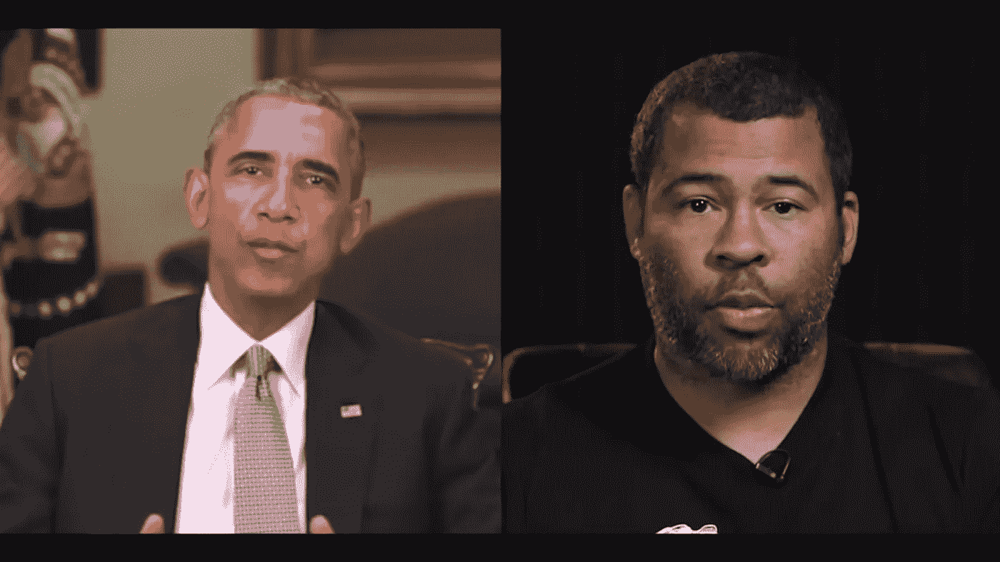
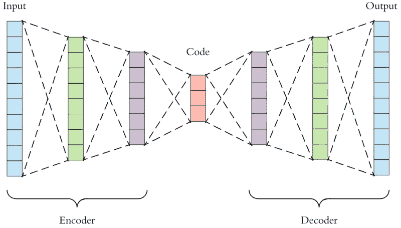
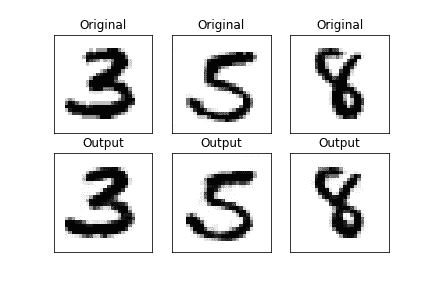

# 在 Tensorflow 中实现一个简单的自动编码器

> 原文：<https://towardsdatascience.com/implementing-a-simple-auto-encoder-in-tensorflow-1181751f202?source=collection_archive---------10----------------------->



Peele using DeepFake to forge a video of Obama — Source: [BuzzFeed](https://www.youtube.com/watch?v=cQ54GDm1eL0), YouTube

生成对抗网络(GAN)最近通过展示它们的一些能力而变得越来越受欢迎，最初是通过模仿著名画家的艺术风格，但最近是通过无缝替换视频中的面部表情，同时保持高输出质量。

Source: [BuzzFeed](https://www.youtube.com/watch?v=cQ54GDm1eL0), YouTube

GANs 的支柱之一是使用自动编码器。自动编码器是一种具有两种特性的神经网络:输入和输出数据是相同的，并且网络包括比输入更低维度的层。起初，这可能听起来令人困惑和无用，但通过训练网络复制输入数据，虽然有一个“瓶颈”，但我们真正做的是让网络学习数据的“压缩”版本，然后
解压缩它。用行话来说，这意味着找到我们数据的“潜在空间”表示。

在这篇文章中，我将解释如何用 python 实现自动编码器，以及如何在实践中使用它来编码和解码数据。假设您已经安装了`Python 3` 和`Tensorflow`并正在运行，尽管代码只需要很小的改动就可以在`Python 2.`上运行

所以，一个好的自动编码器必须:
1。“压缩”数据，即潜在尺寸<输入尺寸
2。很好地复制数据(咄！)
2。允许我们得到编码的潜在表示法
3。允许我们解码一个编码的表示



[Source](/applied-deep-learning-part-3-autoencoders-1c083af4d798): another very interesting article, explaining and using auto-encoder to remove noise from images.

我将向您展示两种方法，一种是严格的/学究式的(取决于您的观点)，它使用低级的`tensorflow` API，另一种是更快更随意的，它利用了`keras` API，尽管如果您想正确理解第二种 API 的内部工作方式，第一种方法是必要的。

# Tensorflow 低级实现

> 只有最酷的孩子才会用这个——比尔·盖茨

他的实现将直接使用`tensorflow core` API，这需要一些先决知识；我将简要解释三个基本概念:`tf.placeholder`、`tf.Variable`和`tf.Tensor`。

一个`tf.placeholder`仅仅是一个“变量”,它将是模型的输入，但不是模型本身的一部分。它基本上允许我们告诉模型，它应该期望一个特定类型和特定维度的变量。这与强类型语言中的变量声明非常相似。

`tf.Variable`与其他编程语言中的变量非常相似，其声明类似于大多数强类型语言的声明。例如，网络的权重是`tf.Variables`。

一个`tf.Tensor`稍微复杂一点。在我们的例子中，我们可以认为它是一个包含操作的符号表示的对象。例如，给定一个占位符 ***X*** 和一个权重变量 ***W*** ，矩阵乘法***W******X***是一个张量，但是它的结果，给定一个特定的值 ***X*** 和 ***W，*** 不是张量。

既然介绍已经做好了，建立关系网的过程就相当简单，但是有点迂腐。我们将使用 MNIST 数据集，这是一个存储为 28x28 图片的手写数字数据集。我们将 *D* 定义为输入数据，在这种情况下，展平的图像尺寸为 784，将 *d* 定义为编码尺寸，我将其设置为 128。该网络然后具有以下维度的 3 层: *D，D，D* 。

我们现在将实现一个简单的自动编码器类，将逐行解释。如果你感兴趣的话，这里还有完整版本的代码。

我们走吧！首先，我们需要一个输入数据的占位符:

```
self.X = tf.placeholder(tf.float32, shape=(None, D))
```

然后，我们开始编码阶段，将第一层权重(带有额外偏差)定义为变量:

```
self.W1 = tf.Variable(tf.random_normal(shape=(D,d)))
self.b1 = tf.Variable(np.zeros(d).astype(np.float32))
```

注意重量的形状是`Dxd`，从较高维度到较低维度。接下来，我们为瓶颈层创建张量，作为输入和权重之间的乘积，加上偏差，所有这些都由 relu 激活。

```
self.Z = tf.nn.relu( tf.matmul(self.X, self.W1) + self.b1 )
```

然后，我们进入解码阶段，这与编码相同，但从低维到高维。

```
self.W2 = tf.Variable(tf.random_normal(shape=(d,D)))
self.b2 = tf.Variable(np.zeros(D).astype(np.float32))
```

最后，我们定义输出张量，以及预测变量。为了简单起见，选择了 Sigmoid 激活，因为它总是在区间[0，1]内，该区间与来自输入的归一化像素的范围相同。

```
logits = tf.matmul(self.Z, self.W2) + self.b2 
self.X_hat = tf.nn.sigmoid(logits)
```

网络到此为止！我们只需要一个损失函数和一个优化器，我们可以开始训练了。选择的损失是 sigmoid 交叉熵，这意味着我们将该问题视为像素级别的二元分类，这对黑白图像数据集有意义。

关于乐观主义者，这是非常古老的魔法。给定一个问题，也许我们应该创建一个模型来输出使用哪个优化器？

```
self.cost = tf.reduce_sum(
    tf.nn.sigmoid_cross_entropy_with_logits(
        # Expected result (a.k.a. itself for autoencoder)
        labels=self.X,
        logits=logits
    )
)

self.optimizer = tf.train.RMSPropOptimizer(learning_rate=0.005).minimize(self.cost)
```

最后一个稍微有点技术性的术语与会话有关，它是一个充当上下文管理器和后端连接器的对象，并且需要初始化:

```
self.init_op = tf.global_variables_initializer()        
if(self.sess == None):
            self.sess = tf.Session()
self.sess = tf.get_default_session()
self.sess.run(self.init_op)
```

就是这样！..或者差不多，现在我们需要拟合模型；但不用担心，这在 tensorflow 中非常简单:

```
# Prepare the batches 
epochs = 10 
batch_size = 64       
n_batches = len(X) // bs

for i in range(epochs):
    # Permute the input data
    X_perm = np.random.permutation(X)
    for j in range(n_batches): # Load data for current batch
        batch = X_perm[j*batch_size:(j+1)*batch_size] # Run the batch training!
        _, costs = self.sess.run((self.optimizer, self.cost),
                                    feed_dict={self.X: batch})
```

最后一行确实是唯一有趣的一行。它告诉 tensorflow 运行一个训练步骤，使用`batch`作为占位符输入 *X，*，并使用给定的优化器和损失函数进行权重更新。

让我们看看这个网络给出的一些重建的例子:



现在这一切都很好，但目前我们只训练了一个可以自我重建的网络..我们实际上如何使用自动编码器？我们需要定义另外两个操作，编码和解码..这其实很简单:

```
def encode(self, X):
    return self.sess.run(self.Z, feed_dict={self.X: X})
```

这里我们告诉 tensorflow 计算`Z` 如果你回头看，你会发现是代表编码的张量。解码也很简单:

```
def decode(self, Z):
    return self.sess.run(self.X_hat, feed_dict={self.Z: Z})
```

这一次，我们通过`Z`显式地给 tensorflow 编码，这是我们之前使用`encode` 函数计算的，我们告诉它计算预测输出`X_hat`。

如你所见，即使对于一个简单的网络来说，这也是相当长的。当然，我们可以对每个权重进行参数化并使用列表而不是单个变量，但是当我们需要快速或自动测试多个结构时会发生什么呢？除了致密层，其他类型的层呢？不要担心，第二种(不那么迂腐的)方法可以让我们轻松地做到所有这些！

# Keras API 实现

> 越简单越好——奥卡姆的威廉

他的第一条路又长又迂腐，而且，说实话，有点讨厌。此外，缺乏简单的概括也无济于事。因此，更简单的解决方案是关键，这可以通过使用`tensorflow`中包含的`keras`接口来实现。

所有的网络定义、损耗、优化和拟合都在几行中:

```
t_model = Sequential()
t_model.add(Dense(256, input_shape=(784,)))
t_model.add(Dense(128, name='bottleneck'))
t_model.add(Dense(784, activation=tf.nn.sigmoid))t_model.compile(optimizer=tf.train.AdamOptimizer(0.001),
              loss=tf.losses.sigmoid_cross_entropy)
t_model.fit(x, x, batch_size=32, epochs=10)
```

就这样，我们有了一个训练有素的网络。生活有时不是很美好吗？

…但是整个编码/解码过程呢？是的，这时候事情会变得有点棘手，但是不要担心，你的向导在这里。
因此，要做到这一点，我们需要几样东西:

*   会话变量
*   输入张量，在`feed_dict`参数中指定输入
*   编码张量，用于检索编码，并用作解码`feed_dict`参数的输入
*   解码/输出张量，用于检索解码值

## 胡言乱语。

我们通过简单地从感兴趣的层中获得所需的张量来实现这一点！注意，通过命名瓶颈层，我使得检索它变得非常容易。

```
session = tf.get_default_session()
if(self.sess == None):
    self.sess = tf.Session()# Get input tensor
def get_input_tensor(model):
    return model.layers[0].input# get bottleneck tensor
def get_encode_tensor(model):
    return model.get_layer(name='encode').output# Get output tensor
def get_output_tensor(model):
    return model.layers[-1].output
```

就是这样！现在，给定一个训练好的模型，您可以通过以下几行获得您需要的所有变量:

```
t_input = get_input_tensor(t_model)
t_enc = get_bottleneck_tensor(t_model)
t_dec = get_output_tensor(t_model)session = tf.get_default_session()# enc will store the actual encoded values of x
enc = session.run(t_enc, feed_dict={t_input:x})# dec will store the actual decoded values of enc
dec = session.run(t_dec, feed_dict={t_enc:enc})
```

我希望你喜欢这篇文章，它是有用的或者至少是有趣的。最初我是专门为会议部分制作的，这部分没有很好的文档记录。我花了几个小时试图理解什么是张量，什么是会话，以及如何实际计算网络的一部分，评估和检索特定的张量，但总而言之，它实际上有助于巩固各种`tensorflow`概念，这些概念远非直观，但一旦理解就非常强大。

感谢您的阅读，不要犹豫，评论，并有一个美好的一天！