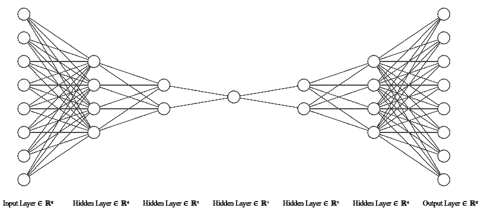
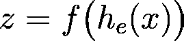
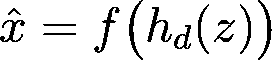
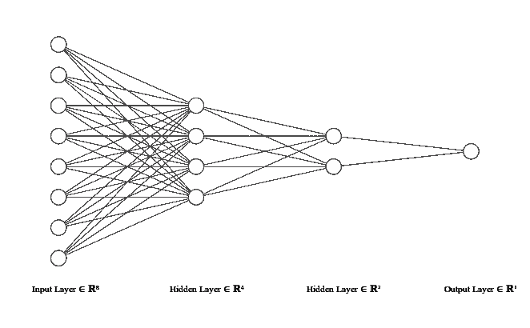
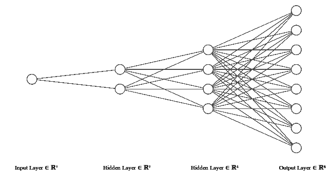
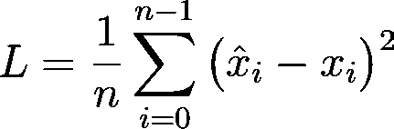
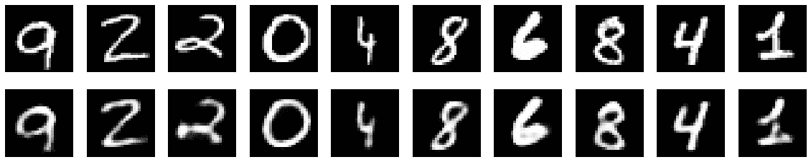

# 在 TensorFlow 2.0 中实现自动编码器

> 原文：<https://towardsdatascience.com/implementing-an-autoencoder-in-tensorflow-2-0-5e86126e9f7?source=collection_archive---------6----------------------->

*by*[*Abien Fred Agarap*](https://twitter.com/afagarap)

> 同时发布于[https://afagarap . works/2019/03/20/implementing-auto encoder-in-tensor flow-2.0 . html](https://afagarap.works/2019/03/20/implementing-autoencoder-in-tensorflow-2.0.html)

G oogle 宣布对世界上最受欢迎的开源机器学习库 TensorFlow 进行重大升级，承诺专注于简单易用、热切执行、直观的高级 API 以及在任何平台上灵活的模型构建。

A new TensorFlow logo unveiled in this year’s TensorFlow Dev Summit at Sunnyvale, CA. Animated logo from [Test Drive TensorFlow 2.0 Alpha by Wolff Dobson and Josh Gordon (2019, March 7)](https://medium.com/tensorflow/test-drive-tensorflow-2-0-alpha-b6dd1e522b01) .

这篇文章是对 TensorFlow 2.0 例子的一个小小的尝试。具体来说，我们将讨论**自动编码器**的[子类化 API](https://www.tensorflow.org/guide/keras#model_subclassing) 实现。

要安装 TensorFlow 2.0，使用下面的`pip install`命令，

`pip install tensorflow==2.0.0`

或者如果你的系统中有一个图形处理器，

`pip install tensorflow-gpu==2.0.0`

通过[tensorflow.org](https://tensorflow.org)的[本指南](https://www.tensorflow.org/install)了解更多安装细节。

在深入研究代码之前，让我们先讨论一下什么是**自动编码器**。

# 自动编码器

我们在机器学习中处理大量的数据，这自然会导致更多的计算。然而，我们也可以选择对模型学习贡献最大的数据部分，从而减少计算量。选择数据的*重要部分*的过程称为*特征选择，*是一个 ***自动编码器*** 的用例数之一。

但是**自动编码器**到底是什么？好吧，让我们首先回忆一下，神经网络是一种计算模型，用于*寻找*描述* *的* *函数数据*特征* ***x*** 及其*值*(一个*回归*任务)或*标签*(一个**

*现在，**自动编码器**也是一个神经网络。但不是找到函数*映射**特征* ***x*** 到*它们对应的值*或*标签* ***y*** ，而是找到将*特征* ***x*** *映射到自身* ***x*** 的函数。等等，什么？我们为什么要这么做？*

*嗯，有趣的是在**自动编码器**内部发生了什么。为了更好的理解，我们来看一个**自动编码器**的图解。*

**

*Illustrated using [NN-SVG](http://alexlenail.me/NN-SVG/index.html). An autoencoder is an artificial neural network that aims to learn how to reconstruct a data.*

*从上图来看，一个**自动编码器**由两部分组成:(1)一个**编码器**，它学习数据的表示，即*重要的* *特征数据的****z***；以及(2)一个**解码器**，它根据它如何构造的想法 ***z*** 来重构数据。*

*回过头来，我们建立了一个**自动编码器**想要找到将 ***x*** 映射到 ***x*** 的函数。它通过其组件来实现这一点。数学上，*

**

****z*** *is the learned data representation by the* ***encoder*** *from input data* ***x****.**

**

***x-hat** is the reconstructed data by the **decoder** based on the learned representation **z**.*

***编码器** *h-sub-e* 从输入特征*中学习数据表示 ***z*** ，然后该表示作为**解码器** *h-sub-d* 的输入，以重构原始数据***x*****

**我们将在下面进一步剖析这个模型。**

# **编码器**

**第一个组件**编码器**，类似于传统的前馈网络。但是，它的任务不是预测值或标签。相反，它的任务是学习数据的结构，即数据表示 ***z*** 。**

****

**Illustrated using [NN-SVG](http://alexlenail.me/NN-SVG/index.html). The **encoder** learns the representation of a given data.**

***编码*是通过将数据输入 ***x*** 传递给**编码器**的隐藏层 ***h*** 来完成的，以便学习数据表示***z = f(h(x))***。我们可以如下实现`Encoder`层，**

**The **encoder** layer of the **autoencoder** written in TensorFlow 2.0 subclassing API.**

**我们首先定义一个继承了`[tf.keras.layers.Layer](https://www.tensorflow.org/api_docs/python/tf/keras/layers/Layer)`的`Encoder` 类，将其定义为一个层而不是一个模型。为什么是图层而不是模型？回想一下，编码器是**自动编码器**型号的*组件*。**

**浏览代码，`Encoder`层被定义为具有一个单独的神经元隐藏层(`self.hidden_layer`)，用于学习输入特性的激活。然后，我们将隐藏层连接到一个层(`self.output_layer`)，该层将数据表示编码到一个较低的维度，该维度由它认为重要的特征组成。因此，`Encoder`层的“输出”就是输入数据 ***x*** 的*学习数据表示* ***z*** 。**

# **解码器**

**第二个组件**解码器**，也类似于一个前馈网络。然而，它不是将数据减少到较低的维度，而是将数据从其较低维度表示 ***z*** 重建到其原始维度 ***x*** 。**

****

**Illustrated using [NN-SVG](http://alexlenail.me/NN-SVG/index.html). The **decoder** learns to reconstruct the data from its lower dimension representation.**

***解码*是通过将较低的维度表示 ***z*** 传递给**解码器**的隐藏层 ***h*** 来完成的，以便将数据重建到其原始维度 ***x = f(h(z))*** 。我们可以如下实现**解码器**层，**

**The **decoder** layer of the **autoencoder** written in TensorFlow 2.0 subclassing API.**

**我们定义了一个`Decoder` 类，它也继承了`[tf.keras.layers.Layer](https://www.tensorflow.org/api_docs/python/tf/keras/layers/Layer)`。**

**`Decoder`层也被定义为具有单个隐藏的神经元层，以通过编码器从学习到的表示中重建输入特征。然后，我们将它的隐藏层连接到一个层，该层将数据表示从较低的维度解码到其原始维度。因此，解码器层的“输出”是来自数据表示 ***z*** 的重构数据 ***x*** 。最终，解码器的输出是自动编码器的输出。**

**现在我们已经定义了我们的**自动编码器**的组件，我们终于可以构建模型了。**

# **构建自动编码器模型**

**我们现在可以通过实例化`Encoder`和`Decoder`层来构建**自动编码器**模型。**

**The **autoencoder** model written in TensorFlow 2.0 subclassing API.**

**如上所述，我们使用**编码器**层的输出作为**解码器**层的输入。就这样吗？不，不完全是。**

**到目前为止，我们只讨论了一个**自动编码器**的组件以及如何构建它，但是我们还没有讨论它实际上是如何学习的。至此，我们只知道*数据流*；从输入层到学习数据表示的**编码器**层，并使用该表示作为重构原始数据的**解码器**层的输入。**

**像其他神经网络一样，**自动编码器**通过[反向传播](https://www.youtube.com/watch?v=LOc_y67AzCA)进行学习。但是我们不是比较模型的值或者标签，而是比较*重构数据* ***x-hat*** 和*原始数据* ***x*** 。让我们称这个比较为*重建误差*函数，它由下面的等式给出:**

****

**The reconstruction error in this case is the [mean-squared error](https://www.youtube.com/watch?v=6OvhLPS7rj4) function that you’re likely to be familiar with.**

**在张量流中，上述等式可以表示如下:**

**Reconstruction error written using TensorFlow core operations.**

**我们到了吗？够近了。只是再补充一些东西。现在我们已经定义了误差函数，我们终于可以为模型编写训练函数了。**

**Training function written in TensorFlow 2.0 following the paradigm of writing the forward pass imperatively through the use of [GradientTape](https://stackoverflow.com/questions/53953099/what-is-the-purpose-of-the-tensorflow-gradient-tape).**

**这种实现反向传播的方式通过使我们能够跟踪梯度以及对其应用[优化算法](http://ruder.io/optimizing-gradient-descent/)而为我们提供了更多的自由。**

**我们说完了吗？让我们看看。**

*   **定义一个**编码器**层。*已检查*。**
*   **定义一个**解码器**层。*已检查*。**
*   **使用**编码器**和**解码器**层构建**自动编码器**。*已检查*。**
*   **定义重建误差函数。*已检查*。**
*   **定义培训功能。*已检查*。**

**是啊！我们完事了。我们终于可以训练我们的模型了！**

**但在此之前，让我们实例化一个我们之前定义的`Autoencoder`类，以及一个要使用的优化算法。然后，让我们加载我们想要重建的数据。对于这篇文章，让我们使用*难忘的* [MNIST 手写数字数据集](http://yann.lecun.com/exdb/mnist/)。**

**我们可以使用 [TensorBoard](https://www.tensorflow.org/guide/summaries_and_tensorboard) 可视化我们的训练结果，为此，我们需要使用`[tf.summary.create_file_writer](https://www.tensorflow.org/versions/r2.0/api_docs/python/tf/summary/create_file_writer)`为结果定义一个摘要文件编写器。**

**Instantiating the **autoencoder** model, and the optimization function. Loading the MNIST dataset. Finally, the training loop for our **autoencoder** model.**

**接下来，我们使用定义的摘要文件编写器，并使用`[tf.summary.record_if](https://www.tensorflow.org/versions/r2.0/api_docs/python/tf/summary/record_if)`记录培训摘要。**

**我们最终(现在真正地)可以通过向它提供小批量数据来训练我们的模型，并通过我们之前定义的`train`函数计算它的每次迭代的损失和梯度，该函数接受定义的*误差函数*、 ***自动编码器*** *模型*、*优化算法*和*小批量*数据。**

**在训练模型的每一次迭代之后，计算的重构误差应该减少，以查看模型是否真的在学习(就像在其他神经网络中一样)。最后，为了在 TensorBoard 中记录训练摘要，我们使用`[tf.summary.scalar](https://www.tensorflow.org/versions/r2.0/api_docs/python/tf/summary/scalar)`记录重建误差值，使用`[tf.summary.image](https://www.tensorflow.org/versions/r2.0/api_docs/python/tf/summary/image)`记录原始数据和重建数据的小批量。**

**经过一些时代，我们可以开始看到一个相对良好的 MNIST 图像重建。**

****

**Plotted using [matplotlib](https://matplotlib.org/). Results on MNIST handwritten digit dataset. Images at the top row are the original ones while images at the bottom row are the reconstructed ones.**

**重建的图像可能足够好，但它们非常模糊。可以做许多事情来改善这个结果，例如添加更多的层和/或神经元，或者使用卷积神经网络架构作为**自动编码器**模型的基础，或者使用[不同种类的**自动编码器**](https://www.deeplearningbook.org/contents/autoencoders.html) 。**

# **结束语**

****自动编码器**对于降维非常有用。但是它也可以用于[数据去噪](https://www.deeplearningbook.org/contents/autoencoders.html)，以及用于[学习数据集的分布](https://blog.keras.io/building-autoencoders-in-keras.html)。我希望我们在这篇文章中已经涵盖了足够多的内容，让你兴奋地学习更多关于**自动编码器**！**

**完整的代码可在[这里](https://gist.github.com/AFAgarap/326af55e36be0529c507f1599f88c06e)获得。如果您有任何反馈，您可以通过 [Twitter](https://twitter.com/afagarap) 联系我。我们也可以通过[脸书](https://facebook.com/afagarap)、 [Instagram](https://instagram.com/afagarap) 和/或 [LinkedIn](https://www.linkedin.com/in/abienfredagarap/) 联系！**

# **参考**

1.  **马丁·阿巴迪、阿希什·阿加瓦尔、保罗·巴勒姆、尤金·布莱夫多、陈质枫、克雷格·西特罗、格雷格·科拉多、安迪·戴维斯、杰弗里·迪恩、马蒂厄·德文、桑杰·格玛瓦特、伊恩·古德菲勒、安德鲁·哈普、杰弗里·欧文、迈克尔·伊萨德、拉斐尔·约泽福维茨、杨青·贾、卢卡斯·凯泽、曼朱纳斯·库德鲁尔、乔希·莱文伯格、丹·曼内、迈克·舒斯特、拉杰特·蒙加、雪莉·穆尔、德里克·默里、克里斯·奥拉、黄邦贤·施伦斯、伯努瓦·施泰纳 [*TensorFlow:异构系统上的大规模机器学习*](https://arxiv.org/abs/1603.04467) (2015)。tensorflow.org[公司](https://tensorflow.org)提供的软件。**
2.  **Francois Chollet，[在 Keras 建立自动编码器](https://blog.keras.io/building-autoencoders-in-keras.html) (2016 年 5 月 14 日)，[Keras 博客](https://blog.keras.io/)。**
3.  **I. Goodfellow，Y. Bengio，& A .库维尔，[深度学习](https://deeplearningbook.org) (2016)。麻省理工出版社。**