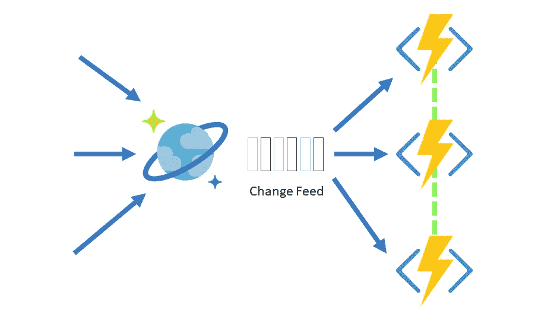
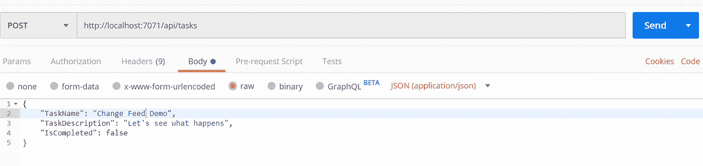
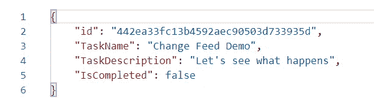
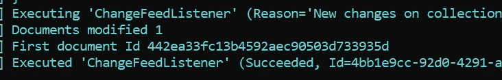
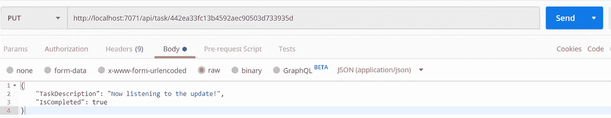
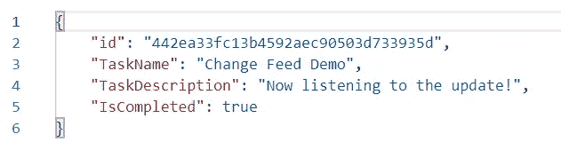
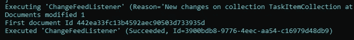

# 使用 C#中的 Azure 函数实现 Cosmos DB 变更提要

> 原文：<https://towardsdatascience.com/implementing-cosmos-db-change-feed-using-azure-functions-in-c-d76a7f3c4ac?source=collection_archive---------5----------------------->

Azure Cosmos DB 有一个很酷的特性叫做 [Change Feed](https://docs.microsoft.com/en-us/azure/cosmos-db/change-feed) ，它允许我们通过监听容器中发生的任何变化来对我们的容器进行实时分析。

然后，这些更改被生成为文档的排序列表，这些列表按照它们被修改的顺序进行了更改。这些是持久的，可以增量处理。然后，输出可以由多个使用者进行并行处理。

这个特性在一个项目的变化可能触发另一个事件或附加动作的情况下非常有用。一个例子可能是一个项目被插入到我们的容器中，我们用它来触发一个网站警报，告诉它在我们的容器中有一个新的项目。

**默认情况下，所有 Cosmos DB 帐户都启用变更订阅功能**。您不需要做任何特殊的事情来设置它，并且您可以使用您在您的 Cosmos 帐户上提供的吞吐量来读取更改提要，就像任何常规的 Cosmos DB 操作一样。

目前，变更提要包括对容器中的项目进行插入和更新操作(这是我们在本教程中要关注的)。如果您想要捕获容器中项目的删除，您可以使用一个标记来捕获软删除，或者在项目上设置一个 [**生存时间(TTL)**](https://docs.microsoft.com/en-us/azure/cosmos-db/time-to-live) 周期，并使用该属性来捕获更改提要。请记住，更改馈送需要在比 TTL 间隔更短的时间内处理。

更改在更改提要中只出现一次。管理您可能需要的任何检查点逻辑需要由您的应用程序来完成。[更改进给处理器库](https://docs.microsoft.com/en-us/azure/cosmos-db/change-feed-processor)很适合这种情况，因为它提供了自动检查点。对于这个简单的例子，现在不用担心这个。

更改可以从任何时间点同步，并且在每个逻辑分区键值内，它按修改的顺序排序。如果您有一个大型容器，那么变更提要可以由多个使用者处理，我们可以在同一容器上同时运行多个变更提要。

[**在这篇博文发表的时候，只有 SQL API 和 Gremlin API 支持变更提要。NET、Java、Python 和 Node.js 应用**](https://docs.microsoft.com/en-us/azure/cosmos-db/change-feed#supported-apis-and-client-sdks) 。

我们可以通过三种方式使用变更馈送:

1.  [使用 Azure Cosmos DB SQL API SDK](https://docs.microsoft.com/en-us/azure/cosmos-db/read-change-feed#using-the-azure-cosmos-db-sql-api-sdk)
2.  [使用更换进给处理器库](https://docs.microsoft.com/en-us/azure/cosmos-db/read-change-feed#using-the-change-feed-processor-library)
3.  [使用 Azure 功能](https://docs.microsoft.com/en-us/azure/cosmos-db/read-change-feed#using-azure-functions)

使用 Azure 函数是迄今为止开始使用 Cosmos DB change feed 最简单的方法。我们实际上创建了在容器的变更提要中的每个新事件上触发的函数。 [CosmosDB 触发器](https://docs.microsoft.com/en-us/azure/azure-functions/functions-create-cosmos-db-triggered-function#prerequisites)允许我们使用来改变提要功能，而不用担心任何基础设施。

出于我们的目的，我将创建两个函数:

1.  一个 [HTTP 触发器](https://docs.microsoft.com/en-us/azure/azure-functions/functions-bindings-http-webhook)函数，允许我们插入和更新新的条目。
2.  一个 [CosmosDB Trigger](https://docs.microsoft.com/en-us/azure/azure-functions/functions-bindings-cosmosdb-v2) 函数，它使用变更提要来跟踪我们的容器上的变更和插入，然后将这些持久化到一个租用容器中。

我使用 2.x 运行时来运行我们的函数。

现在，即使更改提要支持 Gremlin API 和 SQL API Cosmos DB 帐户，[Azure 函数的 Cosmos DB 触发器只支持 SQL API](https://docs.microsoft.com/en-us/azure/azure-functions/functions-bindings-cosmosdb-v2#supported-apis) ，所以这就是我们将在本演示中使用的。

你可以在这里查看[完整的代码库](https://github.com/willvelida/ChangeFeedDemo/)。这包括我在这个项目中使用的相关模型和助手类。我只是使用 Azure Cosmos DB 本地模拟器作为我的 Cosmos 帐户。本地仿真器对于在 Azure 中进行本地开发而言非常酷，无需在实际的数据库上花钱。

让我们首先创建 HTTP 触发器函数来创建和更新我们的项目:

这里我们有两个函数， **CreateTaskItem** 和 **UpdateTaskItem。**在我们的 create 函数中，我们使用 HTTP 触发器输入向我们的 Cosmos DB 数据库发出 POST 请求。我们只是创建一个简单的 TaskItem 并将其持久化到我们的 TaskCollection 集合中。我在这里使用 CosmosDB 绑定只是为了这个例子，但是如果你在生产用例中使用 Azure 函数和 Cosmos DB，你应该考虑使用 Cosmos DB 的单一实例。对于我们的更新函数，我们只是向 task/{id}的路由发出一个 PUT 请求，其中 id 是我们的任务 id。

现在让我们创建另一个函数，它监听我们的 HTTP 函数并将这些更改记录到更改提要中:

在这里，我创建了一个名为**changeed listener**的函数，它连接到我们的 *TaskItemCollection* 并监听容器上的任何变化。然后，它将这些更改保存到一个 *LeaseCollection* 容器中。在我们的函数中，每次我们在 *TaskItemCollection* 中创建或更新一个 *TaskItem* 时，它都会打印出有多少文档被更改(在我们的简单用例中只有 1 个)以及被更改的文档的 id 是什么。

**在生产场景**中，我们可以将此作为消息发送到事件中心，使用 [Twilio 绑定](https://docs.microsoft.com/en-us/azure/azure-functions/functions-bindings-twilio)通过文本发送，甚至作为通知发送到网站。但是现在，这个简单的函数就可以了。

我们已经完成了两个函数，所以让我们用它们做点什么吧！

因为我在本地运行，所以我将使用 [Postman](https://www.getpostman.com/) 来触发我的 HTTP 函数。让我们从 Create 函数开始，创建一个任务。为此，我们将向我们的函数 app 发出一个 **POST** 请求，并传入一个 **JSON** 主体，其中包括 *TaskName* 、 *TaskDescription* 和 *IsCompleted* 属性。

点击 send 按钮发送我们的 **POST** 请求，如果我们的函数正常工作，我们应该会看到下面的 **JSON** 响应:

现在我们的 HTTP 函数已经被触发了，不久之后我们的**changeedplistener**函数就会被触发，告诉我们有一个修改。记下下面的文档 ID。

它与我们刚刚创建的 *TaskItem* 文档的 Id 相同！在 postman 中复制该 id，并将其作为参数传递给我们的 **UpdateTaskItem** 函数。让我们更改*任务描述*和*已完成*值，并更新我们的项目:

看看我们的函数返回的响应体。我们可以看到，我们的项目现在已经用更新后的值进行了更改。

当我们查看函数应用程序的日志时，我们看到变更提要已经跟踪了我们对 *TaskItem* 的更新。

所以你有它！Azure Cosmos DB 变更提要的一个非常基本的例子！

花点时间让[看看代码](https://github.com/willvelida/ChangeFeedDemo/)，并随意克隆它，玩玩它！如你所见，使用 Azure 函数实现变更提要功能非常简单直接。

我们还可以使用[新 Azure Cosmos SDK v3 库](https://docs.microsoft.com/en-us/azure/cosmos-db/change-feed-processor)中的变更提要处理器来利用变更提要特性，所以将来我会尝试一下并写点东西。

如果您有任何问题，欢迎在此评论或联系我。