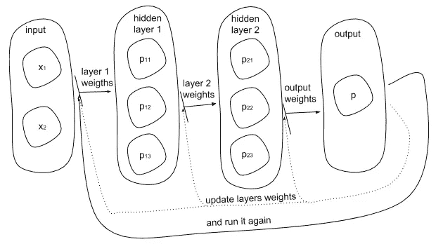
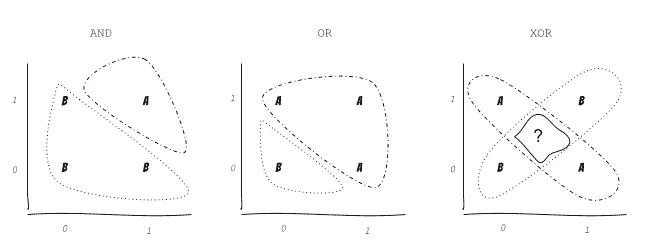
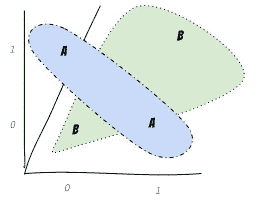

# 从零开始实现深度学习网络。Scala 例子。

> 原文：<https://towardsdatascience.com/implementing-deep-learning-from-scratch-scala-example-340817ce7760?source=collection_archive---------14----------------------->

在过去的几年里，深度学习受到了很多关注。它最初是一种巫术崇拜，现在正在成为一项非常标准的工程任务。它变得不那么神奇，但更像是一个成熟的工具集，可以解决各种各样与数据相关的问题。

尽管如此，仍然有一个神秘的地方，因为它并不清楚这个东西实际上如何能够自己学习，甚至在没有程序员直接干预的情况下“深入”学习。让我们试着理解这一点。

# 简而言之就是神经网络。

“深度学习”的概念指的是一个[人工神经网络](https://en.wikipedia.org/wiki/Artificial_neural_network)，它在某种程度上模仿了我们大脑的工作模式。基本上，它是关于通过连接层的链发送输入，其中每一层对最终结果产生自己的影响。

实际的学习是通过迭代搜索每层必须提供的最佳可能影响/权重来实现的，以便获得我们需要的输出。

Figure 1\. Neural Network with 2 hidden layers

但是在我们看一看实际的实现之前，理解所有这些层(也称为隐藏层)的用途是很重要的。 [XOR](https://en.wikipedia.org/wiki/XOR_gate) 的问题说明了一切。正如你在图 2 的*中所看到的，*你找不到任何一个线性函数能把 A 的面积和 B 的面积分开，因为你可以用[和](https://en.wikipedia.org/wiki/AND_gate)和[或](https://en.wikipedia.org/wiki/OR_gate)来做。中间有一个交叉点，不允许我们决定我们是在 A 段还是在 B 段。

Figure 2\. AND, OR, XOR gates

为了找到答案，我们用额外的维度(或者更多的维度)来扩展我们的 2D 空间，所以你最终可以把一个特征从另一个特征中分离出来。

Figure 3\. 3D space of a XOR gate

就神经网络而言，额外维度只是另一个隐藏层。所以我们所需要的——是弄清楚这另一个维度是否能让我们解决 XOR 问题。为此，我们将应用一种[反向传播](https://en.wikipedia.org/wiki/Backpropagation)算法——1975 年发表的关键概念，使互连层能够学习它们自己的权重，或者换句话说，学习它们对帮助我们在 XOR 中分离 A 和 B 有多大意义。

有了反向传播算法，我们将基本上应用 3 个步骤来实现我们的“深度”学习:

1.  前进传球
2.  偶数道次
3.  更新权重

*前向传递*是利用当前可用的权重进行预测。*倒向* *传递*给我们关于贡献的信息，每一次预测都做不到目标。有了这些信息，我们将*修正*我们的维度权重，并希望在下一次迭代中，我们的预测将使我们更接近目标。

有不同的方法来确定重量。其中之一是[梯度下降](https://en.wikipedia.org/wiki/Gradient_descent)，我们也将在这里使用。

# Scala 中的实现。

在 Scala 代码中，这 3 个步骤的过程可能是这样的:

Listing 1\. Basic Neural Network Pattern

让我们仔细看看我们的第一步— *forward* 函数。我们将把它实现为递归的:

Listing 2\. Making prediction with forward pass

*向前传球*负责:

1.将权重应用于网络层

2.将该加权层通过[s 形激活](https://en.wikipedia.org/wiki/Sigmoid_function)功能

作为一个结果，我们在一个网络中得到一个新的分层预测列表。有了这个*列表*之后，我们可以去寻找每个层的预测导致错过目标的错误(规则输出)。

我们将从目标值之间的差异开始，我们希望达到我们在最后一步中所做的预测。由于我们预测的*列表*是以后进先出的方式生成的，所以*列表*中的第一个元素也是我们做出的最后一个预测，所以我们可以取一个给定的目标，看看我们离目标有多远。有了第一个误差值，我们就可以使用*反向传播*模式*来寻找其余的误差值。*

Listing 3\. Finding the first predictions error and passing it to backpropagation

由于我们在训练网络的最终端发现了一个误差幅度(或增量),我们可以用它来发现前一层的误差增量，因为我们知道这一层得到的预测。在我们进入另一个递归函数之前，每隔一个隐藏层都是如此。

Listing 4\. Backpropagation pattern

你可能会注意到，我们提供的权重是倒序的，这是因为计算反向路径的唯一方法是从网络的末端开始计算。

总的来说，我们到此为止。我们知道如何计算预测及其误差增量，以及如何使用它来更新权重。我们唯一需要做的是开始迭代我们的数据集，并将更新的权重应用于我们试图满足的预测。这样做很长时间，直到我们得到一个尽可能接近目标的权重。

为了验证你在每一次迭代中有多接近，你需要确定一个网络损耗。随着我们的网络学习，损失必须减少。

Listing 5\. Calculation of a prediction’s loss

如果您运行为本博客提供的[示例实现](https://github.com/zavalit/neural-network-example)，您将会看到:

Neural Network learning log

因此，减少损失意味着我们的预测更接近他们应该有的目标值。如果我们看一看在训练过程结束时所做的预测，它们与预期值非常接近。

Training results. XOR Gate is fulfilled

# 有点小技巧。

可能是最后一件还没有涉及到的事情，就是网络的初始权重。我们非常了解如何更新它们，但是我们首先从哪里得到它们呢？为了澄清这一点，我们需要后退一步，回顾一下 layer 预测的定义。我们已经看到，要制作一个，我们需要两个步骤:

1.  *输入*和*权重*的标量积: ***net = np.dot(输入，权重)***
2.  激活具有 *sigmoid* 功能的产品:***1/(1+NP . exp(-net))***

但是理论上第一步实际上看起来是这样的:

> ***net = np.dot(输入，权重)+ b***

其中 *b* 代表*偏差*或阈值，必须是另一个张量，负责在得到的*网*被 sigmoid 激活之前对其进行调节。我们实际上还需要有一个*偏差*，而不仅仅是*权重*就像我们之前做的那样，听起来我们需要实现更多的东西。但是这里有一个技巧。

为了避免额外的复杂性，我们只需执行以下操作:

1.  向我们的训练集张量添加额外的一列(清单 6。第 3 行)
2.  用相同的一列扩展层权重(清单 6。第 11 行)

因此在我们的优化问题中加入了一个*偏差*。

Listing 6\. Prepare network weights and bias

回到我们从哪里得到*权重*的问题。看看第 1 行上的 *generateRandomWeight* 函数。这就是我们的权重最初的来源，它们或多或少是随机的。第一次意识到这一点是很奇怪的，预测的主干— *权重*，可能只是随机生成的，并且在我们更新它们几次后仍然可以进行正确的预测。

# **结论。**

所以希望你能够看到“深度学习”非常接近于常规的编程任务。围绕这种软件和平的秘密，基本上基于两种主要模式:

1.  通过应用反向传播模式，确定我们的神经网络预测离实际目标有多远。
2.  通过借助于随机梯度下降模式更新层权重来逐渐减小该误差空间。

可能是一些有用的链接:

*   这篇博文中使用的代码库:[https://github.com/zavalit/neural-network-example](https://github.com/zavalit/neural-network-example)
*   神经网络游乐场:[http://playground.tensorflow.org](http://playground.tensorflow.org)
*   深入学习(基于 MXNet):[http://d2l . ai](http://d2l.ai)
*   从数学角度看密集连通层的工作:【https://www.youtube.com/watch?v=fXOsFF95ifk 
*   Scala 中的 Numpy 实现[https://github.com/botkop/numsca](https://medium.com/@koen_95886/nice-article-b83b6b7afbda?source=post_info_responses---------0---------------------)

*PS。我想值得一提的是，这不是一篇关于用 Scala 编写的神经网络的生产就绪实现的博文。也许下次吧；)这里的主要焦点是尽可能透明和明显地展示基本模式。我希望你喜欢它。*