# 使用 Python 实现和分析不同的激活函数和权重初始化方法

> 原文：<https://towardsdatascience.com/implementing-different-activation-functions-and-weight-initialization-methods-using-python-c78643b9f20f?source=collection_archive---------7----------------------->

## [深入分析](https://medium.com/towards-data-science/in-depth-analysis/home)

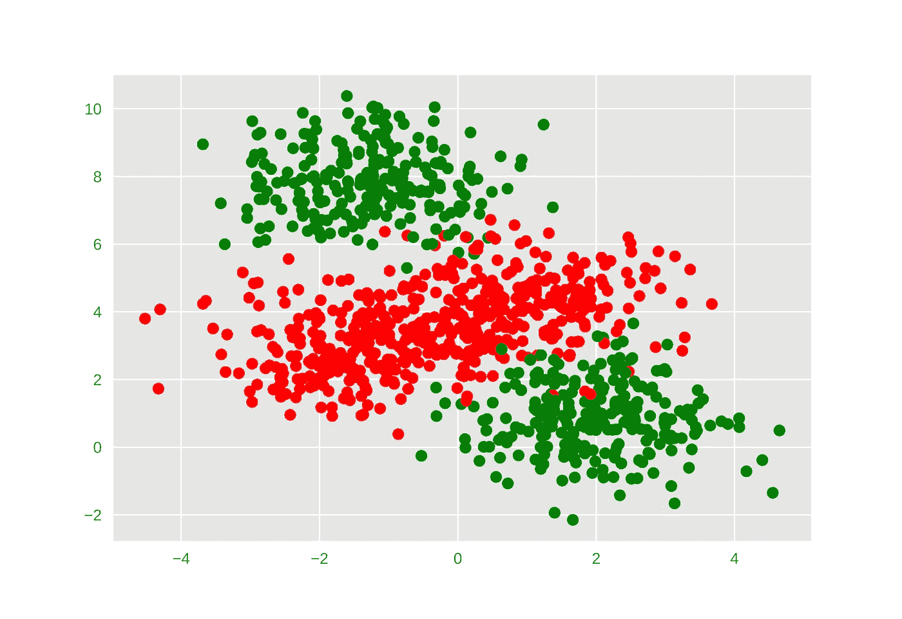

Non-Linearly Separable Data

在本帖中，我们将讨论如何在 python 中实现非线性激活函数和权重初始化方法的不同组合。此外，我们将分析激活函数和权重初始化方法的选择将如何影响准确性以及我们使用非线性可分离玩具数据集在深度神经网络中减少损失的速率。这是我上一篇关于[激活函数和权重初始化方法](https://medium.com/datadriveninvestor/deep-learning-best-practices-activation-functions-weight-initialization-methods-part-1-c235ff976ed)的后续文章。

注意:本文假设读者对神经网络、权重、偏差和反向传播有基本的了解。如果你想学习前馈神经网络的基础知识，可以看看我以前的文章(本文末尾的链接)。

> ***引用注:本文内容和结构基于四分之一实验室深度学习讲座—***[***pad hai***](https://padhai.onefourthlabs.in)***。***

# 激活功能概述

激活函数是非线性函数，我们将该函数应用于到达特定神经元的输入数据，并且该函数的输出将作为输入被发送到下一层中存在的神经元。

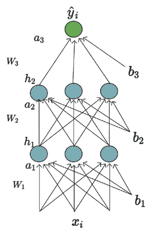

即使我们使用没有非线性激活函数的非常非常深的神经网络，我们也只是将' **y** '学习为' **x** '的线性变换。它只能表示' **x** '和' **y** '之间的线性关系。换句话说，我们将被限制于学习线性决策边界，并且我们不能学习任何任意的非线性决策边界。这就是为什么我们需要激活函数——非线性激活函数来学习输入和输出之间复杂的非线性关系。

一些常用的激活功能，

*   **后勤**
*   Tanh
*   **ReLU**
*   **泄漏的 ReLU**

# 重量初始化概述

当我们训练深度神经网络时，权重和偏差通常用随机值初始化。在将权重初始化为随机值的过程中，我们可能会遇到消失梯度或爆炸梯度等问题。因此，网络将需要很长时间才能收敛(如果它真的收敛的话)。最常用的权重初始化方法:

*   Xavier 初始化
*   He 初始化

要理解最常用的激活函数和权重初始化方法背后的直觉，请参考我以前关于激活函数和权重初始化方法的帖子。

[](https://medium.com/datadriveninvestor/deep-learning-best-practices-activation-functions-weight-initialization-methods-part-1-c235ff976ed) [## 深度学习最佳实践:激活函数和权重初始化方法—第 1 部分

### 最佳激活函数和权重初始化方法可提高精确度

medium.com](https://medium.com/datadriveninvestor/deep-learning-best-practices-activation-functions-weight-initialization-methods-part-1-c235ff976ed) 

# 让我们编码


Photo by [Goran Ivos](https://unsplash.com/@goran_ivos?utm_source=medium&utm_medium=referral) on [Unsplash](https://unsplash.com?utm_source=medium&utm_medium=referral)

在编码部分，我们将涉及以下主题。

1.  **生成不可线性分离的数据**
2.  **写一个前馈网络类**
3.  **绘图设置代码**
4.  **分析乙状结肠激活**
5.  **分析 tanh 激活**
6.  **分析 ReLU 激活**
7.  **分析泄漏 ReLU 激活**

## 概观

在本节中，我们将通过尝试激活函数和权重初始化方法的各种组合来比较简单前馈神经网络的准确性。

我们这样做的方式是，首先我们将生成具有两个类的非线性可分离数据，并编写我们简单的前馈神经网络，它支持所有的激活函数和权重初始化方法。然后使用损失图比较不同的场景。

如果你想跳过理论部分，直接进入代码，

[](https://github.com/Niranjankumar-c/DeepLearning-PadhAI) [## niranjankumar-c/deep learning-PadhAI

### 来自 pad hai-Niranjankumar-c/deep learning-pad hai 的深度学习课程相关的所有代码文件

github.com](https://github.com/Niranjankumar-c/DeepLearning-PadhAI) 

## 将库作为 L 导入

在我们开始分析前馈网络之前，首先我们需要导入所需的库。我们正在导入`numpy`来评估神经网络中两个向量之间的矩阵乘法和点积，导入`matplotlib`来可视化数据，并从`sklearn`包中导入函数来生成数据和评估网络性能。在 Jupiter notebook import 中内联显示/呈现 HTML 内容`HTML`。

在第 19 行，我们通过使用`LinearSegmentedColormap`的`[from_list()](https://matplotlib.org/api/_as_gen/matplotlib.colors.LinearSegmentedColormap.html#matplotlib.colors.LinearSegmentedColormap.from_list)`方法从颜色列表中创建一个定制的颜色映射。

# 生成虚拟数据

请记住，我们使用前馈神经网络是因为我们想要处理非线性可分数据。在本节中，我们将了解如何随机生成非线性可分数据。

为了随机生成数据，我们将使用`make_blobs`来生成高斯分布的点。我在具有四个斑点`centers=4`的 2D 空间中生成了 1000 个数据点，作为多类分类预测问题。每个数据点有两个输入和 0、1、2 或 3 个类别标签。注意`make_blobs()`函数会生成线性可分的数据，但是我们需要有非线性可分的数据进行二分类。

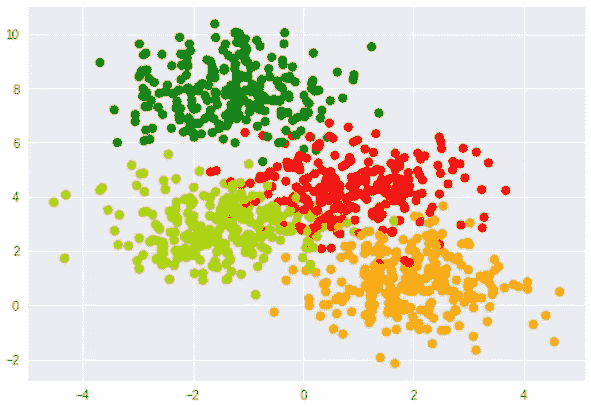

Multi-Class Linearly Separable Data

```
labels_orig = labels
labels = np.mod(labels_orig, 2)
```

将这 4 个类转换为二进制分类的一种方法是将这 4 个类的余数除以 2，这样我就可以得到新的标签 0 和 1。

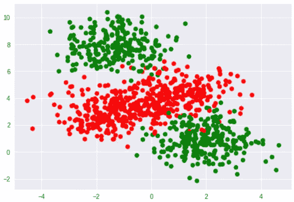

从该图中，我们可以看到斑点的中心被合并，使得我们现在有一个二元分类问题，其中决策边界不是线性的。一旦我们准备好数据，我已经使用`train_test_split` 函数以 90:10 的比例分割`training`和`validation`的数据

# 前馈网络

在本节中，我们将编写一个通用类，它可以通过将隐藏层的数量和每个隐藏层中的神经元数量作为输入参数来生成神经网络。

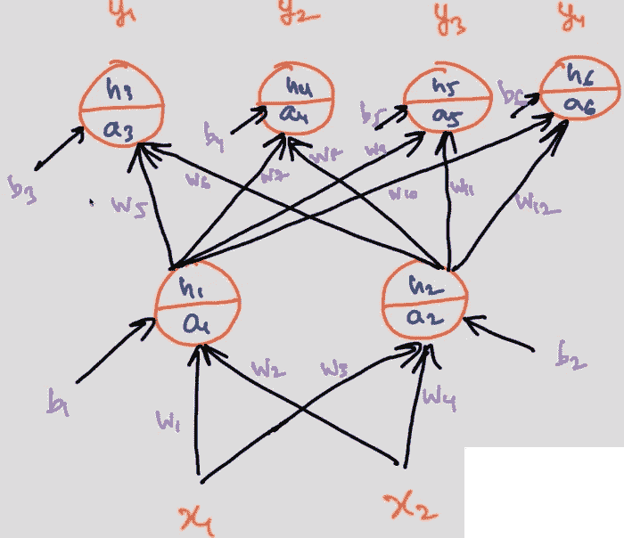

Simple Neural Network

该网络总共有六个神经元——两个在第一个隐藏层，四个在输出层。对于这些神经元中的每一个，预激活用‘a’表示，后激活用‘h’表示。在网络中，我们总共有 18 个参数——12 个权重参数和 6 个偏差项。

我们将在一个名为 **FFNetwork** *的类中编写我们的神经网络。*

在`FirstFFNetwork`类中，我们有 8 个函数，我们将一个接一个地检查这些函数。

```
def __init__(self, init_method = 'random', activation_function = 'sigmoid', leaky_slope = 0.1):
    ......
```

`__init__`函数初始化网络的所有参数，包括权重和偏差。该函数接受几个参数，

*   `init_method`:用于初始化网络所有参数的初始化方法。支持—“随机”、“零点”、“何”和“泽维尔”。
*   `activation_function`:用于学习非线性决策边界的激活函数。支持—“sigmoid”、“tanh”、“relu”和“leaky_relu”。
*   `leaky_slope`:漏 ReLU 的负斜率。默认值设置为 0.1。

在第 5–10 行中，我们设置了网络配置和要在网络中使用的激活功能。

```
self.layer_sizes = [2, 2, 4]
```

`layer_sizes`表示网络有两个输入，第一个隐藏层有两个神经元，第二个隐藏层有 4 个神经元，在这种情况下，第二个隐藏层也是最后一层。之后，我们有一堆“if-else”权重初始化语句，在这些语句中，我们只根据选择的方法初始化权重，偏差总是初始化为值 1。权重和偏差的初始值存储在字典`self.params`中。

```
def forward_activation(self, X):     
    if self.activation_function == "sigmoid":      
        return 1.0/(1.0 + np.exp(-X))    
    elif self.activation_function == "tanh":      
        return np.tanh(X)    
    elif self.activation_function == "relu":      
        return np.maximum(0,X)    
    elif self.activation_function == "leaky_relu":      
        return np.maximum(self.leaky_slope*X,X)
```

接下来，我们有`forward_activation`函数，它将输入‘X’作为参数，并根据激活函数的选择计算输入的激活后值。

```
def grad_activation(self, X):
    ......
```

函数`grad_activation`也将输入‘X’作为参数，计算激活函数在给定输入处的导数并返回它。

```
def forward_pass(self, X, params = None):.......  
def grad(self, X, Y, params = None):
    .......
```

之后，我们有两个函数`forward_pass`来描述向前传球。向前传球包括两步

1.  激活后—计算输入**x**权重 **w** 和相加偏差 **b** 之间的点积
2.  预激活—获取后激活的输出，并在其上应用激活功能。

`grad`函数表征网络中每个参数的梯度计算，并将其存储在一个名为`gradients`的列表中。不要太担心我们是如何得到梯度的，因为我们将使用 Pytorch 来完成繁重的工作，但是如果你有兴趣学习它们，可以看看我以前的文章。

[](https://hackernoon.com/building-a-feedforward-neural-network-from-scratch-in-python-d3526457156b) [## 用 Python 从头开始构建前馈神经网络

### 在没有任何框架的情况下，构建您的第一个通用前馈神经网络

hackernoon.com](https://hackernoon.com/building-a-feedforward-neural-network-from-scratch-in-python-d3526457156b) 

```
def fit(self, X, Y, epochs=1, algo= "GD", display_loss=False, 
          eta=1, mini_batch_size=100, eps=1e-8,  
          beta=0.9, beta1=0.9, beta2=0.9, gamma=0.9 ):
```

接下来，我们定义`fit`方法，该方法将输入‘X’和‘Y’作为强制参数，以及实现梯度下降算法的不同变体所需的一些可选参数。请参考我以前的帖子，了解如何实现算法的详细解释。

[](https://hackernoon.com/implementing-different-variants-of-gradient-descent-optimization-algorithm-in-python-using-numpy-809e7ab3bab4) [## 使用 Numpy 在 Python 中实现梯度下降优化算法的不同变体

### 了解 tensorflow 或 pytorch 如何使用 numpy 实现优化算法，并使用…

hackernoon.com](https://hackernoon.com/implementing-different-variants-of-gradient-descent-optimization-algorithm-in-python-using-numpy-809e7ab3bab4) 

```
def predict(self, X):
```

现在我们定义我们的预测函数将输入`X`作为一个参数，它期望是一个`numpy`数组。在预测函数中，我们将使用训练好的模型计算每个输入的前向传递，并发回一个包含每个输入数据的预测值的 numpy `array`。

# 用于绘图和训练神经网络的设置

在本节中，我们将定义一个函数来评估神经网络的性能，并创建图形来可视化更新规则的工作。这种设置有助于我们使用不同的激活函数、不同的权重初始化方法和梯度下降的不同变量的绘图更新规则来运行不同的实验

首先，我们实例化前馈网络类，然后在具有 10 个时期和设置为 1 的学习率的训练数据上调用`fit`方法(这些值是任意的，不是该数据的最佳值，您可以围绕这些值进行操作，并找到最佳时期数和学习率)。

然后我们将调用`post_process`函数来计算神经网络的训练和验证精度(第 2–11 行)。我们还根据神经网络的预测值绘制了不同大小的输入点的散点图。

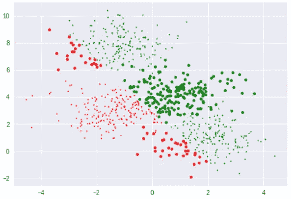

Scatter Plot

图中每个点的大小由一个公式给出，

```
s=15*(np.abs(Y_pred_binarised_train-Y_train)+.2)
```

该公式采用预测值和实际值之间的绝对差值。

*   如果实际值等于预测值，则大小= 3
*   如果实际值不等于预测值，则大小= 18

图中的所有小点表示模型正确预测了这些观察值，大点表示这些观察值分类不正确。

第 20–29 行，我们绘制了使用反向传播从网络获得的每个参数的更新。在我们的网络中，总共有 18 个参数，所以我们迭代了 18 次，每次我们将找到每个参数得到的更新，并使用 subplot 绘制它们。例如，在 iᵗʰ纪元=Wᵢ₊₁-wᵢ更新 wᵢ权重

# 分析乙状结肠激活

为了分析 sigmoid 激活函数对神经网络的影响，我们将激活函数设置为“sigmoid ”,并执行神经网络类。

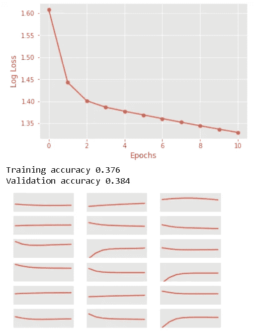

即使我们已经运行了很少的迭代，网络的损耗也在下降。通过使用`post_process`函数，我们能够绘制 18 个支线剧情，我们没有提供任何轴标签，因为这不是必需的。18 个参数的 18 个图按行主顺序绘制，表示参数接收更新的频率。前 12 个图表示权重接收的更新，后 6 个图表示网络中偏置项接收的更新。

在任一子图中，如果曲线更靠近中间，则表明特定参数没有得到任何更新。我们将编写一个`for — loop`来执行所有可能的权重初始化组合，而不是手动执行每个权重初始化。

```
for init_method in ['zeros', 'random', 'xavier', 'he']:
  for activation_function in ['sigmoid']:
    print(init_method, activation_function)
    model = FFNetwork(init_method=init_method,activation_function = activation_function)
    model.fit(X_train, y_OH_train, epochs=50, eta=1, algo="GD", display_loss=True)
    post_process(plot_scale=0.05)
    print('\n--\n')
```

在上面的代码中，我只是添加了两个“for”循环。一个“for”循环用于重量初始化，另一个“for”循环用于激活功能。一旦执行了上面的代码，就会看到神经网络通过保持激活函数— sigmoid 常数，尝试了所有可能的权重初始化方法。

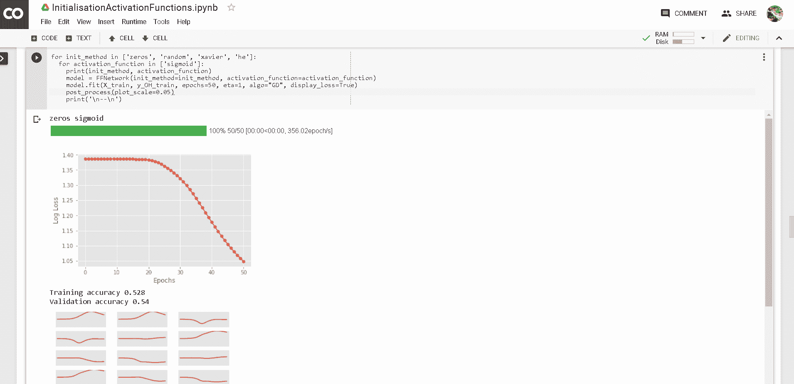

Sigmoid Function Execution

如果用 sigmoid 观察零权重初始化方法的输出，可以看到对称性破缺问题发生在 sigmoid 神经元中。一旦我们将权重初始化为零，在所有后续迭代中，权重将保持不变(它们将远离零，但它们将相等)，这种对称性在训练期间将永远不会打破。这种现象被称为**对称性破缺问题**。因为这个问题，我们的准确率只有 54%。

在随机初始化中，我们可以看到对称性破缺的问题没有发生。这意味着所有的权重和偏差在训练期间取不同的值。通过使用 Xavier 初始化，我们得到了不同权重初始化方法的最高精度。 **Xavier 是 sigmoid 和 tanh 激活函数的推荐权重初始化方法。**

# 分析 Tanh 激活

我们将使用相同的代码，通过在第二个“for”循环中包含关键字“tanh ”,以不同的权重初始化方法组合来执行 tanh 激活函数。

```
for activation_function in ['tanh']:
```

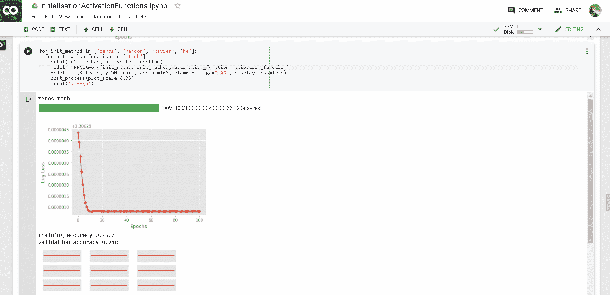

Tanh Activation

在 tanh 激活的零初始化中，从权重更新支线剧情中，我们可以看到 tanh 激活几乎学不到什么东西。在所有图中，曲线更接近于零，表明参数没有从优化算法获得更新。这种现象背后的原因是，tanh 在 x = 0 时的值为零，tanh 的导数也为零。

当我们用 tanh 进行 Xavier 初始化时，我们能够从神经网络获得更高的性能。仅通过改变权重初始化的方法，我们就能够获得更高的准确度(86.6%)。

# 分析 ReLU 激活

通过在第二个“for”循环中包含关键字“relu ”,我们将使用相同的代码来执行具有不同权重初始化方法组合的 ReLU 激活函数。

```
for activation_function in ['relu']:
```

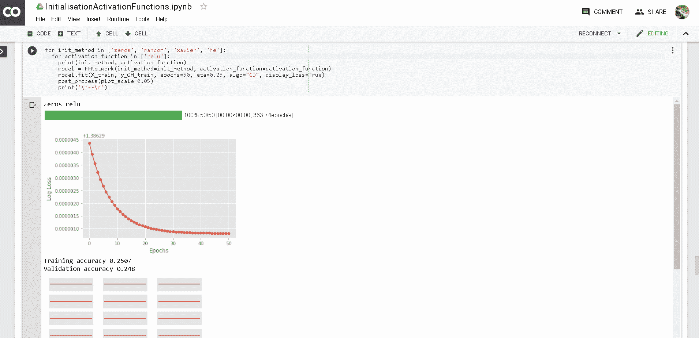

ReLU Activation

类似于零权重初始化的 tanh，我们观察到将权重设置为零对 ReLU 不起作用，因为 ReLU 在零处的值等于零本身。因此，权重不会传播回网络，网络也不会学习任何东西。**因此，在 tanh 或 ReLU 的情况下，将权重设置为零都不是一个好主意。**

ReLU 的推荐初始化方法是 he 初始化，通过使用 He 初始化，我们能够获得最高的精度。

# 分析泄漏 ReLU 激活

通过在第二个“for”循环中包含关键字“relu ”,我们将使用相同的代码来执行具有不同权重初始化方法组合的 ReLU 激活函数。

```
for activation_function in ['leaky_relu']:
```

类似于零权重初始化的 ReLU，我们观察到将权重设置为零对泄漏 ReLU 不起作用，因为泄漏 ReLU 在零处的值等于零本身。因此，权重不会传播回网络，网络也不会学习任何东西。

对于随机初始化，我们可以看到网络达到了非常好的精度，但是在更新子曲线中有很多振荡。大的振荡可能是由于大的学习速率而发生的。通过使用 He 初始化，我们在测试数据上获得了 92%的最高准确率。为了避免大的振荡，我们应该在任何权重初始化方法中设置较小的学习速率。**推荐的 Leaky ReLU 初始化方法是 he 初始化。**

现在，我们已经成功地分析了权重初始化方法和激活函数的不同组合。

# 下一步是什么？

> 代码代码代码

在本文中，我们使用了`make_blobs`函数来生成玩具数据，我们已经看到`make_blobs`生成线性可分数据。如果你想生成一些复杂的非线性可分数据来训练你的前馈神经网络，可以使用`sklearn`包中的`make_moons`函数。

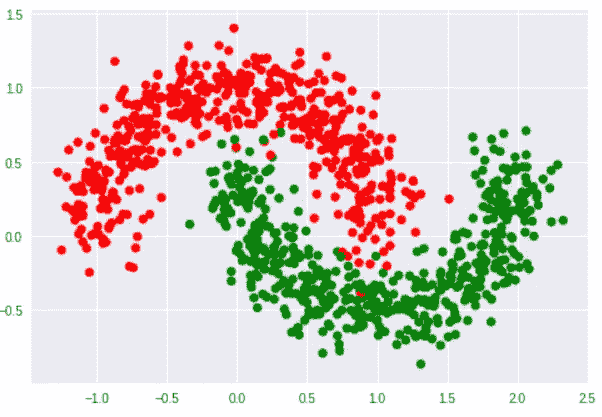

您也可以尝试将学习算法(我们一直使用普通梯度下降)改为不同的梯度下降变体，如 Adam、NAG 等，并研究学习算法对网络性能的影响。使用我们的前馈神经网络类，您可以创建一个更深的网络，每层有更多数量的神经元([2，2，2，4] —前 3 个隐藏层各有两个神经元，输出层有 4 个神经元)，并调整学习速率&多个时期，以检查在哪些参数下神经网络能够达到可能的最佳决策边界。

本文中讨论的全部代码都在这个 GitHub 存储库中。随意叉或者下载。**最棒的是，你可以直接在 google colab 中运行代码，不需要担心安装包**。

[](https://github.com/Niranjankumar-c/DeepLearning-PadhAI) [## niranjankumar-c/deep learning-PadhAI

### 来自 pad hai-Niranjankumar-c/deep learning-pad hai 的深度学习课程相关的所有代码文件

github.com](https://github.com/Niranjankumar-c/DeepLearning-PadhAI) 

# 结论

在这篇文章中，我们简要地看了权重初始化方法和激活函数的概述。然后，我们看到了如何构建一个通用的简单神经元网络类，它支持梯度下降、权重初始化和激活函数的不同变体。之后，我们分析了每个激活函数的不同权重初始化方法。

# 了解更多信息

如果你想学习更多的数据科学，机器学习。查看来自 [Starttechacademy](https://courses.starttechacademy.com/full-site-access/?coupon=NKSTACAD) 的 Abhishek 和 Pukhraj 的[机器学习基础知识](https://courses.starttechacademy.com/full-site-access/?coupon=NKSTACAD)和[高级机器学习](https://courses.starttechacademy.com/full-site-access/?coupon=NKSTACAD)。这些课程的一个优点是它们同时用 Python 和 R 语言授课，所以这是你的选择。

*推荐阅读*

[](https://hackernoon.com/deep-learning-feedforward-neural-networks-explained-c34ae3f084f1) [## 深度学习:解释前馈神经网络

### 你的第一个深度神经网络

hackernoon.com](https://hackernoon.com/deep-learning-feedforward-neural-networks-explained-c34ae3f084f1) 

**作者简介**

[Niranjan Kumar](https://medium.com/u/3e4fb2985698?source=post_page-----c78643b9f20f--------------------------------) 是汇丰银行分析部门的零售风险分析师。他对深度学习和人工智能充满热情。他是[人工智能](https://medium.com/tag/artificial-intelligence/top-writers)中[媒体](https://medium.com/u/504c7870fdb6?source=post_page-----c78643b9f20f--------------------------------)的顶尖作家之一。你可以在这里找到 Niranjan 的所有博客。你可以在 LinkedIn[LinkedIn](https://www.linkedin.com/in/niranjankumar-c/)、 [Twitter](https://twitter.com/Nkumar_283) 和 [GitHub](https://github.com/Niranjankumar-c) 上与 Niranjan 联系，了解他的最新博客文章。

**免责声明** —这篇文章中可能有一些相关资源的附属链接。你可以以尽可能低的价格购买捆绑包。如果你购买这门课程，我会收到一小笔佣金。