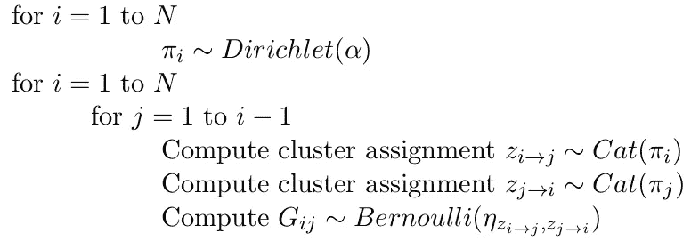
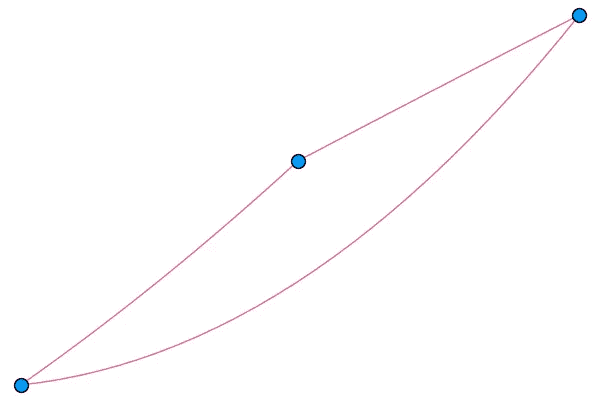
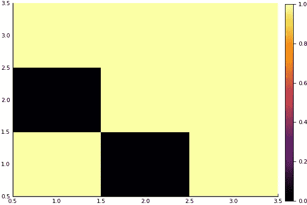
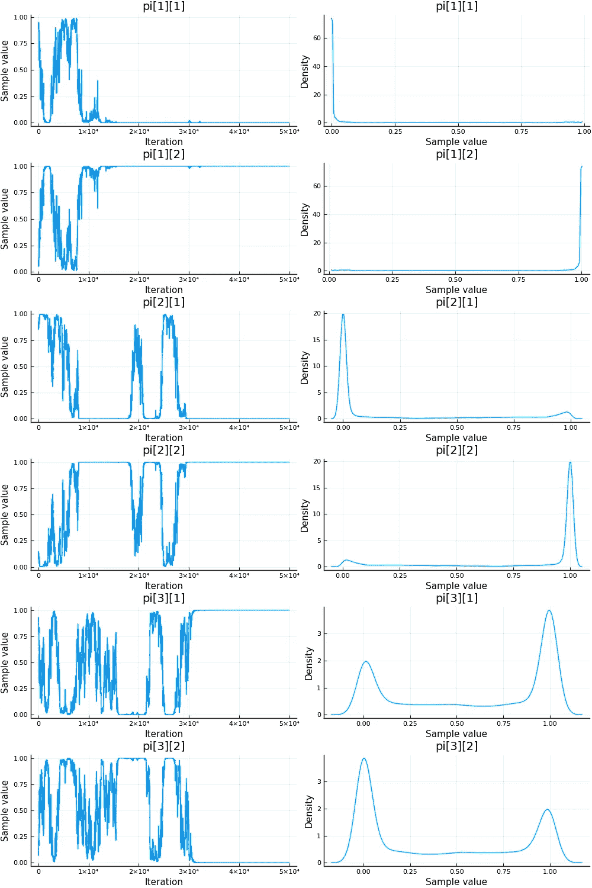

# 实现混合成员随机块模型

> 原文：<https://towardsdatascience.com/implementing-mixed-membership-stochastic-blockmodel-c8129b3bd985?source=collection_archive---------11----------------------->

MMSB:一种用于学习图形结构的概率模型。用 Julia 写的代码可以在这里找到(Jupyter 笔记本上的图表和输出)或者在这里找到(。jl 文件)。


From social networks to protein interactions, graphs have become ubiquitous.

你好！

我叫索米亚·沙阿。这是一篇描述混合成员随机块模型实现的文章，这是一个学习图结构的贝叶斯模型。为此，我将使用用 Julia 编写的概率编程语言(PPL)turing . JL。在图灵中定义模型轻而易举。编写代码就像在纸上写模型一样。那么，事不宜迟，我们开始吧！

# 介绍

MMSB 用于对由成对测量值组成的数据进行建模，以图表的形式进行建模。考虑具有 N 个节点的图 *G* ，具有二进制边权重(即 0 或 1)。因此，1 表示两个节点之间有连接，0 表示没有连接。邻接矩阵表示节点之间的这些连接。MMSB 有助于学习该图的底层结构，这可以重建该图，识别节点之间的模式和关系，并预测未看到的数据的链接。在下面的例子中，我们假设这是一个**无向图**(即邻接矩阵是对称的)。

# 当然，它有一个奇特的名字，但是我在哪里使用它呢？

*   **社交网络:**从用户和他们所属的社区之间的关系数据中，我们可以聚集具有共同兴趣的群体，并提出建议。
*   **蛋白质相互作用:**不同的蛋白质以不同的方式相互作用。利用 MMSB，我们可以预测两种特定蛋白质之间的相互作用及其功能。
*   **学术引文:**引文网络可以帮助我们根据科学家的领域和他的出版物来确定一篇研究论文的重要性。

# 它是如何工作的？

我们来钻研一下数学:)。首先，我们假设我们的图有 *N* 个节点。总共有 *K 个*星团。每个节点具有由 *π_n* 表示的成员概率向量，其指定了节点 *n* 属于每个 *K* 集群的概率。对于每对节点 *n* 和 *m* ，我们从两个概率向量 *π_n* 和*π_ m*中的每一个中得出一个集群。这意味着当考虑到节点 *n* 和 *m、*之间的链接时，节点 *n* 可以属于一个特定的集群，而当考虑到节点*n*之间的关系时，它可以属于另一个集群这就是模型的*混合成员*部分出现的地方。简而言之，每个节点 n 可能有多个集群成员，这取决于它与哪个节点 m 交互。

所以我们有每对节点的集群。我们该拿它怎么办？这就是*随机区块模型*部分的用武之地。一对对象之间的链接取决于它们所属的簇。为此，我们维护了一个 *K×K* 矩阵η，它指定了任意两个集群之间的连接概率。我们使用伯努利分布来确定从一对节点中抽取的一对集群之间是否存在链接。

综上所述，我们考虑所有节点对来确定它们是否链接。对于一个给定的对，我们从其各自的概率向量中为每个节点绘制一个簇分配。基于这些聚类分配，我们通过在矩阵η中查找其值来找到这一对聚类之间的链接的概率。然后，我们将这个概率传递给伯努利分布，得到 1(连接)或 0(不连接)值。

数学上，生成性故事被指定为(这里，α和η是超参数， **π** _1，…，π_N，z11，…，z_NN 是我们要推断的参数):



# 密码在哪里？


“Talk is cheap. Show me the code.”- Linus Torvalds

好了，既然我们已经为 MMSB 是什么以及它是如何工作的打下了基础，那么让我们来看看代码。我们从导入库开始:

继续，我们选择集群的数量 *K = 2* 并设置超参数:

现在，我们生成用于模型的数据。为此，我们对每个节点进行随机集群分配。我们还使用 matplotlib 作为后端，以热图的形式可视化了这个图。

获得了以下可视化:



请注意，可视化效果可能因您而异，因为聚类是随机生成的。

我们来定义一下模型。我稍微调整了模型，使其具有“软”集群分配。因此，我们使用整个概率向量来确定每对节点之间存在链接的概率，而不是从分类分布中提取。因此，参数 z_11，…，z_NN 已被消除，我们只需要推断 pi_1，…，pi_N。这一调整减少了要估计的参数数量，并导致更快的收敛。

还记得我说过的在图灵中定义模型的简易性吗？这里有一个活生生的例子！注意模型是如何定义的，类似于它是如何编写的。

既然我们已经定义了模型，我们可以为后验样本绘制样本。下面的代码块演示了这一点:

您应该会看到描述该链的输出和采样参数的摘要。为了查看我得到的输出，你可以看看这里的代码(在 Jupyter 笔记本中)。我们还可以绘制这些样本，以可视化它们的分布，并检查它们是否已经收敛。



从上面的图中可以看出，在大约 30，000 次迭代之后，所有的参数都收敛了。所以，我们可以期待我们的模型给出好的预测。让我们使用采样参数重建图形，看看它们的估计有多好。

预测图的热图为:


这与我们生成的数据完全相同！该模型成功地重建了原始图形。

我们还可以从数字上计算重建图和原始图之间的不匹配数。这方面的代码如下:

正如所料，这将打印:

```
The number of mismatches is 0
```

这就结束了我在 Julia 中混合成员随机块模型的实现。如果您对此有任何问题或疑问，请随时通过 [s](https://saumyagshah.github.io/) shah@iitk.ac.in 联系我，或者您可以在 Julia slack 上用@Saumya Shah 标记我。希望你能像我写这篇文章一样喜欢读这篇文章:)。

上面解释的代码可以在[这里](https://github.com/saumyagshah/JupyterNBTuringExamples/blob/master/mmsb.ipynb) (Jupyter 笔记本上的图和输出)或者[这里](https://github.com/TuringLang/TuringExamples/blob/master/mmsb.jl)(。jl 文件)。

# 下一步是什么？

我现在将继续实现一些非常有趣的主题:时间序列模型。一旦准备好了，我会写一个帖子。与此同时，图灵大学的一些学生正在开发一个变分推理界面，预计将在一两个月内完成。一旦完成，我将把它与上面的 MMSB 实现集成，以允许对更大的图形进行推断。

# 参考:

[1] Airoldi，Edoardo M .，David M. Blei，Stephen E. Fienberg，和 Eric P. Xing，[混合成员随机块模型](https://arxiv.org/abs/0705.4485) (2008)，《机器学习研究杂志》第 9 期，9 月号(2008):1981–2014。