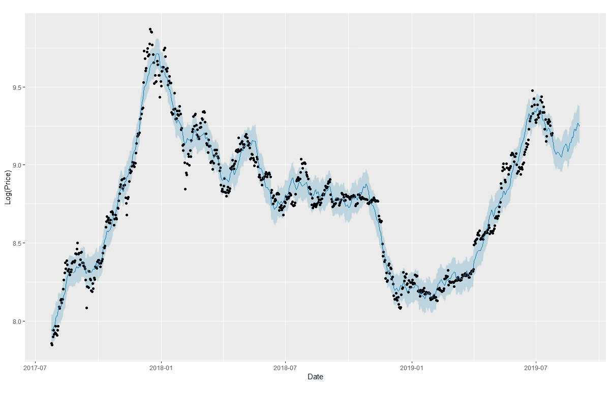

# 实施 Prophet 时间序列预测模型

> 原文：<https://towardsdatascience.com/implementing-prophet-time-series-forecasting-model-f16d2a191acc?source=collection_archive---------13----------------------->

## 一步一步地预测虚拟比特币价格的方法

Photo by [Aleksi Räisä](https://unsplash.com/@denarium_bitcoin?utm_source=medium&utm_medium=referral) on [Unsplash](https://unsplash.com?utm_source=medium&utm_medium=referral)

# **简介**

理解时间序列数据对任何类型的业务都非常重要。如果你与数字和分析打交道，通常情况下，你需要解决一些问题，比如未来几个季度有多少客户会继续购买，我们应该在股票上投资多少以防止缺货问题，明年的销售额是多少等等。或者你只是一个普通人，试图投资一些股票来赚取额外收入，了解并能够预测股票价格是非常必要的。这些都是预测问题，需要对时间序列数据有一定的技术理解和知识。

理解数据已经很难了，知道使用什么工具来生成高质量的预测图就更难了。许多预测模型需要强大的数据科学技术知识和技能。这些模型基于许多复杂的假设，即使是数据科学家也很难找到最好的模型来使用。

这就是为什么脸书发布了一个名为 Prophet 的惊人的预测模型，这是一个有 Python 和 r 两种版本的预测包。这是一个非常容易使用的包，不需要有很多技术背景。

***来自《走向数据科学》编辑的提示:*** *虽然我们允许独立作者根据我们的* [*规则和指导方针*](/questions-96667b06af5) *发表文章，但我们不认可每个作者的贡献。你不应该在没有寻求专业建议的情况下依赖一个作者的作品。详见我们的* [*读者术语*](/readers-terms-b5d780a700a4) *。*

# **我写这篇文章的原因**

Prophet 并不是一个新工具，我很确定有很多人已经熟悉它了。网上还有许多资源，您可以从中找到如何使用该预测模型的分步说明。但是，我个人认为，那些资源还不够简单，不足以让很多人理解模型。所以我写这篇文章是因为我想让一个 ***非统计专业的学生也能轻松地做预测，而不必纠结于任何技术知识。***

在本文中，我将提供一个使用 Prophet in R 预测比特币价格的分步方法。我还将尽力将其作为一个模板，这意味着你也可以使用它来预测其他事情，如要购买的产品数量、航班数量、注册的学生数量等。我会尽量用非专业术语*来解释一切，让它尽可能简单。*

*我们开始吧！*

# ***导入并清除数据***

*我从[这里](https://www.investing.com/crypto/bitcoin/historical-data)取了历史数据。然后，您可以更改时间段和时间范围来获得您喜欢的数据集。*

**

*在进行预测时，我们需要选择训练数据(来训练预测模型)和测试数据(在此基础上，预测模型将用于查看准确性)。为了方便大家，我没有实现代码将数据集分为训练集和测试集，而是简单地选择了 2017 年 7 月 25 日至 2019 年 7 月 25 日的时间段，然后下载。(耶！！！太简单了，每个人都能做到:))*

*下载的文件是一个 csv 文件。*

**

*Original data*

*下载后，让我们快速清理它，只保留那些我们感兴趣的组件，即日期和价格(前 2 列)。我们需要将日期列更改为日期数据类型。只需选择整个列(在 Excel 上)并将类型从 General 更改为 Date。*

**

*太好了！现在数据已经准备好导入 r。*

# ***在 R 中实现先知***

**

*为了使这两列易于操作，我将这两列分别重命名为“ds”和“y”。然后我取 y 列的对数。在 R 中，在日期列中，数据将作为字符读取，所以我们需要使用库 Lubridate 将它们改为日期类型。*

**

*然后我绘制了图表，看看数据是什么样的*

**

*厉害！让我们开始使用 Prophet 进行预测。以下是代码:*

**

*我不想使用 Prophet 函数的默认季节性效果，因为我意识到比特币数据略有不同。所以我把所有的年、周、日的季节性效应都设为‘假’，然后创造自己对数据季节性效应的理解。通过这样做，我可以更好地控制季节性。这很重要！我给你的建议是 ***不要盲目使用该函数，你需要回去查看你的数据并检查*。如果我们能够定制最适合模型工作的季节效应，我们就可以更准确地进行预测。***

*让我解释一下代码。*

*如果你将周期设置为，比如说，30 天，那么你实际上是在告诉模型，在某一点发生的事情很可能在 30 天内再次发生。在我的代码中，对于“每月”季节性，我选择周期为“30 * 1.8”。这基本上意味着模式/趋势可能在 30 * 1.8 = 54 天后重复。*

*你可能会问我是怎么知道这些数字的。如我之前所说，这一切都是为了理解您的数据。在这里，我定义一个月有 30 天，模式/趋势可能在 1.8 个月后重复。为了得到这个数字，我回到我之前绘制的图表来看总体趋势。我也回到了[网站](https://www.investing.com/charts/cryptocurrency-charts)上提供的现场图。*

**

*让我们来看看这个特定的时间段。如你所见，当我们放大时，似乎有一种模式每两个月出现一次。我在这段时间的其他部分做了同样的事情。我意识到，平均而言，1.8 个月对于月度季节性来说是个不错的数字。同样的技巧也适用于年季节性和日季节性。对于每年，我定义一年有 365.25 天(实际上 364 ~ 366 天是一个很好的范围，但我测试了一下，发现 365.25 天最符合历史数据)；这种模式似乎会在 1.5 年后重复。你可以通过查看历史数据的图表来做同样的事情，找出关键的转折点，看看整体模式是如何随时间变化的。这将允许您输入最合适的季节性，以给出最准确的预测模型。*

*接下来是傅立叶分量。在数学上，任何信号都可以用正弦和余弦曲线的和来表示。这就是 Prophet 产生季节性信号的方式。数字越大，显示的曲线越多。有时候，使用一个大的数字是好的，因为我们想要捕捉趋势中的每一个转折点。然而，较大的傅立叶阶可能导致称为 ***过拟合*** 的问题。因此，最好在训练集上尝试一个傅立叶级数范围，看看哪个数最符合数据。*

*现在我们已经重新定义了先知函数。是时候实施了，做个预测。只需遵循以下代码:*

**

*future = make_future_dataframe(m，periods = 40)*

*这里，“周期”代表您希望预测的未来天数。由于我们的训练数据截止到 2019 年 7 月 25 日，我们希望了解该模型是否能很好地预测 2019 年 7 月 25 日至 8 月底的数据。所以，我把期限定为 40 天。下面是获得的图:*

**

*从图表中，模型预测从 7 月 25 日到 7 月底，比特币价格将下降，然后在 8 月份再次上升。这与真实数据非常相似*

**

*也可以把周期改为 90 天，预测未来 3 个月的比特币价格。*

**

*9 月份比特币价格预测在 exp(9.2)= 9897**(记得 y 轴是对数刻度)**左右。10 月份预测为 exp(9.15)= 9400，11 月份上升到 10900。*

*就是这样！希望它能给你们，特别是那些没有统计和编程背景的人一个如何做预测的想法。Prophet 是一个强大的时间序列预测模型，易于每个人使用。如果您很好地了解您的数据并相应地调整模型的参数，您可以极大地提高模型的性能并获得相当准确的预测结果。但是，同样重要的是要知道，模型只是模型，尤其是在预测未来的事情时，模型是基于历史数据和历史模式执行的。所以预测结果永远不会 100%准确。然而，正如我所说的，如果你训练好模型，你可以得到一个相当准确和可靠的结果，如果没有一个可靠的模式和趋势供你做分析。*

*谢谢你的时间。我期待着关于您如何实施和优化您的模型的讨论/反馈。如果有任何问题，请告诉我*

*查看我关于随机森林[的最新帖子](https://medium.com/@hoangkhangtran99/implement-random-forest-in-r-b00b69eb8501)*