# 使用 fastai 实现 SPADE

> 原文：<https://towardsdatascience.com/implementing-spade-using-fastai-6ad86b94030a?source=collection_archive---------4----------------------->

## 使用 GANs 生成照片级逼真图像

Nvidia 最新研究论文出来的时候我就被它的结果迷住了。如果你没有看过[论文](https://arxiv.org/abs/1903.07291)结果，那么你就错过了。此外，看看在 GIF 中基于 GAN 的铲动作。我等不及正式实现发布，决定使用我们最喜欢的 fastai 库自己实现这篇论文。fastai 提供了一个非常简洁的 API，可以用来开发高度可定制的模型。具体来说，它的数据块和回调 API 是令人兴奋的。

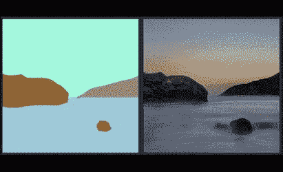

Source: [https://nvlabs.github.io/SPADE/](https://nvlabs.github.io/SPADE/)

这篇论文是一个非常简单的想法，据报道，它使用语义地图作为 GAN 模型的输入，在照片级真实感图像合成任务上提供了巨大的性能提升。今天我要一点一点地实现它。

如果您一直关注这篇博客，您将会了解 fastai 和 PyTorch，以及如何实现新的架构和使用新的数据集。

# SPADE 是什么？

SPADE 代表空间自适应归一化，它只是一种归一化技术，如批量范数、实例范数等。它在 GANs 中用于从**分割蒙版**生成合成的**照片级逼真图像**。本文在生成器的所有层中使用这种规范化技术。SPADE 的想法是，他们使用语义图来计算那些仿射参数，而不是学习批范数层中的仿射参数。困惑什么是仿射参数？

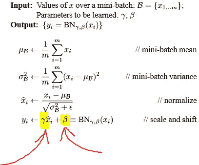

Source: [https://arxiv.org/abs/1502.03167](https://arxiv.org/abs/1502.03167)

这是来自批量标准纸的图像。那些小伽玛和贝塔是仿射参数。这些参数是可以学习的，让模型可以自由选择他们想要的任何分布。因此，SPADE 说为什么不使用语义图来分别计算那些被称为缩放和移位参数的γ和β。

SPADE 将利用语义图来计算这些参数，而不是使用随机初始化的缩放和移动参数，就是这样！他们这样做是因为传统的规范化层洗掉了输入语义掩码中的信息。SPADE 有助于在整个网络中有效地传播语义信息。下面是一个建筑的铲块。

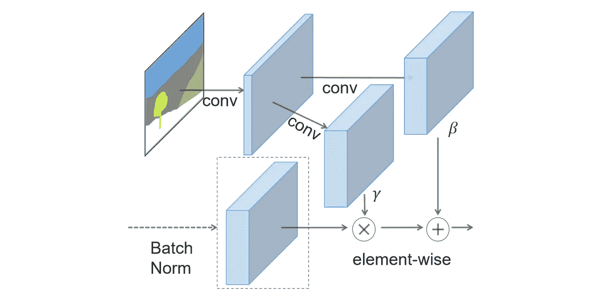

Source: [https://arxiv.org/abs/1903.07291](https://arxiv.org/abs/1903.07291)

现在，我所说的一切都开始有意义了。仍然执行传统的归一化，只是仿射参数不同。基本上，它们只是应用在输入语义图上的几个卷积。我真的很感谢 NVIDIA AI 的研究人员让这篇论文变得如此可视化。所以现在让我们开始编写代码。

# 纸面实现

我将在这里展示的所有代码都来自我的 [Github 仓库](https://github.com/divyanshj16/spade)。我将向您展示在[这个笔记本](https://github.com/divyanshj16/SPADE/blob/master/SPADE-without-feature-matching-loss.ipynb)中实现的具有更少功能的 SPADE paper 版本，但我已经在其他笔记本中实现了其他添加功能。由于它是一个 GAN，它将有一个发生器模块和一个鉴别器模块。生成器模块包含铲层。因此，我们将首先从实现基本的 SPADE 块开始。

## 铲形块

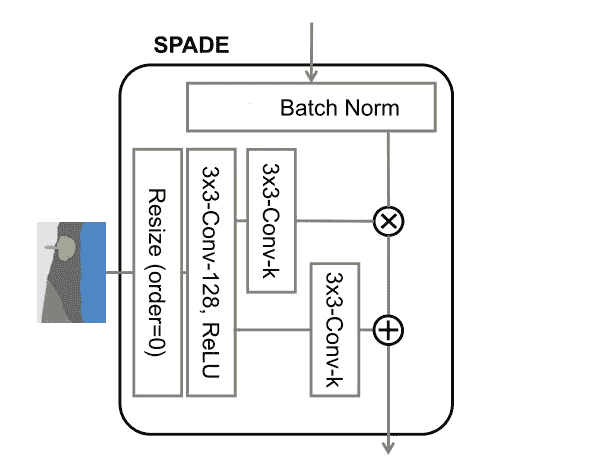

Source: [https://arxiv.org/abs/1903.07291](https://arxiv.org/abs/1903.07291)

这张图片只是早期图片的更详细的版本。它准确地告诉我们在语义图上要执行哪些卷积。

它接受分段掩码和特征。分段掩码只是简单的长整数 2D 掩码，本文建议对类使用嵌入层，但我决定简化，因此输入滤波器的第一卷积层数是 1。然后，它会根据特征的大小调整遮罩的大小。这样做是因为 SPADE 图层将在每个图层上使用，所以它需要知道要素的大小，以便可以针对仿射参数的操作调整掩膜的大小。看看当我初始化 BatchNorm2d 图层时，我将仿射设置为 false，以不使用默认的仿射参数。在本文的所有卷积块中使用频谱归一化来稳定 GAN 训练。在 PyTorch 中，通过继承 *nn 实现了一个新的层。模块"*，并通过实现" *__init__"* 、"*" forward "*函数。变量名 *ni* 和 *nf* 分别用于卷积层中输入滤波器的数量和输出滤波器的数量。

## 铲状残余块

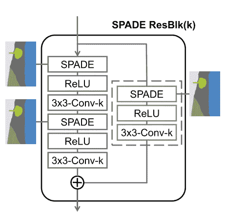

Source: [https://arxiv.org/abs/1903.07291](https://arxiv.org/abs/1903.07291)

在实现了 SPADE 块之后，我们现在可以在 SPADE ResBlk 中使用它了，而且非常简单。

## 发电机

现在，我们已经有了基本的模块设置，现在是将它们堆叠起来的时候了，如下面的架构所示。

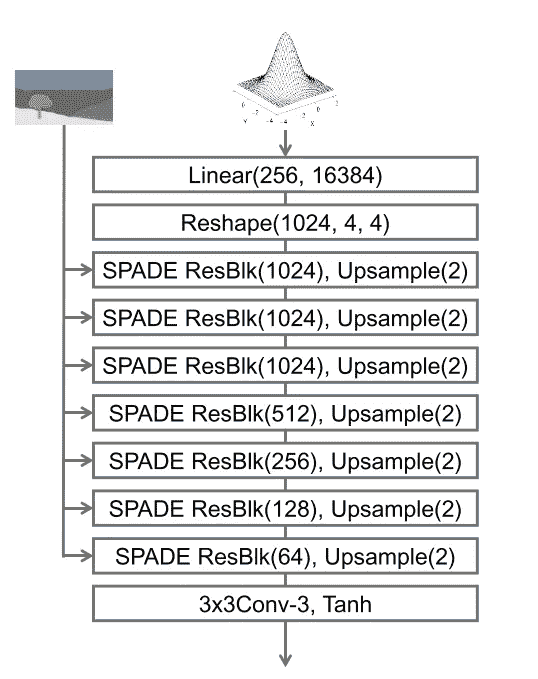

Source: [https://arxiv.org/abs/1903.07291](https://arxiv.org/abs/1903.07291)

我列出了各个图层将丢弃的特征地图的数量，并使用 for 循环创建了生成器。

为了使代码简单，我使用了一些技巧，比如用全局变量初始化模块的参数。你可以看到 *nfs* 变量包含所有 SPADE 残差块的输出，这些块用于初始化生成器中的层。最后，我将 *tanh* 层的输出设置在 0-1 的范围内，这样更容易可视化。

## 鉴别器

该鉴别器是一种基于多尺度、贴片 Gan 的鉴别器。多尺度意味着它在不同的尺度上对给定的图像进行分类。基于贴片 Gan 的鉴别器最后的输出层是卷积的，并且取空间平均值。多重标度的输出相加得到最终输出。

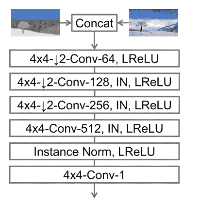

Source: [https://arxiv.org/abs/1903.07291](https://arxiv.org/abs/1903.07291)

鉴别器同时获取掩模和生成的/真实的图像，并输出激活。从代码中可以看出，鉴别器中的 forward 方法将 mask 和 image 作为输入。

现在我们已经实现了模型的完整架构。完整的架构是这样的。

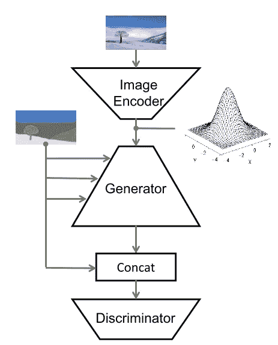

Source: [https://arxiv.org/abs/1903.07291](https://arxiv.org/abs/1903.07291)

现在是实现损失函数的时候了。

## 损失函数

因为是 gan，所以有两个损耗函数，一个用于发生器，另一个用于鉴频器。损失函数是我在之前的博客中提到的萨根论文中的铰链损失。损失函数非常简单，实际上只有一行代码。但是，这是我花了最多时间并意识到损失函数在深度学习问题中有多重要的部分。

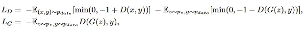

Source: Self-Attention GAN paper

以上两个等式可以在下面的代码块中用代码编写。有时这些看起来可怕的方程只是一行代码。

这里我们用代码实现了这篇论文，但是我们还需要做更多的事情。首先，我们需要将数据传递给模型，并对数据进行预处理，还需要一个训练循环来训练我们的模型。数据准备这一步以前经常困扰着我，但在 fastai 版本 1 发布之后就没有了。它让很多事情变得非常简单快捷。

## 数据准备

我使用了由[切萨皮克保护区土地覆盖数据项目](https://chesapeakeconservancy.org/conservation-innovation-center/high-resolution-data/land-cover-data-project/)提供的土地覆盖分类数据。我使用 ArcGIS Pro 的“导出深度学习的训练数据”工具从分类栅格中提取了的所有图像。一旦我在磁盘上获得了图像，我就使用 fastai 数据块 API 来加载它们，以创建一个 fastai 学习器并调用它的 fit 方法。在创建了适当的类之后，我使用下面的代码创建了一个 fastai databunch 对象。

我创建的类是 SpadeItemList，它只是 fastai 的 SegmentaionItemList 颠倒了。fastai 所做的是，你可以创建一个从 fastai 项目或标签类继承的类，并根据你的需要覆盖几个方法，它将使用该类创建 databunch 对象。Databunch 对象包含包含 PyTorch 数据集和数据加载器的属性。它包含一个显示你的数据的方法，叫做 *show_batch。*这里是我的 *show_batch* 的输出。

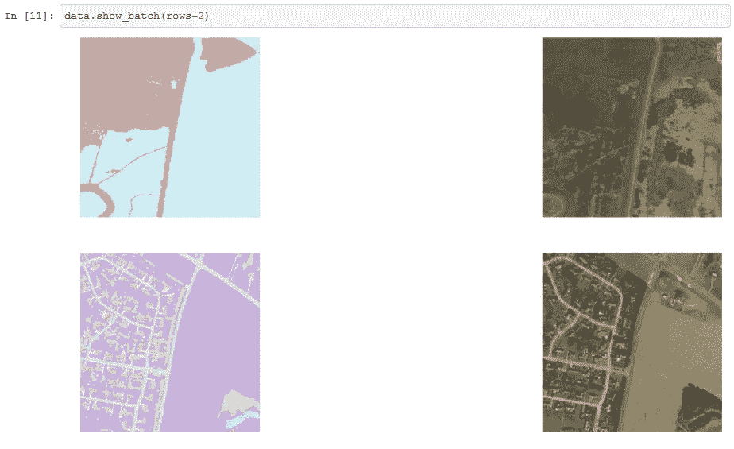

现在，数据准备步骤已经完成，所以现在必须训练模型。

## 让我们训练它。

在 fastai 中，我们必须创建一个学习器，其中包含实际训练模型的方法 fit。但这不是像图像分类那样简单的模型，在 GAN 中，我们需要将模型从生成器切换到鉴别器，反之亦然。要使用 fastai 库，我们需要创建回调机制来完成这项工作。我复制了 fastai library 的 GANLearner，并做了一点修改。

*self.gen_mode* 告诉 GANModule 何时使用发生器，何时使用鉴别器。fastai 中实现了一个回调函数，它以固定的时间间隔切换 GAN。对于每个发生器步骤，我将鉴别器步骤设置为五次。这是使用 FixedGANSwitcher 完成的。

还使用了其他回调函数。请看[我的 Github 库](https://github.com/divyanshj16/SPADE)里的代码。

现在我们可以运行*拟合*方法来训练模型。

## 结果

结果并不真实，但如果有足够的时间和计算，并消除任何存在的错误，将使模型生成良好的图像。下面是模型生成的初始图像。

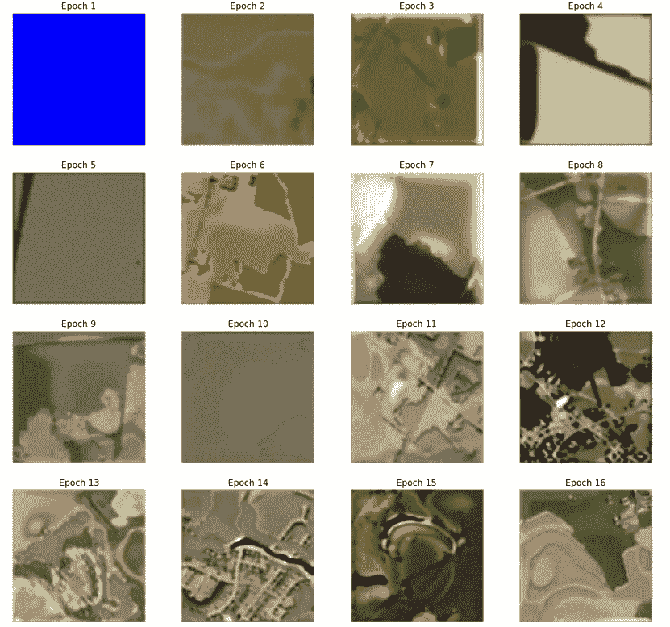

经过 100 次的训练。它开始产生一些详细的图像，但带有一些伪像。

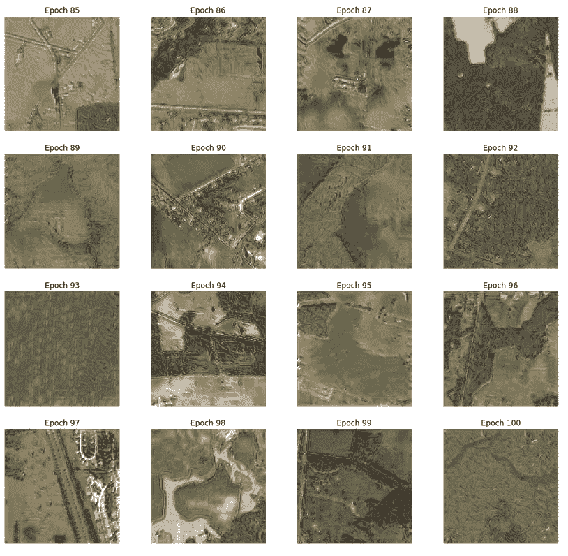

## TL；速度三角形定位法(dead reckoning)

Spade 只是一个标准化层，有助于生成逼真的图像。我在这里实现了:[https://github.com/divyanshj16/SPADE](https://github.com/divyanshj16/SPADE)

> 如果你坚持到这里，我希望你会喜欢。如有任何疑问，您可以通过推特[联系我。在 GitHub 上跟随我，因为我将实现更多的文件。我是这篇论文实现业务的新手，所以请指出你可能在我的代码和博客中发现的任何错误。干杯！](https://twitter.com/divyanshjha)