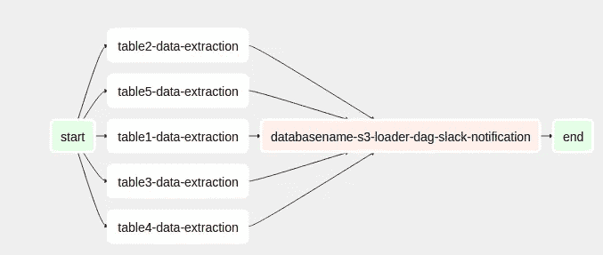

# 通过使用气流在数据加载过程中实现功能数据工程范例

> 原文：<https://towardsdatascience.com/implementing-the-functional-data-engineering-paradigm-in-data-load-processes-by-using-airflow-61d3bae486b0?source=collection_archive---------13----------------------->

## [用气流概括数据加载过程](/generalizing-data-load-processes-with-airflow-a4931788a61f)

## 基于纯任务的方法

Photo by [Max Duzij](https://unsplash.com/@max_duz?utm_source=medium&utm_medium=referral) on [Unsplash](https://unsplash.com?utm_source=medium&utm_medium=referral)

我们在一个包含四十多个应用程序的项目中集成了几个数据源。通过执行批处理来集成这些源，从而允许将数据从内部数据库增量加载到 AWS S3。我们使用 Airflow 作为我们的数据管道编排器，以便轻松地编排和监控此类流程。

在我们体验气流的早期，我们开始构建 Dag，允许我们集成数据源。然而，当重新处理数据源和执行回填过程时，开始出现一些问题。特别是，其中一些是:

*   **流程逻辑过于复杂**。它的设计方式产生了不必要的依赖。流程逻辑没有被恰当地分解成更小的任务。因此，测试和调试被认为是复杂的任务。
*   **大量重复的代码。**我们在 Dag 之间复制了大量代码。这可以用数据提取的内在本质来解释，*例如*，从两个不同的 MySQL 数据库中提取数据的代码通常不会有太大的不同——事实上，数据库连接是代码中大多数时间唯一变化的东西。因此，更改代码被认为是耗时的，因为相同的更改必须在几个 Dag 中传播。
*   **流程不易重现**。根据执行的时间点，流程会返回不同的结果。即使给定了相同的一组参数。因此，从过去执行的过程中复制结果并不容易。尤其是在重新处理数据源和执行回填操作时。

在这一点上，我们意识到我们做错了……经过一段时间的研究，我们发现了由 Maxime Beauchemin 在这篇文章中提出的功能数据工程范例。这种范式允许我们重新定义设计过程的方式。这对我们来说不容易。这就是为什么我们想与你分享我们实现功能数据工程范例的第一个方法。特别是它在数据加载过程中的实现。

# 功能数据工程

功能数据工程范式是基于定义基于 ***纯任务*** 的数据流程。根据 [Maxime Beauchemin](https://medium.com/u/9f4d525c99e2?source=post_page-----61d3bae486b0--------------------------------) :

> “一个纯任务应该是 [**确定性的**](https://en.wikipedia.org/wiki/Deterministic_algorithm) 和 [**幂等的**](https://en.wikipedia.org/wiki/Idempotence) ，意味着它每次运行或重新运行都会产生相同的结果”

特别是，Maxime Beauchemin[提出的三件事，我们认为对实现这种范例至关重要:](https://medium.com/u/9f4d525c99e2?source=post_page-----61d3bae486b0--------------------------------)

*   **上下文无关**。纯函数应该只依赖于它们的上下文，*即*它们的参数。特别是，我们认为上下文无关性可以通过遵循[关注点分离](https://en.wikipedia.org/wiki/Separation_of_concerns)原则来实现。这样的原则可以定义为"*将一个【过程】分解成功能上尽可能少重叠的不同特征的行为。*“所以，”*它们可以单独编写、测试、推理和调试，而不需要理解外部环境或围绕其执行的事件历史*。”
*   **覆盖方法。**在一的纯功能中，任何类型的副作用都应该避免。"*我们需要确定性***重新运行任务是安全的，不会导致重复计算或任何其他形式的不良状态…使用相同的输入参数重新执行一个纯任务应该会覆盖先前运行同一任务时可能会遗漏的任何先前输出。**
*   ***不可变的暂存区。一个有趣的模式是将分区视为不可变的对象，它们是纯任务的输出。它们可以被认为是不可变的临时区域的构建块。通过实施这种方法，即使在暴露的对象实际上是可变的情况下，也有可能使用功能实践。“因此，*给定一个持久不变的暂存区和纯任务，理论上可以从头开始重新计算整个仓库的状态(这不是你应该做的)，并通过重新执行过去运行的数据加载流程来获得完全相同的状态*。***

# *功能数据加载*

*我们通过使用一组模式实现了上述原则，这些模式允许我们创建一个[框架](/generalizing-data-load-processes-with-airflow-a4931788a61f)，用于提取数据并将其加载到我们的数据仓库中。为了简单起见，这样一个[框架](/generalizing-data-load-processes-with-airflow-a4931788a61f)不在本文讨论范围之内。相反，我们深入研究我们用来构建它的模式。这种模式被称为*装载模式。*这种模式是我们概括数据加载过程的方式。*

**加载器模式*基于这样一个概念，即将数据加载到数据湖或数据仓库——在我们的例子中是 AWS S3——只需提供一些与数据源和数据存储位置相关的信息。相应地，该模式的每个实例根据其目标数据库引擎实现一些功能，例如，加载程序连接到数据库的方式或提取数据的方式，以便实现这样的愿景。*

*下面是一个使用 *MySQL 加载器*的 DAG 示例。*

**

*Example DAG*

*DAG 的设计方式是，在每个任务中，通过运行 [*MySQL 加载器*](https://github.com/ajhenaor/pyspark-mysql-to-s3-loader) 加载一个数据库表。*装载器*在一个由气流编排的码头集装箱上运行——我们使用一个 [*码头操作员*](https://airflow.apache.org/docs/stable/_api/airflow/operators/docker_operator/index.html) 来完成*。**

*在下一段代码中， *MySQL 加载器*出现在*中。基本上，我们提取数据并加载到 S3 自动气象站。在此过程中，我们通过使*加载器*起作用、*即*起作用、通过实现上下文无关性、确保覆盖方法以及产生不可变对象作为加载器的输出来确保满足上述功能原则。**

*这是上周 S3 自动气象站的结果。*

**

# *结论*

*最后，关于*装载机需要记住的一些事情:**

*   *通过确保给定相同的参数，*加载器*每次运行时都会产生相同的结果，从而满足确定性和幂等性。*
*   *覆盖方法的实现方式是，我们可以确保每次*加载程序*运行时，它都会覆盖先前运行时可能遗漏的任何先前输出——要查看它在 *MySQL 加载程序中的实现，请参见第 66 行。**
*   *不可变分区由*加载器*的输出表示。由于我们的需要，我们使用每日分区。*
*   *加载器模式可以扩展到任何类型的数据库源——例如、Oracle、PostgreSQL 等等——在这篇文章中，我们展示了 *MySQL 加载器*来举例说明它的实现。*

*我希望这些信息对你有用。*

*感谢阅读到最后。*

*下期帖子再见！*

**如果你想随时更新我的作品，* ***请加入我的*** [***简讯***](https://metadatacommunity.substack.com/) ***！*** *我会努力为你提供信息和资源，让你成为更好的数据从业者！**