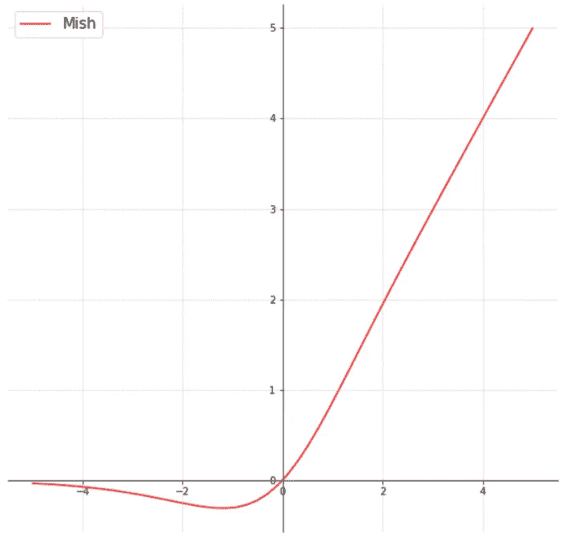
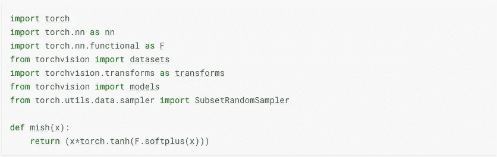
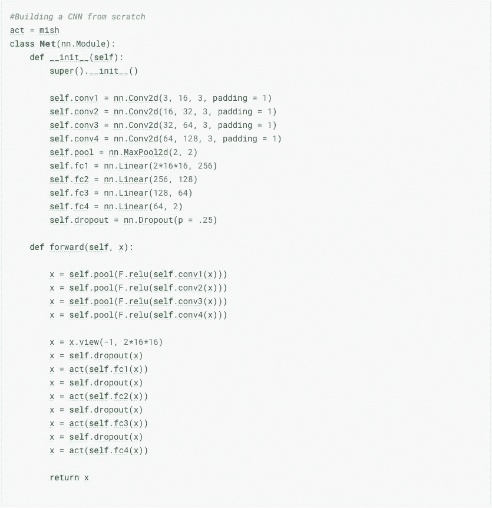
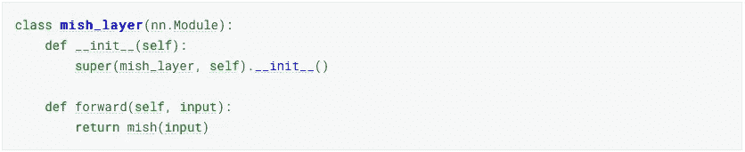
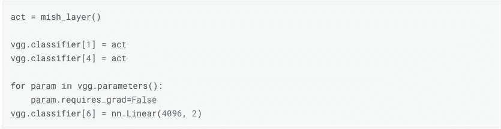

# 用 Pytorch 中的 2 行代码实现最新的 Mish 激活

> 原文：<https://towardsdatascience.com/implementing-the-new-state-of-the-art-mish-activation-with-2-lines-of-code-in-pytorch-e7ef438a5ee7?source=collection_archive---------19----------------------->

## 最先进的深度学习从未如此简单

From [Pexels](https://www.pexels.com/photo/action-blur-bulb-dark-355904/)

[本文](https://arxiv.org/pdf/1908.08681.pdf)作者[迪甘塔·米斯拉](https://medium.com/u/b7a37456ed33?source=post_page-----e7ef438a5ee7--------------------------------)最近发表了一个关于深度学习的新激活函数，叫做 mish activation。当在 CIFAR-100 上使用 Squeeze Excite Net-18 进行测试时，这种新的激活功能击败了 ReLU 和 swish 激活功能。如果你想知道关于研究和激活功能的细节，我强烈推荐你去阅读我上面链接的论文。我不打算深入研究论文的数学和研究，但函数看起来是这样的。

[Mish Activation Function from Paper](https://arxiv.org/ftp/arxiv/papers/1908/1908.08681.pdf)

如果你熟悉激活功能，你可能会认为它看起来很像 swish 激活。这是因为 mish 受到了 swish 的启发。从论文的初步阅读来看，似乎 mish 可能比 swish 和非常受欢迎的 ReLU 激活都要好。这个全新的激活功能最棒的地方是你可以用 2 行代码实现它。

# 履行

## 定制网络

首先，我将向您展示如何在您自己构建的神经网络中实现 mish。在构建我们的网络之前，我们需要使用 PyTorch 编写 mish 函数。正如承诺的那样，它只需要 2 行代码。

用这两行代码，我们写了一个最先进的激活函数。所以现在让我们编写一个基本的 CNN，并在其中实现我们的激活功能。

在前面的部分，我将所有线性层的激活函数设置为我们上面写的 mish 激活。现在模型可以训练了。这是非常直接和容易实现的！我在 Kaggle 的空中仙人掌识别数据上运行了这个模型，并在 10 个训练时期后看到了比 ReLU 激活 1.5%的准确性增加。我不会抱怨那件事。

## 迁移学习

建立自己的神经网络很酷，但几乎不实用。当涉及到在深度学习中获得顶级结果时，迁移学习往往更有效。因此，让我们看看如何用 VGG-16 实现 mish 激活。我们需要为我们的 mish 激活写一个从 torch.nn.Module 类继承的类，而不是一个函数。它应该是这样的:

我很抱歉，我答应 2 行代码，现在我把它改为 5。我希望在你用了这个并看到它有多酷之后，你会原谅我。把我们的激活函数写成一个类，我们现在可以准备把它添加到我们的 VGG-16 模型中。

我们将 VGG-16 的分类部分中的 ReLU 激活改为 mish 激活，并用一个用于我们的分类问题的层替换最后一层。除去最后一层的渐变后，我们就可以开始训练了！有了这些小代码，你就实现了一个最先进的激活功能。

# 一些提示

如果你想实现它，我认为在 mish 的文章中提到的一些事情是值得注意的:

*   与其他激活函数相比，mish 函数在较低的学习速率下表现更好。所以一定不要去 high。
*   Mish 激活似乎对超参数的变化相当稳健。查看报纸，了解更多这方面的信息。
*   没有最佳激活函数。这不会总是比其他任何事情都好。不过这绝对值得一试。

如果你有兴趣看我的完整代码，我把它放在 Kaggle [这里](https://www.kaggle.com/nelsongriffiths/mish-activation-and-transfer-learning-pytorch)。随意克隆它，尝试不同的架构，或者将 mish 激活应用到卷积层。