# 用神经网络反向传播实现异或门

> 原文：<https://towardsdatascience.com/implementing-the-xor-gate-using-backpropagation-in-neural-networks-c1f255b4f20d?source=collection_archive---------1----------------------->

使用神经网络实现逻辑门有助于理解神经网络处理其输入以达到特定输出的数学计算。这个神经网络将处理 XOR 逻辑问题。XOR(异或门)是一种数字逻辑门，只有当它的两个输入彼此不同时，它才给出真输出。XOR 门的真值表如下所示:

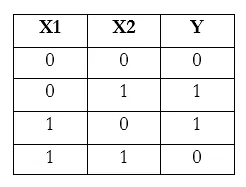

Truth Table for XOR

神经网络的目标是根据上述真值表对输入模式进行分类。如果输入模式是根据它们的输出绘制的，可以看出这些点不是线性可分的。因此，必须对神经网络进行建模，以使用*决策平面来分离这些输入模式。*

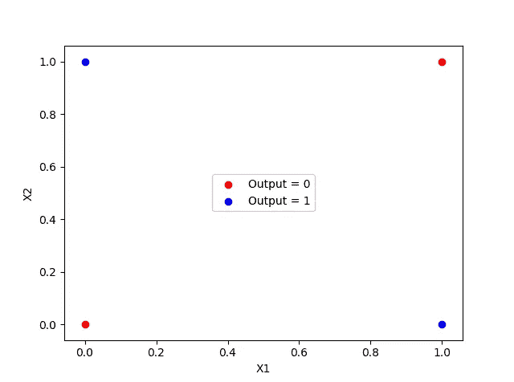

XOR, Graphically

# 神经网络模型

如前所述，神经网络需要产生两个不同的决策平面，以根据输出模式线性分离输入数据。这是通过使用*隐藏层*的概念实现的。神经网络将由一个具有两个节点(X1，X2)的输入层组成；一个具有两个节点的隐藏层(因为需要两个决策平面)；和一个具有一个节点(Y)的输出层。因此，神经网络看起来像这样:

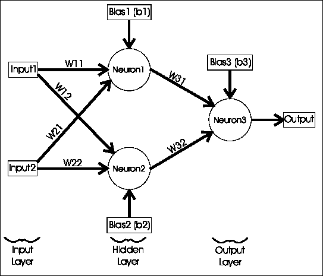

The Neural Network Model to solve the XOR Logic (from: [https://stopsmokingaids.me/](https://stopsmokingaids.me/))

# 乙状结肠神经元

为了实现 XOR 门，我将使用一个 Sigmoid 神经元作为神经网络中的节点。乙状结肠神经元的特征是:

1.可以接受实值作为输入。

2.激活值等于其输入的加权和
，即∑wi xi

3.乙状结肠神经元的输出是乙状结肠函数的函数，也称为逻辑回归函数。sigmoid 函数是一个连续函数，它输出 0 到 1 之间的值:

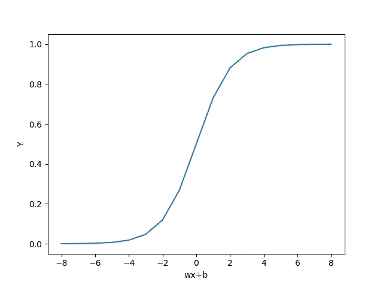

The Sigmoidal Curve

# 学习算法

神经网络的信息存储在神经元之间的互连中，即权重中。神经网络通过根据帮助其收敛到预期输出的学习算法更新其权重来进行学习。学习算法是基于损失函数改变权重和偏差的原理方法。

1.  随机初始化权重和偏差。
2.  迭代数据
    i。使用 sigmoid 函数
    ii 计算预测输出。使用平方误差损失函数
    iii 计算损失。W(新)= W(旧)—α∏W
    iv。B(新)= B(旧)—αB
3.  重复直到误差最小

这是一个相当简单的学习算法，仅包含算术运算来更新权重和偏差。该算法可分为两部分:前向传递*和后向传递*也称为*“反向传播”***

让我们实现算法的第一部分。我们将根据 XOR 的真值表初始化我们的权重和预期输出。

```
inputs = np.array([[0,0],[0,1],[1,0],[1,1]])
expected_output = np.array([[0],[1],[1],[0]])
```

步骤 1:用随机值初始化权重和偏差

```
import numpy as npinputLayerNeurons, hiddenLayerNeurons, outputLayerNeurons = 2,2,1hidden_weights = np.random.uniform(size=(inputLayerNeurons,hiddenLayerNeurons))
hidden_bias =np.random.uniform(size=(1,hiddenLayerNeurons))output_weights = np.random.uniform(size=(hiddenLayerNeurons,outputLayerNeurons))
output_bias = np.random.uniform(size=(1,outputLayerNeurons))
```

正向传递包括计算预测输出，该输出是给予神经元的输入的加权和的函数:

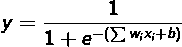

The Sigmoid Function

其中σwx+b 称为激活。

```
def sigmoid (x):
    return 1/(1 + np.exp(-x))hidden_layer_activation = np.dot(inputs,hidden_weights)
hidden_layer_activation += hidden_bias
hidden_layer_output = sigmoid(hidden_layer_activation)output_layer_activation = np.dot(hidden_layer_output,output_weights)
output_layer_activation += output_bias
predicted_output = sigmoid(output_layer_activation)
```

这就完成了一次正向传递，其中需要将我们的预测输出与预期输出进行比较。基于这种比较，使用反向传播来改变隐藏层和输出层的权重。反向传播是使用梯度下降算法完成的。

# 梯度下降

乙状结肠神经元的损失函数是平方误差损失。如果我们绘制损失/误差与重量的关系图，我们会得到如下结果:

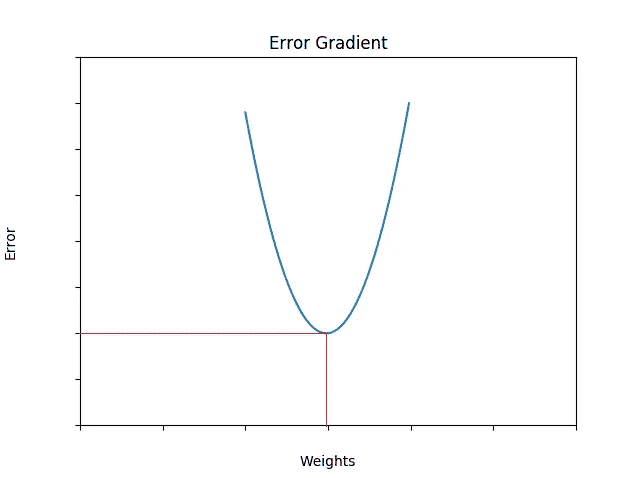

Error/Loss vs Weights Graph

我们的目标是找到对应于误差最小的点的权重向量，即误差梯度的最小值。这就是微积分发挥作用的地方。

# 梯度下降背后的数学

误差可以简单地写成预测结果和实际结果之间的差异。数学上:

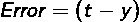

其中 *t* 是目标/预期输出& *y* 是预测输出

然而，为相同的误差量分配不同的误差值公平吗？例如，1 和 0 以及 1 和 0 之间的绝对差值是相同的，但是上面的公式会对预测-1 的结果产生负面影响。为了解决这个问题，我们使用平方误差损失。(注意没有使用模数，因为它使区分变得更加困难)。此外，这个误差被除以 2，以便更容易区分，我们将在下面的步骤中看到。

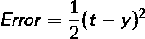

Squared Error Loss

由于可能有许多重量会导致这一误差，我们每次对每个重量进行偏导数，以找出最小误差。对于输出层权重(W31 和 W32)和隐藏层权重(W11，W12，W21，W22)，权重的变化是不同的。
设外层权重为 wo，隐含层权重为 wh。

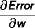

我们将首先找到外层权重的 W。由于结果是激活的函数，并且进一步的激活是权重的函数，因此根据链式法则:

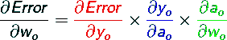

在解决问题时，

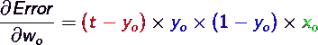

Change in the outer layer weights

注意，对于 Xo 来说，它只不过是隐藏层节点的输出。
隐藏层节点的输出也是激活的函数，并且相应地是权重的函数。因此，链式法则针对隐藏层权重进行扩展:

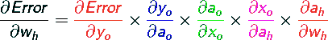

也就是说，

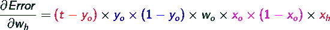

Change in the hidden layer weights

> 注意:Xo 也可以被认为是 Yh，即隐藏层的输出是输出层的输入。Xh 是隐藏层的输入，它是真值表中的实际输入模式。

然后让我们实现向后传递。

```
def sigmoid_derivative(x):
    return x * (1 - x)#Backpropagation
error = expected_output - predicted_output
d_predicted_output = error * sigmoid_derivative(predicted_output)

error_hidden_layer = d_predicted_output.dot(output_weights.T)
d_hidden_layer = error_hidden_layer * sigmoid_derivative(hidden_layer_output)#Updating Weights and Biases
output_weights += hidden_layer_output.T.dot(d_predicted_output) * lr
output_bias += np.sum(d_predicted_output,axis=0,keepdims=True) * lr
hidden_weights += inputs.T.dot(d_hidden_layer) * lr
hidden_bias += np.sum(d_hidden_layer,axis=0,keepdims=True) * lr
```

重复这个过程，直到预测输出收敛到预期输出。将该过程重复一定次数(迭代次数/时期)比设置预期收敛程度的阈值更容易。

# PYTHON 实现

选择历元的数量和学习率的值决定了两件事:模型的精确度，以及模型计算最终输出的速度。*超参数调优*的概念本身就是一个完整的课题。
历元= 10000，学习率= 0.1 的输出为:

```
Output from neural network after 10,000 epochs: 
[0.05770383] [0.9470198] [0.9469948] [0.05712647]
```

因此，神经网络已经收敛到预期输出:
【0】【1】【1】【0】。历元与误差图显示了误差是如何最小化的。

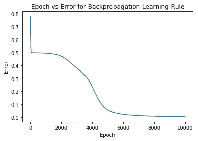

# 资源

1.  凯文·格尼的神经网络导论
2.  [https://www . analyticsvidhya . com/blog/2017/05/neural-network-from-scratch-in-python-and-r/](https://www.analyticsvidhya.com/blog/2017/05/neural-network-from-scratch-in-python-and-r/)
3.  感谢[https://www.codecogs.com/latex/eqneditor.php](https://www.codecogs.com/latex/eqneditor.php)将 LaTeX 方程转换成本文使用的 png。

我希望听到任何反馈/建议！这里和我[连线。](https://www.linkedin.com/in/siddharthapratimdutta/)