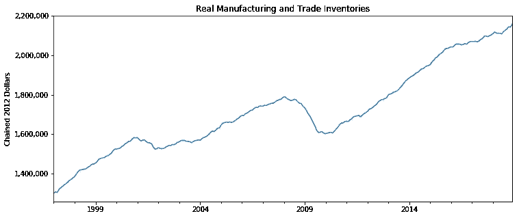
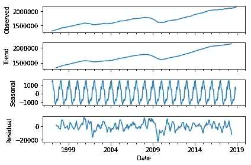
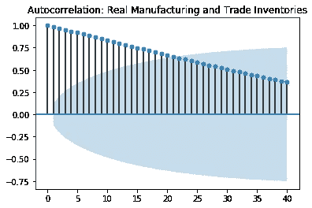
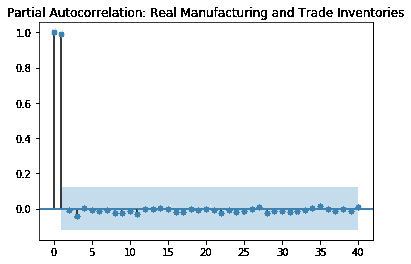
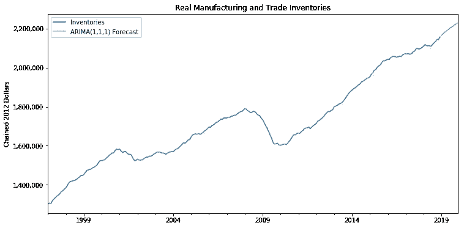

# 实施时间序列 ARIMA

> 原文：<https://towardsdatascience.com/implementing-time-series-arima-38fd77fc1d79?source=collection_archive---------16----------------------->

我们听说过很多时间序列分析中基于 ARIMA 的模型，这是一种用于预测各种时间序列数据的流行工具。也就是说，不建议在不了解数据及其潜在趋势的情况下盲目使用 ARIMA 模型。

本文讨论 ARIMA 及其一般应用。ARIMA 是非季节性的，萨里玛具有季节性。SARIMA 扩展了 ARIMA 模型的适用性:它在建模和预测中包括了数据的季节性。但是等等，什么是 ARIMA 呢？

**ARIMA 阿玛简介:**

当数据已经稳定时，使用 ARMA(即自回归移动平均模型)。

当数据不稳定且具有趋势成分时，使用 ARIMA(即，与移动平均模型集成的自回归)。因为有一个差分组件(d)将数据转换为静态数据，然后应用其他顺序。(p，q)

p:自动回归项的阶数(时间步长滞后的数量)

问:移动平均项的顺序

d:获得平稳性的差分阶

本文不包括应用每种方法的统计描述；它只是涵盖了我们如何在 python 中应用 ARIMA 和萨里玛模型，并对其有一个大致的了解。因此，让我们一步一步地将这些模型与我们的数据相匹配。

**分步骤实施 ARIMA 的一般方法:**

**第一步**:加载数据集，绘制源数据。(检查数据是否有任何季节性模式、周期性模式、一般趋势)

*   处理缺失值:ARIMA 模型不适用于有 NAs 的数据。

Plotting the data*

**步骤 2** :应用扩展的 Dickey Fuller 检验(以确认数据的平稳性)

实现:adfuller()

*   如果数据是平稳的，则进行 ARMA 或 ARIMA。(这是你的选择！)
*   如果数据不是稳定的，继续 ARIMA。(因为，需要对数据进行差分以使其稳定:ARIMA 的“I”组件就是这样做的)

**步骤 3** :对数据进行 ETS 分解(检查数据的季节性)

实现:季节性分解()

Seasonal Decomposition components

*   如果季节性与趋势成分相比很小，我们就不需要考虑它。在这种情况下，我们可以采用非季节性 ARIMA 模型。例如，在上面的示例图中，与趋势成分范围相比，季节性范围非常小。

ACF Plot

ACF -可用于确定毫安顺序(q)。

PACF -可用于确定 AR 顺序(p)。

*   同样，如果数据中的季节性很明显，则使用季节性 ARIMA 或萨里玛。

PACF plot

上述 ACF 和 PACF 图解释如下:ACF-MA 的顺序取为“1”，因为只有第 1 点(实际上是第 0 点和第 1 点)位于 95%置信区间(阴影区域)之外。PACF-AR 的顺序取为“1 ”,因为在第一个点之后值会急剧下降。

通常情况下，这些情节并不像我们在上面的例子中那样容易理解。这就是为什么我们使用 auto_arima()来确定订单。

**步骤 4** :使用自动金字塔 ARIMA 方法确定 ARIMA 的订单(P，D，Q)和萨里玛的订单(P，D，Q，P，D，Q)。(自动型号选择)

实现:auto_arima()

这些系数也可以通过查看 ACF/PACF 图(自相关/部分自相关图)来确定。使用这种技术通常很难确定顺序，而使用 auto_arima()则更好。

auto_arima()使用 p、d、q 值的不同组合运行不同的 arima(或 SARIMA)模型，并使用 AIC 和 BIC 指标比较它们的性能。

AIC 和 BIC 是如何工作的:这个度量标准的优点是，它提供了为防止过度拟合而使用的参数数量的惩罚。假设您有一个性能相对较好的简单模型和一个性能略好于前一个模型的复杂模型。如果这两个模型之间有微小的性能改进，那么 AIC 会考虑这一点，并告诉你选择简单的模型，而不是复杂的模型。在这种情况下，复杂模型将比简单模型具有更低的信息标准值。在某种程度上，AIC 惩罚了使用太多参数的模型。

此外，我们可以通过对我们的数据再次应用 Dickey Fuller 测试来验证 auto_arima()获得的“d”顺序。

**步骤 5** : *将数据集分割成训练集和测试集。*一旦我们应用了 auto_arima()，我们就获得了一组(p，d，q)订单，我们可以将这些订单直接分配给我们的 arima 模型。但是在拟合模型之前，我们首先要拆分数据。

*   在时间序列建模中，我们通常认为分割数据的百分比为 70:30(训练:测试)。但我们必须注意，测试数据的大小必须等于预测期。例如，如果我们想预测未来 6 个月的情况，那么我们必须至少采用*6 个月的测试数据量。*
*   另一个需要注意的要点是，我们*不需要*对数据进行采样来进行时间序列预测。这是因为在时间序列中，新值比旧值具有更大的权重。

**第六步** : *拟合 ARIMA 模型*。将步骤 4 中获得的 p、d、q 系数值分配给该模型。

执行:ARIMA()

**步骤 7** : *根据测试数据测试模型拟合。*

*   预测测试值。

实现:预测()

*   将预测值与实际测试值进行比较。(绘制两个图表，并使用误差指标(如 MSE、RMSE)来衡量模型性能。)

**第 8 步**:根据完整数据重新训练模型

我们需要用整个数据来拟合模型。这样做是为了将最近的值和旧的值纳入我们的建模过程。此外，较新的值具有较高的权重。因此，我们必须在整个数据集上重新训练模型。

**第九步**:预测未来！

如前所述，预测周期必须等于或小于测试数据的大小。

实现:预测()

(很少有时间序列模型使用 forecast()来预测未来，也很少有像 ARIMA 这样的模型使用 predict()来预测未来)

此外，绘制数据及其预测。

**萨里玛:**季节性 ARIMA 模型有一组额外的参数(P，D，Q)

p:季节性 AR 条款的顺序

d:达到平稳性的差分阶

问:季节 MA 术语的顺序

萨里玛的实施与 ARIMA 相似。除了在步骤 4 中，我们获得 3 个值:ARIMA 的 P，D，Q，这里，我们获得 6 个值:萨里玛的 P，D，Q，P，D，Q。我们应用 SARIMA()进行模型拟合，并继续进行与 ARIMA 相同的过程。

感谢您阅读本文！