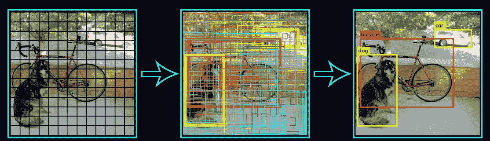
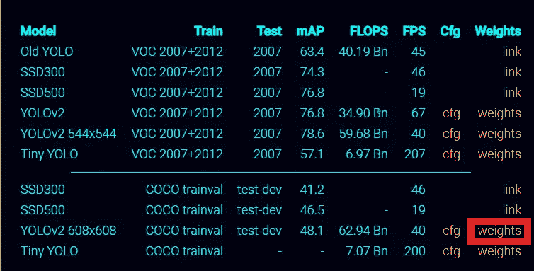
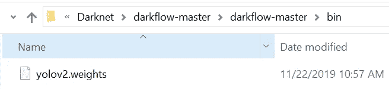
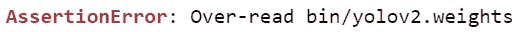
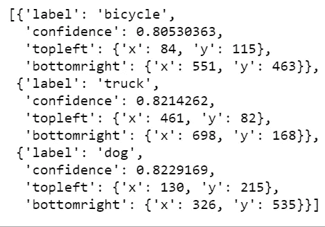
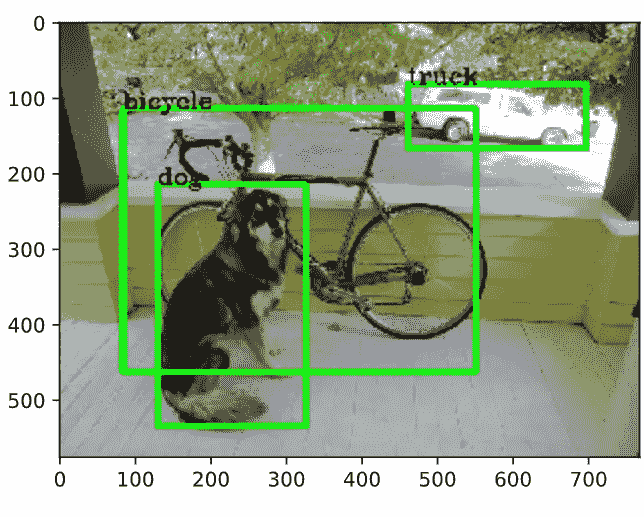
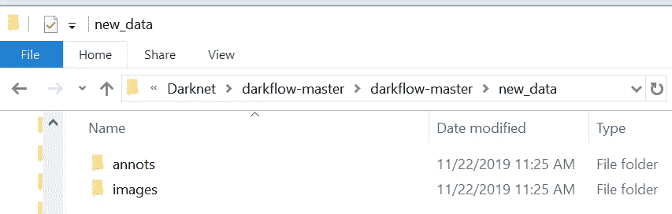
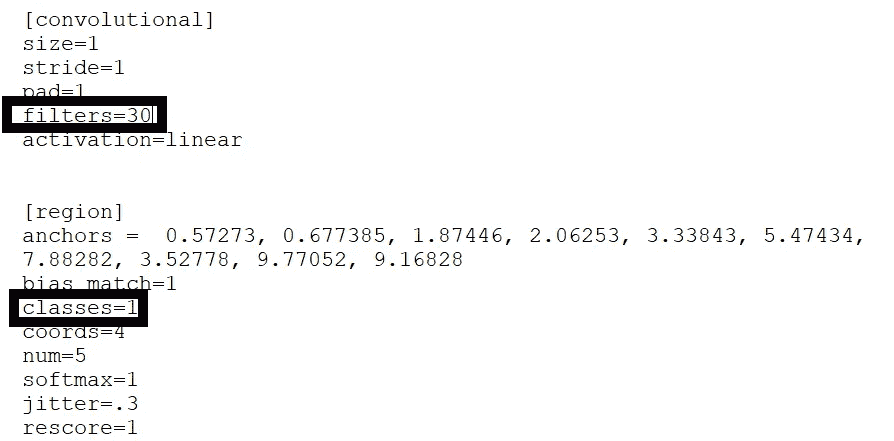
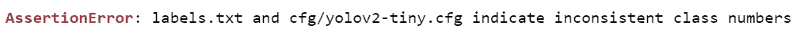

# 在自定义数据集上实现 YOLO

> 原文：<https://towardsdatascience.com/implementing-yolo-on-a-custom-dataset-20101473ce53?source=collection_archive---------4----------------------->

***在本文中，我们将逐步了解在自定义数据集上使用 keras 实施 YOLO v2，以及一些常见问题及其解决方案***



# 了解 YOLO——你只需看一眼

[从 CNN 到面具 R-CNN 和 Yolo](https://medium.com/@arshren/computer-vision-a-journey-from-cnn-to-mask-r-cnn-and-yolo-1d141eba6e04) 第 1 部分

[从 CNN 到 Mask R-CNN 和 Yolo Part 2](https://medium.com/@arshren/computer-vision-a-journey-from-cnn-to-mask-r-cnn-and-yolo-part-2-b0b9e67762b1)

[使用 Yo](https://medium.com/@arshren/object-detection-using-yolov3-using-keras-80bf35e61ce1) lov3 进行物体检测

[Yolo 上的原始文件](https://pjreddie.com/darknet/yolov2/)

我将使用[袋鼠数据集](https://github.com/experiencor/kangaroo)作为我的自定义数据集

# 必需的库

*   Python 3.5 或更高版本
*   Tensorflow:我用过 CPU 版本
*   OpenCV
*   VC++ build 14

# 下载使用 keras 实现的 Yolo 代码

我们将使用暗流回购，可以从这里下载:[**https://github.com/thtrieu/darkflow**](https://github.com/thtrieu/darkflow)

# **降低预训练的重量**

重量可以从[https://pjreddie.com/darknet/yolov2/](https://pjreddie.com/darknet/yolov2/)下载



[https://pjreddie.com/darknet/yolov2/](https://pjreddie.com/darknet/yolov2/)

我创建了一个名为 bin 的新文件夹，并将下载的权重放在那里，如下所示



## **提示:配置(cfg)文件和权重应匹配**

如果配置(cfg)文件和权重不匹配，我们会得到以下错误



Darkflow 通过读取。当权重和配置文件之间的层不匹配时，从. weights 中读取相应的字节块。当权重解析器已经到达. weights 的结尾时，配置文件可能仍有要读取的层。这将生成 over read 断言错误。

# 构建代码

构建代码有三种选择。

**选项 1:**

```
python setup.py build_ext --inplace 
```

**选项 2:** pip 在开发模式下全局安装暗流

```
pip install -e .
```

选项 3:全球安装 pip

```
pip install .
```

对我来说，选项 2 和 3 效果不错。

我们现在准备处理图像或视频文件。

# 使用 Yolo 处理图像文件

导入所需的库

```
import cv2
from darkflow.net.build import TFNet
import matplotlib.pyplot as plt%config InlineBackend.figure_format = 'svg'
```

要定义模型，我们可以使用以下选项

**1。型号**:配置**文件**(*。cfg)包含模型的细节

**2。加载** : **预训练重量**文件

**3。批次**:每批次要训练的数据数量

**4。纪元**:训练的迭代次数

**5。gpu** :如果想充分利用 gpu 硬件，设置 **1.0** 。如果您需要使用 cpu，则排除此选项

**6。训练**:训练数据集时使用此选项

**7。注释**:存储注释文件的目录

**8。数据集**:存储图像文件的目录

```
options = {
 'model': 'cfg/yolo.cfg',
 'load': 'bin/yolov2.weights',
 'threshold': 0.3
}
tfnet = TFNet(options)
```

## 使用 Yolo 加载图像并识别图像中的对象

```
# read the color image and covert to RGBimg = cv2.imread(‘sample_img\sample_dog.jpg’, cv2.IMREAD_COLOR)
img = cv2.cvtColor(img, cv2.COLOR_BGR2RGB)# use YOLO to predict the image
**result = tfnet.return_predict(img)
result**
```



predicting the class, confidence and bounding box in the image

## 在图像上显示类和边界框

```
# pull out some info from the results
for i in range(0, len(result)):
    **tl = (result[i]['topleft']['x'], result[i]['topleft']['y'])
    br = (result[i]['bottomright']['x'], result[i]['bottomright']['y'])
    label = result[i]['label']**# add the box and label and display it
    **img = cv2.rectangle(img, tl, br, (0, 255, 0), 7)
    img = cv2.putText(img, label, tl, cv2.FONT_HERSHEY_COMPLEX, 1, (0, 0, 0), 2)
    plt.imshow(img)**
**plt.show()**
```



# 使用 Yolov2 对新数据集进行训练

我正在使用[袋鼠数据集](https://github.com/experiencor/kangaroo)作为我的自定义数据集。

注释应该是 Pascal VOC(可视对象分类)兼容的。这种格式为对象类别识别提供了标准化的图像数据集。

在暗流文件夹下创建一个文件夹，存储图像和注释。我创建了一个新文件夹 new_data，并在它下面创建了 images 和 annots 文件夹，如下所示



## 用自定义类名更新 labels.txt

暗流使用标签选项从自定义标签文件加载对象类。当 lables 标志未设置时，默认情况下，darkflow 将从`labels.txt`加载。

## 在中更新模型。cfg 文件

我们在。cfg 文件。我们需要更新 cfg 文件中最后一个卷积层的类和过滤器的数量。

过滤器数量= (5 +类别数量)*5

在我们的例子中，因为我们只有一个袋鼠类，我们将有 5*(5+1)=30 个过滤器，如下所示



cgf file for the custom dataset

## 技巧 2:将 labels.txt 中的类与。cfg 文件

默认情况下，Darkflow 会尝试从 labels.txt 加载标签。与中的类相比，当模型在 labels.txt 中发现错误的标签数量时，会出现以下错误。cfg 文件



## 定义模型选项

```
 options = {"model": "cfg/yolo.cfg", 
           "load": "bin/yolov2.weights",
           "batch": 2,
           "epoch": 5,
           "train": True,
           "annotation": "new_data/annots/",
           "dataset": "new_data/images/"}
```

## 构建暗流的实例

```
from darkflow.net.build import TFNet
tfnet = TFNet(options)
```

## 训练模型

```
tfnet.train()
```

## **使用命令提示符训练模型**

我们还可以使用命令行通过以下命令来训练自定义数据集

```
**python flow --model cfg/yolo.cfg --load bin/yolov2.weights --train --annotation new_data\annots --dataset new_data\images --epoch 1**
```

## 使用在新数据集上训练的权重来预测图像

```
options = {
 'model': 'cfg/yolo-1c.cfg',
 'load': 50,
 'threshold': 0.3,
 'backup':'ckpt/'

}
tfnet2 = TFNet(options)
```

## 加载检查点

这将从我们刚刚在 options 中指定的检查点加载预先训练的参数。

```
tfnet2.load_from_ckpt()
```

## 根据自定义数据集对影像进行预测

我们将采用一幅未用于训练的图像来预测类别、包围盒和置信度

```
original_img = cv2.imread(“new_data/images/00001.jpg”)
original_img = cv2.cvtColor(original_img, cv2.COLOR_BGR2RGB)
results = tfnet2.return_predict(original_img)
print(results)
```

我在实验中遇到的一个错误是

***转换时有四个字节大小差异的断言错误。***

解决方案是更改 utils 文件夹 weights_walker 中的 loader.py 文件。__init__()方法

```
 change **self.offset = 16 to self.offset = 20** 
```

根据字节误差，您可能需要对偏移量进行调整。一个通用公式将是

## self.offset = old_offset_value +(发现值-预期值)

文件中的 old_offset_value 是 16。错误将为您提供发现值和预期值的值

# 参考资料:

[https://pjreddie.com/darknet/yolov2/](https://pjreddie.com/darknet/yolov2/)

[](https://github.com/thtrieu/darkflow) [## thtrieu/darkflow

### 实时目标检测和分类。纸张:第一版，第二版。阅读更多关于 YOLO 的信息(在暗网上)和…

github.com](https://github.com/thtrieu/darkflow) [](https://github.com/markjay4k/YOLO-series) [## markjay4k/YOLO 系列

### 此时您不能执行该操作。您已使用另一个标签页或窗口登录。您已在另一个选项卡中注销，或者…

github.com](https://github.com/markjay4k/YOLO-series) 

[Github](https://github.com/deep-diver/Soccer-Ball-Detection-YOLOv2/blob/master/YOLOv2-Train.ipynb)