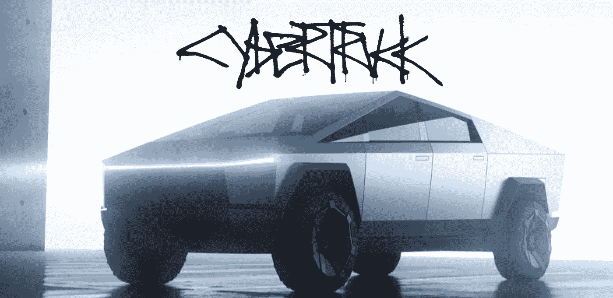

# 网络卡车对执法和人工智能的影响

> 原文：<https://towardsdatascience.com/implications-of-the-cybertruck-for-law-enforcement-and-ai-31cd0eb692c6?source=collection_archive---------36----------------------->

你不能错过特斯拉的 Cybertruck 的公告，它带有与碎玻璃相关的“可爱”片段。价格点和两极分化的设计是关键的讨论点。

The image of the Cybertruck (from tesla.com)

“bladerunner”的设计伴随着通常的粉丝热情和对福特、通用、康明斯、艾利森变速器影响的强制性金融分析师报告。

令人不安的是合金钢和防弹玻璃中“坚不可摧”材料的使用。

执法部门可能想再看看一辆类似坦克的汽车在街道上行驶的可能性，它也有内置电源。

模仿恐怖主义是全世界人民的祸害。传统和社交媒体引发的病毒式传播刺激了模仿者:从校园枪击案到人们驾驶卡车冲进人群和建筑物。

像这样的卡车需要背景调查吗？如果它被用于帮派暴力呢？问题比比皆是，社会需要对不断变化的技术做出反应。

例如，NHTSA 校车的安全标准可能需要重新审视。行人安全也是要检查的。

艾在这里也有一出戏。这种卡车的行驶里程超过 500 英里，可以邀请司机前往偏远地区，如国家公园和越野。计算机视觉系统对周围环境并不熟悉。就我而言，我很想看看视觉系统对鹿、野牛和熊的反应。

优步事故突出了行人检测(或缺乏检测)，行人直到很晚才被识别为人。请记住，特斯拉花了很长时间和一些事件才开始认识到道路施工、分流和汽车从公路路肩并入。

对于像沙漠、丘陵和雪地这样的偏远地区和地形，人工智能需要为此进行训练。

识别雪人或稻草人，并将其与人区分开来也是一项任务。毫无疑问，这将是一个小学生想玩的游戏——试图欺骗人工智能计算机视觉。

伦理人工智能和可解释人工智能再次成为焦点。举例来说，偏僻狭窄的道路可能会让你在一辆停下来的、抛锚的汽车和一辆救护车之间做出选择。

我们生活在有趣的时代。