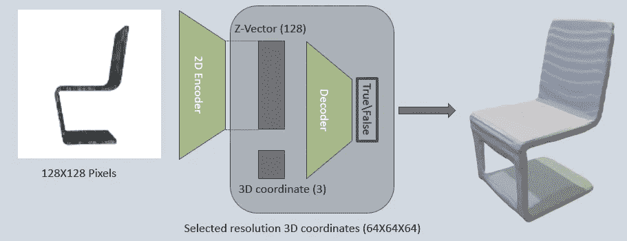
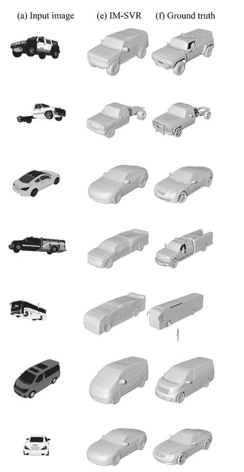

# 隐式解码器部分 1 - 3D 重建

> 原文：<https://towardsdatascience.com/implicit-decoder-3d-reconstruction-838193f9b760?source=collection_archive---------31----------------------->

## 内部人工智能

## **使用深度学习从单幅图像进行 3D 重建**

一种编码-解码类型的神经网络，用于对 2D 图像中形状的 3D 结构进行编码，然后对该结构进行解码并重建 3D 形状。这是我见过的最高质量的 3D 图像重建。

## 一些细节

*   输入图像:128X128 像素
*   透明图像背景
*   训练和生成是基于相似对象的类别来完成的
*   输出体素:基本分辨率为 64X64X64 体素。但是，可以产生任何所需分辨率的输出(！)而无需重新训练神经网络

## 神经网络结构:

*   2D 编码器—基于 ResNet18。从输入图像生成大小为 128 的编码向量(z 向量)
*   解码器——简单的 6 个全连接层，带 1 个分类输出神经元。接收空间中的 z 向量和- **1** - 3D 坐标作为输入，并分类该坐标是否属于物体的质量。

Neural Network Structure

## 重建是如何从这个网络发生的？

为了重建物体的整个结构，空间中的所有 3D 坐标被发送到解码器(在该论文的情况下，每个物体有 64X64X64 坐标)，以及来自图像的单个 z 向量。解码器对每个坐标进行分类，并创建 3D 结构的表示。这创建了 3D 对象的体素表示。然后，使用[行进立方体](https://en.wikipedia.org/wiki/Marching_cubes)算法来创建网格表示。

# 汽车类别重建示例

第一列是输入图像，第二列是 AI 3D 重建，最后一列是汽车的原始 3D 对象(或者，用技术语言来说，是地面真相)。这个图像案例中的神经网络是在汽车模型上训练的。在论文中有在椅子、飞机等上面训练的结果。请注意，本文中的输入输出图像和体素分辨率是特定的，但可以根据任何所需的实现进行相应的更改。

## 等等！最后一辆车是怎么改造的？

软件甚至没有看到图像中的车头。这就是 DL 培训的力量所在。由于我们通过许多以前的汽车例子来训练网络，它知道如何推断它从未见过的新车的形状。外推是可能的，因为网络是在来自相似类别的对象上训练的，所以网络有效地重建它之前被训练的相似结构，该结构匹配它在图像中看到的结构。

# 现有的三维重建软件

现在有很多工具可以从图像中进行三维重建。这些工具使用经典的[摄影测量](https://en.wikipedia.org/wiki/Photogrammetry)技术，从同一物体的多个图像中重建 3D 模型。两个例子:

*   [Agisoft](https://agisoft.com)
*   [欧特克公司——重述](https://www.autodesk.com/products/recap/overview)

这种类型的软件可以从当前的 AI 研究中受益。简单平面的重建，即使它们在图像中不完全可见，处理图像中的光反射或像差，更好的比例估计等等。所有这些都可以使用类似的神经网络解决方案来改进。

# 类似的研究

由于编码-解码架构和 GANs，单图像 3D 重建目前正在发展。这种研究的一个很好的例子是:[单幅图像的 3D 场景重建](https://2d3d.ai/index.php/2019/10/09/3d-scene-reconstruction-from-single-image/) —用于场景重建。单个物体重建的质量看起来不是很好，但令人印象深刻的是，他们是从自然场景图像中实现的。

# ShapeNet

与 ImageNet 的图像类似，ShapeNet 是一个大型的带注释的 3D 模型数据集，以及围绕 3D 主题进行 ML 研究的竞赛和人群。大多数(如果不是全部的话)3D ML 研究使用该数据集进行训练和基准测试，包括隐式解码器研究。有两个主要的 Shapenet 数据集，最新的是 ShapeNetCore.v2:

*   55 个常见对象类别
*   大约 51，300 个独特的 3D 模型
*   验证每个 3D 模型的类别和对齐(位置和方向)。

# 参考

*   博文原文：<https://2d3d.ai/index.php/2019/10/11/implicit-decoder-part-1-3d-reconstruction/>
*   研究:[1]陈、、。"学习生成式形状建模的隐式场."*IEEE 计算机视觉和模式识别会议论文集*。2019.
*   shape net:[https://www.shapenet.org/](https://www.shapenet.org/)

[隐式解码器第 2 部分— 3D 生成](/implicit-decoder-part-2-3d-generation-80dbcad8a563)