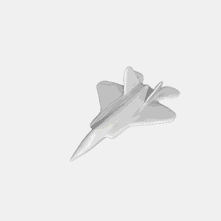
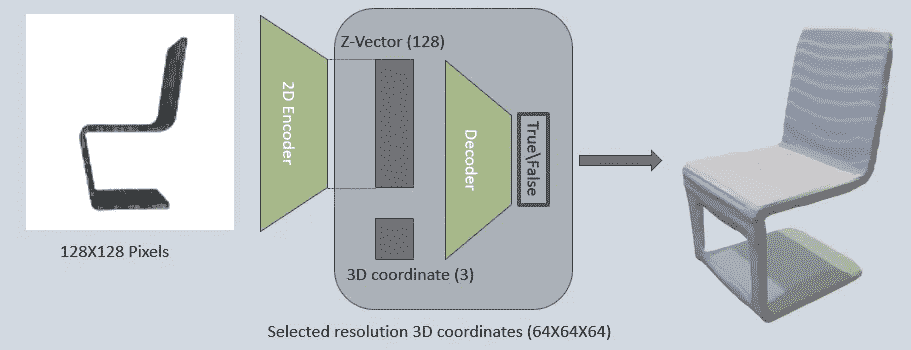
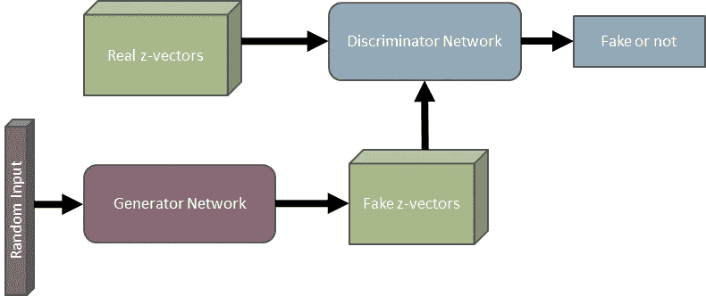
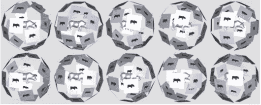

# 隐式解码器第 2 部分–3D 生成

> 原文：<https://towardsdatascience.com/implicit-decoder-part-2-3d-generation-80dbcad8a563?source=collection_archive---------40----------------------->

## 内部人工智能

## 深度学习和 3D 的 3D 生成和限制

前一篇文章— [隐式解码器第 1 部分—3D 重建](/implicit-decoder-3d-reconstruction-838193f9b760)

# 3D 生成

3D Airplane Generation

还记得[甘斯](https://2d3d.ai/index.php/2019/11/11/the-deep-learning-dictionary/#What-are-generative-networks?)吗？嗯，同样的技术可以用来生成你在左边看到的飞机。

它是如何发生的？诀窍是使用相同的解码器网络如下所示。特别是与编码器一起训练的同一个解码器。我们训练一个 GAN 网络来生成一个假的 z 向量。

鉴别器从编码器-解码器网络获得真实的 z 向量作为输入，同时从生成器网络获得虚假的 z 向量作为输入。生成器网络被训练为仅基于随机输入产生新的 z 向量。由于解码器知道获得 z 向量作为输入，并从中重建 3D 模型，并且生成器被训练以产生类似真实的 z 向量，因此可以使用两个网络组合来重建新的 3D 模型。

此外，我们可以看到 gif 显示一个飞机模型变形为一个新的。这是通过获取第一个和最后一个 3D 模型的 z 向量来完成的，让我们将这些向量称为 z_start 和 z_end，然后新的 z 向量被计算为 z_start 和 z_end 的线性组合。具体来说，选取一个介于 0 和 1 之间的数字(假设为 alpha)，然后计算一个新的 z-z _ new:z _ new =(z _ start * alpha+z _ end *(1-alpha))。然后，z_new 被馈送到解码器网络中，并且可以计算中间 3D 模型。

Encoder-Decoder

在不同的 3D 模型之间存在这样的平滑过渡的原因是隐式解码器网络被训练来基于 z 向量识别模型的底层 3D 构造，并且更具体地，识别特定模型类别中的模型。因此，z_vector 的微小变化将导致 3D 模型的微小变化，但仍然保持模型类别的 3D 结构，这样就可以从 z_start 到 z_end 连续地改变模型。

Generating z-vectors

# 深度学习和 3D 重建\生成的局限性

这些结果被带到这里和其他地方，使神经网络似乎是全能的，易于使用和推广到其他场景，用例和产品。有时候是这样，但很多时候不是。在 3D 生成和重建中，神经网络存在局限性。仅举几个例子:

## 数据集限制

正如我们已经证明的，神经网络每次都需要针对特定的模型类别进行训练。每个类别中需要有足够多的模型(通常至少数百个),并且足够多的类别允许这种类型的神经网络的任何类型的现实生活应用，ShapeNet 正在为学术界做这项工作，即使在学术界，类别和每个类别中的模型的数量也是有限的。为了使它在商业上可行，我们需要更多的型号和种类。此外，每个模型需要贴上标签，以其确切的类别，需要调整翻译和规模准确，需要以正确的格式保存。此外，对于每个模型，我们需要不同角度、不同照明位置和相机参数、不同比例对齐和平移的图像。同样，ShapeNet 和其他研究计划有助于建立这一系统，以帮助科学进步。但是，这也意味着，为了将这项研究转化为产品，在数据集创建和处理方面会有大量开销。

## 准确度测量

一个反复出现的问题是 3D 重建或生成有多精确。对此的一个回答是——如何测量 3D 重建的精确度？假设一个人类 3D 设计师从一幅图像重建一个 3D 模型，我们怎么能说他的工作准确与否呢？即使我们有了原始的 3D 模型，又怎么能说两个 3D 模型是相似的，或者说重建的 3D 模型与原点相似，又怎么能量化这种相似性呢？老派的方法，如 MSE、IoU、F1 分数、切角和法向距离[[添加参考—[https://2d 3d . ai/index . PHP/2019/10/09/3D-scene-re construction-from-single-image/](https://2d3d.ai/index.php/2019/10/09/3d-scene-reconstruction-from-single-image/)]]是不考虑对象的 3D 结构的直接度量。例如，IoU 检查与两个形状的联合体积相比，重建的 3D 形状的体积有多少与原始 3D 形状重叠。如果重建的形状被移动到空间中的不同体积中，即使形状是相同的，IoU 也可能为零(因为没有重叠)。

在隐式解码器论文中，作者使用了一种不同的 3D 形状相似性度量方法—[【LFD】](https://onlinelibrary.wiley.com/doi/abs/10.1111/1467-8659.00669)。该度量对于模型的比例、对齐和位置(平移)是不变的。基本想法是从十二面体上的角度拍摄模型的 10 个轮廓图像，并且每个模型拍摄 10 个不同的十二面体。

然后，当在两个模型之间进行比较时，使用[傅立叶](https://en.wikipedia.org/wiki/Fourier_series)和[泽尼克](https://en.wikipedia.org/wiki/Zernike_polynomials)系数来比较来自这 10 个十二面体的图像的视觉相似性。

# 参考

*   陈，，和。"学习生成式形状建模的隐式场."*IEEE 计算机视觉和模式识别会议论文集*。2019.
*   shape net:[https://www.shapenet.org/](https://www.shapenet.org/)
*   ，陈，丁云，等，“基于视觉相似性的三维模型检索研究”*计算机图形学论坛*。第 22 卷。№3.英国牛津:布莱克威尔出版公司，2003 年。

*原载于 2019 年 11 月 16 日*[*https://2d3d . ai*](https://2d3d.ai/index.php/2019/11/16/implicit-decoder-part-2-3d-generation/?utm_source=2d3d.ai&utm_campaign=cf7b1bfd74-EMAIL_CAMPAIGN_2019_11_16_07_23&utm_medium=email&utm_term=0_9ef5ea9bbc-cf7b1bfd74-)*。*