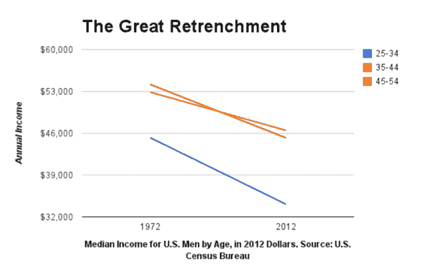
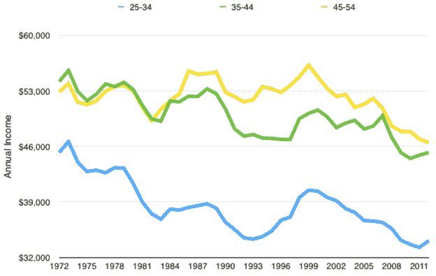
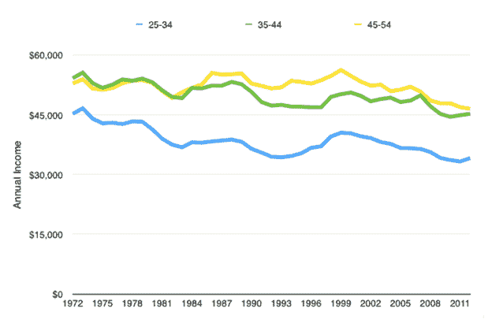
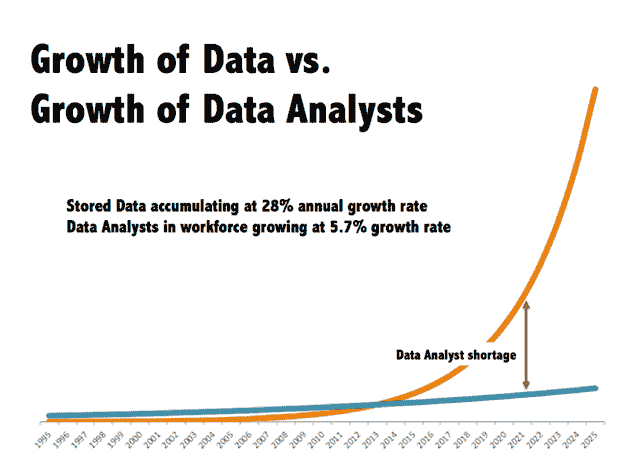
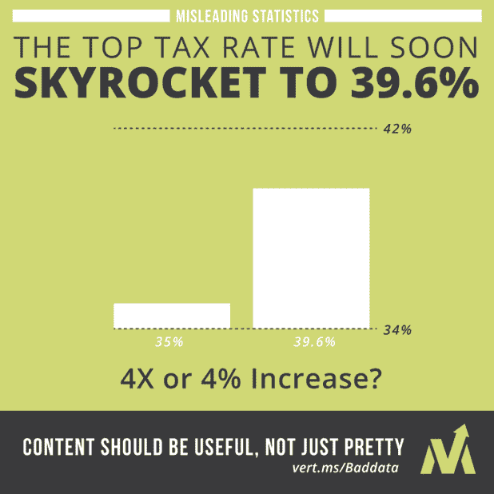

# 数据可视化对获得可行见解的重要性

> 原文：<https://towardsdatascience.com/importance-of-data-visualization-to-derive-actionable-insights-46e4d6dfa33c?source=collection_archive---------23----------------------->

Photo by [NASA](https://unsplash.com/@nasa?utm_source=unsplash&utm_medium=referral&utm_content=creditCopyText) on [Unsplash](https://unsplash.com/search/photos/data-visualization?utm_source=unsplash&utm_medium=referral&utm_content=creditCopyText)

数据可视化本身不是关于洞察力，而是关于交流洞察力。

从搅动大量数据中获得的定量洞察通常是微妙的、令人惊讶的、技术上复杂的。鉴于此，向任何受众，尤其是可能有兴趣/时间了解技术细节的业务受众传达这些见解变得更加困难。尽管如此，还是有一些人更喜欢用平淡无奇的黑白数字表格和方程式来展示结果，而不是更具视觉刺激的演示，但是这种人的比例非常小。

作为一名咨询出身的人，我们必须准备好面对各种类型的客户&喜欢表格和方程式的客户，以及想要好看的视觉效果的客户。

根据我的经验，以下是我得到的一些经验法则:

## 1.清楚

*   每张图讲述一个非常重要的观点，并找出讲述故事的元素
*   你陈述的每一件事都应该与整个故事相联系或引导整个故事
*   保持形象简单直接
*   简化但不要过度简化，以免丢失调查结果或关键数据特征

让我们来看一个我最喜欢的例子，数据可视化对于获得洞察力是多么重要。

上面的图表出现在《彭博》上，结论是在过去的 40 年里，所有年龄段的美国男性工人的收入中值都在急剧下降。但这真的是真的吗？让我们看看下面的视觉代表相同的数据集。

现在，从上面的图像中，你可以清楚地看到，在仅仅代表了 2 个数据点(1972 年和 2012 年)后，许多局部扰动被消除了

同样，如果你观察 y 轴，它不应该从零开始。

完全相同的数据和图表视觉效果，只是 y 轴变为零。

完整阅读请参考 Eric 的原文[此处](https://medium.com/i-data/misleading-with-statistics-c63780efa928)。

## 2.透明度

*   解释获得适当深度洞察力的方法
*   陈述分析所依据的假设

Source: [http://www.delphianalytics.net](http://www.delphianalytics.net/wp-content/uploads/2013/04/GrowthOfDataVsDataAnalysts.png)

没有 y 轴，上面的图表毫无意义。显然，数据增长和数据分析师增长的规模/单位完全不同。如果不考虑单个度量的比例/单位，你就无法将两个视觉效果叠加在一起。讲述故事最重要的元素应该取 X 轴和 Y 轴；在得出任何结论之前，一定要检查这一点(很多方法会误导观众)。

## 3.完整

*   准确、诚实地描述不确定性和局限性，因为夸大数据的含义是非常普遍和诱人的。
*   卓越的图形化始于讲述数据的真相。—爱德华·塔夫特，定量信息的可视化展示，2001

Source: [http://www.verticalmeasures.com](http://www.verticalmeasures.com/wordpress/wp-content/uploads/2013/11/Skyrocketing-Tax-Rate-Increase.jpg)

这篇博客的灵感来源于 Dakshinamurthy V Kolluru 博士主持的数据可视化会议，并引用了其中的内容。

请在评论区告诉我们你的想法。

这些内容最初发表在我的个人博客网站:[http://datascienceninja.com/](http://datascienceninja.com/?source=post_page---------------------------)。点击[此处](http://datascienceninja.com/2019/07/29/importance-of-data-visualization-to-derive-actionable-insights/)查看并订阅即时接收最新博客更新。