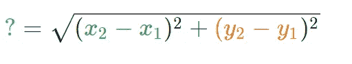
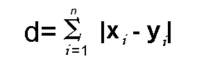
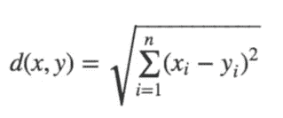

# 距离度量在机器学习建模中的重要性

> 原文：<https://towardsdatascience.com/importance-of-distance-metrics-in-machine-learning-modelling-e51395ffe60d?source=collection_archive---------3----------------------->


[Unsplash](https://unsplash.com/photos/smXusOhyHwg)

许多机器学习算法——有监督的或无监督的——使用距离度量来了解输入数据模式，以便做出任何基于数据的决策。良好的距离度量有助于显著提高分类、聚类和信息检索过程的性能。在本文中，我们将讨论不同的距离度量，以及它们如何帮助机器学习建模。

# 介绍

在许多现实世界的应用中，我们使用机器学习算法来分类或识别图像，并通过图像的内容检索信息。例如，人脸识别、在线审查图像、零售目录、推荐系统等。在这里，选择一个好的距离度量变得非常重要。距离度量有助于算法识别内容之间的相似性。

基础数学定义(来源维基百科)，

> 距离度量使用距离函数来提供数据集中每个元素之间的关系度量。

你们有些人可能会想，这个距离函数是什么？它是如何工作的？它如何决定数据中的特定内容或元素与另一个内容或元素有某种关系？让我们在接下来的几节里试着找出答案。

# 距离函数

你记得学过勾股定理吗？如果你这样做了，那么你可能还记得用这个定理计算两个数据点之间的距离。


Source: [Khan Academy’s Distance Formula Tutorial](https://www.khanacademy.org/math/geometry/hs-geo-analytic-geometry/hs-geo-distance-and-midpoints/a/distance-formula)

为了计算数据点 A 和 B 之间的距离，勾股定理考虑了 x 轴和 y 轴的长度。



Source: [Khan Academy’s Distance Formula Tutorial](https://www.khanacademy.org/math/geometry/hs-geo-analytic-geometry/hs-geo-distance-and-midpoints/a/distance-formula)

你们中的许多人一定想知道，我们在机器学习算法中使用这个定理来寻找距离吗？回答你的问题，是的，我们确实使用它。在许多机器学习算法中，我们使用上述公式作为距离函数。我们将讨论使用它的算法。

现在你可能已经知道什么是距离函数了。下面是一个简化的定义。

来自 Math.net 的基本定义，

> 距离函数提供集合中元素之间的距离。如果距离为零，那么元素是等价的，否则它们彼此不同。

距离函数只不过是距离度量使用的数学公式。不同的距离度量的距离函数可以不同。让我们讨论不同的距离度量，并了解它们在机器学习建模中的作用。

# 距离度量

有许多距离度量，但是为了使本文简洁，我们将只讨论几个广泛使用的距离度量。我们将首先尝试理解这些度量背后的数学，然后我们将确定使用这些距离度量的机器学习算法。

以下是常用的距离度量-

# **闵可夫斯基距离:**

闵可夫斯基距离是赋范向量空间中的度量。什么是赋范向量空间？赋范向量空间是在其上定义了范数的向量空间。假设 X 是一个向量空间，那么 X 上的范数是一个实值函数| |*X*| |它满足以下条件

1.  **零矢量-** 零矢量的长度为零。
2.  **标量因子-** 当你把向量乘以一个正数时，它的方向不变，尽管它的长度会改变。
3.  **三角形不等式-** 如果距离是一个范数，那么两点之间的计算距离将始终是一条直线。

你可能想知道为什么我们需要赋范向量，我们能不能不要简单的度量？由于赋范向量具有上述性质，这有助于保持范数诱导的度量齐次和平移不变。更多细节可以在[这里](https://math.stackexchange.com/questions/152340/whats-the-need-of-defining-notion-of-distance-using-norm-function-in-a-metric-s)找到。

可以使用下面的公式计算距离


闵可夫斯基距离是广义距离度量。这里的广义是指我们可以操纵上述公式，以不同的方式计算两个数据点之间的距离。

如上所述，我们可以操作 *p* 的值，并以三种不同的方式计算距离-

> p = 1，曼哈顿距离
> 
> p = 2，欧几里德距离
> 
> p = ∞，切比雪夫距离

我们将在下面详细讨论这些距离度量。

**曼哈顿距离:**

如果我们需要计算网格状路径中两个数据点之间的距离，我们使用曼哈顿距离。如上所述，我们使用 ***闵可夫斯基距离*** 公式，通过设置 ***p 的*** 值为 ***1*** 来求曼哈顿距离。

比方说，我们要计算两个数据点- ***x*** 和 ***y*** 之间的距离， ***d*** 。


距离 ***d*** 将使用其笛卡尔坐标之间的 ***差*** 的绝对和来计算，如下所示:



其中，****易*** 分别为二维向量空间中向量 x 和 y 的变量。即 ***x = (x1，x2，x3，...)*** 和 ***y = (y1，y2，y3，…)*** 。*

*现在距离 ***d*** 将被计算为-*

****【x1-y1】***+**+*(x2-y2)***+**+*(x3-y3)***+…+***(xn-yn)***。*

*如果您尝试将距离计算可视化，它将如下所示:*

**

*Source — [Taxicab geometry Wikipedia](https://en.wikipedia.org/wiki/Taxicab_geometry)*

*曼哈顿距离也被称为出租车几何，城市街区距离等。*

***欧几里德距离:***

*欧几里德距离是最常用的距离度量之一。通过将 ***p 的*** 值设置为 ***2*** ，使用闵可夫斯基距离公式进行计算。这将更新距离***【d】***公式如下:*

**

*我们停一会儿吧！这个公式看着眼熟吗？嗯是的，我们刚刚在这篇文章上面讨论 ***“勾股定理”的时候看到了这个公式。****

*欧几里德距离公式可以用来计算平面上两个数据点之间的距离。*

**

# ***余弦距离:***

*余弦距离度量主要用于发现不同文档之间的相似性。在余弦度量中，我们测量两个文档/向量之间的角度(作为度量收集的不同文档中的术语频率)。当向量之间的大小无关紧要但方向重要时，使用这种特定的度量。*

*余弦相似性公式可以从点积公式中导出*

**

*现在，你一定在想余弦角的哪个值会有助于找出相似点。*

**

*现在我们有了用来衡量相似性的值，我们需要知道 1，0 和-1 代表什么。*

*这里余弦值 1 用于指向相同方向的向量，即在文档/数据点之间存在相似性。正交向量为零，即不相关(发现一些相似性)。指向相反方向的向量的值为-1(无相似性)。*

# ***马氏距离:***

*Mahalanobis 距离用于计算多元空间中两个数据点之间的距离。*

*根据维基百科的定义，*

> ***Mahalanobis 距离**是一个点 P 和分布 d 之间距离的度量。测量的想法是，P 离 d 的平均值有多少标准差。*

*使用 mahalanobis 距离的好处是，它考虑了协方差，这有助于测量两个不同数据对象之间的强度/相似性。观察值和平均值之间的距离可以计算如下-*

**

*这里，S 是协方差矩阵。我们使用协方差度量的倒数来获得方差归一化的距离方程。*

*现在，我们对不同的距离度量有了基本的了解，我们可以进入下一步，即使用这些距离度量的机器学习技术/建模。*

# *机器学习建模和距离度量*

*在这一部分，我们将研究一些基本的分类和聚类用例。这将有助于我们理解距离度量在机器学习建模中的用途。我们将从监督和非监督算法的快速介绍开始，然后慢慢转向例子。*

## *1.分类*

***K-最近邻(KNN)-***

*KNN 是一种非概率监督学习算法，即它不产生任何数据点的隶属概率，而是 KNN 根据硬分配对数据进行分类，例如数据点将属于 0 或 1。现在，你一定在想，如果没有概率方程，KNN 是怎么工作的。KNN 使用距离度量来找出相似点或不同点。*

*让我们看看 iris 数据集，它有三个类，看看 KNN 将如何识别测试数据的类。*

**

*在黑色方块上方的#2 图像中是一个测试数据点。现在，我们需要借助 KNN 算法找到这个测试数据点属于哪一类。我们现在将准备数据集来创建机器学习模型，以预测我们的测试数据的类别。*

```
*#Import required libraries#Import required librariesimport numpy as np
import pandas as pd
from sklearn.model_selection import train_test_split
from sklearn.neighbors import KNeighborsClassifier
from sklearn.metrics import accuracy_score#Load the dataset
url = "[https://raw.githubusercontent.com/SharmaNatasha/Machine-Learning-using-Python/master/Datasets/IRIS.csv](https://raw.githubusercontent.com/SharmaNatasha/Machine-Learning-using-Python/master/Datasets/IRIS.csv)"
df = pd.read_csv(url)#quick look into the data
df.head(5)#Separate data and label
x = df.iloc[:,1:4]
y = df.iloc[:,4]#Prepare data for classification process
x_train, x_test, y_train, y_test = train_test_split(x, y, test_size=0.3, random_state=0)*
```

*在 KNN 分类算法中，我们定义了常数*“K”。* K 是一个测试数据点的最近邻数。然后，这 K 个数据点将用于决定测试数据点的类别。(注意这是在训练数据集中)*

**

**你是否想知道我们如何找到最近的邻居。这就是距离度量进入图片的地方。首先，我们计算每列火车和测试数据点之间的距离，然后根据 k 的值选择最接近的顶部**

*我们不会从头开始创建 KNN，但会使用 scikit KNN 分类器。*

```
*#Create a modelKNN_Classifier = KNeighborsClassifier(n_neighbors = 6, p = 2, metric='minkowski')*
```

*你可以在上面的代码中看到，我们使用的是闵可夫斯基距离度量，p 值为 2，即 KNN 分类器将使用欧几里德距离度量公式。*

*随着机器学习建模的发展，我们现在可以训练我们的模型，并开始预测测试数据的类别。*

```
*#Train the model
KNN_Classifier.fit(x_train, y_train)#Let's predict the classes for test data
pred_test = KNN_Classifier.predict(x_test)*
```

*一旦选择了顶部最近的邻居，我们检查邻居中投票最多的类-*

**

*从上图中，你能猜出考点的类别吗？它是 1 类，因为它是投票最多的类。*

*通过这个小例子，我们看到了*距离度量*对于 KNN 分类器的重要性。*这有助于我们获得已知类别的最接近的列车数据点。*使用不同的距离指标，我们可能会得到更好的结果。所以，在像 KNN 这样的非概率算法中，距离度量起着重要的作用。*

## *2.使聚集*

***K-means-***

*在概率或非概率的分类算法中，我们将获得带标签的数据，因此预测类别变得更容易。尽管在聚类算法中我们不知道哪个数据点属于哪个类。距离度量是这类算法的重要组成部分。*

*在 K-means 中，我们选择定义聚类数的质心数。*然后使用距离度量(欧几里德)*将每个数据点分配到其最近的质心。我们将使用 iris 数据来理解 K-means 的基本过程。*

**

*在上面的图像#1 中，你可以看到我们随机放置了质心，在图像#2 中，使用距离度量试图找到它们最近的聚类类。*

```
*import numpy as np
import pandas as pd
from sklearn.cluster import KMeans
import matplotlib.pyplot as plt#Load the dataset
url = "[https://raw.githubusercontent.com/SharmaNatasha/Machine-Learning-using-Python/master/Datasets/IRIS.csv](https://raw.githubusercontent.com/SharmaNatasha/Machine-Learning-using-Python/master/Datasets/IRIS.csv)"
df = pd.read_csv(url)#quick look into the data
df.head(5)#Separate data and label
x = df.iloc[:,1:4].values#Creating the kmeans classifier
KMeans_Cluster = KMeans(n_clusters = 3)
y_class = KMeans_Cluster.fit_predict(x)*
```

*我们将需要不断重复分配质心，直到我们有一个清晰的集群结构。*

**

*正如我们在上面的例子中看到的，在 K-Means 中的距离度量的帮助下，在没有关于标签的任何知识的情况下，我们将数据聚类成 3 类。*

## *3.自然语言处理*

***信息检索***

*在信息检索中，我们处理非结构化数据。数据可以是文章、网站、电子邮件、短信、社交媒体帖子等。借助 NLP 中使用的技术，我们可以创建矢量数据，以便在查询时可以用来检索信息。一旦将非结构化数据转换成向量形式，我们就可以使用余弦相似性度量从语料库中过滤掉不相关的文档。*

*我们举个例子，了解一下余弦相似度的用法。*

1.  *为语料库和查询创建向量形式-*

```
*import math
import numpy as np
import pandas as pd
import matplotlib.pyplot as pyplot
from sklearn.metrics.pairwise import cosine_similarity
from sklearn.feature_extraction.text import TfidfVectorizervectorizer = TfidfVectorizer()corpus = [
 'the brown fox jumped over the brown dog',
 'the quick brown fox',
 'the brown brown dog',
 'the fox ate the dog'
]query = ["brown"]X = vectorizer.fit_transform(corpus)
Y = vectorizer.transform(query)*
```

*2.检查相似性，即找到语料库中与我们的查询相关的文档-*

```
*cosine_similarity(Y, X.toarray())**Results:**
**array([[0.54267123, 0.44181486, 0.84003859, 0\.        ]])***
```

*从上面的例子可以看出，我们查询单词*“布朗”*，在语料库中只有三个文档包含单词*“布朗”。*当使用余弦相似性度量检查时，除第四个文档外，其他三个文档的>值均为 0，从而给出了相同的结果。*

# *结论*

*通过这篇文章，我们了解了一些流行的距离/相似性度量，以及如何使用这些度量来解决复杂的机器学习问题。希望这能对初入机器学习/数据科学的人有所帮助。*

# *参考*

1.  *余弦相似度- [Sklearn](https://scikit-learn.org/stable/modules/generated/sklearn.metrics.pairwise.cosine_similarity.html) ， [TDS 文章](/overview-of-text-similarity-metrics-3397c4601f50)，[维基百科](https://en.wikipedia.org/wiki/Cosine_similarity)，[例题](http://www.sfs.uni-tuebingen.de/~ddekok/ir/lectures/tf-idf-dump.html)*
2.  *[Github 代码](https://github.com/SharmaNatasha/Machine-Learning-using-Python/blob/master/Distance_Metrics_MM.ipynb)*
3.  *距离度量-【Math.net ，[维基](https://en.wikipedia.org/wiki/Distance)*
4.  *闵可夫斯基距离度量- [维基](https://en.wikipedia.org/wiki/Minkowski_distance)，[博客](https://people.revoledu.com/kardi/tutorial/Similarity/MinkowskiDistance.html)，[著名度量](https://machinelearning1.wordpress.com/2013/03/25/three-famous-metrics-manhattan-euclidean-minkowski/)*