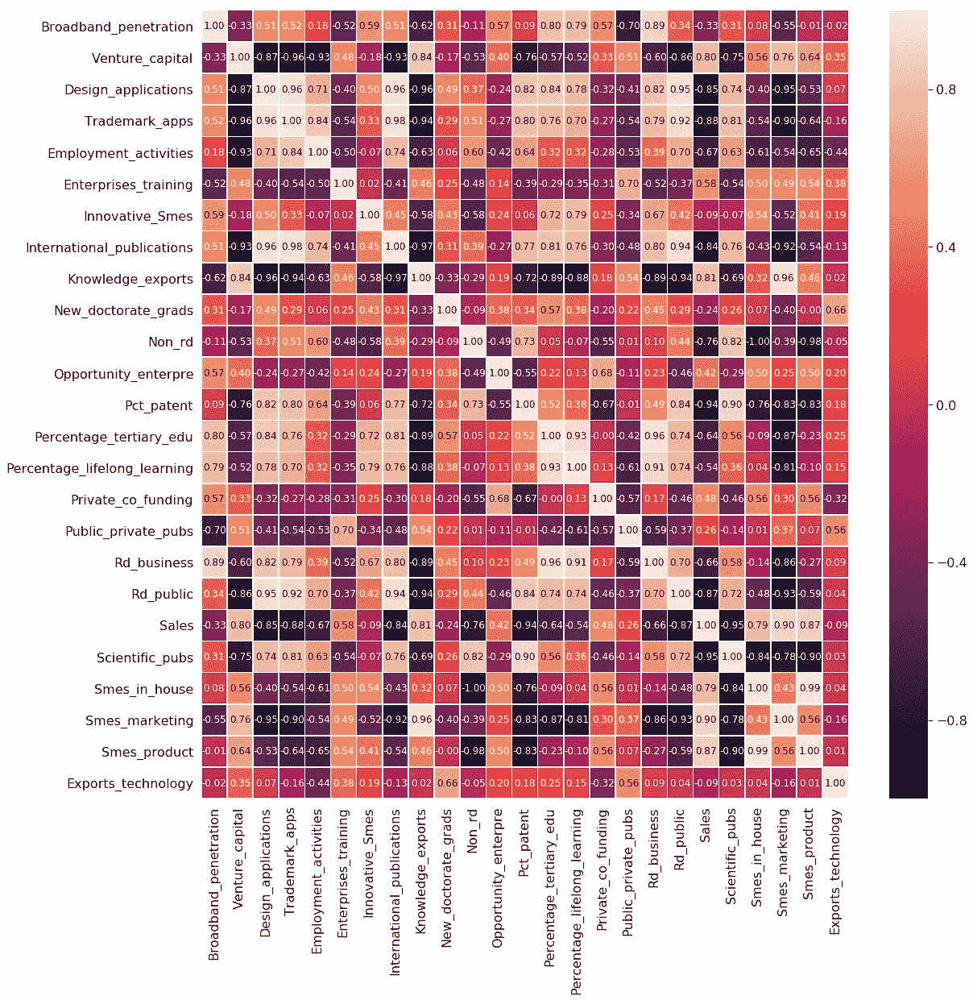
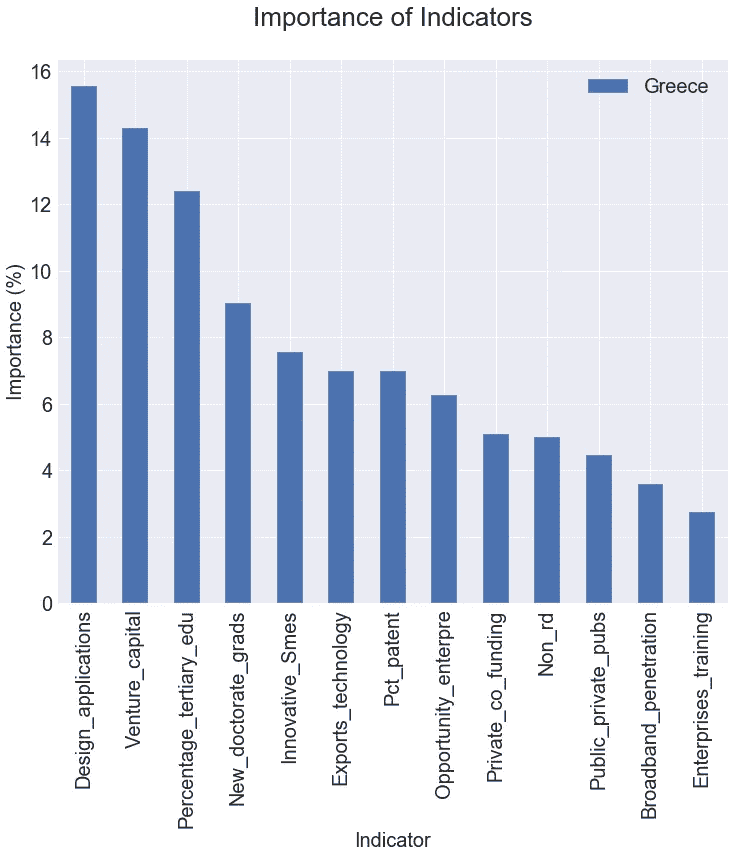

# 利用机器学习的创新指标的重要性

> 原文：<https://towardsdatascience.com/importance-of-innovation-indicators-utilizing-machine-learning-141fb5515866?source=collection_archive---------38----------------------->

## 希腊的例子

Photo by [Anastasia Zhenina](https://unsplash.com/@disguise_truth?utm_source=medium&utm_medium=referral) on [Unsplash](https://unsplash.com?utm_source=medium&utm_medium=referral)

这篇文章对希腊进行了创新分析。利用多种机器学习算法的基于模型的特征重要性来确定影响希腊创新产出得分波动的最重要指标。使用的分类器有**逻辑回归**、**随机森林**、**额外树**和**支持向量机**。这项研究的数据由 [*欧洲创新记分牌*](https://ec.europa.eu/growth/industry/innovation/facts-figures/scoreboards_en) 免费提供。

# 介绍

创新可以定义为一个过程，它为组织、供应商和客户提供附加值和一定程度的新颖性，开发新的程序、解决方案、产品和服务以及新的营销方式[1]。这是每个组织最关心的问题之一。它在市场发展和协调中的作用是固有的。创新应用的重要性在从产品开发、管理方法到工作方式的所有人类领域都至关重要[2]。

# 背景资料

## 相关资料

欧盟委员会提供了各种工具来绘制、监测和评估欧盟在不同创新领域的表现。所提供的信息有助于欧盟、国家和区域层面的政策制定者和实践者衡量其绩效和政策，并了解新趋势和新出现的商业机会，从而为循证决策提供信息[3]。*欧洲创新记分牌* ( *EIS* )就是这样一个工具，它提供了对欧洲研究和创新绩效的比较评估。它评估国家研究和创新系统的相对优势和弱点，并帮助各国和各区域确定它们需要解决的领域。

Photo by [Sara Kurfeß](https://unsplash.com/@stereophototyp?utm_source=medium&utm_medium=referral) on [Unsplash](https://unsplash.com?utm_source=medium&utm_medium=referral)

2018 年的 *EIS* 版本区分了四种主要类型的指标和十个创新维度，总共捕获了 27 个不同的指标[4]。包括综合指标在内的四个主要类别是:

*   *框架条件*:企业外部创新绩效的主要驱动因素，区分三个综合指标(人力资源、研究系统、创新友好型环境)。
*   *投资*:对公共和商业部门的投资，区分两个综合指标(金融和支持、企业投资)。
*   *创新活动*:商业部门创新的不同方面，并区分三个综合指标(创新者、联系、知识资产)。
*   *影响*:企业创新活动的影响以及两个综合指标之间的差异(就业影响、销售影响)。

*EIS* 2018 的时序数据是指 2010-2017 年的时间框架。

## 机器学习

特征选择是机器学习中的基本技术[5]。人们不能随意保留或删除特征。有几种特征选择方法，包括降维[6]。一般来说，有两种主要的特征重要性方法，模型无关的和基于模型的。与模型无关的特征选择技术，例如前向特征选择，提取所选关键性能指标的最佳值所需的最重要的特征。然而，这种方法通常有一个缺点，即时间复杂度大。为了避免这个问题，可以从被训练模型中直接获得特征重要性。上面的方法是基于模型的方法。因此，上述方法被用于估计特征的重要性。

**Logistic 回归**是一种二元分类算法。它的目标是在 *k* 维空间中找到分隔这两个类别的最佳超平面，最小化逻辑损失[7]。为了估计每个特征对模型输出的重要性，使用了 *k* 维权重向量。第 j *个*权重的大绝对值表示第 j *个*特征在类别预测中的较高重要性。

**随机森林**是决策树模型的变种。这是一个使用多个决策树作为基础学习器的集成模型。基础学习者是高方差、低偏差的模型。通过汇总所有基础学习者做出的决策来预测响应变量，减少了整个模型的方差。这个想法是为了确保每个基础学习者学习数据的不同方面。这是通过行和列采样实现的[8]。在分类设置中，聚合是通过采取多数表决来完成的。在决策树的每个节点，基于信息增益标准或计算成本更低的基尼系数杂质减少来决定用于分割数据集的特征。选择最大化信息增益(或减少基尼系数杂质)的特征作为分裂特征。通过使用基尼重要度，特征重要度被计算为通过到达该节点的概率加权的节点杂质的减少。节点概率可以通过到达节点的样本数除以样本总数来计算。因此，很容易理解，值越高，特征越重要。

**Extra-Trees** 代表极度随机化的树。该分类器是一种基本上基于决策树的集成学习方法。 **Extra-Trees** 分类器将某些决策和数据子集随机化，以最大限度地减少数据的过度学习和过度拟合。**多余的树**就像**随机森林**。这种算法建立和适应多棵树，并使用随机特征子集分割节点[9]。然而，**随机森林**和**额外树**分类器之间的两个关键区别如下:

*   **额外树**不引导观察。该算法使用无替换的采样。
*   **额外树**节点根据在每个节点选择的特征的随机子集的随机分裂来分裂，而不是最佳分裂。

从统计学的角度来看，放弃 bootstrapping 的想法会导致偏倚方面的优势，而分裂点随机化通常具有极好的方差减少效果。如上所述，在**随机森林**中使用基尼系数计算特征重要性。

**支持向量机** ( **SVM** )是一个强大的监督学习模型，用于预测和分类。 **SVM** 的基本思想是使用非线性映射函数将训练数据映射到高维空间，然后在高维空间执行“线性”回归以分离数据。预定的核函数用于数据映射。通过寻找最佳超平面来完成数据分离。这个最优超平面被称为**支持向量**，其具有来自分离类的最大余量【10】。

与人工神经网络、决策树等经典分类方法相比，SVM 有许多优点。在高维空间中的良好性能可以被认为是一种优势。此外，**支持向量**依赖于训练数据的一个小子集，这给了 **SVM** 惊人的计算优势。

在这项研究中，使用了线性核的 **SVM** 算法。因此，为了估计每个特征对模型输出的重要性，使用了 *k* 维权重向量。第 j *个*权重的大绝对值表示第 j *个*特征在类别预测中的较高重要性。权重系数彼此之间的绝对大小可以用于从数据中确定特征重要性。

# 数据收集和预处理

使用来自 2018 年*欧洲创新记分牌* ( *EIS* )数据库版本的数据，包括 2010-2017 年期间的希腊数据。数据是从 [*欧洲创新记分牌*](https://ec.europa.eu/growth/industry/innovation/facts-figures/scoreboards_en) 网站免费收集的。希腊的数据质量很高，只有少量遗漏的观测数据。

数据库被过滤以仅选择关于希腊的指标。数据中丢失的值将被清除。此外，这两个指标的值在希腊层面缺失，因此在分析中不予考虑。这些指标是“外国博士研究生占所有博士研究生的百分比”和“在快速增长的企业中就业的百分比”。对于每个指标，使用数据库提供的标准化分数构建了 2010 年至 2017 年的时间序列数据。总体而言，时间序列数据由 25 个指标和汇总创新指数组成。

为了便于阅读，指示器的名称被截断。指示器的全名如下所示:

*   **宽带 _ 渗透**:宽带渗透。
*   **Venture_capital** :风险资本占 GDP 的百分比。
*   **设计 _ 应用**:每十亿 GDP 的设计应用(PPS)。
*   **Trademark_apps** :每十亿 GDP 的商标申请量(pps)。
*   **就业 _ 活动**:知识密集型活动的就业(占总就业的%)。
*   **企业 _ 培训**:提供培训以发展或提升其员工信息和通信技术技能的企业。
*   **创新型中小企业**:与他人合作的创新型中小企业(中小企业的%)。
*   **国际 _ 出版物**:每百万人口的国际科学合作出版物。
*   **知识 _ 出口**:知识密集型服务出口占总服务出口的百分比。
*   新博士毕业生:每 1000 名 25-34 岁人口中的新博士毕业生。
*   **非研发**:非研发&创新支出(占营业额的百分比)。
*   **Opportunity_enterpre** :机会驱动型创业(动机指数)。
*   **Pct_patent** :每十亿 GDP 的 Pct 专利申请量(PPS)。
*   **百分比 _ 高等教育 _ edu**:25-34 岁人口完成高等教育的百分比。
*   **百分比 _ 终身学习**:参与终身学习的 25-64 岁人口的百分比。
*   **私人共同出资**:公共研发支出的私人共同出资(占国内生产总值的百分比)。
*   **Public_private_pubs** :每百万人口公私合作出版物。
*   **Rd_business** : R & D 商业部门的支出(占国内生产总值的%)。
*   **Rd_public** : R & D 公共部门的支出(占国内生产总值的%)。
*   **销售额**:新上市和新公司创新的销售额占营业额的百分比。
*   **Scientific_pubs** :世界范围内被引用次数最多的前 10%的科学出版物占该国全部科学出版物的百分比。
*   **内部中小企业**:内部创新的中小企业占中小企业的百分比。
*   **中小企业 _ 营销**:引入营销或组织创新的中小企业占中小企业的百分比。

# 建模和实施

首先，使用相关性分析来避免在分析中包括高度相关的特征。然后，简要描述了时间序列分类过程的建模技术。

下图显示了希腊指标的关联热图。出于可视化和解释的目的，热图用于呈现成对相关分析。为避免多重共线性问题，丢弃高度相关要素的阈值设置为 **0.90** 。但是，这个阈值仍然被认为是一个高值。使用阈值 **0.70** 当然更好，但是数据特征的数量有限。因此，具有 **0.90** 相关性的特征将从分析中删除。

因此，应删除以下指标:

*   每十亿国内生产总值的商标申请量(PPS)
*   知识密集型活动中的就业(占总就业的%)
*   每百万人口的国际科学合作出版物，
*   知识密集型服务出口占总服务出口的百分比，
*   25-64 岁参与终身学习人口百分比，
*   商业部门的研发支出(占国内生产总值的%)
*   公共部门的研发支出(占国内生产总值的%)
*   新上市和新公司创新的销售额占营业额的百分比，
*   世界上被引用次数最多的前 10%的科学出版物占该国全部科学出版物的百分比，
*   内部创新的中小企业占中小企业的百分比，
*   采用营销或组织创新的中小企业占中小企业的百分比，
*   引入产品或工艺创新的中小企业占中小企业的百分比。

接下来，描述了用于分类目的的时间序列建模技术。构建了一个向量 ***v*** ，该向量使用以下技术对时间范围(2010-2017)内的综合创新指数波动进行建模:

*   步长等于一年的滑动窗口从时间帧的开始开始，并且如果本年度的汇总创新指数的值高于上一年度的值，则 ***v*** =1，否则 ***v*** =0。因此，这是一个二元分类问题，特征矩阵为 ***X*** 指标，标号为 ***y*** 向量为 ***v*** 。

然后，使用三重交叉验证方法训练四个机器学习模型，即**逻辑回归**、 **SVM** (线性核)、**随机森林**分类器和**额外树**分类器。数据实例有限的事实导致我们对模型进行交叉验证训练，特别是三重交叉验证。保持模型对 3 个折叠中每个折叠的特征重要性的估计。然后，重要性的最终值是每个模型的这 3 个折叠的平均值。每个基于模型的重要性值被转换为每个模型的百分比。最后，特征重要性的总结是来自每个模型的指标重要性的所有百分比值的平均值。

# 结果

下面是一个图表，以百分比形式总结了希腊指标的特征重要性。

毫无疑问，风险资本在希腊的创新产出中发挥着重要作用。具体来说，这是初创企业和企业家最关心的问题之一。它为创新铺平了道路，并允许它们被设计成适销对路的产品。它有助于为商业想法提供资金，否则这些想法将没有机会获得必要的资本。因此，创新技术和服务的发展在国家创新产出中发挥着关键作用。

此外，希腊还倾向于严重依赖受过良好教育的人和有创造力的中小企业来增加创新生产。新的博士毕业生和 25-34 岁的大学毕业生无疑在创新生产中发挥着重要作用。大多数创新的想法来自受过教育的人。在希腊，中小企业占该国私营部门总数的 99.9%。具体来说，微型企业约占私营部门的 96.6%，约占希腊经济总就业人数的 56%。换言之，中小企业是希腊经济中最重要的部分，直接影响着经济生活的金融和社会层面。与其他公司或组织合作的创新型中小企业是希腊企业家精神的一个重要标志。公共研究机构和公司之间以及公司和其他企业之间的专业知识转移似乎对创新的产生很重要。

# 结论

在这篇文章中，使用机器学习对创新指标的重要性进行了分析。通过对希腊综合创新指数采用建模技术，评估了希腊指标对其波动的影响。基于模型的希腊特征重要性分析是使用四个众所周知的分类器模型实现的。结果显示，排名前五位的重要特征是*设计申请*、*风险投资*、*25-34 岁完成高等教育的人口比例*、*每 1000 名 25-34 岁人口中新增博士毕业生*和*与他人合作的创新型中小企业*。

# 参考

[1] R .卡内基和澳大利亚商业理事会。管理创新企业:澳大利亚公司与世界最佳竞争。商业图书馆，1993 年，第 427 页，ISBN: 1863501517。【在线】。可用:[https://catalogue . nla . gov.au/Record/1573090](https://catalogue.nla.gov.au/Record/1573090)。

[2] H. Tohidi 和 M. M. Jabbari，“创新的重要性及其在组织成长、生存和成功中的关键作用”，《Procedia 技术》，第 1 卷，第 535-538 页，2012 年 1 月，ISSN:2212-0173。DOI:10.1016/j . protcy . 2012 . 02 . 116 .[在线]。可用:[https://www . science direct . com/science/article/pii/s 221201731200117 x](https://www.sciencedirect.com/science/article/pii/S221201731200117X)

[3]监测创新|内部市场、工业、企业家精神和中小企业。【在线】。可用:[https://ec.europa.eu/growth/industry/innovation/事实-数字 _en](https://ec.europa.eu/growth/industry/innovation/facts-figures_en) 。

[4]欧盟委员会，DocsRoom —欧盟委员会 EIS 2018 方法论报告，2018。【在线】。可用:[https://ec.europa.eu/docsroom/documents/30081](https://ec.europa.eu/docsroom/documents/30081)。

[5] I. Guyon 和 A. Elisseeff，“变量和特征选择导论”，机器学习研究杂志，第 3 卷，第 3 号，第 1157-1182 页，2003 年，ISSN:ISSN 1533-7928。【在线】。可用:【http://jmlr.csail.mit.edu/papers/v3/guyon03a.html】T2。

[6] M. L. Bermingham，R. Pong-Wong，A. Spiliopoulou，C. Hayward，I. Rudan，H. Campbell，A. F. Wright，J. F. Wilson，F. Agakov，P. Navarro 和 C. S. Haley，“高维特征选择的应用:对人类基因组预测的评估”，《科学报告》，第 5 卷，第 1 期，第 10-312 页，2015 年 9 月，ISSN:2045-2322。DOI: 10.1038/srep10312。【在线】。可用:【https://www.nature.com/articles/srep10312】T4。

[7] D. W. Hosmer 和 S. Lemeshow，应用逻辑回归。美国新泽西州霍博肯:约翰威利父子公司，2000 年 9 月，ISBN: 9780471722144。DOI: 10.1002/ 0471722146。【在线】。可用:[http://doi.wiley.com/10.1002/0471722146.](http://doi.wiley.com/10.1002/0471722146.)

[8] T. K. Ho，“随机决策森林”，载于第三届国际文件分析和识别会议录(第 1 卷)——第 1 卷，ser 美国 DC 华盛顿州 IC Dar ' 95:IEEE 计算机学会，1995 年，第 278 页，ISBN:0–8186–7128–9。【在线】。可用:[https://dl.acm.org/citation.cfm?id=%20844379.844681](https://dl.acm.org/citation.cfm?id=%20844379.844681)。

[9] P. Geurts、D. Ernst 和 L. Wehenkel，“极度随机化的树”，Mach Learn (2006 年。DOI:10.1007/s 10994–006–6226–1。【在线】。可用:[http://citeseerx.ist.psu.edu/viewdoc/download?doi = 10 . 1 . 1 . 65 . 7485&rep = re P1&type = pdf](http://citeseerx.ist.psu.edu/viewdoc/download?doi=10.1.1.65.7485&rep=rep1&type=pdf)。

[10] V. Vapnik，“统计学习理论概述”，IEEE 神经网络汇刊，第 10 卷，第 5 期，第 988-999 页，1999 年，ISSN: 10459227。DOI: 10.1109/72.788640。【在线】。可用:[https://ieeexplore.ieee.org/document/788640](https://ieeexplore.ieee.org/document/788640)。