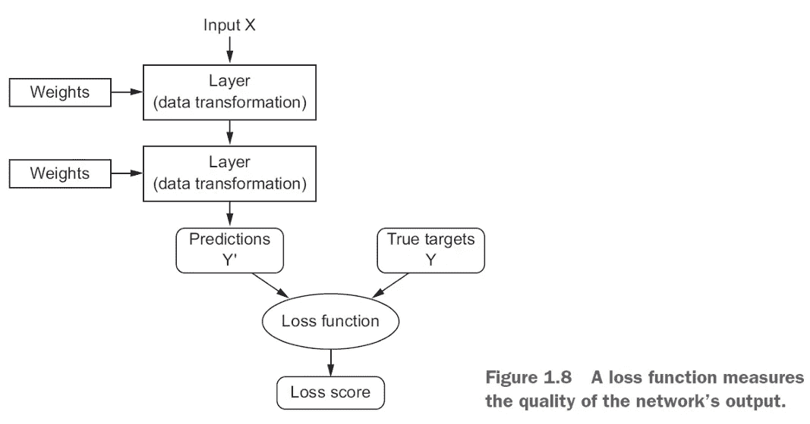
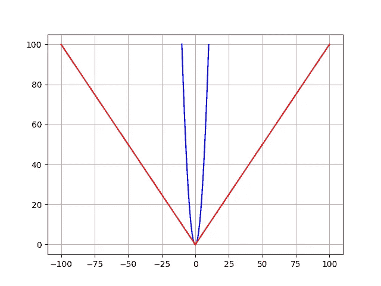
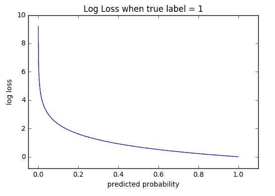
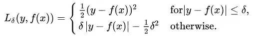

# 损失函数在机器学习中的重要性

> 原文：<https://towardsdatascience.com/importance-of-loss-function-in-machine-learning-eddaaec69519?source=collection_archive---------9----------------------->

最初发表于 [OpenGenus IQ](https://iq.opengenus.org/importance-of-loss-function/) 。

答假设给你一个任务，用 10 公斤沙子装满一个袋子。你把它装满，直到测量机器给你一个 10 公斤的精确读数，或者如果读数超过 10 公斤，你就把沙子拿出来。

就像那个称重机，如果你的预测是错的，你的损失函数会输出一个更高的数字。如果他们很好，它会输出一个较低的数字。当你试验你的算法来尝试和改进你的模型时，你的损失函数会告诉你是否有所进展。

> *“我们要最小化或最大化的函数叫做目标函数或准则。当我们将其最小化时，我们也可以称之为成本函数、损失函数或误差函数”——*[*来源*](https://www.deeplearningbook.org/)

> 本质上，损失函数是对预测模型在预测预期结果(或价值)方面表现的度量。我们将学习问题转化为优化问题，定义一个损失函数，然后优化算法以最小化损失函数。



# 损失函数有哪些类型？

最常用的损失函数有:

*   均方误差
*   绝对平均误差
*   对数似然损失
*   铰链损耗
*   胡伯损失

1.  **均方误差**

均方差(MSE)是基本损失函数的工作空间，因为它易于理解和实现，并且通常工作得很好。要计算 MSE，您需要获取模型预测值和地面真实值之间的差异，将其平方，然后在整个数据集内取平均值。
无论预测值和实际值的符号如何，结果总是正的，理想值为 0.0。

```
# function to calculate MSE
def MSE(y_predicted, y_actual): squared_error = (y_predicted - y_actual) ** 2
    sum_squared_error = np.sum(squared_error)
    mse = sum_squared_error / y_actual.size return mse
```

**2。平均绝对误差**

平均绝对误差(MAE)在定义上与 MSE 略有不同，但有趣的是，它提供了几乎完全相反的性质。要计算 MAE，您需要获取模型预测和地面实况之间的差异，将绝对值应用于该差异，然后在整个数据集内进行平均。

```
# function to calculate MAE
def MAE(y_predicted, y_actual):

    abs_error = np.abs(y_predicted - y_actual)
    sum_abs_error = np.sum(abs_error)
    mae = sum_abs_error / y_actual.size

    return mae
```



MSE (blue) and MAE (red) loss functions

**3。对数似然损失**

这个损失函数也比较简单，常用于分类问题。在此，
使用交叉熵来测量两个概率分布之间的误差。

```
-(y_actual * log(y_predicted) + (1 - y_actual) * log(1 - y_predicted))
```

这里可以看到，当实际类为 1 时，函数的后半部分消失，当实际类为 0 时，前半部分下降。那样的话，我们最终会乘以实际预测概率的对数。



Source: [fast.ai](https://www.fast.ai/)

二元或两类预测问题的交叉熵实际上是作为所有示例的平均交叉熵来计算的。

```
from math import log

# function to calculate binary cross entropy
def binary_cross_entropy(actual, predicted):
	sum_score = 0.0
	for i in range(len(actual)):
		sum_score += actual[i] * log(1e-15 + predicted[i])
	mean_sum_score = 1.0 / len(actual) * sum_score
	return -mean_sum_score
```

这个函数是 Kaggle 竞赛中最受欢迎的度量之一。这只是对数似然函数的简单修改。

**4。铰链损耗**

铰链损失函数在支持向量机中很流行。这些用于训练分类器。假设“t”是目标输出，使得 t = -1 或 1，并且分类器得分是“y”，则预测的铰链损失被给出为:`L(y) = max(0, 1-t.y)`

**5。胡贝尔损失**

我们知道 MSE 非常适合学习异常值，而 MAE 非常适合忽略它们。但是中间的东西呢？
考虑一个例子，我们有一个 100 个值的数据集，我们希望我们的模型被训练来预测。在所有这些数据中，25%的预期值是 5，而另外 75%是 10。

由于我们没有“异常值”，一个 MSE 损失不会完全解决问题；25%绝不是一个小分数。另一方面，我们不一定要用 MAE 来衡量太低的 25%。这些值 5 并不接近中值(10——因为 75%的点的值为 10 ),但它们也不是异常值。

# 我们的解决方案？

胡伯损失函数。

Huber Loss 通过同时平衡 MSE 和 MAE 提供了两个世界的最佳选择。我们可以使用以下分段函数来定义它:



这个等式的实际意思是，对于小于δ的损耗值，使用 MSE 对于大于 delta 的损失值，使用 MAE。这有效地结合了两个损失函数的优点。

```
# function to calculate Huber loss
def huber_loss(y_predicted, y_actual, delta=1.0): huber_mse = 0.5*(y_actual-y_predicted)**2
    huber_mae = delta * (np.abs(y_actual - y_predicted) - 0.5 * delta)

    return np.where(np.abs(y_actual - y_predicted) <= delta, 
                             huber_mse,  huber_mae)
```


MSE (blue), MAE (red) and Huber (green) loss functions

# 结论

损失函数提供的不仅仅是模型执行情况的静态表示，而是算法如何首先拟合数据。大多数机器学习算法在优化或为您的数据寻找最佳参数(权重)的过程中使用某种损失函数。

重要的是，损失函数的选择与神经网络输出层中使用的激活函数直接相关。这两个设计元素是联系在一起的。

将输出图层的配置视为对预测问题框架的选择，将损失函数的选择视为对问题给定框架的误差计算方式。

**进一步阅读**
[深度学习](https://www.deeplearningbook.org/)书作者*伊恩·古德菲勒、约舒阿·本吉奥和亚伦·库维尔*。