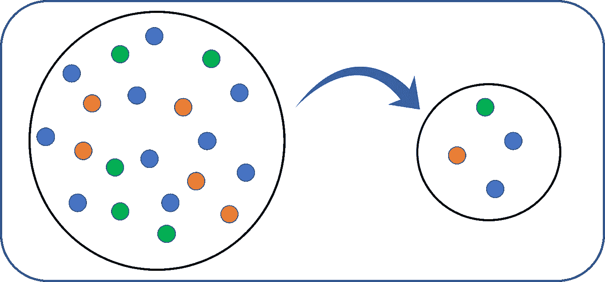
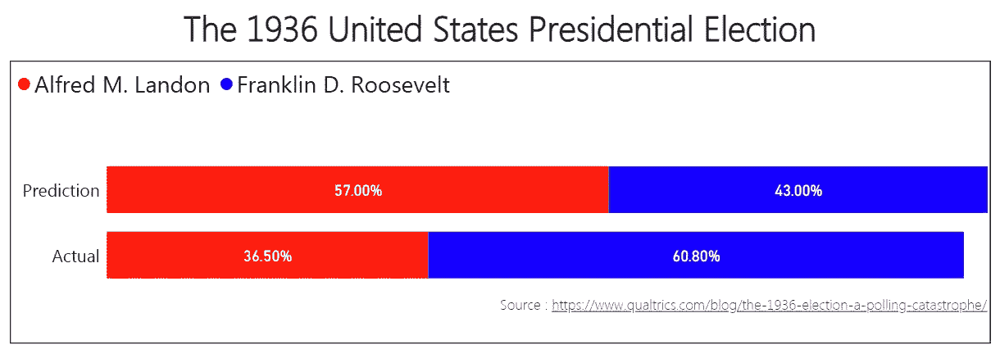

# 大数据时代采样的重要性

> 原文：<https://towardsdatascience.com/importance-of-sampling-in-the-era-of-big-data-d2cf83e06c6a?source=collection_archive---------20----------------------->

## 1936 年的教训

数字时代的进步帮助我们克服了调查、研究和质量保证领域的统计抽样传统上面临的一些挑战。传统上，数据收集和处理的边际成本很高。现在，只需动动手指，收集、存储和处理大量数据就变得更加容易和快捷。在某些情况下，这导致了所谓的 [*大数据傲慢*](https://blogs.scientificamerican.com/observations/why-big-data-isnt-necessarily-better-data/) —假设大数据分析可以作为传统分析手段的替代而非补充。

本文的目的不是淡化大数据和大数据分析带来的优势，而是仅仅强调抽样的重要性。此外，应该警惕拥有大量数据将弥补分析中其他挑战的观念。

## **1936 年美国总统竞选的文学文摘民意调查**

在某种程度上，这可以被认为是 20 世纪 30 年代的“大数据”实验。1936 年，阿尔弗雷德·m·兰登(时任堪萨斯州州长)和在任的富兰克林·d·罗斯福分别代表共和党和民主党进行总统竞选。

《文学文摘》是当时备受尊重的新闻周刊。在那之前，他们一直顺风顺水——正确预测了自 1916 年以来总统选举的获胜者。他们大胆宣称将在 10 月举行 11 月的选举，发起了一场规模宏大的民意测验，邮件列表超过 1000 万。每个成员都收到了一张模拟选票，并被要求交回一张有标记的选票。约有 240 万人回复。根据这些回答，人们预测兰登将获得 57%的选票，而罗斯福将获得 43%的选票。但现实远非如此。罗斯福赢得了 46 个州和 60.8%的选票。

Predicted vs. Actual share of popular vote Source: Qualtrics

与此同时，乔治·盖洛普通过仔细获取约 5 万人的样本，预测出了获胜者。

## 我们能从中学到什么？

> 即使您拥有的数据非常“大”,它也可能只代表一部分人口，而不代表全部人口！

在《文学文摘》的案例中，他们的邮件列表来源于电话簿、杂志订户列表、俱乐部会员名册等等。嗯……在 20 世纪 30 年代，电话是一种奢侈品，这个国家一直受到大萧条的困扰，经济问题成为竞选的主题是有原因的！有明显的迹象表明，对低收入群体存在选择偏见。

*在* ***机器学习*** *中，采样偏差会影响你的模型的性能。在训练和测试阶段，确保数据样本反映了您试图建模的相同基础分布是很重要的。*

> **在一个问题上投入计算资源(或金钱)并不总能解决问题**

花时间和精力选择合适的取样技术比对整个可及人群进行强力数据收集更有效。**的重点**不应该是增加样本量，而是**减少采样偏差**或其他误差。

> **有时候，少即是多！**

当数据量有限时，更容易控制数据的质量。花时间**去了解你的数据和收集数据的背景**是非常重要的。在通过模型运行数据之前，可视化和检查数据中的异常值或缺失值非常重要。此外，在错误分类中更容易发现错误。

当我们每天坐在越来越多的数据上时，你认为哪个统计概念更重要？欢迎在下面评论..

参考资料:

 [## 1936 年的选举——一场投票灾难

### 在之前的帖子中，我们简要提到了 1936 年选举中一个经常被引用的投票错误。为了选举的荣誉…

www.qualtrics.com](https://www.qualtrics.com/blog/the-1936-election-a-polling-catastrophe/)