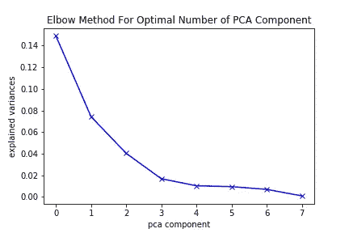
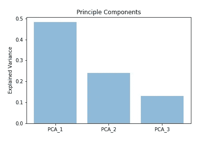
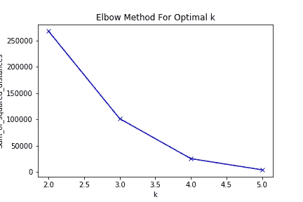

# 理解机器学习算法复杂性的重要性

> 原文：<https://towardsdatascience.com/importance-of-understanding-the-complexity-of-a-machine-learning-algorithm-9d0532685982?source=collection_archive---------14----------------------->

## 运行时分析

## 解释理解机器学习算法的内部工作的重要性，它在实现和评估中的不同。


Photo by [Vincent Botta](https://unsplash.com/@0asa?utm_source=unsplash&utm_medium=referral&utm_content=creditCopyText) on [Unsplash](https://unsplash.com/s/photos/inner-workings?utm_source=unsplash&utm_medium=referral&utm_content=creditCopyText)

机器学习工程师经常会发现自己需要为手头的问题选择正确的算法。通常情况下，他们首先理解他们提供解决方案的问题的结构。然后他们研究手边的数据集。经过最初的观察和关键的总结，他们最终为任务选择了正确的算法。

决定应用于手头数据集的最佳算法似乎是一项微不足道的工作。工程师经常在这些情况下创建捷径。如果任务有 0–1 标签，就应用逻辑回归，对吗？不对！我们应该意识到这些捷径，并时刻提醒自己，尽管某些算法对特定问题很有效，但在为问题选择最佳算法时，并没有“处方”。然而，算法的复杂性和运行时分析应该经常被讨论和考虑。

算法的运行时分析不仅对理解算法的内部工作至关重要，而且还能产生更成功的实现。

在本文的其余部分，我将描述一种情况，忽略对算法的运行时分析，在这种情况下 k 意味着集群，会导致工程师损失大量的时间和精力。

# 什么是 K 均值聚类

K-means 聚类是最流行且易于实现的无监督机器学习算法之一。也是容易理解的机器学习算法之一。

通常，无监督的机器学习算法仅使用特征向量从输入数据集进行推断。因此，这些算法适用于没有标签数据的数据集。当想要从大量结构化和非结构化数据中提取价值或洞察力时，它们也非常有用。K-means 聚类是这些探索性数据分析技术中的一种，其目标是提取数据点子组，使得同一聚类中的数据点在定义的特征方面非常相似。

# K-均值聚类是如何工作的

K-means 聚类从第一组随机选择的数据点开始，这些数据点被用作质心的初始种子。然后，该算法执行迭代计算，将剩余的数据点分配给最近的聚类。当根据定义的距离函数执行这些计算时，质心的位置被更新。当出现以下任一情况时，它会停止优化聚类中心:

*   质心的位置是稳定的，即它们的值的变化不超过预定的阈值。
*   该算法超过了最大迭代次数。

因此，算法的复杂度是

```
O(n * K * I * d)n : number of points
K : number of clusters
I : number of iterations
d : number of attributes
```

# K-means 算法例题

我将分享一个 k 均值聚类任务的代码片段。我的唯一目的是演示一个例子，其中未能理解运行时的复杂性会导致对算法的糟糕评估。我所采取的步骤并没有针对算法进行优化，也就是说，你可以更好地预处理数据并得到更好的聚类。涉及的步骤概述如下:

1.  *导入库，并读取数据集。在这里，我导入相关的库并读取数据集，我已经将数据集下载到了本地文件夹中。*
2.  *预处理。在这一步中，我放弃了字符串类型的列，只关注数字特性。由于 k-means 聚类分析计算数据点之间的距离，因此它适用于数值列。*
3.  *应用主成分分析进行降维。在应用 k-means 聚类之前降低数据集的维度通常是一种好的做法，因为在高维空间中，距离度量并不十分有效。*
4.  *计算剪影分数。K-means 聚类不直接应用。它涉及到寻找最佳聚类数的问题。轮廓分数是可用于确定最佳聚类数的技术之一。不理解剪影分数分析中所涉及的计算的复杂性将导致较差的实现。*
5.  *替代方案。在这里，我列出了一些找到最佳集群数量的备选解决方案。就运行时间复杂性而言，与剪影分数相比，它们是有利的。*

您可以重现问题来试一试。数据集的链接:[https://www.kaggle.com/sobhanmoosavi/us-accidents](https://www.kaggle.com/sobhanmoosavi/us-accidents)。

## 步骤 1:导入库并读取数据集

## 第二步:预处理

出于说明目的，我们仅根据道路相关特征对数据点进行聚类。

## 第三步:应用主成分分析降低维数



似乎 3 是最佳的。

## 步骤 4:计算剪影分数

有许多指标和方法可用于确定最佳聚类数。但我将集中讨论其中的几个。轮廓分数是这些度量之一。它是使用每个实例的平均类内距离和平均最近类距离来计算的。它计算每个样本与各个聚类中其余样本之间的距离。因此它的运行时间复杂度是 O(n)。如果不执行运行时分析，您可能需要等待数小时(如果不是数天)才能完成对大型数据集的分析。由于当前数据集有数百万行，一种解决方法是使用更简单的度量标准，如惯性或对数据集应用随机抽样。我将展示这两种选择。

## 第五步:替代解决方案

*   **肘法**

这种方法使用惯性或类内平方和作为输入。它描述了随着聚类数量的增加惯性值的减少。“肘”(曲线上的拐点)是惯性值的减少没有显著变化的点的良好指示。使用这种技术的优点是组内平方和不像轮廓分数那样计算昂贵，并且已经作为度量包括在算法中。



上面代码片段的挂钟时间是:

```
27.9 s ± 247 ms per loop (mean ± std. dev. of 7 runs, 1 loop each)
```

*   **随机下采样**

缩减采样允许您处理更小的数据集。这样做的好处是算法完成的时间大大减少了。这使得分析师能够更快地工作。缺点是，如果随机进行下采样，可能无法表示原始数据集。因此，任何涉及缩减采样数据集的分析都可能导致不准确的结果。但是，您可以始终采取预防措施，确保缩减采样数据集代表原始数据集。

上面代码片段的挂钟时间是:

```
3min 25s ± 640 ms per loop (mean ± std. dev. of 2 runs, 1 loop each)
```

**结束语**

在这篇文章中，我试图强调理解机器学习算法的复杂性的重要性。算法的运行时分析不仅对特定任务中的算法选择至关重要，而且对成功实现也很重要。这也是大多数雇主在数据科学领域寻求的关键技能之一。因此，做运行时分析和理解算法的复杂性总是一个好的实践。

*如果你对这个帖子有任何疑问，或者对数据科学有任何疑问，你可以在*[***Linkedin***](http://www.linkedin.com/in/baran-köseoğlu-391b99b1)***上找到我。***