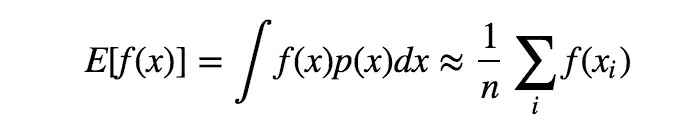
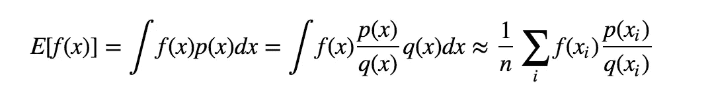
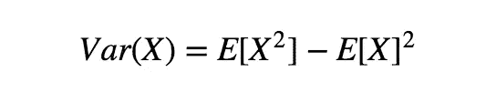
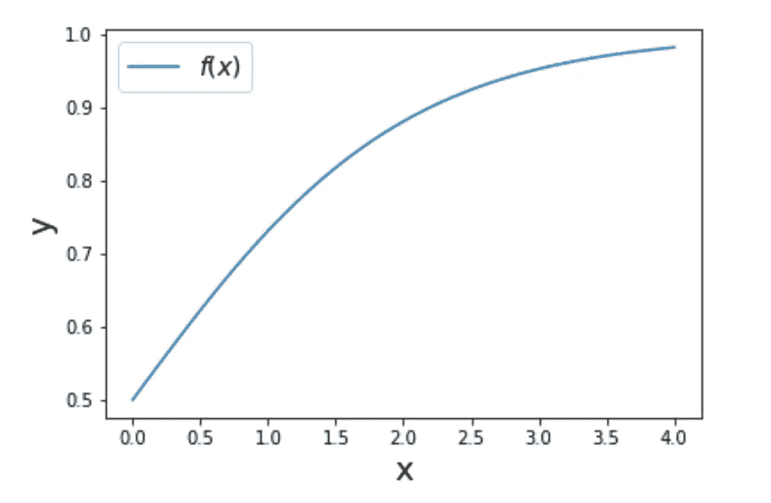
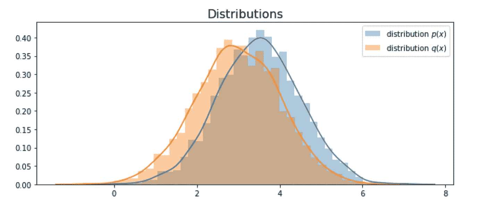
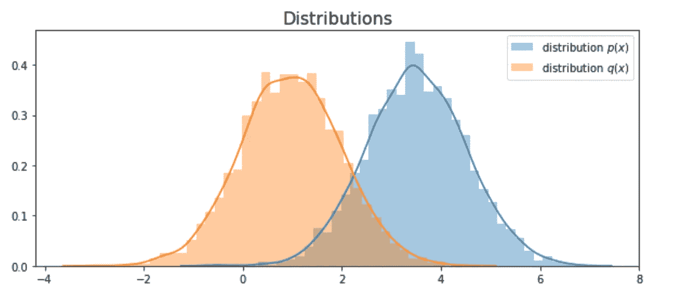

# 重要性抽样介绍

> 原文：<https://towardsdatascience.com/importance-sampling-introduction-e76b2c32e744?source=collection_archive---------1----------------------->

## 估计不同分布的期望值

重要抽样是一种近似方法，而不是抽样方法。它来源于一个小小的数学变换，能够以另一种方式表述问题。在这篇文章中，我们将:

1.  学习重要性抽样的概念
2.  通过实施流程获得更深入的理解
3.  比较不同抽样分布的结果

# 什么是重要性抽样？

考虑一个场景，你试图计算函数`f(x)`的期望值，其中`x ~ p(x)`服从某种分布。我们对`E(f(x))`有如下估计:

蒙特卡罗抽样方法是简单地从分布`p(x)`中抽取`x`样本，并取所有样本的平均值，从而得到期望值的估计值。那么问题来了，如果`p(x)`很难采样呢？我们能够根据一些已知的和容易抽样的分布来估计期望值吗？

答案是肯定的。它来自一个简单的公式转换:

其中`x`是从分布`q(x)`中取样的，且`q(x)`不应为 0。通过这种方式，估计期望能够从另一个分布中抽样`q(x)`，`p(x)/q(x)`被称为抽样比率或抽样权重，它作为一个校正权重来抵消从不同分布中抽样的概率。

我们需要讨论的另一件事是估计的方差:

其中在这种情况下，`X`是`f(x)p(x)/q(x)`，所以如果`p(x)/q(x)`很大，这将导致很大的方差，这是我们肯定希望避免的。另一方面，也可以选择适当的`q(x)`来产生更小的变化。我们来举个例子。

# 示范

首先，让我们定义函数`f(x)`和样本分布:

`f(x)`的曲线看起来像:

现在我们来定义`p(x)`和`q(x)`的分布:

为了简单起见，这里`p(x)`和`q(x)`都是正态分布，你可以试着定义一些很难采样的`p(x)`。在我们的第一个演示中，让我们设置两个分布，它们具有相似的平均值(3 和 3.5)和相同的 sigma 1:

现在我们能够计算从分布`p(x)`中采样的真实值

我们得到的估计值是 0.954。现在让我们从`q(x)`中取样，看看它的表现如何:

请注意，这里的`x_i`是从近似分布`q(x)`中抽取的，我们得到的估计值为 0.949，方差为 0.304。请注意，我们能够通过从不同的分布中取样来获得估计值！

## 比较

分布`q(x)`可能与`p(x)`过于相似，以至于你可能会怀疑重要性抽样的能力，现在让我们试试另一个分布:

带直方图:

这里我们将`n`设置为 5000，当分布不同时，通常我们需要更多的样本来逼近该值。这次我们得到的估计值是 0.995，但是方差是 83.36。

原因来自`p(x)/q(x)`，因为两个分布相差太大可能会导致该值的巨大差异，从而增加方差。经验法则是定义`q(x)`，其中`p(x)|f(x)|`较大。([全面实施](https://github.com/MJeremy2017/Machine-Learning-Algorithm-Implemention))

**参考:**

[1][https://www.youtube.com/watch?v=3Mw6ivkDVZc](https://www.youtube.com/watch?v=3Mw6ivkDVZc)

[2][https://astro statistics . PSU . edu/su14/lectures/cisewski _ is . pdf](https://astrostatistics.psu.edu/su14/lectures/cisewski_is.pdf)