# 你需要知道的机器学习的重要话题

> 原文：<https://towardsdatascience.com/important-topics-in-machine-learning-you-need-to-know-21ad02cc6be5?source=collection_archive---------3----------------------->

## 机器学习基础

Robots (Photo by [Daniel Cheung](https://unsplash.com/@danielkcheung?utm_source=unsplash&utm_medium=referral&utm_content=creditCopyText) on [Unsplash](https://unsplash.com/?utm_source=unsplash&utm_medium=referral&utm_content=creditCopyText))

机器学习现在是一个热门话题，每个人都试图获得任何关于这个话题的信息。关于机器学习的信息量如此之大，人们可能会不知所措。在这篇文章中，我列出了一些你需要知道的机器学习中最重要的主题，以及一些可以帮助你进一步阅读你有兴趣深入了解的主题的资源。

# **人工智能**

人工智能是计算机科学的一个分支，旨在创造模仿人类行为的智能机器，如知识、推理、解决问题、感知、学习、规划、操纵和移动物体的能力

人工智能是计算机科学的一个领域，它强调创造像人类一样工作和反应的智能机器。

 [## 人工智能

### 在计算机科学中，人工智能(AI)，有时称为机器智能，是智能证明…

en.wikipedia.org](https://en.wikipedia.org/wiki/Artificial_intelligence)  [## 什么是 AI(人工智能)？-WhatIs.com 的定义

### 人工智能是机器，尤其是计算机对人类智能过程的模拟

searchenterpriseai.techtarget.com](https://searchenterpriseai.techtarget.com/definition/AI-Artificial-Intelligence) 

# **机器学习(ML)**

机器学习属于人工智能的范畴，它为系统提供了自动学习和根据经验改进的能力，而无需显式编程。

学习的过程始于观察或数据，如例子、直接经验或指导，以便在数据中寻找模式，并根据我们提供的例子在未来做出更好的决策。

主要目的是让计算机在没有人类干预或帮助的情况下自动学习，并相应地调整行动。

 [## 机器学习

### 机器学习(ML)是对算法和统计模型的科学研究，计算机系统使用这些算法和统计模型来…

en.wikipedia.org](https://en.wikipedia.org/wiki/Machine_learning)  [## 什么是机器学习？定义专家系统

### 机器学习是人工智能(AI)的一种应用，它为系统提供了自动…

www.expertsystem.com](https://www.expertsystem.com/machine-learning-definition/)  [## 人工智能/人工智能初学者指南🤖👶

### 机器学习终极指南。简单明了的英语解释伴随着数学，代码和现实世界…

medium.com](https://medium.com/machine-learning-for-humans/why-machine-learning-matters-6164faf1df12) 

# **监督学习**

监督学习是基于示例输入-输出对学习将输入映射到输出的函数的机器学习任务。监督学习算法分析训练数据并产生推断的函数，该函数可用于映射新的示例。

在监督学习中，我们已经标记了训练数据。

 [## 监督学习

### 监督学习是一种机器学习任务，它学习一个函数，该函数基于…

en.wikipedia.org](https://en.wikipedia.org/wiki/Supervised_learning)  [## 监督学习-简介| Coursera

### 本课程视频抄本机器学习是让计算机在没有明确…

www.coursera.org](https://www.coursera.org/lecture/machine-learning/supervised-learning-1VkCb) 

# **无监督学习**

无监督学习是一种机器学习任务，它从由没有标记响应的输入数据组成的数据集进行推断。无监督学习的目标是对数据中的底层结构或分布进行建模，以便了解更多关于数据的信息。

聚类和关联是一些非监督学习子类别。

Photo by [Hans-Peter Gauster](https://unsplash.com/@sloppyperfectionist?utm_source=unsplash&utm_medium=referral&utm_content=creditCopyText) on [Unsplash](https://unsplash.com/?utm_source=unsplash&utm_medium=referral&utm_content=creditCopyText)

 [## 无监督学习

### 无监督学习是一种自组织的 Hebbian 学习，有助于在数据中发现以前未知的模式…

en.wikipedia.org](https://en.wikipedia.org/wiki/Unsupervised_learning)  [## 什么是无监督机器学习？数据机器人

### 无监督的机器学习算法从数据集推断模式，而不参考已知的或标记的…

www.datarobot.com](https://www.datarobot.com/wiki/unsupervised-machine-learning/)  [## 有监督学习和无监督学习有什么区别？

### 维基监督学习的定义监督学习是数据挖掘的任务，从标签中推断出一个函数

dataconomy.com](https://dataconomy.com/2015/01/whats-the-difference-between-supervised-and-unsupervised-learning/) 

# **神经网络或人工神经网络**

神经网络是一种生物启发的编程范式，它使计算机能够从观察数据中学习。人工神经网络的设计受到了人脑生物神经网络的启发，导致了一个远比标准机器学习模型更有能力的学习过程。

神经网络也称为人工神经网络，由输入层和输出层以及隐藏层组成，隐藏层由将输入转换为输出层可以使用的东西的单元组成。他们在需要寻找模式的任务中表现得非常好。

 [## 理解神经网络

### 我们探索神经网络如何运作，以建立对深度学习的直观理解

towardsdatascience.com](/understanding-neural-networks-19020b758230)  [## 神经网络和深度学习

### 人类视觉系统是世界奇迹之一。考虑下面的手写数字序列:大多数…

neuralnetworksanddeeplearning.com](http://neuralnetworksanddeeplearning.com/chap1.html)  [## 什么是神经网络？

### 神经网络是一种机器学习类型，它模仿人脑来模拟自身。这就造成了一种人为的…

www.techradar.com](https://www.techradar.com/au/news/what-is-a-neural-network) 

# **反向传播**

这是神经网络中的一个概念，它允许网络在结果与创造者希望的不匹配的情况下调整其隐藏的神经元层。

 [## 反向传播

### 反向传播算法是一系列用于有效训练人工神经网络的方法

en.wikipedia.org](https://en.wikipedia.org/wiki/Backpropagation)  [## 人工神经网络中的反向传播是如何工作的？

### 自从机器学习的世界被引入到递归工作的非线性函数(即人工…

towardsdatascience.com](/how-does-back-propagation-in-artificial-neural-networks-work-c7cad873ea7) 

# **深度神经网络(DNN)或深度学习**

深度学习是机器学习的一个子集，其中多层神经网络堆叠在一起，创建了一个巨大的网络，将输入映射到输出。它允许网络提取不同的特征，直到它能够识别它正在寻找什么。

 [## 什么是深度神经网络？-来自 Techopedia 的定义

### 深度神经网络定义-深度神经网络是一种具有一定复杂程度的神经网络，一种神经…

www.techopedia.com](https://www.techopedia.com/definition/32902/deep-neural-network)  [## 深度神经网络的基础

### 随着 Tensorflow 2.0 和 Fastai 等库的兴起，实现深度学习已经变得触手可及

towardsdatascience.com](/the-basics-of-deep-neural-networks-4dc39bff2c96)  [## 神经网络和深度学习| Coursera

### 从 deeplearning.ai 学习神经网络和深度学习，如果你想打入前沿 ai，这门课…

www.coursera.org](https://www.coursera.org/learn/neural-networks-deep-learning) 

# **线性回归**

线性回归是一种基于监督学习的机器学习算法。它执行回归任务。回归基于独立变量对目标预测值进行建模。它主要用于找出变量和预测之间的关系。可以使用线性回归的任务的一个例子是根据过去的价值预测房价。

线性回归的成本函数是预测 y 值(pred)和真实 y 值(y)之间的均方根误差(RMSE)。

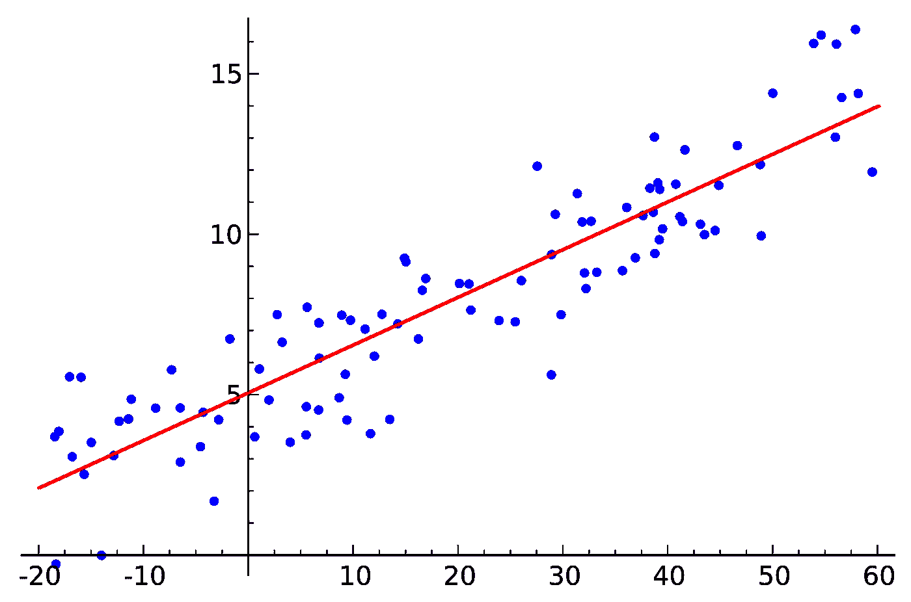

Linear Regression (By Sewaqu — Own work, Public Domain, [https://commons.wikimedia.org/w/index.php?curid=11967659](https://commons.wikimedia.org/w/index.php?curid=11967659))

 [## 线性回归

### 在统计学中，线性回归是一种建模标量响应(或变量)之间关系的线性方法

en.wikipedia.org](https://en.wikipedia.org/wiki/Linear_regression)  [## 线性回归-详细视图

### 线性回归用于寻找目标和一个或多个预测值之间的线性关系。有两个…

towardsdatascience.com](/linear-regression-detailed-view-ea73175f6e86)  [## 机器学习的线性回归

### 线性回归也许是统计学和机器中最著名和最容易理解的算法之一

machinelearningmastery.com](https://machinelearningmastery.com/linear-regression-for-machine-learning/) 

# **逻辑回归**

逻辑回归是用于分类问题的监督机器学习算法。这是一种分类算法，用于将观察值分配给一组离散的类。分类问题的一些例子是垃圾邮件或非垃圾邮件、在线交易欺诈或非欺诈。

逻辑回归使用逻辑 sigmoid 函数转换其输出，以返回概率值。

有两种类型的逻辑回归:

1.  二进制的
2.  多类

Logistic Regression (By Michaelg2015 — Own work, CC BY-SA 4.0, [https://commons.wikimedia.org/w/index.php?curid=42442194](https://commons.wikimedia.org/w/index.php?curid=42442194))

 [## 逻辑回归—详细概述

### 逻辑回归在二十世纪早期被用于生物科学。它后来被用于许多社会…

towardsdatascience.com](/logistic-regression-detailed-overview-46c4da4303bc)  [## 逻辑回归

### 在统计学中，逻辑模型(或 logit 模型)用于模拟某一类或某一事件的概率…

en.wikipedia.org](https://en.wikipedia.org/wiki/Logistic_regression)  [## 什么是逻辑回归？-统计解决方案

### 一个人体重每增加一磅，患肺癌的概率(是与否)会有怎样的变化…

www.statisticssolutions.com](https://www.statisticssolutions.com/what-is-logistic-regression/) 

# **K-最近邻(K-NN)**

k-最近邻(KNN)算法是一种简单、易于实现的监督机器学习算法，可用于解决分类和回归问题。

KNN 算法假设相似的事物存在于附近。换句话说，相似的事物彼此靠近。

可以用在推荐系统上。

KNN 的工作方式是找出查询和数据中所有示例之间的距离，选择最接近查询的指定数量的示例(K)，然后投票选择最频繁的标签(在分类的情况下)或平均标签(在回归的情况下)。

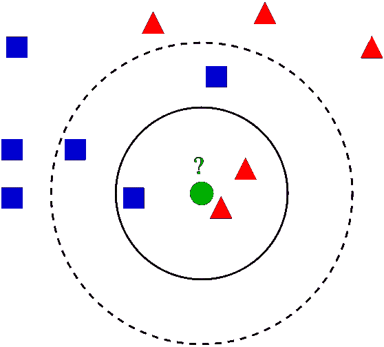

K-NN (Photo by Antti Ajanki AnAj [CC BY-SA 3.0 ([http://creativecommons.org/licenses/by-sa/3.0/](http://creativecommons.org/licenses/by-sa/3.0/))])

 [## 机器学习的 k-最近邻(KNN)算法

### 机器学习算法介绍系列的第 1 部分

medium.com](https://medium.com/capital-one-tech/k-nearest-neighbors-knn-algorithm-for-machine-learning-e883219c8f26)  [## K-最近邻算法快速介绍

### 大家好！今天我想谈谈 K-最近邻算法(或 KNN)。KNN 算法是一种…

blog.usejournal.com](https://blog.usejournal.com/a-quick-introduction-to-k-nearest-neighbors-algorithm-62214cea29c7)  [## KNN 分类

### 编辑描述

www.saedsayad.com](https://www.saedsayad.com/k_nearest_neighbors.htm) 

# **随机森林**

随机森林就像一种通用的机器学习技术，可用于回归和分类目的。它由大量单独的决策树组成，这些决策树作为一个整体运行。随机森林中的每个单独的决策树都给出一个类别预测，拥有最多票数的类别成为我们模型的预测。

一般来说，随机森林模型不会过度拟合，即使过度拟合，也很容易阻止它过度拟合。

随机森林模型不需要单独的验证集。

它只做了一些统计假设。不假设您的数据是正态分布的，也不假设关系是线性的。

它只需要很少的特征工程。

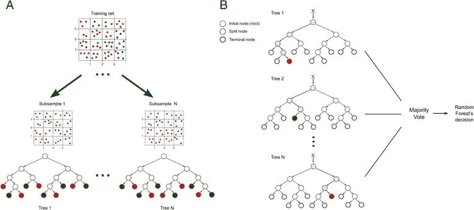

Random Forest ([Source](https://www.researchgate.net/figure/Random-forest-model-Example-of-training-and-classification-processes-using-random_fig5_280533599))

 [## 我学到的关于随机森林机器学习算法的东西

### 第一课概述:Fast.ai 机器学习课程随机森林介绍

towardsdatascience.com](/things-i-learned-about-random-forest-machine-learning-algorithm-40fde28fa89e)  [## 了解随机森林

### 该算法如何工作以及为什么如此有效

towardsdatascience.com](/understanding-random-forest-58381e0602d2) 

# **合奏学习**

集成学习通过组合几个模型来帮助改善机器学习结果。与单一模型相比，这种方法可以产生更好的性能。

集成方法是一种元算法，它将几种机器学习技术结合到一个预测模型中，以减少方差(bagging)、偏差(boosting)或改善预测(stacking)。

例子是随机森林，梯度提升决策树，ADA 提升。

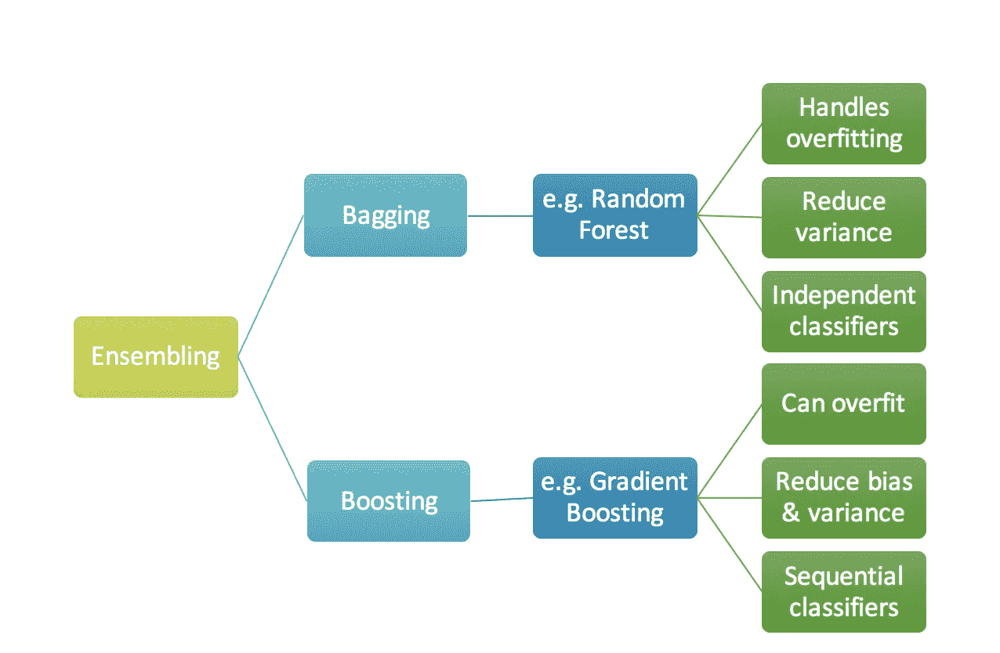

Ensembling ([Source](https://medium.com/mlreview/gradient-boosting-from-scratch-1e317ae4587d))

 [## 集成学习方法简单指南

### 什么，为什么，如何和装袋——推进去神秘化，而非传统的解释，读下去:)

towardsdatascience.com](/simple-guide-for-ensemble-learning-methods-d87cc68705a2)  [## 整体方法:装袋、助推和堆叠

### 理解集成学习的关键概念。

towardsdatascience.com](/ensemble-methods-bagging-boosting-and-stacking-c9214a10a205) 

# **梯度提升决策树**

Boosting 是一种集成技术，其中预测器不是独立产生的，而是顺序产生的。

这是一种将弱学习者转化为强学习者的方法。梯度增强是增强的一个例子。它是一种用于回归和分类问题的机器学习技术，它以集成或弱预测模型的形式产生预测模型，通常是决策树。

 [## 从零开始的渐变提升

### 简化复杂的算法

medium.com](https://medium.com/mlreview/gradient-boosting-from-scratch-1e317ae4587d)  [## 一位 Kaggle 大师解释梯度推进

### 如果线性回归是丰田凯美瑞，那么梯度推进将是 UH-60 黑鹰直升机。一个特别的…

blog.kaggle.com](http://blog.kaggle.com/2017/01/23/a-kaggle-master-explains-gradient-boosting/) 

# **过拟合**

当模型对训练数据建模得太好时，就会发生过度拟合。

当模型学习训练数据中的细节和噪声达到对新数据的模型性能产生负面影响的程度时，就会发生过度拟合。它会对模型的概括能力产生负面影响。

可以通过以下方式预防:

1.  交叉验证
2.  正规化

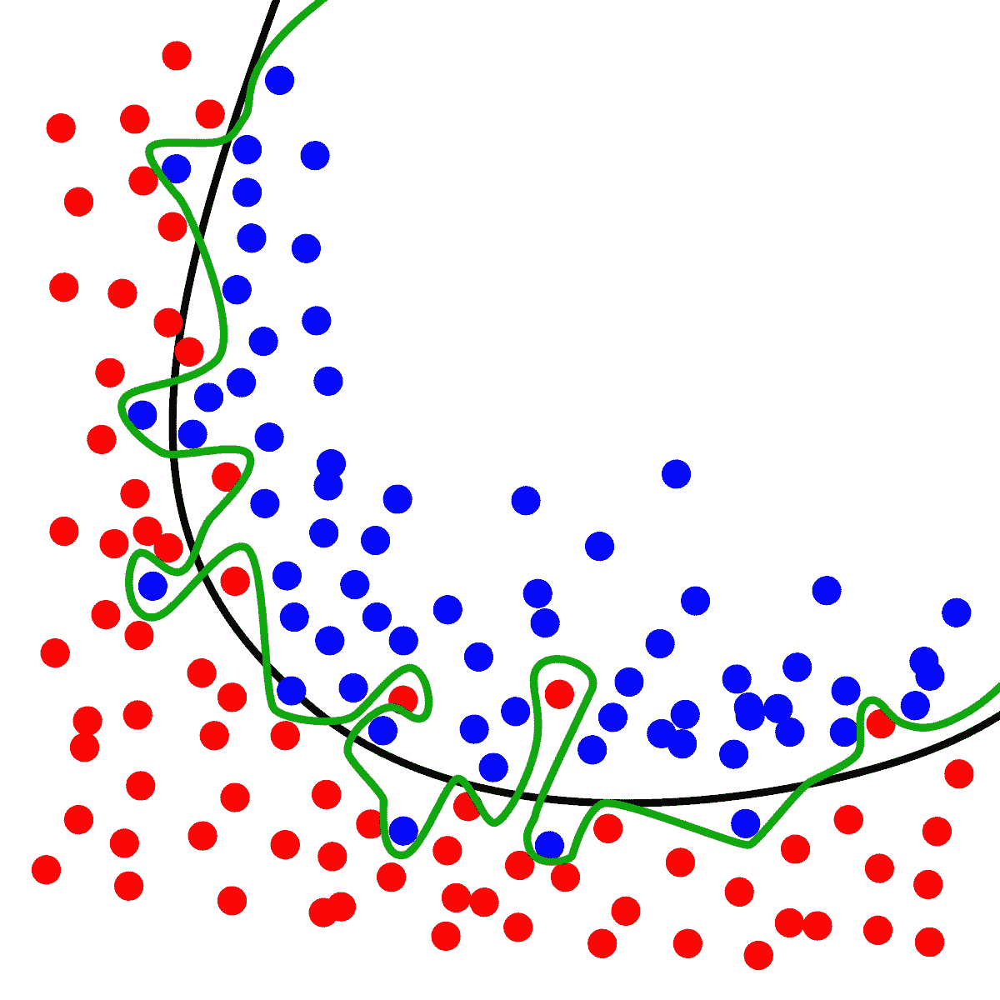

Overfitting ([Source](https://commons.wikimedia.org/wiki/File:Overfitting.svg))

 [## 机器学习中的过度拟合:什么是过度拟合以及如何防止过度拟合

### 你知道有一个错误吗......成千上万的数据科学初学者在不知不觉中犯的错误？还有这个…

elitedatascience.com](https://elitedatascience.com/overfitting-in-machine-learning)  [## 机器学习算法的过拟合和欠拟合

### 机器学习性能不佳的原因是数据过拟合或欠拟合。在这篇文章中，你…

machinelearningmastery.com](https://machinelearningmastery.com/overfitting-and-underfitting-with-machine-learning-algorithms/) 

# **欠适**

欠拟合指的是既不能对训练数据建模也不能推广到新数据的模型。它将在训练数据上表现不佳。

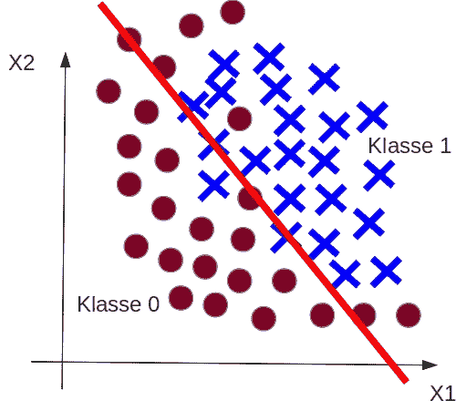

Underfitting ([Source](http://christianherta.de/lehre/dataScience/machineLearning/basics/pics/zeichnungen-twoClass-not-linear-separable-underfitting.png))

 [## 今天的机器学习课——过度拟合和欠拟合

### 当统计模型或机器学习算法捕捉到数据的噪声时，就会发生过拟合。直觉上…

chemicalstatistician.wordpress.com](https://chemicalstatistician.wordpress.com/2014/03/19/machine-learning-lesson-of-the-day-overfitting-and-underfitting/)  [## 机器学习中什么是欠拟合和过拟合，如何处理。

### 每当处理一个数据集来预测或分类一个问题时，我们倾向于通过实现一个设计…

medium.com](https://medium.com/greyatom/what-is-underfitting-and-overfitting-in-machine-learning-and-how-to-deal-with-it-6803a989c76)  [## 什么是欠拟合|数据机器人人工智能维基

### 当机器学习模型不够复杂，无法准确地…

www.datarobot.com](https://www.datarobot.com/wiki/underfitting/) 

# **正规化**

正则化是一种修改机器学习模型以避免过拟合问题的技术。你可以将正则化应用于任何机器学习模型。正则化通过向目标函数添加惩罚项来简化容易过度拟合的过于复杂的模型。如果一个模型过度拟合，它将有泛化的问题，因此当它暴露于新的数据集时，将给出不准确的预测。

 [## 机器学习中的正则化

### 训练机器学习模型的一个主要方面是避免过度拟合。该模型将有一个低…

towardsdatascience.com](/regularization-in-machine-learning-76441ddcf99a)  [## 关于正规化，你需要知道的是

### 艾丽斯:嘿，鲍勃！！！我已经训练了我的模型 10 个小时了，但是我的模型精度很差，虽然它…

towardsdatascience.com](/all-you-need-to-know-about-regularization-b04fc4300369) 

# **L1 vs L2 正规化**

使用 L1 正则化技术的回归模型称为 Lasso 回归。使用 L2 正则化技术的模型被称为刚性回归。

两者之间的关键区别是添加到损失函数中的惩罚项。

刚性回归将系数的“平方值”作为惩罚项添加到损失函数中。Lasso 回归(最小绝对收缩和选择算子)将系数的“绝对值”作为惩罚项添加到损失函数中。

 [## L1 L2 正则化

### 在这篇文章中，我们将了解为什么我们需要正规化，什么是正规化，什么是不同类型的…

medium.com](https://medium.com/datadriveninvestor/l1-l2-regularization-7f1b4fe948f2)  [## 为了简单而正规化:L₂正规化|机器学习速成班|谷歌…

### 估计时间:7 分钟考虑以下一般化曲线，该曲线显示了训练集…

developers.google.com](https://developers.google.com/machine-learning/crash-course/regularization-for-simplicity/l2-regularization)  [## L1 和 L2 作为损失函数和正则化的差异

### 2014/11/30:通过经过验证的方案图更新了 L1-诺姆与 L2-诺姆损失函数。感谢读者的…

www.chioka.in](http://www.chioka.in/differences-between-l1-and-l2-as-loss-function-and-regularization/) 

# **交叉验证**

交叉验证是一种评估机器学习模型的技术，通过在可用输入数据的子集上训练几个 ML 模型，并在数据的互补子集上评估它们。它用于防止模型过度拟合。

不同类型的交叉验证技术有:

1.  保持方法
2.  k 倍(最受欢迎)
3.  漏接

 [## 交叉验证

### 验证可能是数据科学家使用的最重要的技术之一，因为总是需要…

towardsdatascience.com](/cross-validation-70289113a072)  [## 为什么以及如何交叉验证模型？

### 一旦我们完成了对模型的训练，我们就不能假设它会在数据上很好地工作，如果它没有…

towardsdatascience.com](/why-and-how-to-cross-validate-a-model-d6424b45261f) 

# **回归性能指标**

**平均绝对误差(MAE):** 测量实际值和预测值之间的平均绝对差值。

**均方根误差(RMSE):** 测量实际值和预测值之间的平方差的平均值的平方根。

 [## 了解回归性能指标

### 请不要让你的表现退步。

becominghuman.ai](https://becominghuman.ai/understand-regression-performance-metrics-bdb0e7fcc1b3)  [## 为评估机器学习模型选择正确的度量标准—第 1 部分

### 本系列的第一部分关注回归度量

medium.com](https://medium.com/usf-msds/choosing-the-right-metric-for-machine-learning-models-part-1-a99d7d7414e4)  [## 梅和 RMSE——哪个指标更好？

### 平均绝对误差与均方根误差

medium.com](https://medium.com/human-in-a-machine-world/mae-and-rmse-which-metric-is-better-e60ac3bde13d) 

# **分类问题的性能指标**

**混淆矩阵:**它是用于发现模型正确性和准确性的最直观和最容易的度量之一。它用于分类问题，其中输出可以是两种或多种类型的类。

Confusion Matrix ([Source](/understanding-confusion-matrix-a9ad42dcfd62))

**真阳性(TP):** 是数据点的实际类别为 1(真)且预测类别也为 1(真)的情况。

**真阴性(TN):** 是数据点的实际类别为 0(假)且预测类别也为 0(假)的情况。

**假阳性(FP):** 是数据点的实际类别为 0(假)而预测类别为 1(真)的情况。False 是因为模型预测不正确，而正数是因为预测的类是正数。

**假阴性(FN):** 是数据点的实际类别为 1(真)而预测类别为 0(假)的情况。False 是因为模型预测不正确，负值是因为预测的类为负(0)。

**准确性:**分类问题中的准确性是模型在所有预测中做出的正确预测的数量。

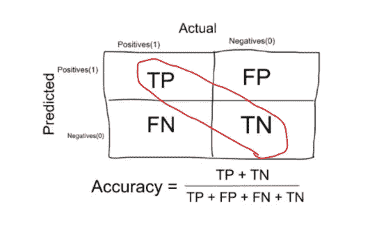

Accuracy in the confusion matrix ([Source](http://cdn-images-1.medium.com/max/800/1*5XuZ_86Rfce3qyLt7XMlhw.png))

**何时使用精度:**当数据中的目标变量类接近平衡时，精度是一个很好的度量。

何时不使用精确度:当数据中的目标变量类是一个类的大多数时，精确度决不应该被用作度量。

**Precision(hits):**Precision 是一种度量，它告诉我们预测值为真的比例实际上是真的。

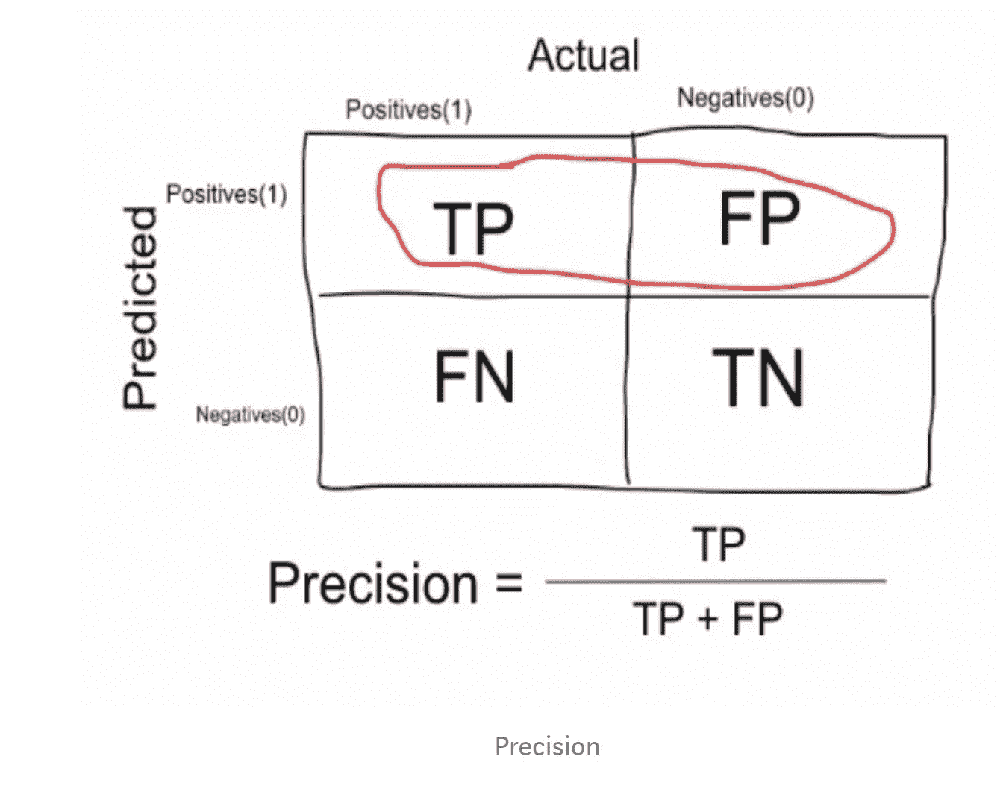

**回忆或敏感度(缺失):**回忆是一种度量，它告诉我们有多少比例的患者实际上是真实的，而被模型预测为真实的。

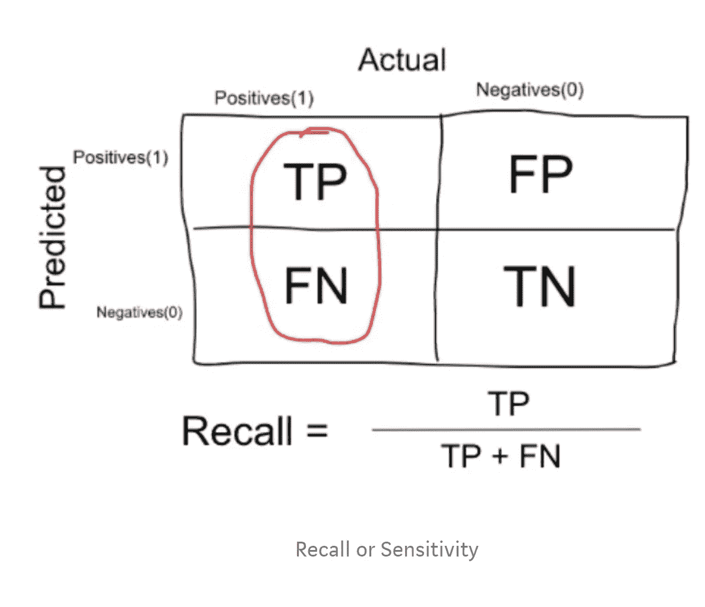

**F1 评分:**同时代表了查准率和查全率。

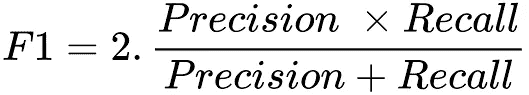

F1 Score ([Source](https://www.oreilly.com/library/view/hands-on-recommendation-systems/9781788993753/assets/dcd94ad1-96f6-4e27-84c9-d6f42e1efee2.png))

**受试者工作特性(ROC)曲线:**ROC 曲线是显示分类模型在所有分类阈值下的性能的图表。

该曲线绘制了两个参数:

1.  真实阳性率(回忆)
2.  假阳性率(特异性)

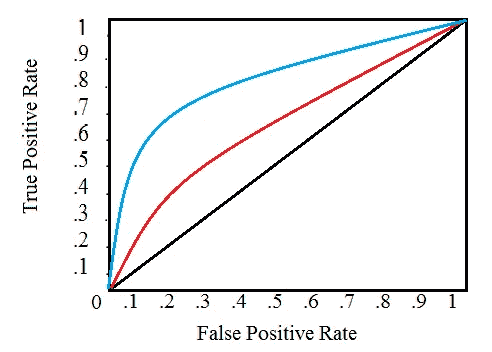

ROC Curve ([Source](https://www.statisticshowto.datasciencecentral.com/wp-content/uploads/2016/08/ROC-curve.png))

**AUC(ROC 曲线下面积):** AUC 测量整个 ROC 曲线下的整个二维面积。

它提供了跨所有可能的分类阈值的综合性能度量。

Area under ROC curve ([Source](https://miro.medium.com/max/722/1*pk05QGzoWhCgRiiFbz-oKQ.png))

 [## 机器学习中分类问题的性能度量

### “数字有一个重要的故事要讲。他们依靠你给他们一个声音。”—斯蒂芬·诺

medium.com](https://medium.com/thalus-ai/performance-metrics-for-classification-problems-in-machine-learning-part-i-b085d432082b)  [## 理解混淆矩阵

### 当我们得到数据，经过数据清洗，预处理和争论，我们做的第一步是把它提供给一个…

towardsdatascience.com](/understanding-confusion-matrix-a9ad42dcfd62) 

上面讨论的主题是机器学习的基础。我们讨论了人工智能、机器学习和深度学习等基本术语，不同类型的机器学习:监督和非监督学习，一些机器学习算法，如线性回归、逻辑回归、k-nn 和随机森林，以及不同算法的性能评估矩阵。

你认为哪个话题最重要？请在下面留下你的想法。