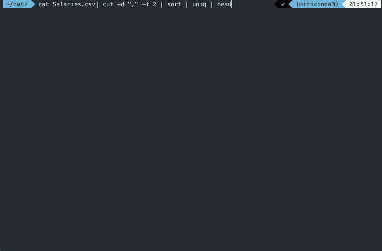
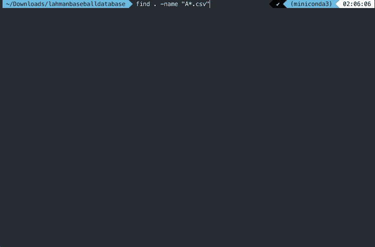

# 用你新获得的壳技能打动旁观者

> 原文：<https://towardsdatascience.com/impress-onlookers-with-your-newly-acquired-shell-skills-a02effb420c2?source=collection_archive---------9----------------------->

## 数据科学家的 10 分钟外壳/终端技能


Photo by [Adam Littman Davis](https://unsplash.com/@adamlittmandavis?utm_source=medium&utm_medium=referral) on [Unsplash](https://unsplash.com?utm_source=medium&utm_medium=referral)

我敢打赌，我们大多数人都见过有人坐在咖啡馆里对着黑/绿屏幕乱砍一气。

每当这种情况发生时，我第一个想到的就是——“这看起来太酷了。”

没有图形用户界面。这就像你在玩你的操作系统的内部。

***你要去的地方是和汇编语言一样接近的地方。***

[外壳命令](https://amzn.to/2YkjHbS)功能强大。它们看起来也很酷。

所以我想给他们一个尝试。我意识到，它们也可能是我数据科学工作流程的重要组成部分。

***这篇文章是关于我在使用 shell/terminal 时发现的最有用的命令，主要关注数据科学。***

# 您何时会使用 shell/terminal 进行数据分析？


有一件事我们都认为是理所当然的——您不会一直拥有 Python。

可能是新公司的 Linux 服务器没有安装 python。

或者您想对大文件进行一些检查，而不真正将它们加载到内存中。

考虑这样一种情况，当您的笔记本电脑/服务器上有一个 6 GB 管道分隔的文件，并且您想要找出某一特定列中不同值的计数。

你可能有不止一种方法可以做到这一点。您可以将该文件放入数据库并运行 SQL 命令，或者您可以编写一个 Python/Perl 脚本。

但是如果服务器上没有安装 SQL/Python 呢？或者，如果你想在黑屏上看起来很酷呢？

无论如何， ***无论你做什么，都不会比这个更简单/耗时更少:***

```
cat data.txt | cut -d "|" -f 1 | sort -u | wc -l
-------------------------------------------------
30
```

这将比你用 Perl/Python 脚本做的任何事情运行得更快。

现在，让我们稍微违背这个命令。这个命令说:

*   使用 **cat** 命令将文件内容打印/流式输出到标准输出。
*   使用|命令将流内容从我们的 cat 命令传输到下一个命令 **cut** 。
*   在 **cut** 命令中，通过参数 **-d** 指定分隔符“|”(注意管道周围的分号，因为我们不想将管道用作流)，并通过参数 **-f.** 选择第一列
*   将流内容传输到对输入进行排序的**排序**命令。它采用参数 **-u** 来指定我们需要唯一的值。
*   通过管道将输出传递给 wc -l 命令，该命令计算输入中的行数。

***也许你还不明白。但是不要担心，我保证你在文章结束时会明白的。*** 我还会在本帖结束前尝试解释比上述命令更高级的概念。

现在，我在工作中广泛使用 shell 命令。作为一名数据科学家，我将根据我在日常工作中几乎每天都会遇到的用例来解释每个命令的用法。

我使用来自 Lahman Baseball 数据库的 Salaries.csv 数据来说明不同的 shell 函数。你可能想要[下载数据](https://www.kaggle.com/freshrenzo/lahmanbaseballdatabase)来配合你自己的文章。

# 从基本命令开始


Think of every command as a color in your palette

每当试图学习一门新语言时，从基础开始总是有帮助的。shell 是一种新语言。我们将逐一讲解一些基本命令。

## 1.猫:

有很多时候你需要看到你的数据。一种方法是在记事本中打开 txt/CSV 文件。对于小文件来说，这可能是最好的方法。

但是大数据是个问题。有时文件会非常大，以至于你无法在 sublime 或任何其他软件工具中打开它们，在那里我们可以使用 cat 命令。

你可能需要等一会儿。gif 文件来显示。

```
cat salaries.csv
```


## 2.头部和尾部:

现在你可能会问我为什么要在终端上打印整个文件？一般不会。但我只想告诉你关于猫的命令。

对于用例，当您只需要数据的顶部/底部 n 行时，您通常会使用 [head](https://en.wikipedia.org/wiki/Head_%28Unix%29) / [tail](https://en.wikipedia.org/wiki/Tail_%28Unix%29) 命令。你可以如下使用它们。

```
head Salaries.csv
tail Salaries.csv
head -n 3 Salaries.csv
tail -n 3 Salaries.csv
```


请注意这里的 shell 命令的结构:

```
CommandName [-arg1name] [arg1value] [-arg2name] [arg2value] filename
```

它是`CommandName`，后跟几个`argnames`和`argvalues`，最后是文件名。通常，shell 命令有很多参数。您可以通过使用`man`命令来查看命令支持的所有参数的列表。你可以把`man`看作是帮助。

```
man cat
```

## 3.wc:


Count the Lines

[wc](https://en.wikipedia.org/wiki/Wc_%28Unix%29) 是一个相当有用的 shell 实用程序/命令，它让我们**计算给定文件中的行数(-l)** 、**字数(-w)** 或**字符(-c)** 。

```
wc -l Salaries.csv
wc -w Salaries.csv
wc -c Salaries.csv
```


## 4.grep:

有时，您可能希望在文件中查找特定的行。或者您可能希望打印文件中包含特定单词的所有行。

或者你可能想看看 2000 年球队的薪水。

grep 是你的朋友。

在本例中，我们打印了文件中包含“2000，BAL”的所有行。

```
grep "2000,BAL" Salaries.csv| head
```


你也可以在 grep 中使用正则表达式。

# 管道——这使得外壳很有用


既然我们现在知道了 shell 的基本命令，我现在可以谈谈 Shell 用法的基本概念之一— [**管道**](https://en.wikipedia.org/wiki/Pipeline_%28Unix%29) 。

如果不使用这个概念，您将无法利用 shell 提供的全部功能。

这个想法很简单。

还记得我们之前如何使用 head 命令查看文件的前几行吗？

现在，您也可以编写如下的`head`命令:

```
cat Salaries.csv | head
```


***我的建议:*** *把命令里的“|”读成“把数据传到”*

所以我会把上面的命令理解为:

*cat* (打印)整个数据流，**将数据传递给** *head* ，这样它就可以只给我前几行。

你知道管道的作用吗？

它为我们提供了一种连续使用基本命令的方法。有许多命令都是相对基本的，它让我们可以按顺序使用这些基本命令来做一些相当重要的事情。

现在让我告诉你几个不那么基本的命令，然后我会向你展示我们如何**链接**它们来完成相当高级的任务。

# 一些中间命令


## 1.排序:

你可能想在特定的列上对你的数据集进行排序。`sort`是你的朋友。

假设您想找出数据集中任何球员的前 10 名最高工资。我们可以如下使用排序。

```
sort -t "," -k 5 -r -n Salaries.csv | head -10
```


所以这个命令中确实有很多选项。让我们一个一个地看。

*   **-t** :使用哪个分隔符？","
*   **-k** :按哪一列排序？5
*   **-n** :如果要数值排序。如果您希望进行字母排序，请不要使用此选项。
*   **-r** :我想降序排序。默认情况下，升序排序。

然后显然是管道——或者把数据传递给`head`指挥部。

## 2.剪切:

此命令允许您从数据中选择特定的列。有时，您可能希望只查看数据中的某些列。

例如，您可能只想查看年份、团队和薪水，而不想查看其他列。[切割](https://en.wikipedia.org/wiki/Cut_(Unix))是要使用的命令。

```
cut -d "," -f 1,2,5 Salaries.csv | head
```


这些选项包括:

*   **-d** :使用哪个分隔符？","
*   **-f** :剪切哪一列/哪些列？1,2,5

然后，显然是管道——或者将数据传递给`head`命令。

## 3.uniq:

[uniq](https://en.wikipedia.org/wiki/Uniq) 有一点棘手，因为你可能想在排序中使用这个命令。

此命令删除连续的重复项。比如:1，1，2 会转换成 1，2。

所以结合 sort，它可以用来获得数据中的不同值。

例如，如果我想在数据中找出十个不同的团队，我会使用:

```
cat Salaries.csv| cut -d "," -f 2 | sort | uniq | head
```


该命令也可以与参数 **-c** 一起使用，以计算这些不同值的出现次数。

类似于**的东西算不同的**。

```
cat Salaries.csv | cut -d "," -f 2 | sort | uniq -c | head
```



# 其他一些实用程序命令


这里有一些其他的命令行工具，你可以不用深入细节就可以使用，因为细节很难。 ***就把这个帖子收藏起来吧。***

## 1.更改文件中的分隔符:

有时您可能需要更改文件中的分隔符，因为某个应用程序可能需要特定的分隔符才能工作。Excel 需要“，”作为分隔符。

**寻找并替换魔法。**:您可能想使用`[tr](https://en.wikipedia.org/wiki/Tr_%28Unix%29)`命令将文件中的某些字符替换为其他字符。


## 2.文件中一列的总和:

使用 [awk](https://en.wikipedia.org/wiki/AWK) 命令，您可以找到文件中一列的总和。除以行数(`wc -l`)，就可以得到平均值。


awk 是一个强大的命令，它本身就是一门完整的语言。请务必查看 awk 的 wiki 页面，其中有很多关于 awk 的好的用例。

## 3.在目录中查找满足特定条件的文件:

有时，您需要在包含大量文件的目录中找到一个文件。您可以使用 find 命令来完成此操作。假设您想要**找到所有的。当前工作目录中的 txt 文件**即**以**开头。



去找**所有人。以 A 或 B 开头的 txt 文件**我们可以使用 regex。

# 最后>和>>

有时，您希望通过命令行实用程序(Shell 命令/ Python 脚本)获得的数据不显示在 stdout 上，而是存储在文本文件中。

你可以使用 **" > "** 操作符。例如，您可以在将上一个示例中的分隔符替换到另一个名为 newdata.txt 的文件中后存储该文件，如下所示:

```
cat data.txt | tr ',' '|' > newdata.txt
```

开始的时候，我经常搞不清 **"|"** (管道)和 **" > "** (to_file)操作。

记住的一个方法是，当你想写一些东西到一个文件时，你应该只使用**>**。

**“|”不能用于写入文件。**另一个你应该知道的操作是**>>**操作。它类似于 **" > "** ，但它附加到一个现有的文件，而不是替换文件和重写。

# 结论


这只是冰山一角。

虽然我不是 shell 使用方面的专家，但是这些命令在很大程度上减少了我的工作量。

试着将它们融入你的工作流程。我通常在 jupyter 笔记本中使用它们(如果您以`!`开始命令，您可以在 jupyter 代码块中编写 shell 命令)。永远记住:

> 技工要完善他的工作，必须先磨利他的工具。——孔子

所以，现在给一些人留下深刻印象。

如果你想了解更多关于命令行的知识，我想你会的，Coursera 上有[UNIX 工作台](https://www.coursera.org/learn/unix?ranMID=40328&ranEAID=lVarvwc5BD0&ranSiteID=lVarvwc5BD0-EK0XnncSGKDui6jU1GFilw&siteID=lVarvwc5BD0-EK0XnncSGKDui6jU1GFilw&utm_content=2&utm_medium=partners&utm_source=linkshare&utm_campaign=lVarvwc5BD0)课程，你可以试试。

我以后也会写更多这样的帖子。让我知道你对这个系列的看法。在 [**媒体**](https://medium.com/@rahul_agarwal) 关注我或者订阅我的 [**博客**](http://eepurl.com/dbQnuX) 了解他们。一如既往，我欢迎反馈和建设性的批评，可以通过 Twitter [@mlwhiz](https://twitter.com/MLWhiz) 联系到我。