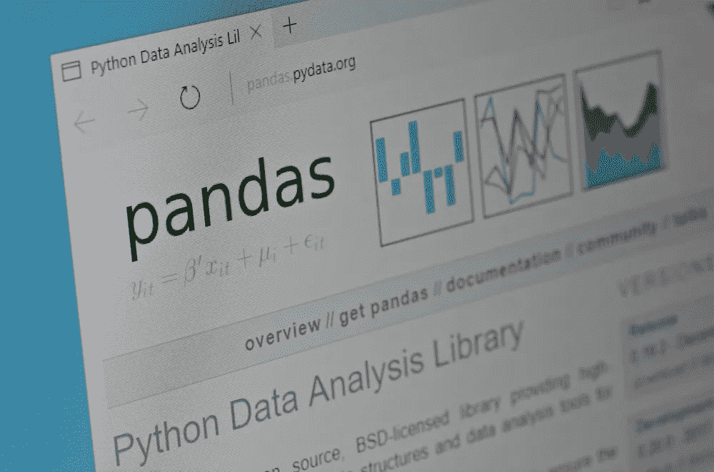

# 通过使用 pandas 库和 Python 提高数据质量

> 原文：<https://towardsdatascience.com/improve-data-quality-by-using-the-pandas-library-and-python-34fda752a6b5?source=collection_archive---------15----------------------->



*数据质量*是一个具有多个维度的宽泛概念。我在[的另一篇介绍性文章](/data-demystified-data-quality-d8c699b678a2)中详细介绍了这一信息。本教程探索了一个真实的例子。我们确定我们想要改进什么，创建代码来实现我们的目标，并以一些关于现实生活中可能发生的事情的评论结束。要继续学习，您需要对 [Python](https://www.python.org/) 有一个基本的了解。

# 熊猫图书馆

Python 数据分析库( [pandas](https://pandas.pydata.org/) )是一个开源的、BSD 许可的库，它为 Python 编程语言提供了高性能、易于使用的数据结构和数据分析工具。

您可以通过在命令行中输入以下代码来安装 pandas:python 3-m pip install—upgrade pandas。

pandas 中有两种主要的数据结构:

*   **系列。**可以包含任何类型数据的单个列。
*   **数据帧。**具有行和命名列的关系数据表。

数据帧包含一个或多个系列以及每个系列的名称。数据帧是通常用于数据操作的抽象或复杂性管理器。

# 系列结构

系列就像是字典和列表的混合体。物品按顺序存放，并贴上标签，以便您可以检索。序列列表中的第一项是特殊索引，它很像一个字典键。第二项是你的实际数据。需要注意的是，每个数据列都有自己的索引标签。您可以通过使用。名称属性。这部分结构不同于字典，它对于合并多列数据很有用。

这个简单的例子向您展示了一个系列是什么样子的:

```
import pandas as pd **carbs = [‘pizza’, ‘hamburger‘, ‘rice’]
pd.Series(carbs)**0     ‘pizza’
1     ‘hamburger’
2     ‘rice’dType: object
```

我们还可以创建带有标签属性的系列:

```
**foods = pd.Series( [‘pizza’, ‘hamburger’, ‘rice’], index=[‘Italy’, ‘USA’, ‘Japan’]**Italy     ‘pizza’
USA       ‘hamburger’
Japan     ‘rice’dType: object
```

# 查询系列

您可以通过索引位置或索引标签来查询序列。如果不为系列指定索引，则位置和标签具有相同的值。要按数字位置进行查询，请使用 iloc 属性。

```
**foods.iloc[2]**
‘rice’
```

要通过索引标签进行查询，请使用 loc 属性。

```
**foods.loc[‘USA’]**
‘hamburger’
```

请记住，一个键可以返回多个结果。这个例子展示了基础知识。还有许多其他系列主题，如矢量化、内存管理等。但我们不会在本文中深入探讨。

# 数据帧结构


数据框架是熊猫图书馆的主要结构。它是您在数据分析和清理任务中工作的主要对象。

从概念上讲，DataFrame 是一个二维序列对象。它有一个索引和多列内容，每一列都有标签。但是列和行之间的区别只是概念上的。将 DataFrame 想象成一个双轴标签数组。

您可以使用**系列**创建如下数据帧表:

```
purchase_1  = pd.Series({ ‘Name’: ‘John’, ‘Ordered’:’Pizza’, ‘Cost’: 11 })
purchase_2  = pd.Series({ ‘Name’: ‘Mary’, ‘Ordered’:’Brioche’, ‘Cost’: 21.20 })
purchase_3  = pd.Series({ ‘Name’: ‘Timothy’, ‘Ordered’:’Steak’, ‘Cost’: 30.00 })**df = pd.DataFrame([purchase_1, purchase_2, purchase_3], index=[‘Restaurant 1’, ‘Restaurant 1’, ‘Restaurant 2’])**+--------------+-------+---------+---------+
|              | Cost  | Ordered |  Name   |
+--------------+-------+---------+---------+
| Restaurant 1 |    11 | Pizza   | John    |
| Restaurant 1 | 21.20 | Brioche | Mary    |
| Restaurant 2 | 30.00 | Steak   | Timothy |
+--------------+-------+---------+---------+
```

和 Series 一样，我们可以通过使用 **iloc** 和 **loc** 属性来提取数据。数据帧是二维的。因此，当我们向 loc 传递单个值时，如果只有一行要返回，那么索引操作符将返回一个序列。

让我们查询这个数据帧。

```
**df.loc[‘Restaurant 2’]**Cost         30.00
Ordered   ‘Steak’
Name       ‘Timothy’
```

该函数返回一个 Series 类型的对象。

pandas DataFrame 的一个强大特性是，您可以基于多个轴快速选择数据。因为 iloc 和 loc 用于行选择，pandas 开发人员直接在数据帧上为列选择保留了索引操作符。在数据帧中，列总是有一个名称。所以这个选择总是基于标签的。

例如，我们可以用以下代码重写所有餐馆 1 成本的查询:

```
**df.loc[‘Restaurant 1’][‘Cost’]**Restaurant 1    11
Restaurant 1    21.20Name: Cost, dType: float64
```

# 表演时间到了。

现在我们处理一个简单但常见的数据问题:缺少值。在[数据去神秘化——数据质量](/data-demystified-data-quality-d8c699b678a2)，中，我解释了为什么完整性是评估数据质量时要考虑的因素之一。缺失数据还可能与另外两个方面有关:缺乏准确性或一致性。还有很多东西需要学习，但是我想直接跳到一个例子，并随着我们的进行引入新的概念。

我们可以从任何来源读取大型数据集。一些例子是关系数据库、文件和 NoSQL 数据库。这个库示例展示了一组与关系数据库交互的方法:

```
import pandas.io.sql as psql
```

注意 **connect** 和 **read_sql** 是关键方法。

为了简单起见，我们将使用 CSV 文件。假设我们有一个存储在 logs.csv 中的日志文件，该日志每隔 100 毫秒存储一次鼠标指针的位置。如果鼠标没有变化，算法会存储一个空值，但会向该行添加一个新条目。为什么？因为如果信息没有改变，通过网络发送这些信息是没有效率的。

我们的目标是用正确的坐标存储 CSV 文件中的所有行。如下表所示，我们可以用以下代码存储这些行:

```
df = pd.read_csv(‘logs.csv’)
df+----+-----------+---------+---------+-----+-----+
|    | timestamp |  page   |  user   |  x  |  y  |
+----+-----------+---------+---------+-----+-----+
|  0 | 169971476 | landing | admin   | 744 | 220 |
|  1 | 169971576 | landing | admin   | NaN | NaN |
|  2 | 169971591 | profile | maryb   | 321 | 774 |
|  3 | 169971691 | profile | maryb   | NaN | NaN |
|  4 | 169972003 | landing | joshf   | 432 | 553 |
|  5 | 169971776 | landing | admin   | 722 | 459 |
|  6 | 169971876 | landing | admin   | NaN | NaN |
|  7 | 169971891 | profile | maryb   | 221 | 333 |
|  8 | 169971976 | landing | admin   | NaN | NaN |
|  9 | 169971991 | profile | maryb   | NaN | NaN |
| 10 | 169972003 | landing | johnive | 312 | 3   |
| 11 | 169971791 | profile | maryb   | NaN | NaN |
| 12 | 169971676 | landing | admin   | NaN | NaN |
+----+-----------+---------+---------+-----+-----+
```

当我们检查数据时，我们发现了多个问题。有许多空值，并且文件不是按时间戳排序的。这个问题在高度并行的系统中很常见。

可以处理空数据的一个函数是 fillna。更多信息请输入 df.fillna？在命令行中。使用这种方法有许多选项:

*   一种选择是传入单个*标量*值，将所有丢失的数据都变成一个值。但是这种改变不是我们想要的。
*   另一个选择是传递一个*方法*参数。两个常见的值是 ffill 和 bfill。ffill 向前填充单元格。它使用前一行中的值更新单元格中的 NaN 值。为了使此更新有意义，您的数据需要按顺序排序。但是传统的数据库管理系统通常不能保证你从中提取的数据的顺序。

所以，我们先把数据整理一下。我们可以按索引或值排序。在这个例子中，时间戳是索引，我们对*索引*字段进行排序:

```
df = df.set_index(‘timestamp’)
df = df.sort_index()
```

我们创建了下表:

```
+-----------+---------+---------+-----+-----+
|           |  page   |  user   |  x  |  y  |
+-----------+---------+---------+-----+-----+
| time      |         |         |     |     |
| 169971476 | landing | admin   | 744 | 220 |
| 169971576 | landing | admin   | NaN | NaN |
| 169971591 | profile | maryb   | 321 | 774 |
| 169971676 | landing | admin   | NaN | NaN |
| 169971691 | profile | maryb   | NaN | NaN |
| 169971776 | landing | admin   | 722 | 459 |
| 169971791 | profile | maryb   | NaN | NaN |
| 169971876 | landing | admin   | NaN | NaN |
| 169971891 | profile | maryb   | 221 | 333 |
| 169971976 | landing | admin   | NaN | NaN |
| 169971991 | profile | maryb   | NaN | NaN |
| 169972003 | landing | johnive | 312 | 3   |
| 169972003 | landing | joshf   | 432 | 553 |
+-----------+---------+---------+-----+-----+
```

如你所见，还有一个问题。我们的时间戳不是唯一的。两个用户可能同时与平台交互。

让我们重置索引，并使用时间戳和用户名创建一个复合索引:

```
df = df.reset_index()
df = df.set_index([‘timestamp’, ‘user’])
df
```

我们创建了下表:

```
+-----------+---------+---------+-----+-----+
|           |         |  page   |  x  |  y  |
+-----------+---------+---------+-----+-----+
| time      | user    |         |     |     |
| 169971476 | admin   | landing | 744 | 220 |
| 169971576 | admin   | landing | NaN | NaN |
| 169971676 | admin   | landing | NaN | NaN |
| 169971776 | admin   | landing | 722 | 459 |
| 169971876 | admin   | landing | NaN | NaN |
| 169971976 | admin   | landing | NaN | NaN |
| 169971591 | maryb   | profile | 321 | 774 |
| 169971691 | maryb   | profile | NaN | NaN |
| 169971791 | maryb   | profile | NaN | NaN |
| 169971891 | maryb   | profile | 221 | 333 |
| 169971991 | maryb   | profile | NaN | NaN |
| 169972003 | johnive | landing | 312 | 3   |
|           | joshf   | landing | 432 | 553 |
+-----------+---------+---------+-----+-----+
```

现在我们可以用 **ffill** 来填充缺失的数据:

```
**df = df.fillna(method='ffill')**
```

下表显示了结果:

```
+-----------+---------+---------+-----+-----+
|           |         |  page   |  x  |  y  |
+-----------+---------+---------+-----+-----+
| time      | user    |         |     |     |
| 169971476 | admin   | landing | 744 | 220 |
| 169971576 | admin   | landing | 744 | 220 |
| 169971676 | admin   | landing | 744 | 220 |
| 169971776 | admin   | landing | 722 | 459 |
| 169971876 | admin   | landing | 722 | 459 |
| 169971976 | admin   | landing | 722 | 459 |
| 169971591 | maryb   | profile | 321 | 774 |
| 169971691 | maryb   | profile | 321 | 774 |
| 169971791 | maryb   | profile | 321 | 774 |
| 169971891 | maryb   | profile | 221 | 333 |
| 169971991 | maryb   | profile | 221 | 333 |
| 169972003 | johnive | landing | 312 |   3 |
|           | joshf   | landing | 432 | 553 |
+-----------+---------+---------+-----+-----+
```

# 熊猫大战 PostgreSQL


熊猫胜过 PostgreSQL。对于大型数据集，它的运行速度要快 5 到 10 倍。PostgreSQL 唯一表现更好的时候是在小数据集上，通常少于一千行。在 pandas 中选择列是高效的，时间为 O(1)。这是因为数据帧存储在内存中。

出于同样的原因，pandas 也有局限性，仍然需要 SQL。熊猫的数据存储在内存中。所以很难加载大于系统内存一半的 CSV 文件。数据集通常包含数百列，这为超过一百万行的数据集创建了大约 10 GB 的文件大小。

PostgreSQL 和 pandas 是两种不同的工具，具有重叠的功能。创建 PostgreSQL 和其他基于 SQL 的语言是为了管理数据库。它们使用户能够轻松地访问和检索数据，尤其是跨多个表的数据。

*   运行 PostgreSQL 的服务器将所有数据集存储为系统中的表。对于用户来说，将所需的表传输到他们的系统，然后使用 pandas 在客户端执行像 join 和 group 这样的任务是不现实的。
*   熊猫的专长是数据处理和复杂的数据分析操作。

这两种工具在技术市场上并不竞争。相反，它们增加了数据科学计算堆栈中可用的工具范围。

# 额外小费

pandas 团队最近引入了一种方法，用与数据帧长度相同的序列来填充缺失值。使用这种新方法，如果需要的话，很容易得到缺失的值。

# 参考

Fox，D. (2018)，[用 pandas 和 PostgreSQL 操纵数据:哪个更好？](https://blog.thedataincubator.com/2018/01/pandas-vs-postgresql/)、*数据孵化器*。

熊猫(2019)， [Python 数据分析库](https://pandas.pydata.org/)。