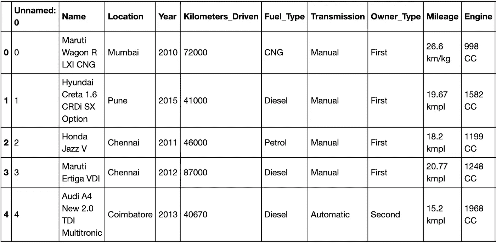
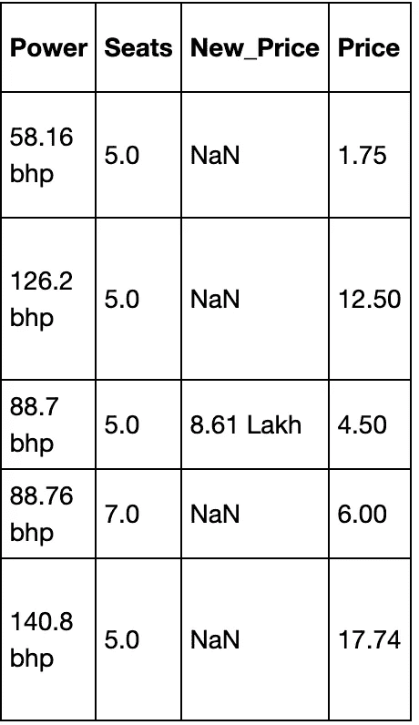
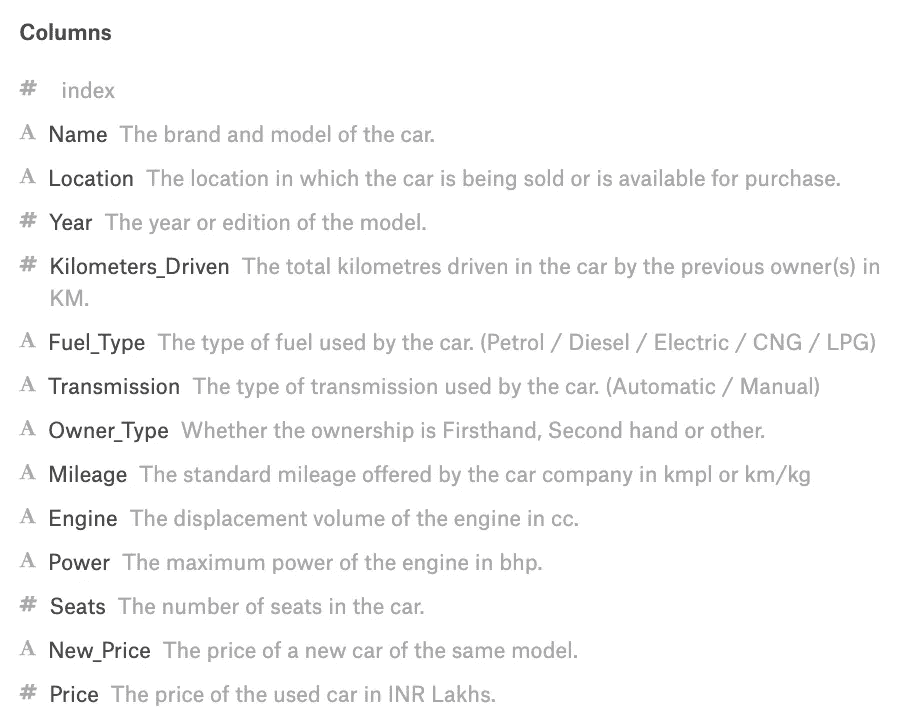
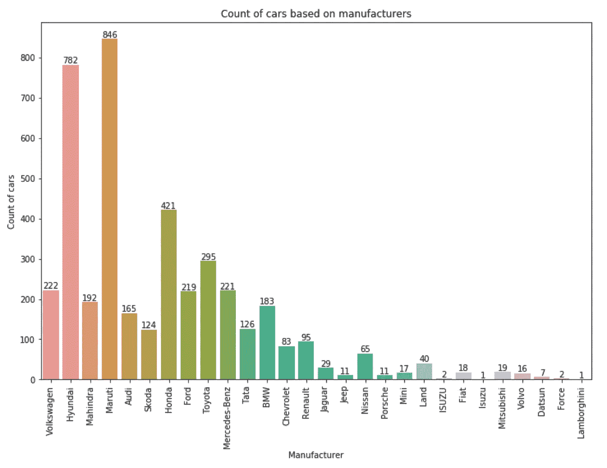

# 通过尝试不同的方法来改进你的 ML 模型

> 原文：<https://towardsdatascience.com/improve-your-ml-model-by-trying-different-approaches-582f4dda7eee?source=collection_archive---------18----------------------->

## 基于机器学习的二手车价格预测

Photo by [Jen Theodore](https://unsplash.com/@jentheodore?utm_source=medium&utm_medium=referral) on [Unsplash](https://unsplash.com?utm_source=medium&utm_medium=referral)

在这篇文章中，我们将看看我最近完成的项目，在这个项目中，我根据许多因素预测了二手车的价格。我在 [Kaggle](https://www.kaggle.com/avikasliwal/used-cars-price-prediction) 上找到了数据集。

这个项目是特殊的，因为我尝试了许多不同的东西，然后在笔记本上完成，作为存储库的一部分。我会解释我所想的每一步，以及结果如何。包含代码的存储库如下:

 [## kb22/二手车价格预测

### 此时您不能执行该操作。您已使用另一个标签页或窗口登录。您已在另一个选项卡中注销，或者…

github.com](https://github.com/kb22/Used-Car-Price-Prediction) 

# 太久了，不会读

这篇文章的关键是:

1.  创建新特征可能会有帮助，例如我从`Name`创建了特征`Manufacturer`。
2.  尝试不同的方法来处理同一列。当直接使用`Year`栏时会产生不好的结果，所以我使用了从它派生出来的每辆车的年龄，这要有用得多。`New_Price`首先填充了基于`Manufacturer`的平均值，但是没有用，所以我在第二次迭代中删除了这个列。
3.  看起来不相关的栏目应该被删除。我掉了`Index`、`Location`、`Name`、`New_Price`。
4.  创建虚拟数据需要处理测试数据中缺失的列。
5.  摆弄 ML 模型的参数，因为它可能是有用的。当我将值设置为 100 时，RandomForestRegressor 中的参数`n_estimators`改进了`r2_score`。我也尝试了 1000，但它只是花了很长时间没有任何明显的改善。

如果你还想要完整的细节，请继续阅读！

# 导入库

我将导入`datetime`库来处理`Year`列。`numpy`和`pandas`库帮助我处理数据集。`matplotlib`和`seaborn`有助于绘图，我在这个项目中没有做太多。最后，我从`sklearn`导入了一些东西，尤其是度量和模型。

# 读取数据集

原始 Kaggle 数据集有两个文件:`train-data.csv`和`test-data.csv`。然而，文件`test-data.csv`的最终输出标签没有给出，因此，我将永远无法测试我的模型。因此，我决定只使用`train-data.csv`，并在`data`文件夹中将其重命名为`dataset.csv`。

dataset.csv (Part 1)

dataset.csv (Part 2)

然后，我将数据集分成 70%的训练数据和 30%的测试数据。

我输出训练数据信息，看看数据是什么样的。我们发现有些列像`Mileage`、`Engine`、`Power`和`Seats`有一些空值，而`New_Price`的大部分值都丢失了。为了更好地理解每一列真正代表了什么，我们可以看一下有数据描述的 Kaggle 仪表板。

Columns description

数据集现在已经加载，我们知道每一列的含义。现在是做一些探索性分析的时候了。请注意，我将始终使用培训部分，然后仅基于培训部分转换测试部分。

# 探索性数据分析

在这里，我们将探究上面的每一个专栏，并讨论它们的相关性。

## 索引

数据集中的第一列未命名。它实际上只是每一行的索引，因此，我们可以安全地删除这一列。

## 名字

`Name`列定义了每辆车的名称。我认为汽车的名字可能不会有很大的影响，但汽车制造商可以。例如，如果一般人发现`Maruti`生产可靠的汽车，他们的转售价值应该更高。因此，我决定从每个`Name`中提取`Manufacturer`。每个`Name`的第一个字就是厂家。

让我们根据制造商绘制并查看每辆汽车的数量。

Manufacturer plot

正如我们在上面的图中看到的，在整个训练数据中，马鲁蒂的汽车数量最多，兰博基尼的汽车数量最少。另外，我不需要`Name`列，所以我删除了它。

## 位置

我最初尝试使用`Location`,但它导致了许多热门专栏，对预测帮助没有多大贡献。这意味着销售地点对汽车最终转售价格的影响几乎可以忽略不计。因此，我决定放弃这个专栏。

## 年

我最初保留`Year`是为了定义模型的构造。但后来我意识到，影响转售价值的不是年份，而是车的年龄。因此，受 Kaggle 的启发，我决定通过从当前年份中减去年份来用车龄替换`Year`。

## 燃料类型、变速器和所有者类型

所有这些列都是分类列。因此，我将为这些列中的每一列创建虚拟列，并将其用于预测。

## 公里驱动

数据输出显示列中存在的高值。我们应该调整数据，否则像`Kilometers_Driven`这样的列会比其他列对预测产生更大的影响。

## 英里数

`Mileage`定义汽车的行驶里程。然而，里程单位因发动机类型而异，例如，有些是每千克，有些是每升，但在这种情况下，我们将认为它们是等效的，只从这一列中提取数字。

正如我们之前检查的那样，`Mileage`列有一些缺失值，所以让我们检查它们并用该列的平均值更新空值。

## 发动机、动力和座椅

`Engine`值是在 CC 中定义的，所以我需要从数据中删除 CC。同样，`Power`有 bhp，我把 bhp 去掉。此外，由于这三个值都有缺失值，我将再次用平均值替换它们，就像我对`Mileage`所做的那样。

我使用`pd.to_numeric()`来处理空值，并且在从字符串转换为数字(int 或 float)时不会产生错误。

## 新价格

该列中的大多数值都丢失了。我最初决定把它们装满。我会根据制造商填写平均值。例如，对于福特，我会取所有存在的值，取它们的平均值，然后用该平均值替换福特 New_Price 的所有空值。然而，这仍然遗漏了一些空值。然后，我会用该列中所有值的平均值来填充这些空值。测试数据也是如此。

然而，这种方法并不真正成功。我试着对它运行随机森林回归器，结果是非常小的`r2_score`值。接下来，我决定简单地删除该列，这样`r2_score`的值会显著提高。

# 数据处理

这里，我将使用`pd.get_dummies`为所有分类变量创建虚拟列。

然而，由于测试数据中缺少所有类型，很可能会有缺失的列。我们用一个例子来理解一下。例如在列`Transmission`中，训练数据包括`Manual`和`Automatic`，因此虚拟对象将类似于`Transmission_Manual`和`Transmission_Automatic`。但是如果测试数据只有`Manual`值而没有`Automatic`值呢？在这种情况下，假人只会导致`Transmission_Manual`。这将使测试数据集比训练数据少一列，预测将不起作用。为了处理这个问题，我们在测试数据中创建缺失的列，并用零填充它们。最后，我们对测试数据进行排序，就像训练数据一样。

最后，我会缩放数据。

# 训练和预测

我将创建一个线性回归和随机森林模型来训练数据，并比较`r2_score`值以选择最佳选择。

我得到线性回归的`r2_score`为`0.70`，随机森林为`0.88`。因此，随机森林在测试数据上表现得非常好。

# 结论

在这篇文章中，我们看到了如何处理现实生活中的机器学习问题，以及我们如何根据它们的相关性和它们给出的信息来调整功能。

您可能还喜欢:

 [## 我是如何使用 Python 和 R 来分析和预测医疗预约的！

### 一个 R 和 Python 共存的世界

towardsdatascience.com](/how-i-used-python-and-r-to-analyze-and-predict-medical-appointment-show-ups-cd290cd3fad0)  [## seaborn——让绘图变得有趣

### Python 中的 Seaborn 库简介

towardsdatascience.com](/seaborn-lets-make-plotting-fun-4951b89a0c07)  [## 使用深度学习通过确保驾驶员的注意力来拯救生命

### 现实生活中的卷积神经网络

towardsdatascience.com](/using-deep-learning-to-save-lives-by-ensuring-drivers-attention-e9ab39c03d07)  [## 使用 Python 中的多个绘图库在地图上绘制商业位置

### 比较地图打印库

towardsdatascience.com](/plotting-business-locations-on-maps-using-multiple-plotting-libraries-in-python-45a00ea770af) 

请随意分享你的想法和想法。我很想收到你的来信！