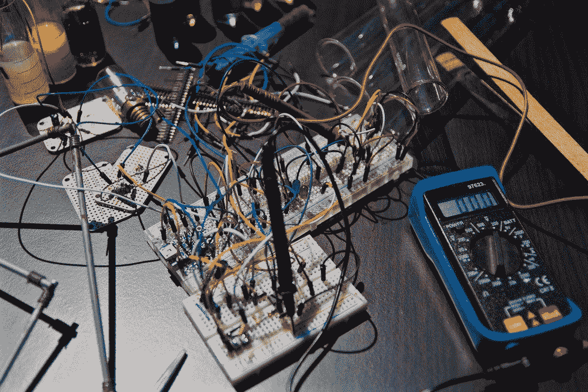
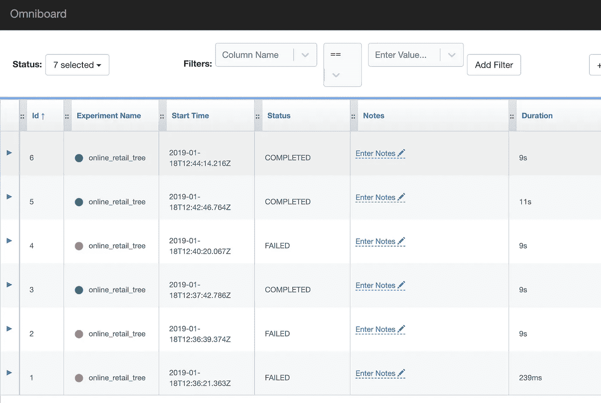
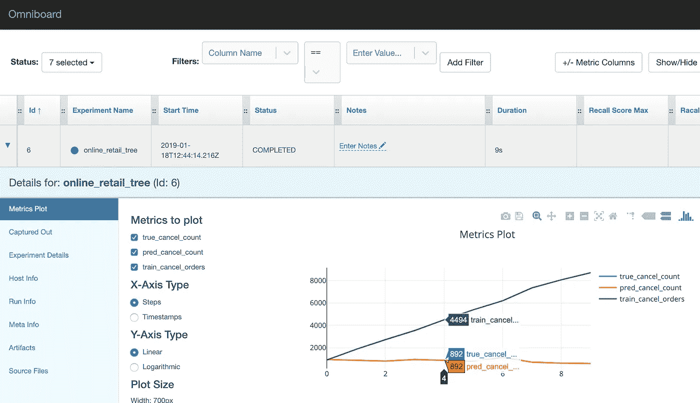

# 通过使用 Sacred 管理您的机器学习实验来改进您的工作流程

> 原文：<https://towardsdatascience.com/improve-your-workflow-by-managing-your-machine-learning-experiments-using-sacred-d51dd2b0047e?source=collection_archive---------6----------------------->



Me building experiments before using Sacred (Thanks [Nicolas](https://unsplash.com/@nicolasthomas) for the pick)

作为一名数据科学家，模型调优是我最不喜欢的任务。我 ***讨厌*** 它。我想这是因为管理实验总是会变得非常混乱。在寻找帮助我的工具时，我看到很多人提到[神圣的](https://github.com/IDSIA/sacred)，所以我决定试一试。

在这篇文章中，我们将看到**如何使用神圣和全面的**来管理我们的实验。剧透警告:这个工具很棒，现在做实验真的很有趣。

# 神圣是如何工作的？

我们在模型训练脚本中使用神圣的装饰者。就是这样！该工具会自动存储每次运行的实验信息。今天，我们将使用 MongoDB 存储信息，并使用 Omniboard 工具将其可视化。好了，我们开始吧。

# 使用神圣的

这里有一个逐步指南:

1.  创造一个实验
2.  定义实验的主要功能
3.  添加配置参数
4.  添加其他指标
5.  进行实验

## 1 —创建一个实验

首先我们需要创建一个实验。很简单:

```
from **sacred** import **Experiment****ex = Experiment("our_experiment")**
```

搞定了。

## 2 —定义实验的主要功能

`run`方法运行实验的主要功能。当我们运行 Python 脚本时，`@ex.automain`装饰器定义*并且*运行实验的主要功能。它相当于:

```
from sacred import Experimentex = Experiment("our_experiment")**@ex.main
def run():
    pass**

**if __name__ == '__main__':
    ex.run_commandline()**
```

让我们用`@ex.automain`来代替:

```
from sacred import Experimentex = Experiment("our_experiment")**@ex.automain
def run():
    pass**
```

## 3-添加配置参数

每次运行时，配置参数也会存储在数据库中。设置的方式有很多:通过[配置范围](https://sacred.readthedocs.io/en/latest/configuration.html#config-scopes)、[字典](https://sacred.readthedocs.io/en/latest/configuration.html#config-dictionaries)、[配置文件](https://sacred.readthedocs.io/en/latest/configuration.html#config-files)。让我们坚持这里的配置范围。

我们将使用这个[在线零售数据集](https://archive.ics.uci.edu/ml/datasets/online+retail)并使用 scikit-learn 的[时间序列交叉验证器](https://scikit-learn.org/stable/modules/generated/sklearn.model_selection.TimeSeriesSplit.html)来拆分数据。该模型将预测订单是否会被取消。让我们定义`criterion`参数:

```
from sklearn.tree import DecisionTreeClassifier
from sklearn.model_selection import TimeSeriesSplit
import pandas as pd
from sacred import Experiment ex = Experiment('online_retail_tree') **@ex.config
def cfg():    
    criterion = "entropy"** @ex.automain
def run(**criterion**):    
    dateparse = lambda x: pd.datetime.strptime(x, '%d/%m/%Y %H:%M') df = pd.read_csv("Online Retail.csv", parse_dates["InvoiceDate"], date_parser=dateparse, decimal=",") df = df.sort_values(by="InvoiceDate")    df["canceled"] = df["InvoiceNo"].apply(lambda x: x[0] == "C")         X = df.loc[:,["Quantity","UnitPrice"]]    
    y = df.loc[:, ["canceled"]]         ts_split = TimeSeriesSplit(n_splits=10)     

    clf = DecisionTreeClassifier(criterion=criterion)  

    for train_index, test_index in ts_split.split(X):        
        X_train = X.iloc[train_index]        
        y_train = y.iloc[train_index]                 X_test = X.iloc[test_index]        
        y_test = y.iloc[test_index]                 clf.fit(X_train, y_train.values.ravel())         
        y_pred = clf.predict(X_test)
```

## 4 —添加其他指标

神圣收集关于实验的信息，但我们通常也想测量其他东西。在我们的例子中，我想知道**每次分割中取消订单的数量**。我们可以为此使用 Metrics API。

> 神圣支持使用 Metrics API 跟踪数字序列(例如 int、float)。`_run.log_scalar(metric_name, value, step)`方法采用一个度量名称(例如“training.loss”)、测量值和获取该值的迭代步骤。如果未指定步长，则会为每个度量设置一个自动递增 1 的计数器。— [指标 API](https://sacred.readthedocs.io/en/latest/collected_information.html#metrics-api)

```
from sklearn.tree import DecisionTreeClassifier
from sklearn.model_selection import TimeSeriesSplit
import pandas as pd
from sacred import Experimentex = Experiment('online_retail_tree')@ex.config
def cfg():    
    criterion = "entropy"@ex.automain
def run(criterion):    
    dateparse = lambda x: pd.datetime.strptime(x, '%d/%m/%Y %H:%M') df = pd.read_csv("Online Retail.csv", parse_dates["InvoiceDate"], date_parser=dateparse, decimal=",") df = df.sort_values(by="InvoiceDate") df["canceled"] = df["InvoiceNo"].apply(lambda x: x[0] == "C") X = df.loc[:,["Quantity","UnitPrice"]]    
    y = df.loc[:, ["canceled"]] ts_split = TimeSeriesSplit(n_splits=10)     

    clf = DecisionTreeClassifier(criterion=criterion)  

    for train_index, test_index in ts_split.split(X):        
        X_train = X.iloc[train_index]        
        y_train = y.iloc[train_index] X_test = X.iloc[test_index]        
        y_test = y.iloc[test_index] clf.fit(X_train, y_train.values.ravel())         
        y_pred = clf.predict(X_test)5 — Running the experiment true_cancel_count = y_test["canceled"].value_counts().tolist()[1]  

       pred_cancel_count = y_pred.tolist().count(True)  

       train_cancel_count = y_train["canceled"].value_counts().tolist()[1] **ex.log_scalar("true_cancel_count", true_cancel_count)        
       ex.log_scalar("pred_cancel_count", pred_cancel_count)        
       ex.log_scalar("train_cancel_orders", train_cancel_count)**
```

## 5 —运行实验

我们将使用 MongoDB Observer 来存储关于实验的信息:

> 神圣通过为你的实验提供一个*观察者界面*来帮助你。通过附加一个观察器，您可以收集关于运行的所有信息，即使它还在运行。— [观察实验](https://sacred.readthedocs.io/en/latest/observers.html#observing-an-experiment)

为了将数据保存到名为 my_database 的 mongo 数据库中，我们只需运行`python3 my_experiment.py -m my_database`。

现在有了关于实验的数据，但我们需要将它可视化。为此，我们将使用[综合](https://github.com/vivekratnavel/omniboard)。

# 使用 OMNIBOARD

Omniboard 是用 React，Node.js，Express 和 Bootstrap 写的一个神圣的仪表盘。

要安装它，运行`npm install -g omniboard`，并开始我们运行`omniboard -m hostname:port:database`，在我们的例子中:`omniboard -m localhost:27017:my_database`。



Omniboard listing our experiments

我们可以看到一个实验是否失败，实验持续时间，添加注释等等。



Detailed view of an experiment

detail 视图显示了我们跟踪的指标的图表，我们还可以查看命令行输出、源代码(awesome)和其他实验细节。

# 那又怎样？

神圣是一个伟大的工具，因为**现在我们不必担心保存我们的实验结果**。一切都被自动存储，我们可以回去分析任何实验。

这个工具被设计成**只引入最小的开销**，在我看来这就是它的伟大之处。

这里的主要信息是:**给神圣一个尝试**！我可以说我现在的工作流程因为它好了很多。🙂

为了同样的目的，你使用另一个工具吗？我也想听听其他替代方案。感谢您的阅读！